# Overview

This document describes the flow for deleting a user in the CardDemo application. Administrators initiate a user deletion request, which is validated and confirmed before the user record is removed from the system. The process ensures that only valid deletions are processed and provides clear feedback to the administrator at each step.

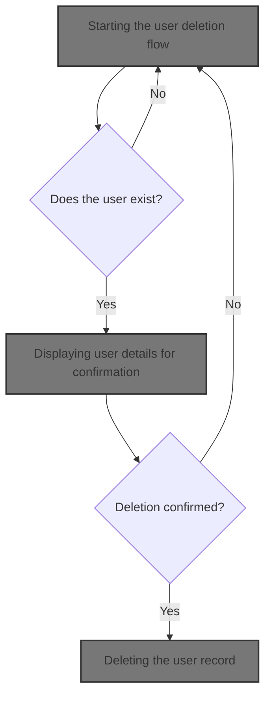

## Dependencies

### Programs

- COUSR03C (app/cbl/COUSR03C.cbl)
- CU03
- COADM01C (app/cbl/COADM01C.cbl)
- CA00
- COSGN00C (app/cbl/COSGN00C.cbl)
- CDEMO-FROM-PROGRAM

### Copybooks

- COCOM01Y (app/cpy/COCOM01Y.cpy)
- COADM02Y (app/cpy/COADM02Y.cpy)
- COADM01 (app/cpy-bms/COADM01.CPY)
- COTTL01Y (app/cpy/COTTL01Y.cpy)
- CSDAT01Y (app/cpy/CSDAT01Y.cpy)
- CSMSG01Y (app/cpy/CSMSG01Y.cpy)
- CSUSR01Y (app/cpy/CSUSR01Y.cpy)
- DFHAID
- DFHBMSCA
- COUSR03 (app/cpy-bms/COUSR03.CPY)

# Where is this program used?

This program is used once, as represented in the following diagram:

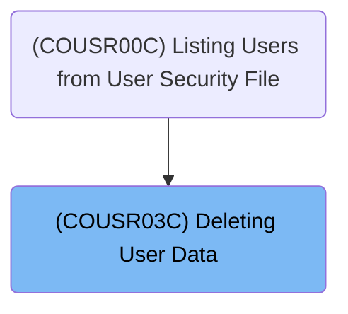

## Input and Output Tables/Files used in the Program

| Table / File Name | Type | Description                                               | Usage Mode   | Key Fields / Layout Highlights |
| ----------------- | ---- | --------------------------------------------------------- | ------------ | ------------------------------ |
| WS-USRSEC-FILE    | File | User credentials and access type for application security | Input/Output | File resource                  |

&nbsp;

# Workflow

# Starting the user deletion flow

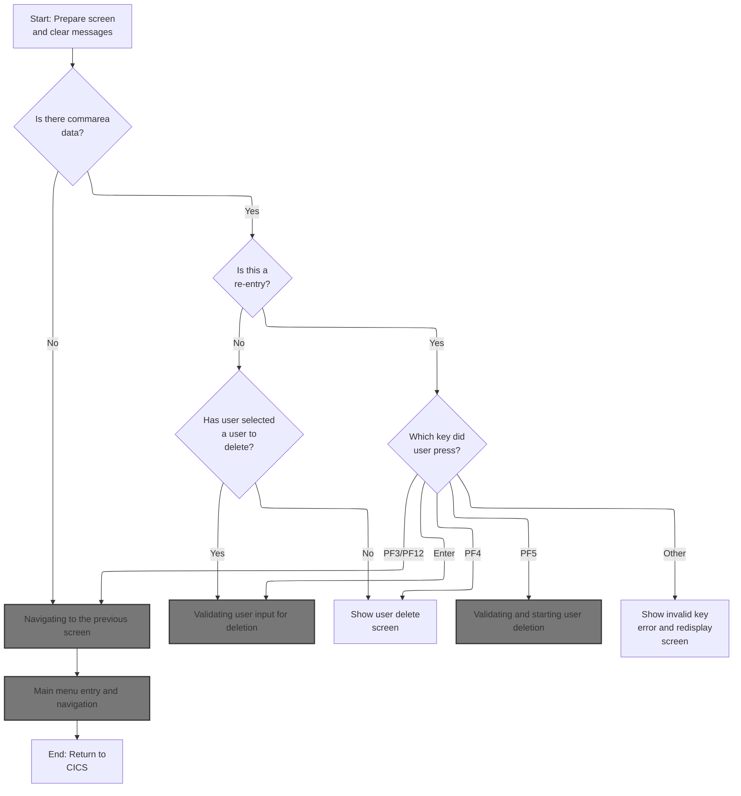

This section manages the initial flow for deleting a user, including navigation based on input data, error feedback for invalid actions, and initialization of the screen and state.

| Rule ID | Code Location | Category       | Rule Name                       | Description                                                                                                                                                       | Conditions                                                                    | Remarks                                                                                                                                  |
| ------- | ------------- | -------------- | ------------------------------- | ----------------------------------------------------------------------------------------------------------------------------------------------------------------- | ----------------------------------------------------------------------------- | ---------------------------------------------------------------------------------------------------------------------------------------- |
| BR-001  | MAIN-PARA     | Business logic | Navigation on missing input     | If there is no communication area data provided, the system navigates the user to the previous screen (signon screen) instead of starting the user deletion flow. | No communication area data is present (EIBCALEN = 0).                         | The navigation target program is set to 'COSGN00C', which is the signon screen. The output is a navigation action, not a data format.    |
| BR-002  | MAIN-PARA     | Business logic | Screen and state initialization | At the start of the user deletion flow, all error flags and user modification indicators are reset, and any previous messages are cleared from the screen.        | User deletion flow is started (entry to MAIN-PARA).                           | Error flag is set to 'N' (off), user modified indicator is set to 'N' (no), and message field is cleared (set to spaces, 80 characters). |
| BR-003  | MAIN-PARA     | Error handling | Invalid key error feedback      | When an invalid key is pressed during the user deletion flow, the system displays a specific error message to the user and redisplays the screen.                 | User presses a key that is not Enter, PF3, PF4, PF5, or PF12 during re-entry. | The error message displayed is 'Invalid key pressed. Please see below...         ' (50 characters, left aligned, padded with spaces).    |

<SwmSnippet path="/app/cbl/COUSR03C.cbl" line="82" repo-id="Z2l0aHViJTNBJTNBa3luZHJ5bC1hd3MtbWFpbmZyYW1lLW1vZGVybml6YXRpb24tY2FyZGRlbW8lM0ElM0FTd2ltbS1EZW1v">

---

In `MAIN-PARA` we're kicking off the user deletion logic. The code checks if there's any input data (EIBCALEN). If not, it sets up to return to the previous screen. If data is present, it copies the communication area, checks if we're reentering, and either initializes the screen or processes user actions like deletion, navigation, or error handling.

```cobol
       MAIN-PARA.

           SET ERR-FLG-OFF     TO TRUE
           SET USR-MODIFIED-NO TO TRUE

           MOVE SPACES TO WS-MESSAGE
                          ERRMSGO OF COUSR3AO
```

---

</SwmSnippet>

<SwmSnippet path="/app/cbl/COUSR03C.cbl" line="90" repo-id="Z2l0aHViJTNBJTNBa3luZHJ5bC1hd3MtbWFpbmZyYW1lLW1vZGVybml6YXRpb24tY2FyZGRlbW8lM0ElM0FTd2ltbS1EZW1v">

---

If there's no input data, we set up the target program for navigation and call RETURN-TO-PREV-SCREEN to jump out of the deletion flow and send the user back to the signon screen.

```cobol
           IF EIBCALEN = 0
               MOVE 'COSGN00C' TO CDEMO-TO-PROGRAM
               PERFORM RETURN-TO-PREV-SCREEN
```

---

</SwmSnippet>

## Navigating to the previous screen

This section manages navigation when the user requests to return to the previous screen, ensuring a valid target is always set, navigation history is updated, context is reset, and session data is passed to the next program.

| Rule ID | Code Location         | Category       | Rule Name                               | Description                                                                                                                                                                           | Conditions                                                                    | Remarks                                                                                                                                                                   |
| ------- | --------------------- | -------------- | --------------------------------------- | ------------------------------------------------------------------------------------------------------------------------------------------------------------------------------------- | ----------------------------------------------------------------------------- | ------------------------------------------------------------------------------------------------------------------------------------------------------------------------- |
| BR-001  | RETURN-TO-PREV-SCREEN | Business logic | Default to signon screen                | If the navigation target program is not set, the system must default the navigation target to the signon screen to ensure the user can always return to a valid screen.               | The navigation target program is either unset (low-values) or blank (spaces). | The default signon screen program is 'COSGN00C', which is an 8-character alphanumeric string.                                                                             |
| BR-002  | RETURN-TO-PREV-SCREEN | Business logic | Update navigation history               | Before navigating to the previous screen, the system must update the communication area with the current program and transaction identifiers to maintain accurate navigation history. | Navigation to the previous screen is initiated.                               | The current program identifier is an 8-character alphanumeric string, and the transaction identifier is a 4-character alphanumeric string.                                |
| BR-003  | RETURN-TO-PREV-SCREEN | Business logic | Reset navigation context                | When returning to the previous screen, the system must reset the navigation context to indicate a fresh entry into the next program.                                                  | Navigation to the previous screen is initiated.                               | The navigation context is reset to zero, indicating a fresh entry. The context field is a single-digit numeric value.                                                     |
| BR-004  | RETURN-TO-PREV-SCREEN | Business logic | Pass communication area to next program | When navigating to the previous screen, all relevant communication area data must be passed to the next program to maintain continuity of user session and data.                      | Navigation to the previous screen is initiated.                               | The communication area includes program, transaction, user, customer, account, card, and additional info fields. All fields are passed as a single structured data block. |

<SwmSnippet path="/app/cbl/COUSR03C.cbl" line="197" repo-id="Z2l0aHViJTNBJTNBa3luZHJ5bC1hd3MtbWFpbmZyYW1lLW1vZGVybml6YXRpb24tY2FyZGRlbW8lM0ElM0FTd2ltbS1EZW1v">

---

In `RETURN-TO-PREV-SCREEN` we check if the target program is set. If not, we default to the signon screen so the user doesn't get stuck. This keeps navigation predictable.

```cobol
       RETURN-TO-PREV-SCREEN.

           IF CDEMO-TO-PROGRAM = LOW-VALUES OR SPACES
               MOVE 'COSGN00C' TO CDEMO-TO-PROGRAM
           END-IF
```

---

</SwmSnippet>

<SwmSnippet path="/app/cbl/COUSR03C.cbl" line="202" repo-id="Z2l0aHViJTNBJTNBa3luZHJ5bC1hd3MtbWFpbmZyYW1lLW1vZGVybml6YXRpb24tY2FyZGRlbW8lM0ElM0FTd2ltbS1EZW1v">

---

After setting up the navigation target, we update the communication area with the current program and transaction info, reset the context, and call XCTL to transfer control to the next program, passing all relevant data.

```cobol
           MOVE WS-TRANID    TO CDEMO-FROM-TRANID
           MOVE WS-PGMNAME   TO CDEMO-FROM-PROGRAM
           MOVE ZEROS        TO CDEMO-PGM-CONTEXT
           EXEC CICS
               XCTL PROGRAM(CDEMO-TO-PROGRAM)
               COMMAREA(CARDDEMO-COMMAREA)
           END-EXEC.
```

---

</SwmSnippet>

## Admin menu entry and navigation

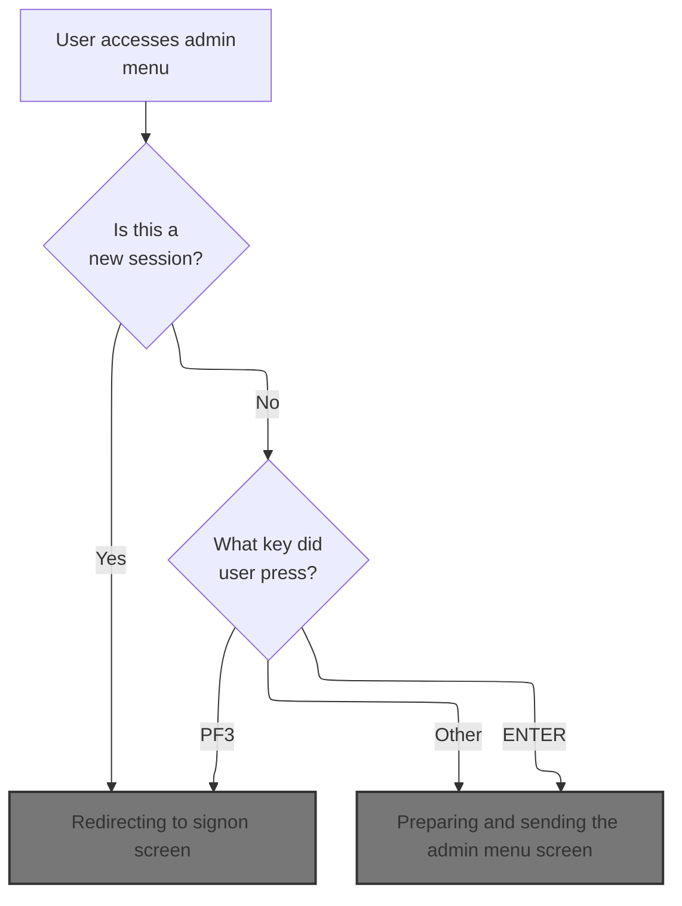

This section manages the entry and navigation logic for the admin menu, including session initialization, user input handling, and error messaging for invalid keys.

| Rule ID | Code Location | Category       | Rule Name                       | Description                                                                                                                                          | Conditions                                                                    | Remarks                                                                                                                                                            |
| ------- | ------------- | -------------- | ------------------------------- | ---------------------------------------------------------------------------------------------------------------------------------------------------- | ----------------------------------------------------------------------------- | ------------------------------------------------------------------------------------------------------------------------------------------------------------------ |
| BR-001  | MAIN-PARA     | Business logic | Session initialization redirect | If the session is new (no communication area provided), the user is redirected to the signon screen.                                                 | Session context length is zero (no prior session data).                       | The signon screen is triggered when the session context is absent. The output is a screen transition to the signon interface.                                      |
| BR-002  | MAIN-PARA     | Business logic | PF3 key signon redirect         | If the session is reentered and the user presses the PF3 key, the user is redirected to the signon screen.                                           | Session is reentered and user input is PF3 key.                               | PF3 key triggers a transition to the signon screen. The output is a screen transition to the signon interface.                                                     |
| BR-003  | MAIN-PARA     | Business logic | ENTER key admin menu display    | If the session is reentered and the user presses the ENTER key, the admin menu screen is prepared and sent.                                          | Session is reentered and user input is ENTER key.                             | ENTER key triggers the admin menu screen. The output is the admin menu interface.                                                                                  |
| BR-004  | MAIN-PARA     | Business logic | Admin menu initialization       | When the session is reentered for the first time, the admin menu screen is initialized and sent to the user.                                         | Session is reentered for the first time (not previously marked as reentered). | The admin menu screen is initialized with default values and sent to the user.                                                                                     |
| BR-005  | MAIN-PARA     | Error handling | Invalid key error handling      | If the session is reentered and the user presses any key other than ENTER or PF3, an error message is displayed and the admin menu screen is resent. | Session is reentered and user input is not ENTER or PF3.                      | Error message 'Invalid key pressed. Please see below...         ' (50 characters, left aligned, padded with spaces) is displayed. The admin menu screen is resent. |

<SwmSnippet path="/app/cbl/COADM01C.cbl" line="75" repo-id="Z2l0aHViJTNBJTNBa3luZHJ5bC1hd3MtbWFpbmZyYW1lLW1vZGVybml6YXRpb24tY2FyZGRlbW8lM0ElM0FTd2ltbS1EZW1v">

---

`MAIN-PARA` in COADM01C.cbl checks if we're entering fresh or reentering. If it's a fresh entry, we set up for the signon screen or initialize the admin menu. If reentered, we process user input and handle navigation or errors based on the key pressed.

```cobol
       MAIN-PARA.

           SET ERR-FLG-OFF TO TRUE

           MOVE SPACES TO WS-MESSAGE
                          ERRMSGO OF COADM1AO

           IF EIBCALEN = 0
               MOVE 'COSGN00C' TO CDEMO-FROM-PROGRAM
               PERFORM RETURN-TO-SIGNON-SCREEN
           ELSE
               MOVE DFHCOMMAREA(1:EIBCALEN) TO CARDDEMO-COMMAREA
               IF NOT CDEMO-PGM-REENTER
                   SET CDEMO-PGM-REENTER    TO TRUE
                   MOVE LOW-VALUES          TO COADM1AO
                   PERFORM SEND-MENU-SCREEN
               ELSE
                   PERFORM RECEIVE-MENU-SCREEN
                   EVALUATE EIBAID
                       WHEN DFHENTER
                           PERFORM PROCESS-ENTER-KEY
                       WHEN DFHPF3
                           MOVE 'COSGN00C' TO CDEMO-TO-PROGRAM
                           PERFORM RETURN-TO-SIGNON-SCREEN
                       WHEN OTHER
                           MOVE 'Y'                       TO WS-ERR-FLG
                           MOVE CCDA-MSG-INVALID-KEY      TO WS-MESSAGE
                           PERFORM SEND-MENU-SCREEN
                   END-EVALUATE
               END-IF
           END-IF

           EXEC CICS RETURN
                     TRANSID (WS-TRANID)
                     COMMAREA (CARDDEMO-COMMAREA)
           END-EXEC.
```

---

</SwmSnippet>

### Redirecting to signon screen

This section ensures users are safely redirected to the signon screen if no valid navigation target is specified, maintaining consistent application flow.

| Rule ID | Code Location           | Category       | Rule Name                  | Description                                                                                                                         | Conditions                                                       | Remarks                                                                                                               |
| ------- | ----------------------- | -------------- | -------------------------- | ----------------------------------------------------------------------------------------------------------------------------------- | ---------------------------------------------------------------- | --------------------------------------------------------------------------------------------------------------------- |
| BR-001  | RETURN-TO-SIGNON-SCREEN | Business logic | Default to signon handler  | If the target program for navigation is not specified or is blank, the system will redirect the user to the signon handler program. | The target program field is either blank or contains low values. | The signon handler program is identified by the value 'COSGN00C', which is an 8-character alphanumeric string.        |
| BR-002  | RETURN-TO-SIGNON-SCREEN | Business logic | Redirect to target program | The system will always redirect the user to the program specified in the target program field, regardless of its value.             | The target program field contains any value.                     | The target program field is an 8-character alphanumeric string. The program specified will be invoked for navigation. |

<SwmSnippet path="/app/cbl/COADM01C.cbl" line="160" repo-id="Z2l0aHViJTNBJTNBa3luZHJ5bC1hd3MtbWFpbmZyYW1lLW1vZGVybml6YXRpb24tY2FyZGRlbW8lM0ElM0FTd2ltbS1EZW1v">

---

In `RETURN-TO-SIGNON-SCREEN` we check if the next program is set. If not, we default to the signon handler and call XCTL to jump there, keeping navigation safe.

```cobol
       RETURN-TO-SIGNON-SCREEN.

           IF CDEMO-TO-PROGRAM = LOW-VALUES OR SPACES
               MOVE 'COSGN00C' TO CDEMO-TO-PROGRAM
           END-IF
           EXEC CICS
               XCTL PROGRAM(CDEMO-TO-PROGRAM)
           END-EXEC.
```

---

</SwmSnippet>

### Signon screen entry and input handling

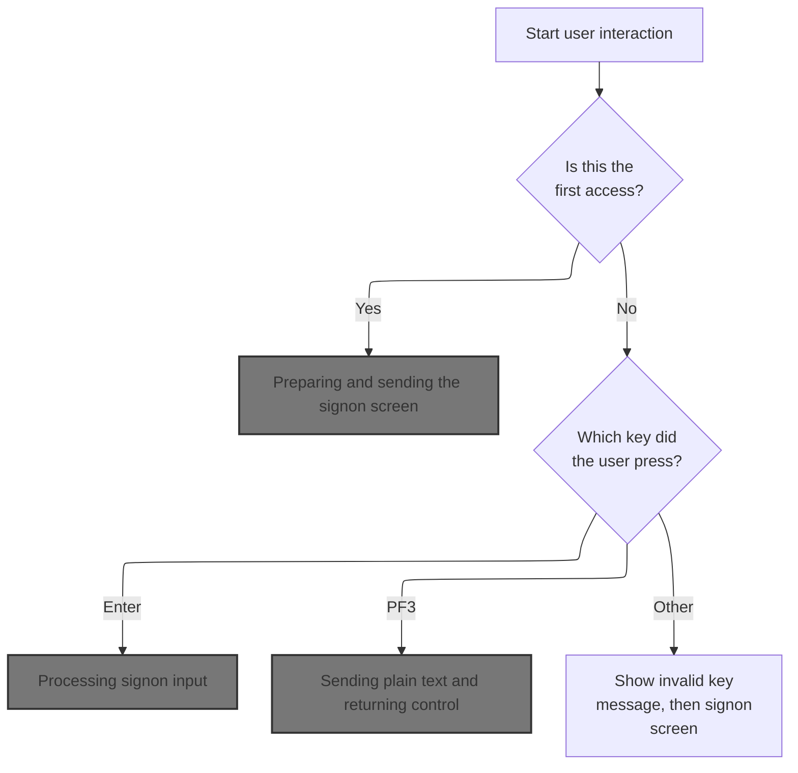

This section manages the initial user interaction for the signon screen, determining what is displayed to the user based on their input and guiding them through the signon process or providing feedback for invalid actions.

| Rule ID | Code Location | Category       | Rule Name                 | Description                                                                                                                                                                      | Conditions                                                       | Remarks                                                                                                                                              |
| ------- | ------------- | -------------- | ------------------------- | -------------------------------------------------------------------------------------------------------------------------------------------------------------------------------- | ---------------------------------------------------------------- | ---------------------------------------------------------------------------------------------------------------------------------------------------- |
| BR-001  | MAIN-PARA     | Business logic | Initial signon prompt     | When the user first accesses the signon screen (no input provided), the application must display a blank signon prompt for the user to enter their credentials.                  | Triggered when the input length is zero (first access).          | The signon screen is cleared and displayed with all fields set to blank or default values. The user ID field is set to -1 (meaning not yet entered). |
| BR-002  | MAIN-PARA     | Business logic | Signon input processing   | When the user presses the Enter key after interacting with the signon screen, the application must process the signon input and proceed with authentication or further handling. | Triggered when the user presses the Enter key.                   | The application processes the entered credentials. The details of authentication are handled in another paragraph, not shown here.                   |
| BR-003  | MAIN-PARA     | Business logic | Thank you message on exit | When the user presses the PF3 key, the application must display a thank you message and return control to the application.                                                       | Triggered when the user presses the PF3 key.                     | The thank you message is: 'Thank you for using CardDemo application...      ' (string, 50 characters, left aligned, padded with spaces).             |
| BR-004  | MAIN-PARA     | Error handling | Invalid key handling      | When the user presses any key other than Enter or PF3, the application must display an invalid key message and re-display the signon screen.                                     | Triggered when the user presses any key other than Enter or PF3. | The invalid key message is: 'Invalid key pressed. Please see below...         ' (string, 50 characters, left aligned, padded with spaces).           |

<SwmSnippet path="/app/cbl/COSGN00C.cbl" line="73" repo-id="Z2l0aHViJTNBJTNBa3luZHJ5bC1hd3MtbWFpbmZyYW1lLW1vZGVybml6YXRpb24tY2FyZGRlbW8lM0ElM0FTd2ltbS1EZW1v">

---

`MAIN-PARA` in COSGN00C.cbl checks if we're starting fresh or handling user input. If it's a fresh entry, we clear the screen and show the signon prompt. If there's input, we branch based on the key pressed to handle signon, exit, or errors.

```cobol
       MAIN-PARA.

           SET ERR-FLG-OFF TO TRUE

           MOVE SPACES TO WS-MESSAGE
                          ERRMSGO OF COSGN0AO

           IF EIBCALEN = 0
               MOVE LOW-VALUES TO COSGN0AO
               MOVE -1       TO USERIDL OF COSGN0AI
               PERFORM SEND-SIGNON-SCREEN
           ELSE
               EVALUATE EIBAID
                   WHEN DFHENTER
                       PERFORM PROCESS-ENTER-KEY
                   WHEN DFHPF3
                       MOVE CCDA-MSG-THANK-YOU        TO WS-MESSAGE
                       PERFORM SEND-PLAIN-TEXT
                   WHEN OTHER
                       MOVE 'Y'                       TO WS-ERR-FLG
                       MOVE CCDA-MSG-INVALID-KEY      TO WS-MESSAGE
                       PERFORM SEND-SIGNON-SCREEN
               END-EVALUATE
           END-IF.

           EXEC CICS RETURN
                     TRANSID (WS-TRANID)
                     COMMAREA (CARDDEMO-COMMAREA)
                     LENGTH(LENGTH OF CARDDEMO-COMMAREA)
           END-EXEC.
```

---

</SwmSnippet>

#### Preparing and sending the signon screen

This section prepares and sends the signon screen to the user, ensuring the header is populated with relevant information and any messages are displayed.

| Rule ID | Code Location        | Category       | Rule Name                                | Description                                                                                                                                                  | Conditions                                                                              | Remarks                                                                                                                                                                                                                                                                                                                                                       |
| ------- | -------------------- | -------------- | ---------------------------------------- | ------------------------------------------------------------------------------------------------------------------------------------------------------------ | --------------------------------------------------------------------------------------- | ------------------------------------------------------------------------------------------------------------------------------------------------------------------------------------------------------------------------------------------------------------------------------------------------------------------------------------------------------------- |
| BR-001  | POPULATE-HEADER-INFO | Business logic | Signon screen header information         | The signon screen header must display the current date and time, application titles, program name, transaction name, and system/application IDs to the user. | Whenever the signon screen is prepared and sent to the user.                            | The header includes: Title 1 (string, up to 20 characters), Title 2 (string, up to 20 characters), Program Name (string, 8 characters, default 'COSGN00C'), Transaction Name (string, 4 characters, default 'CC00'), Date (string, format MM-DD-YY), Time (string, format HH-MM-SS), Application ID (string, 8 characters), System ID (string, 4 characters). |
| BR-002  | SEND-SIGNON-SCREEN   | Business logic | Display message in error field           | Any message present must be displayed in the error/message field of the signon screen.                                                                       | Whenever a message is present in the message variable when preparing the signon screen. | The message field is a string of up to 80 characters. If no message is present, the field is blank.                                                                                                                                                                                                                                                           |
| BR-003  | SEND-SIGNON-SCREEN   | Business logic | Send signon screen with erase and cursor | The signon screen must be sent to the user with all fields erased and the cursor positioned for user input.                                                  | Whenever the signon screen is sent to the user.                                         | The signon screen is sent with the ERASE option (clears previous screen contents) and CURSOR option (positions cursor for input).                                                                                                                                                                                                                             |

<SwmSnippet path="/app/cbl/COSGN00C.cbl" line="145" repo-id="Z2l0aHViJTNBJTNBa3luZHJ5bC1hd3MtbWFpbmZyYW1lLW1vZGVybml6YXRpb24tY2FyZGRlbW8lM0ElM0FTd2ltbS1EZW1v">

---

`SEND-SIGNON-SCREEN` sets up the header, puts any message in the error field, and sends the signon screen to the user using the CICS SEND MAP command.

```cobol
       SEND-SIGNON-SCREEN.

           PERFORM POPULATE-HEADER-INFO

           MOVE WS-MESSAGE TO ERRMSGO OF COSGN0AO

           EXEC CICS SEND
                     MAP('COSGN0A')
                     MAPSET('COSGN00')
                     FROM(COSGN0AO)
                     ERASE
                     CURSOR
           END-EXEC.
```

---

</SwmSnippet>

<SwmSnippet path="/app/cbl/COSGN00C.cbl" line="177" repo-id="Z2l0aHViJTNBJTNBa3luZHJ5bC1hd3MtbWFpbmZyYW1lLW1vZGVybml6YXRpb24tY2FyZGRlbW8lM0ElM0FTd2ltbS1EZW1v">

---

`POPULATE-HEADER-INFO` grabs the current date and time, sets up the app titles, program and transaction names, and pulls system IDs for the signon screen header.

```cobol
       POPULATE-HEADER-INFO.

           MOVE FUNCTION CURRENT-DATE  TO WS-CURDATE-DATA

           MOVE CCDA-TITLE01           TO TITLE01O OF COSGN0AO
           MOVE CCDA-TITLE02           TO TITLE02O OF COSGN0AO
           MOVE WS-TRANID              TO TRNNAMEO OF COSGN0AO
           MOVE WS-PGMNAME             TO PGMNAMEO OF COSGN0AO

           MOVE WS-CURDATE-MONTH       TO WS-CURDATE-MM
           MOVE WS-CURDATE-DAY         TO WS-CURDATE-DD
           MOVE WS-CURDATE-YEAR(3:2)   TO WS-CURDATE-YY

           MOVE WS-CURDATE-MM-DD-YY    TO CURDATEO OF COSGN0AO

           MOVE WS-CURTIME-HOURS       TO WS-CURTIME-HH
           MOVE WS-CURTIME-MINUTE      TO WS-CURTIME-MM
           MOVE WS-CURTIME-SECOND      TO WS-CURTIME-SS

           MOVE WS-CURTIME-HH-MM-SS    TO CURTIMEO OF COSGN0AO

           EXEC CICS ASSIGN
               APPLID(APPLIDO OF COSGN0AO)
           END-EXEC

           EXEC CICS ASSIGN
               SYSID(SYSIDO OF COSGN0AO)
           END-EXEC.
```

---

</SwmSnippet>

#### Processing signon input

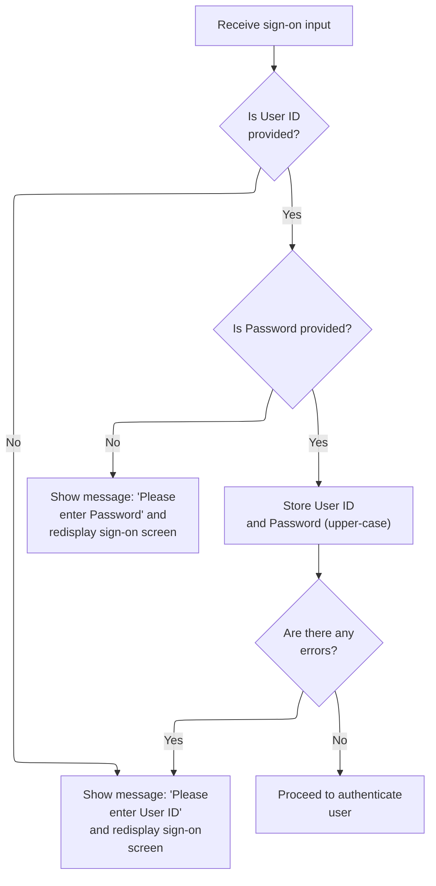

This section validates user credentials entered on the sign-on screen, provides error feedback for missing fields, normalizes credentials, and initiates authentication if all validations pass.

| Rule ID | Code Location     | Category        | Rule Name                    | Description                                                                                                                                                                       | Conditions                                                                 | Remarks                                                                                                                                                                                      |
| ------- | ----------------- | --------------- | ---------------------------- | --------------------------------------------------------------------------------------------------------------------------------------------------------------------------------- | -------------------------------------------------------------------------- | -------------------------------------------------------------------------------------------------------------------------------------------------------------------------------------------- |
| BR-001  | PROCESS-ENTER-KEY | Data validation | User ID required             | If the User ID field is empty or contains only blank or non-printable characters, the system displays the message 'Please enter User ID ...' and redisplays the sign-on screen.   | User ID field is empty, blank, or contains only non-printable characters.  | The User ID must be provided as a non-empty string. The error message is 'Please enter User ID ...'. The User ID field is 8 characters long, left-aligned, padded with spaces if shorter.    |
| BR-002  | PROCESS-ENTER-KEY | Data validation | Password required            | If the Password field is empty or contains only blank or non-printable characters, the system displays the message 'Please enter Password ...' and redisplays the sign-on screen. | Password field is empty, blank, or contains only non-printable characters. | The Password must be provided as a non-empty string. The error message is 'Please enter Password ...'. The Password field is 8 characters long, left-aligned, padded with spaces if shorter. |
| BR-003  | PROCESS-ENTER-KEY | Business logic  | Credentials normalization    | If both User ID and Password are provided, the system converts both fields to uppercase before passing them to authentication.                                                    | Both User ID and Password fields are provided and not blank/non-printable. | User ID and Password are normalized to uppercase. Both fields are 8 characters long, left-aligned, padded with spaces if shorter.                                                            |
| BR-004  | PROCESS-ENTER-KEY | Business logic  | Proceed to authentication    | If no errors are present after validation, the system proceeds to authenticate the user.                                                                                          | No error flag is set after input validation.                               | Authentication is only attempted if both User ID and Password are provided and valid.                                                                                                        |
| BR-005  | PROCESS-ENTER-KEY | Error handling  | Error feedback and redisplay | If any validation error occurs, the sign-on screen is redisplayed with the relevant error message.                                                                                | An error flag is set due to missing or invalid input.                      | The sign-on screen is redisplayed and the error message is shown to the user. Error messages are up to 80 characters, left-aligned.                                                          |

<SwmSnippet path="/app/cbl/COSGN00C.cbl" line="108" repo-id="Z2l0aHViJTNBJTNBa3luZHJ5bC1hd3MtbWFpbmZyYW1lLW1vZGVybml6YXRpb24tY2FyZGRlbW8lM0ElM0FTd2ltbS1EZW1v">

---

`PROCESS-ENTER-KEY` grabs user input from the signon screen, checks for missing fields, converts credentials to uppercase, and if all is good, calls the user security file reader for authentication.

```cobol
       PROCESS-ENTER-KEY.

           EXEC CICS RECEIVE
                     MAP('COSGN0A')
                     MAPSET('COSGN00')
                     RESP(WS-RESP-CD)
                     RESP2(WS-REAS-CD)
           END-EXEC.

           EVALUATE TRUE
               WHEN USERIDI OF COSGN0AI = SPACES OR LOW-VALUES
                   MOVE 'Y'      TO WS-ERR-FLG
                   MOVE 'Please enter User ID ...' TO WS-MESSAGE
                   MOVE -1       TO USERIDL OF COSGN0AI
                   PERFORM SEND-SIGNON-SCREEN
               WHEN PASSWDI OF COSGN0AI = SPACES OR LOW-VALUES
                   MOVE 'Y'      TO WS-ERR-FLG
                   MOVE 'Please enter Password ...' TO WS-MESSAGE
                   MOVE -1       TO PASSWDL OF COSGN0AI
                   PERFORM SEND-SIGNON-SCREEN
               WHEN OTHER
                   CONTINUE
           END-EVALUATE.

           MOVE FUNCTION UPPER-CASE(USERIDI OF COSGN0AI) TO
                           WS-USER-ID
                           CDEMO-USER-ID
           MOVE FUNCTION UPPER-CASE(PASSWDI OF COSGN0AI) TO
                           WS-USER-PWD

           IF NOT ERR-FLG-ON
               PERFORM READ-USER-SEC-FILE
           END-IF.
```

---

</SwmSnippet>

#### Authenticating user credentials

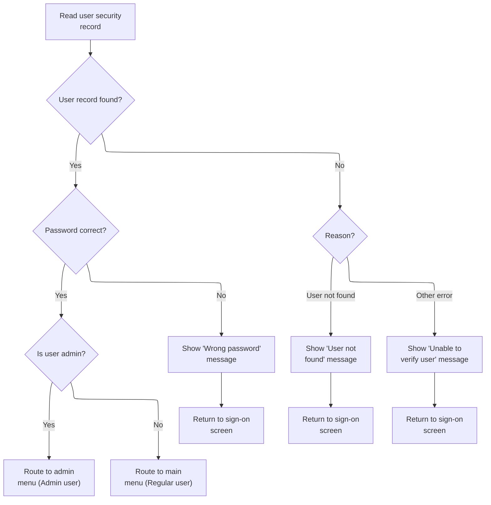

This section authenticates user credentials during sign-on, determines user access level, and handles error messaging for failed authentication attempts.

| Rule ID | Code Location      | Category       | Rule Name                             | Description                                                                                                                                                     | Conditions                                                        | Remarks                                                                                                                            |
| ------- | ------------------ | -------------- | ------------------------------------- | --------------------------------------------------------------------------------------------------------------------------------------------------------------- | ----------------------------------------------------------------- | ---------------------------------------------------------------------------------------------------------------------------------- |
| BR-001  | READ-USER-SEC-FILE | Business logic | Successful authentication and routing | If the user record is found and the password matches, the user is authenticated and routed to the appropriate menu based on their user type (admin or regular). | User record exists and password matches the stored password.      | Admin users are identified by user type 'A'; regular users by 'U'. The routing is to the admin menu for 'A' and main menu for 'U'. |
| BR-002  | READ-USER-SEC-FILE | Error handling | Wrong password error handling         | If the password does not match the stored password for a found user record, display a 'Wrong Password. Try again ...' message and return to the sign-on screen. | User record exists but password does not match.                   | Error message: 'Wrong Password. Try again ...' is displayed. The password field is reset.                                          |
| BR-003  | READ-USER-SEC-FILE | Error handling | User not found error handling         | If the user record is not found, display a 'User not found. Try again ...' message and return to the sign-on screen.                                            | User record does not exist (response code 13).                    | Error message: 'User not found. Try again ...' is displayed. The user ID field is reset.                                           |
| BR-004  | READ-USER-SEC-FILE | Error handling | General authentication error handling | If an error other than 'user not found' occurs during user record lookup, display an 'Unable to verify the User ...' message and return to the sign-on screen.  | Any error response other than 0 (success) or 13 (user not found). | Error message: 'Unable to verify the User ...' is displayed. The user ID field is reset.                                           |

<SwmSnippet path="/app/cbl/COSGN00C.cbl" line="209" repo-id="Z2l0aHViJTNBJTNBa3luZHJ5bC1hd3MtbWFpbmZyYW1lLW1vZGVybml6YXRpb24tY2FyZGRlbW8lM0ElM0FTd2ltbS1EZW1v">

---

`READ-USER-SEC-FILE` reads the user record, checks the password, and routes the user to either the admin or main menu. If authentication fails, we show an error and redisplay the signon screen.

```cobol
       READ-USER-SEC-FILE.

           EXEC CICS READ
                DATASET   (WS-USRSEC-FILE)
                INTO      (SEC-USER-DATA)
                LENGTH    (LENGTH OF SEC-USER-DATA)
                RIDFLD    (WS-USER-ID)
                KEYLENGTH (LENGTH OF WS-USER-ID)
                RESP      (WS-RESP-CD)
                RESP2     (WS-REAS-CD)
           END-EXEC.

           EVALUATE WS-RESP-CD
               WHEN 0
                   IF SEC-USR-PWD = WS-USER-PWD
                       MOVE WS-TRANID    TO CDEMO-FROM-TRANID
                       MOVE WS-PGMNAME   TO CDEMO-FROM-PROGRAM
                       MOVE WS-USER-ID   TO CDEMO-USER-ID
                       MOVE SEC-USR-TYPE TO CDEMO-USER-TYPE
                       MOVE ZEROS        TO CDEMO-PGM-CONTEXT

                       IF CDEMO-USRTYP-ADMIN
                            EXEC CICS XCTL
                              PROGRAM ('COADM01C')
                              COMMAREA(CARDDEMO-COMMAREA)
                            END-EXEC
                       ELSE
                            EXEC CICS XCTL
                              PROGRAM ('COMEN01C')
                              COMMAREA(CARDDEMO-COMMAREA)
                            END-EXEC
                       END-IF
                   ELSE
                       MOVE 'Wrong Password. Try again ...' TO
                                                          WS-MESSAGE
                       MOVE -1       TO PASSWDL OF COSGN0AI
                       PERFORM SEND-SIGNON-SCREEN
                   END-IF
               WHEN 13
                   MOVE 'Y'      TO WS-ERR-FLG
                   MOVE 'User not found. Try again ...' TO WS-MESSAGE
                   MOVE -1       TO USERIDL OF COSGN0AI
                   PERFORM SEND-SIGNON-SCREEN
               WHEN OTHER
                   MOVE 'Y'      TO WS-ERR-FLG
                   MOVE 'Unable to verify the User ...' TO WS-MESSAGE
                   MOVE -1       TO USERIDL OF COSGN0AI
                   PERFORM SEND-SIGNON-SCREEN
           END-EVALUATE.
```

---

</SwmSnippet>

#### Main menu entry and navigation


This section controls entry and navigation for the main menu in the CardDemo application, handling session initialization, user key input, and error messaging for invalid actions.

| Rule ID | Code Location                      | Category       | Rule Name                       | Description                                                                                                                          | Conditions                                                       | Remarks                                                                                                                                                   |
| ------- | ---------------------------------- | -------------- | ------------------------------- | ------------------------------------------------------------------------------------------------------------------------------------ | ---------------------------------------------------------------- | --------------------------------------------------------------------------------------------------------------------------------------------------------- |
| BR-001  | MAIN-PARA, RETURN-TO-SIGNON-SCREEN | Business logic | Session initialization redirect | If the session is new (no communication area provided), the user is redirected to the signon screen before accessing the main menu.  | Session entry with EIBCALEN = 0 (no communication area present). | The signon program name is 'COSGN00C'. The communication area is expected to be empty or uninitialized.                                                   |
| BR-002  | MAIN-PARA                          | Business logic | Enter key menu navigation       | When the user presses the ENTER key on the main menu, the application prepares and sends the admin menu screen.                      | Session is reentered and user input key is ENTER.                | The admin menu screen is presented to the user. No error message is shown.                                                                                |
| BR-003  | MAIN-PARA, RETURN-TO-SIGNON-SCREEN | Business logic | PF3 key signon redirect         | When the user presses PF3, the application redirects the user to the signon screen.                                                  | Session is reentered and user input key is PF3.                  | The signon program name is 'COSGN00C'. The user is redirected out of the admin menu.                                                                      |
| BR-004  | MAIN-PARA                          | Error handling | Invalid key error handling      | If the user presses any key other than ENTER or PF3, the application displays an error message and redisplays the admin menu screen. | Session is reentered and user input key is not ENTER or PF3.     | The error message is 'Invalid key pressed. Please see below...         ' (50 characters, left aligned, padded with spaces). The error flag is set to 'Y'. |

<SwmSnippet path="/app/cbl/COMEN01C.cbl" line="75" repo-id="Z2l0aHViJTNBJTNBa3luZHJ5bC1hd3MtbWFpbmZyYW1lLW1vZGVybml6YXRpb24tY2FyZGRlbW8lM0ElM0FTd2ltbS1EZW1v">

---

`MAIN-PARA` in COMEN01C.cbl checks if we're entering fresh or reentering. If it's a fresh entry, we set up for the signon screen or initialize the main menu. If reentered, we process user input and handle navigation or errors based on the key pressed.

```cobol
       MAIN-PARA.

           SET ERR-FLG-OFF TO TRUE

           MOVE SPACES TO WS-MESSAGE
                          ERRMSGO OF COMEN1AO

           IF EIBCALEN = 0
               MOVE 'COSGN00C' TO CDEMO-FROM-PROGRAM
               PERFORM RETURN-TO-SIGNON-SCREEN
           ELSE
               MOVE DFHCOMMAREA(1:EIBCALEN) TO CARDDEMO-COMMAREA
               IF NOT CDEMO-PGM-REENTER
                   SET CDEMO-PGM-REENTER    TO TRUE
                   MOVE LOW-VALUES          TO COMEN1AO
                   PERFORM SEND-MENU-SCREEN
               ELSE
                   PERFORM RECEIVE-MENU-SCREEN
                   EVALUATE EIBAID
                       WHEN DFHENTER
                           PERFORM PROCESS-ENTER-KEY
                       WHEN DFHPF3
                           MOVE 'COSGN00C' TO CDEMO-TO-PROGRAM
                           PERFORM RETURN-TO-SIGNON-SCREEN
                       WHEN OTHER
                           MOVE 'Y'                       TO WS-ERR-FLG
                           MOVE CCDA-MSG-INVALID-KEY      TO WS-MESSAGE
                           PERFORM SEND-MENU-SCREEN
                   END-EVALUATE
               END-IF
           END-IF

           EXEC CICS RETURN
                     TRANSID (WS-TRANID)
                     COMMAREA (CARDDEMO-COMMAREA)
           END-EXEC.
```

---

</SwmSnippet>

<SwmSnippet path="/app/cbl/COMEN01C.cbl" line="170" repo-id="Z2l0aHViJTNBJTNBa3luZHJ5bC1hd3MtbWFpbmZyYW1lLW1vZGVybml6YXRpb24tY2FyZGRlbW8lM0ElM0FTd2ltbS1EZW1v">

---

In `RETURN-TO-SIGNON-SCREEN` we check if the next program is set. If not, we default to the signon handler and call XCTL to jump there, keeping navigation safe.

```cobol
       RETURN-TO-SIGNON-SCREEN.

           IF CDEMO-TO-PROGRAM = LOW-VALUES OR SPACES
               MOVE 'COSGN00C' TO CDEMO-TO-PROGRAM
           END-IF
           EXEC CICS
               XCTL PROGRAM(CDEMO-TO-PROGRAM)
           END-EXEC.
```

---

</SwmSnippet>

##### Preparing and sending the main menu screen

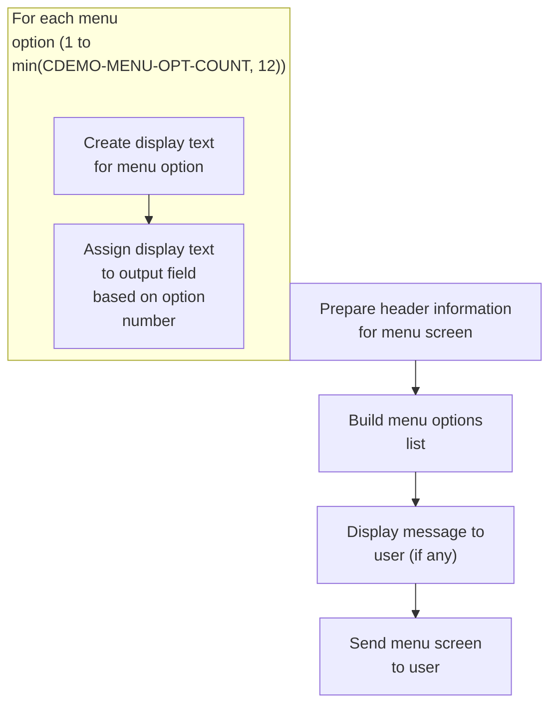

This section prepares and sends the main menu screen to the user, including the header, menu options, and any message to be displayed.

| Rule ID | Code Location        | Category       | Rule Name                             | Description                                                                                                                                  | Conditions                                                                                                                                                  | Remarks                                                                                                                                                                                                                                                      |
| ------- | -------------------- | -------------- | ------------------------------------- | -------------------------------------------------------------------------------------------------------------------------------------------- | ----------------------------------------------------------------------------------------------------------------------------------------------------------- | ------------------------------------------------------------------------------------------------------------------------------------------------------------------------------------------------------------------------------------------------------------ |
| BR-001  | POPULATE-HEADER-INFO | Business logic | Menu header display                   | The main menu screen must display a header containing the application title, program name, transaction name, current date, and current time. | Whenever the main menu screen is prepared and sent to the user.                                                                                             | The header includes: title line 1 (string, left aligned), title line 2 (string, left aligned), program name (string, 8 characters), transaction name (string, 4 characters), current date (formatted as MM-DD-YY), and current time (formatted as HH:MM:SS). |
| BR-002  | BUILD-MENU-OPTIONS   | Business logic | Menu options display limit and format | The menu screen must display up to 12 menu options, each formatted as '<option number>. <option name>'.                                      | Whenever the main menu screen is prepared and sent to the user; the number of options is determined by CDEMO-MENU-OPT-COUNT, but no more than 12 are shown. | Maximum of 12 options. Each option is displayed as a string: option number (numeric, left aligned), a period and space, then option name (string, left aligned).                                                                                             |
| BR-003  | SEND-MENU-SCREEN     | Business logic | Menu message display                  | If a message is present, it must be displayed in the error/message field of the menu screen.                                                 | Whenever the main menu screen is prepared and sent to the user; if a message exists in the message field.                                                   | Message field is a string of up to 80 characters, left aligned. If no message is present, the field is blank.                                                                                                                                                |
| BR-004  | SEND-MENU-SCREEN     | Technical step | Menu screen send                      | The menu screen must be sent to the user after all header, menu options, and message fields are populated.                                   | Whenever the main menu screen is prepared and all fields are populated.                                                                                     | The entire menu screen, including header, options, and message, is sent as a single output using the CICS SEND MAP command.                                                                                                                                  |

<SwmSnippet path="/app/cbl/COMEN01C.cbl" line="182" repo-id="Z2l0aHViJTNBJTNBa3luZHJ5bC1hd3MtbWFpbmZyYW1lLW1vZGVybml6YXRpb24tY2FyZGRlbW8lM0ElM0FTd2ltbS1EZW1v">

---

`SEND-MENU-SCREEN` sets up the header, builds the menu options, puts any message in the error field, and sends the main menu screen to the user using the CICS SEND MAP command.

```cobol
       SEND-MENU-SCREEN.

           PERFORM POPULATE-HEADER-INFO
           PERFORM BUILD-MENU-OPTIONS

           MOVE WS-MESSAGE TO ERRMSGO OF COMEN1AO

           EXEC CICS SEND
                     MAP('COMEN1A')
                     MAPSET('COMEN01')
                     FROM(COMEN1AO)
                     ERASE
           END-EXEC.
```

---

</SwmSnippet>

<SwmSnippet path="/app/cbl/COMEN01C.cbl" line="212" repo-id="Z2l0aHViJTNBJTNBa3luZHJ5bC1hd3MtbWFpbmZyYW1lLW1vZGVybml6YXRpb24tY2FyZGRlbW8lM0ElM0FTd2ltbS1EZW1v">

---

`POPULATE-HEADER-INFO` grabs the current date and time, sets up the app titles, program and transaction names, and formats everything for the main menu header.

```cobol
       POPULATE-HEADER-INFO.

           MOVE FUNCTION CURRENT-DATE  TO WS-CURDATE-DATA

           MOVE CCDA-TITLE01           TO TITLE01O OF COMEN1AO
           MOVE CCDA-TITLE02           TO TITLE02O OF COMEN1AO
           MOVE WS-TRANID              TO TRNNAMEO OF COMEN1AO
           MOVE WS-PGMNAME             TO PGMNAMEO OF COMEN1AO

           MOVE WS-CURDATE-MONTH       TO WS-CURDATE-MM
           MOVE WS-CURDATE-DAY         TO WS-CURDATE-DD
           MOVE WS-CURDATE-YEAR(3:2)   TO WS-CURDATE-YY

           MOVE WS-CURDATE-MM-DD-YY    TO CURDATEO OF COMEN1AO

           MOVE WS-CURTIME-HOURS       TO WS-CURTIME-HH
           MOVE WS-CURTIME-MINUTE      TO WS-CURTIME-MM
           MOVE WS-CURTIME-SECOND      TO WS-CURTIME-SS

           MOVE WS-CURTIME-HH-MM-SS    TO CURTIMEO OF COMEN1AO.
```

---

</SwmSnippet>

<SwmSnippet path="/app/cbl/COMEN01C.cbl" line="236" repo-id="Z2l0aHViJTNBJTNBa3luZHJ5bC1hd3MtbWFpbmZyYW1lLW1vZGVybml6YXRpb24tY2FyZGRlbW8lM0ElM0FTd2ltbS1EZW1v">

---

`BUILD-MENU-OPTIONS` loops through all menu options, builds the display string for each, and assigns it to the right output field for the main menu screen.

```cobol
       BUILD-MENU-OPTIONS.

           PERFORM VARYING WS-IDX FROM 1 BY 1 UNTIL
                           WS-IDX > CDEMO-MENU-OPT-COUNT

               MOVE SPACES             TO WS-MENU-OPT-TXT

               STRING CDEMO-MENU-OPT-NUM(WS-IDX)  DELIMITED BY SIZE
                      '. '                         DELIMITED BY SIZE
                      CDEMO-MENU-OPT-NAME(WS-IDX) DELIMITED BY SIZE
                 INTO WS-MENU-OPT-TXT

               EVALUATE WS-IDX
                   WHEN 1
                       MOVE WS-MENU-OPT-TXT TO OPTN001O
                   WHEN 2
                       MOVE WS-MENU-OPT-TXT TO OPTN002O
                   WHEN 3
                       MOVE WS-MENU-OPT-TXT TO OPTN003O
                   WHEN 4
                       MOVE WS-MENU-OPT-TXT TO OPTN004O
                   WHEN 5
                       MOVE WS-MENU-OPT-TXT TO OPTN005O
                   WHEN 6
                       MOVE WS-MENU-OPT-TXT TO OPTN006O
                   WHEN 7
                       MOVE WS-MENU-OPT-TXT TO OPTN007O
                   WHEN 8
                       MOVE WS-MENU-OPT-TXT TO OPTN008O
                   WHEN 9
                       MOVE WS-MENU-OPT-TXT TO OPTN009O
                   WHEN 10
                       MOVE WS-MENU-OPT-TXT TO OPTN010O
                   WHEN 11
                       MOVE WS-MENU-OPT-TXT TO OPTN011O
                   WHEN 12
                       MOVE WS-MENU-OPT-TXT TO OPTN012O
                   WHEN OTHER
                       CONTINUE
               END-EVALUATE

           END-PERFORM.
```

---

</SwmSnippet>

##### Receiving and processing main menu input

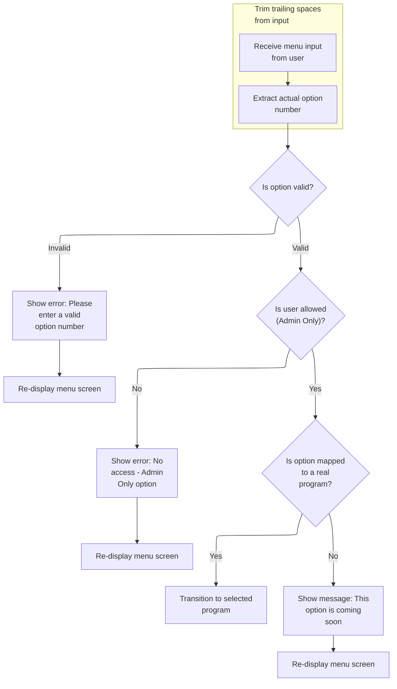

This section manages the reception and processing of user input from the main menu, validating selections, enforcing access control, and directing users to the appropriate application features or providing feedback when options are unavailable.

| Rule ID | Code Location     | Category        | Rule Name                          | Description                                                                                                                                                             | Conditions                                                                                                    | Remarks                                                                                                                                                                                                                                 |
| ------- | ----------------- | --------------- | ---------------------------------- | ----------------------------------------------------------------------------------------------------------------------------------------------------------------------- | ------------------------------------------------------------------------------------------------------------- | --------------------------------------------------------------------------------------------------------------------------------------------------------------------------------------------------------------------------------------- |
| BR-001  | PROCESS-ENTER-KEY | Data validation | Menu option validity check         | If the user's menu option input is not numeric, is zero, or exceeds the maximum allowed option count, an error message is displayed and the menu screen is redisplayed. | User enters a menu option that is not numeric, is zero, or is greater than the value of CDEMO-MENU-OPT-COUNT. | CDEMO-MENU-OPT-COUNT is the maximum allowed option number. The error message displayed is 'Please enter a valid option number...'. The output message is a string up to 80 characters, left-aligned, padded with spaces if shorter.     |
| BR-002  | PROCESS-ENTER-KEY | Data validation | Admin-only option access control   | If a regular user selects an admin-only menu option, an access denied message is displayed and the menu screen is redisplayed.                                          | User type is 'U' (regular user) and the selected option requires admin access ('A').                          | User types: 'A' for admin, 'U' for regular user. The error message displayed is 'No access - Admin Only option... '. The output message is a string up to 80 characters, left-aligned, padded with spaces if shorter.                   |
| BR-003  | PROCESS-ENTER-KEY | Data validation | Input trimming                     | User input is trimmed of trailing spaces before validation and processing.                                                                                              | User enters a menu option with trailing spaces.                                                               | Input is trimmed to remove trailing spaces before further processing. The trimmed value is used for all subsequent validation and logic.                                                                                                |
| BR-004  | PROCESS-ENTER-KEY | Business logic  | Program transition on valid option | If the selected menu option is mapped to a real program, the system transitions to that program.                                                                        | No error flag is set and the selected option's program name does not start with 'DUMMY'.                      | Program names are strings of up to 8 characters. Transition is performed using the CICS XCTL command with the selected program name and communication area.                                                                             |
| BR-005  | PROCESS-ENTER-KEY | Business logic  | Coming soon option handling        | If the selected menu option is not mapped to a real program, a 'coming soon' message is displayed and the menu screen is redisplayed.                                   | No error flag is set and the selected option's program name starts with 'DUMMY'.                              | The message format is: 'This option <option name> is coming soon ...', where <option name> is the display name of the selected option. The output message is a string up to 80 characters, left-aligned, padded with spaces if shorter. |

<SwmSnippet path="/app/cbl/COMEN01C.cbl" line="199" repo-id="Z2l0aHViJTNBJTNBa3luZHJ5bC1hd3MtbWFpbmZyYW1lLW1vZGVybml6YXRpb24tY2FyZGRlbW8lM0ElM0FTd2ltbS1EZW1v">

---

`RECEIVE-MENU-SCREEN` pulls user input from the main menu screen using the CICS RECEIVE command and puts it in the COMEN1AI structure.

```cobol
       RECEIVE-MENU-SCREEN.

           EXEC CICS RECEIVE
                     MAP('COMEN1A')
                     MAPSET('COMEN01')
                     INTO(COMEN1AI)
                     RESP(WS-RESP-CD)
                     RESP2(WS-REAS-CD)
           END-EXEC.
```

---

</SwmSnippet>

<SwmSnippet path="/app/cbl/COMEN01C.cbl" line="115" repo-id="Z2l0aHViJTNBJTNBa3luZHJ5bC1hd3MtbWFpbmZyYW1lLW1vZGVybml6YXRpb24tY2FyZGRlbW8lM0ElM0FTd2ltbS1EZW1v">

---

`PROCESS-ENTER-KEY` trims and validates the user's menu option input, checks access control, and either jumps to the selected program or shows a 'coming soon' message if the option isn't implemented.

```cobol
       PROCESS-ENTER-KEY.

           PERFORM VARYING WS-IDX
                   FROM LENGTH OF OPTIONI OF COMEN1AI BY -1 UNTIL
                   OPTIONI OF COMEN1AI(WS-IDX:1) NOT = SPACES OR
                   WS-IDX = 1
           END-PERFORM
           MOVE OPTIONI OF COMEN1AI(1:WS-IDX) TO WS-OPTION-X
           INSPECT WS-OPTION-X REPLACING ALL ' ' BY '0'
           MOVE WS-OPTION-X              TO WS-OPTION
           MOVE WS-OPTION                TO OPTIONO OF COMEN1AO

           IF WS-OPTION IS NOT NUMERIC OR
              WS-OPTION > CDEMO-MENU-OPT-COUNT OR
              WS-OPTION = ZEROS
               MOVE 'Y'     TO WS-ERR-FLG
               MOVE 'Please enter a valid option number...' TO
                               WS-MESSAGE
               PERFORM SEND-MENU-SCREEN
           END-IF

           IF CDEMO-USRTYP-USER AND
              CDEMO-MENU-OPT-USRTYPE(WS-OPTION) = 'A'
               SET ERR-FLG-ON          TO TRUE
               MOVE SPACES             TO WS-MESSAGE
               MOVE 'No access - Admin Only option... ' TO
                                       WS-MESSAGE
               PERFORM SEND-MENU-SCREEN
           END-IF

           IF NOT ERR-FLG-ON
               IF CDEMO-MENU-OPT-PGMNAME(WS-OPTION)(1:5) NOT = 'DUMMY'
                   MOVE WS-TRANID    TO CDEMO-FROM-TRANID
                   MOVE WS-PGMNAME   TO CDEMO-FROM-PROGRAM
      *            MOVE WS-USER-ID   TO CDEMO-USER-ID
      *            MOVE SEC-USR-TYPE TO CDEMO-USER-TYPE
                   MOVE ZEROS        TO CDEMO-PGM-CONTEXT
                   EXEC CICS
                       XCTL PROGRAM(CDEMO-MENU-OPT-PGMNAME(WS-OPTION))
                       COMMAREA(CARDDEMO-COMMAREA)
                   END-EXEC
               END-IF
               MOVE SPACES             TO WS-MESSAGE
               MOVE DFHGREEN           TO ERRMSGC  OF COMEN1AO
               STRING 'This option '       DELIMITED BY SIZE
                       CDEMO-MENU-OPT-NAME(WS-OPTION)
                                       DELIMITED BY SPACE
                       'is coming soon ...'   DELIMITED BY SIZE
                  INTO WS-MESSAGE
               PERFORM SEND-MENU-SCREEN
           END-IF.
```

---

</SwmSnippet>

#### Sending plain text and returning control

This section is responsible for sending a plain text message to the user's terminal and then returning control, ending the current program session.

| Rule ID | Code Location   | Category       | Rule Name                    | Description                                                                                                       | Conditions                                        | Remarks                                                                                                                                                                                                                                                                                                           |
| ------- | --------------- | -------------- | ---------------------------- | ----------------------------------------------------------------------------------------------------------------- | ------------------------------------------------- | ----------------------------------------------------------------------------------------------------------------------------------------------------------------------------------------------------------------------------------------------------------------------------------------------------------------- |
| BR-001  | SEND-PLAIN-TEXT | Business logic | Send message before return   | A plain text message must be sent to the user's terminal before the program returns control.                      | Whenever the SEND-PLAIN-TEXT section is executed. | The message is taken from WS-MESSAGE, which is an alphanumeric string of up to 80 characters. The message may contain any content previously set in WS-MESSAGE, including predefined messages such as 'Thank you for using CardDemo application...      ' or 'Invalid key pressed. Please see below...         '. |
| BR-002  | SEND-PLAIN-TEXT | Business logic | Message format and length    | The message sent to the user's terminal must be formatted as plain text and may be up to 80 characters in length. | Whenever a message is sent using SEND-PLAIN-TEXT. | The message is stored in WS-MESSAGE, which is defined as an alphanumeric string of 80 characters. Predefined messages such as 'Thank you for using CardDemo application...      ' (50 characters) and 'Invalid key pressed. Please see below...         ' (50 characters) are examples of possible content.       |
| BR-003  | SEND-PLAIN-TEXT | Business logic | Return control after message | After the message is sent to the user's terminal, control is returned and the current program session ends.       | Whenever SEND-PLAIN-TEXT is executed.             | The program does not perform any further actions after sending the message; control is returned to the caller or environment.                                                                                                                                                                                     |

<SwmSnippet path="/app/cbl/COSGN00C.cbl" line="162" repo-id="Z2l0aHViJTNBJTNBa3luZHJ5bC1hd3MtbWFpbmZyYW1lLW1vZGVybml6YXRpb24tY2FyZGRlbW8lM0ElM0FTd2ltbS1EZW1v">

---

`SEND-PLAIN-TEXT` sends a message to the user's terminal and then returns control, ending the current program.

```cobol
       SEND-PLAIN-TEXT.

           EXEC CICS SEND TEXT
                     FROM(WS-MESSAGE)
                     LENGTH(LENGTH OF WS-MESSAGE)
                     ERASE
                     FREEKB
           END-EXEC.

           EXEC CICS RETURN
           END-EXEC.
```

---

</SwmSnippet>

### Preparing and sending the admin menu screen

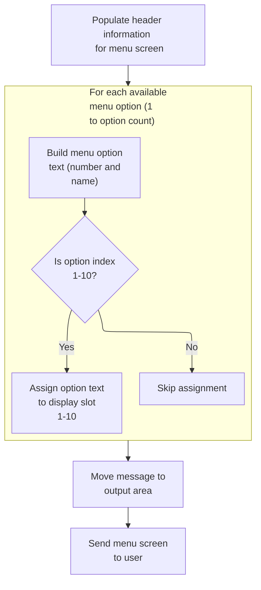

This section prepares and sends the admin menu screen to the user, including header information, menu options, and any message, ensuring the user receives a complete and formatted menu interface.

| Rule ID | Code Location        | Category       | Rule Name                            | Description                                                                                                                                                  | Conditions                                                                         | Remarks                                                                                                                                                 |
| ------- | -------------------- | -------------- | ------------------------------------ | ------------------------------------------------------------------------------------------------------------------------------------------------------------ | ---------------------------------------------------------------------------------- | ------------------------------------------------------------------------------------------------------------------------------------------------------- |
| BR-001  | POPULATE-HEADER-INFO | Business logic | Header information display           | The admin menu screen header must display the current date and time, application titles, program name, and transaction name, formatted for user readability. | Whenever the admin menu screen is prepared for display.                            | Date is formatted as MM-DD-YY, time as HH-MM-SS. Titles, program name, and transaction name are displayed as strings in their respective header fields. |
| BR-002  | BUILD-MENU-OPTIONS   | Business logic | Menu option display limit and format | The admin menu screen must display up to 10 menu options, each showing its number and name in the format 'N. OptionName'.                                    | Whenever the admin menu screen is prepared, and there are available admin options. | Maximum of 10 options displayed. Each option is formatted as: number (1-10), dot, space, option name (string). Options beyond the 10th are not shown.   |
| BR-003  | SEND-MENU-SCREEN     | Business logic | Error message display                | Any message present must be displayed in the error field of the admin menu screen.                                                                           | Whenever the admin menu screen is sent, and a message is present.                  | Message is displayed as a string in the error field. If no message is present, the field is blank (spaces).                                             |
| BR-004  | SEND-MENU-SCREEN     | Business logic | Menu screen delivery                 | The admin menu screen must be sent to the user after all header, menu options, and message fields are populated.                                             | Whenever the admin menu screen is prepared for display.                            | Screen is sent using the CICS SEND MAP command, with all fields populated as described above.                                                           |

<SwmSnippet path="/app/cbl/COADM01C.cbl" line="172" repo-id="Z2l0aHViJTNBJTNBa3luZHJ5bC1hd3MtbWFpbmZyYW1lLW1vZGVybml6YXRpb24tY2FyZGRlbW8lM0ElM0FTd2ltbS1EZW1v">

---

`SEND-MENU-SCREEN` sets up the header, builds the admin menu options, puts any message in the error field, and sends the admin menu screen to the user using the CICS SEND MAP command.

```cobol
       SEND-MENU-SCREEN.

           PERFORM POPULATE-HEADER-INFO
           PERFORM BUILD-MENU-OPTIONS

           MOVE WS-MESSAGE TO ERRMSGO OF COADM1AO

           EXEC CICS SEND
                     MAP('COADM1A')
                     MAPSET('COADM01')
                     FROM(COADM1AO)
                     ERASE
           END-EXEC.
```

---

</SwmSnippet>

<SwmSnippet path="/app/cbl/COADM01C.cbl" line="202" repo-id="Z2l0aHViJTNBJTNBa3luZHJ5bC1hd3MtbWFpbmZyYW1lLW1vZGVybml6YXRpb24tY2FyZGRlbW8lM0ElM0FTd2ltbS1EZW1v">

---

`POPULATE-HEADER-INFO` grabs the current date and time, sets up the app titles, program and transaction names, and formats everything for the admin menu header.

```cobol
       POPULATE-HEADER-INFO.

           MOVE FUNCTION CURRENT-DATE  TO WS-CURDATE-DATA

           MOVE CCDA-TITLE01           TO TITLE01O OF COADM1AO
           MOVE CCDA-TITLE02           TO TITLE02O OF COADM1AO
           MOVE WS-TRANID              TO TRNNAMEO OF COADM1AO
           MOVE WS-PGMNAME             TO PGMNAMEO OF COADM1AO

           MOVE WS-CURDATE-MONTH       TO WS-CURDATE-MM
           MOVE WS-CURDATE-DAY         TO WS-CURDATE-DD
           MOVE WS-CURDATE-YEAR(3:2)   TO WS-CURDATE-YY

           MOVE WS-CURDATE-MM-DD-YY    TO CURDATEO OF COADM1AO

           MOVE WS-CURTIME-HOURS       TO WS-CURTIME-HH
           MOVE WS-CURTIME-MINUTE      TO WS-CURTIME-MM
           MOVE WS-CURTIME-SECOND      TO WS-CURTIME-SS

           MOVE WS-CURTIME-HH-MM-SS    TO CURTIMEO OF COADM1AO.
```

---

</SwmSnippet>

<SwmSnippet path="/app/cbl/COADM01C.cbl" line="226" repo-id="Z2l0aHViJTNBJTNBa3luZHJ5bC1hd3MtbWFpbmZyYW1lLW1vZGVybml6YXRpb24tY2FyZGRlbW8lM0ElM0FTd2ltbS1EZW1v">

---

`BUILD-MENU-OPTIONS` loops through all admin options, builds the display string for each, and assigns it to the right output field for the admin menu screen.

```cobol
       BUILD-MENU-OPTIONS.

           PERFORM VARYING WS-IDX FROM 1 BY 1 UNTIL
                           WS-IDX > CDEMO-ADMIN-OPT-COUNT

               MOVE SPACES             TO WS-ADMIN-OPT-TXT

               STRING CDEMO-ADMIN-OPT-NUM(WS-IDX)  DELIMITED BY SIZE
                      '. '                         DELIMITED BY SIZE
                      CDEMO-ADMIN-OPT-NAME(WS-IDX) DELIMITED BY SIZE
                 INTO WS-ADMIN-OPT-TXT

               EVALUATE WS-IDX
                   WHEN 1
                       MOVE WS-ADMIN-OPT-TXT TO OPTN001O
                   WHEN 2
                       MOVE WS-ADMIN-OPT-TXT TO OPTN002O
                   WHEN 3
                       MOVE WS-ADMIN-OPT-TXT TO OPTN003O
                   WHEN 4
                       MOVE WS-ADMIN-OPT-TXT TO OPTN004O
                   WHEN 5
                       MOVE WS-ADMIN-OPT-TXT TO OPTN005O
                   WHEN 6
                       MOVE WS-ADMIN-OPT-TXT TO OPTN006O
                   WHEN 7
                       MOVE WS-ADMIN-OPT-TXT TO OPTN007O
                   WHEN 8
                       MOVE WS-ADMIN-OPT-TXT TO OPTN008O
                   WHEN 9
                       MOVE WS-ADMIN-OPT-TXT TO OPTN009O
                   WHEN 10
                       MOVE WS-ADMIN-OPT-TXT TO OPTN010O
                   WHEN OTHER
                       CONTINUE
               END-EVALUATE

           END-PERFORM.
```

---

</SwmSnippet>

### Receiving and processing admin menu input

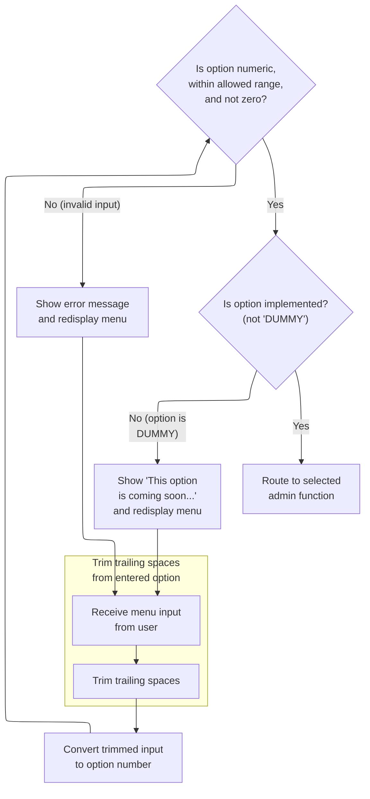

This section manages the reception and processing of admin menu input, ensuring that user selections are validated, appropriate feedback is given for invalid or unavailable options, and routing to admin functions is performed when valid options are selected.

| Rule ID | Code Location     | Category        | Rule Name                     | Description                                                                                                                                                                              | Conditions                                                                                               | Remarks                                                                                                                                                    |
| ------- | ----------------- | --------------- | ----------------------------- | ---------------------------------------------------------------------------------------------------------------------------------------------------------------------------------------- | -------------------------------------------------------------------------------------------------------- | ---------------------------------------------------------------------------------------------------------------------------------------------------------- |
| BR-001  | PROCESS-ENTER-KEY | Data validation | Trim trailing spaces          | If the entered menu option contains trailing spaces, these spaces are removed before further processing. Only the meaningful part of the input is considered for validation and routing. | The user enters a menu option with trailing spaces.                                                      | The input is trimmed so that only non-space characters are used for option selection. The trimmed value is used for all subsequent validation and routing. |
| BR-002  | PROCESS-ENTER-KEY | Data validation | Menu option validation        | The entered menu option must be numeric, within the allowed range, and not zero. If the input fails any of these checks, an error message is displayed and the menu is redisplayed.      | The user enters a menu option that is not numeric, is greater than the allowed option count, or is zero. | The allowed range is from 1 to the value of CDEMO-ADMIN-OPT-COUNT. The error message displayed is 'Please enter a valid option number...'.                 |
| BR-003  | PROCESS-ENTER-KEY | Business logic  | Unimplemented option handling | If the selected menu option is not implemented (marked as 'DUMMY'), a 'coming soon' message is displayed and the menu is redisplayed.                                                    | The user selects a menu option whose program name starts with 'DUMMY'.                                   | The message displayed is 'This option is coming soon ...'. The output format is a string message shown on the admin menu screen.                           |
| BR-004  | PROCESS-ENTER-KEY | Business logic  | Route to admin function       | If the selected menu option is valid and implemented, the system routes the user to the corresponding admin function.                                                                    | The user selects a menu option that is numeric, within range, not zero, and not marked as 'DUMMY'.       | Routing is performed by transferring control to the program associated with the selected option. The communication area is passed to the next program.     |

<SwmSnippet path="/app/cbl/COADM01C.cbl" line="189" repo-id="Z2l0aHViJTNBJTNBa3luZHJ5bC1hd3MtbWFpbmZyYW1lLW1vZGVybml6YXRpb24tY2FyZGRlbW8lM0ElM0FTd2ltbS1EZW1v">

---

`RECEIVE-MENU-SCREEN` pulls user input from the admin menu screen using the CICS RECEIVE command and puts it in the COADM1AI structure.

```cobol
       RECEIVE-MENU-SCREEN.

           EXEC CICS RECEIVE
                     MAP('COADM1A')
                     MAPSET('COADM01')
                     INTO(COADM1AI)
                     RESP(WS-RESP-CD)
                     RESP2(WS-REAS-CD)
           END-EXEC.
```

---

</SwmSnippet>

<SwmSnippet path="/app/cbl/COADM01C.cbl" line="115" repo-id="Z2l0aHViJTNBJTNBa3luZHJ5bC1hd3MtbWFpbmZyYW1lLW1vZGVybml6YXRpb24tY2FyZGRlbW8lM0ElM0FTd2ltbS1EZW1v">

---

`PROCESS-ENTER-KEY` trims and validates the admin's menu option input, and either jumps to the selected program or shows a 'coming soon' message if the option isn't implemented.

```cobol
       PROCESS-ENTER-KEY.

           PERFORM VARYING WS-IDX
                   FROM LENGTH OF OPTIONI OF COADM1AI BY -1 UNTIL
                   OPTIONI OF COADM1AI(WS-IDX:1) NOT = SPACES OR
                   WS-IDX = 1
           END-PERFORM
           MOVE OPTIONI OF COADM1AI(1:WS-IDX) TO WS-OPTION-X
           INSPECT WS-OPTION-X REPLACING ALL ' ' BY '0'
           MOVE WS-OPTION-X              TO WS-OPTION
           MOVE WS-OPTION                TO OPTIONO OF COADM1AO

           IF WS-OPTION IS NOT NUMERIC OR
              WS-OPTION > CDEMO-ADMIN-OPT-COUNT OR
              WS-OPTION = ZEROS
               MOVE 'Y'     TO WS-ERR-FLG
               MOVE 'Please enter a valid option number...' TO
                                       WS-MESSAGE
               PERFORM SEND-MENU-SCREEN
           END-IF


           IF NOT ERR-FLG-ON
               IF CDEMO-ADMIN-OPT-PGMNAME(WS-OPTION)(1:5) NOT = 'DUMMY'
                   MOVE WS-TRANID    TO CDEMO-FROM-TRANID
                   MOVE WS-PGMNAME   TO CDEMO-FROM-PROGRAM
                   MOVE ZEROS        TO CDEMO-PGM-CONTEXT
                   EXEC CICS
                       XCTL PROGRAM(CDEMO-ADMIN-OPT-PGMNAME(WS-OPTION))
                       COMMAREA(CARDDEMO-COMMAREA)
                   END-EXEC
               END-IF
               MOVE SPACES             TO WS-MESSAGE
               MOVE DFHGREEN           TO ERRMSGC  OF COADM1AO
               STRING 'This option '       DELIMITED BY SIZE
      *                CDEMO-ADMIN-OPT-NAME(WS-OPTION)
      *                                DELIMITED BY SIZE
                       'is coming soon ...'   DELIMITED BY SIZE
                  INTO WS-MESSAGE
               PERFORM SEND-MENU-SCREEN
           END-IF.
```

---

</SwmSnippet>

## Handling user deletion screen reentry

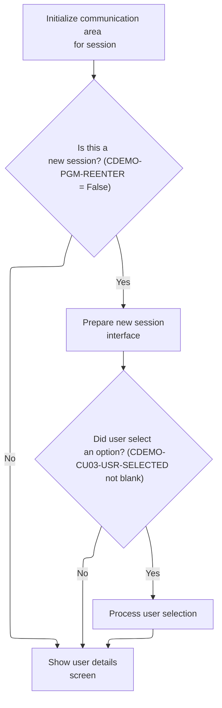

This section manages the logic for initializing and displaying the user deletion screen, handling both new sessions and reentry scenarios, and processing any pre-selected user input.

| Rule ID | Code Location | Category       | Rule Name                             | Description                                                                                                                                          | Conditions                                                                                                      | Remarks                                                                                                                                                                                                                                                                                                                                     |
| ------- | ------------- | -------------- | ------------------------------------- | ---------------------------------------------------------------------------------------------------------------------------------------------------- | --------------------------------------------------------------------------------------------------------------- | ------------------------------------------------------------------------------------------------------------------------------------------------------------------------------------------------------------------------------------------------------------------------------------------------------------------------------------------- |
| BR-001  | MAIN-PARA     | Business logic | Session initialization on first entry | When a session is not a reentry, the user deletion screen is initialized and any pre-selected user is processed before displaying the screen.        | Session is not a reentry (CDEMO-PGM-REENTER is False).                                                          | The session reentry flag is set to True after initialization. The user deletion screen is prepared with default values (LOW-VALUES for output fields, -1 for input index). If a user is pre-selected and the value is not blank or LOW-VALUES, the user details are loaded and processed. Constants: CDEMO-PGM-REENTER = 1, LOW-VALUES, -1. |
| BR-002  | MAIN-PARA     | Business logic | Pre-selected user processing          | If a user is pre-selected and the value is not blank or LOW-VALUES, the user details are loaded and processed before displaying the deletion screen. | A user is pre-selected (CDEMO-CU03-USR-SELECTED is not blank and not LOW-VALUES) during session initialization. | Pre-selected user value must not be blank (spaces) or LOW-VALUES. The user details are loaded into the input field and processed before the screen is displayed.                                                                                                                                                                            |
| BR-003  | MAIN-PARA     | Business logic | Display user deletion screen          | After initialization or processing user selection, the user deletion screen is displayed to the user.                                                | Session is either a reentry or has just been initialized, or a user selection has been processed.               | The user deletion screen is presented regardless of whether a user was pre-selected or not. The format and content of the screen depend on prior processing steps.                                                                                                                                                                          |

<SwmSnippet path="/app/cbl/COUSR03C.cbl" line="93" repo-id="Z2l0aHViJTNBJTNBa3luZHJ5bC1hd3MtbWFpbmZyYW1lLW1vZGVybml6YXRpb24tY2FyZGRlbW8lM0ElM0FTd2ltbS1EZW1v">

---

Back in MAIN-PARA after RETURN-TO-PREV-SCREEN, we check if we're reentering. If not, we set up the screen and handle any pre-selected user by calling PROCESS-ENTER-KEY. If reentered, we process user input.

```cobol
           ELSE
               MOVE DFHCOMMAREA(1:EIBCALEN) TO CARDDEMO-COMMAREA
               IF NOT CDEMO-PGM-REENTER
                   SET CDEMO-PGM-REENTER    TO TRUE
                   MOVE LOW-VALUES          TO COUSR3AO
                   MOVE -1       TO USRIDINL OF COUSR3AI
                   IF CDEMO-CU03-USR-SELECTED NOT =
                                              SPACES AND LOW-VALUES
                       MOVE CDEMO-CU03-USR-SELECTED TO
                            USRIDINI OF COUSR3AI
                       PERFORM PROCESS-ENTER-KEY
                   END-IF
                   PERFORM SEND-USRDEL-SCREEN
```

---

</SwmSnippet>

## Validating user input for deletion

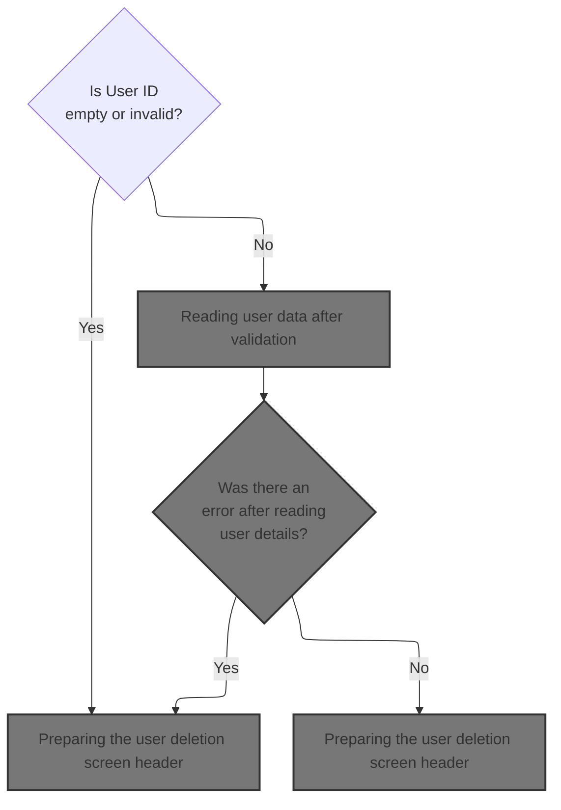

This section validates the User ID input when a user attempts to delete a user record, ensuring that only valid User IDs are accepted and providing immediate feedback for invalid entries.

| Rule ID | Code Location     | Category        | Rule Name                                    | Description                                                                                                                                                                                            | Conditions                                                                   | Remarks                                                                                                                                                                                                                   |
| ------- | ----------------- | --------------- | -------------------------------------------- | ------------------------------------------------------------------------------------------------------------------------------------------------------------------------------------------------------ | ---------------------------------------------------------------------------- | ------------------------------------------------------------------------------------------------------------------------------------------------------------------------------------------------------------------------- |
| BR-001  | PROCESS-ENTER-KEY | Data validation | User ID required for deletion                | If the User ID is empty or contains only low-values, the system sets an error flag, displays the message 'User ID can NOT be empty...', and prevents further processing until valid input is provided. | The User ID input is empty or contains only low-values.                      | The error message displayed is 'User ID can NOT be empty...'. The error flag is set to 'Y'. The input length is set to -1 to indicate invalid input. The error message is shown immediately via the user deletion screen. |
| BR-002  | PROCESS-ENTER-KEY | Business logic  | Valid User ID proceeds to deletion           | If the User ID is valid (not empty and not low-values), the system allows the deletion process to continue without displaying an error.                                                                | The User ID input is present and does not contain only spaces or low-values. | The input length is set to -1 to indicate readiness for further processing. No error message is displayed and the error flag remains unset.                                                                               |
| BR-003  | PROCESS-ENTER-KEY | Error handling  | Immediate error feedback for invalid User ID | When an invalid User ID is detected, the system immediately displays feedback to the user via the user deletion screen, ensuring prompt error notification.                                            | The User ID input is empty or contains only low-values.                      | The error message 'User ID can NOT be empty...' is displayed immediately. The user deletion screen is shown to provide feedback.                                                                                          |

<SwmSnippet path="/app/cbl/COUSR03C.cbl" line="142" repo-id="Z2l0aHViJTNBJTNBa3luZHJ5bC1hd3MtbWFpbmZyYW1lLW1vZGVybml6YXRpb24tY2FyZGRlbW8lM0ElM0FTd2ltbS1EZW1v">

---

In `PROCESS-ENTER-KEY`, we check if the User ID input is empty or just low-values. If it is, we set the error flag, put an error message in place, set the input length to -1, and call SEND-USRDEL-SCREEN to show the error right away. If the User ID is present, we just set the length and keep going. Calling SEND-USRDEL-SCREEN here makes sure the user sees feedback immediately if their input is invalid.

```cobol
       PROCESS-ENTER-KEY.

           EVALUATE TRUE
               WHEN USRIDINI OF COUSR3AI = SPACES OR LOW-VALUES
                   MOVE 'Y'     TO WS-ERR-FLG
                   MOVE 'User ID can NOT be empty...' TO
                                   WS-MESSAGE
                   MOVE -1       TO USRIDINL OF COUSR3AI
                   PERFORM SEND-USRDEL-SCREEN
               WHEN OTHER
                   MOVE -1       TO USRIDINL OF COUSR3AI
                   CONTINUE
           END-EVALUATE
```

---

</SwmSnippet>

### Preparing the user deletion screen header

This section prepares and sends the user deletion screen header, ensuring that users see up-to-date information, identification, and relevant messages when interacting with the application.

| Rule ID | Code Location        | Category       | Rule Name                     | Description                                                                                                                                                      | Conditions                                                                          | Remarks                                                                                                                                                                                                                           |
| ------- | -------------------- | -------------- | ----------------------------- | ---------------------------------------------------------------------------------------------------------------------------------------------------------------- | ----------------------------------------------------------------------------------- | --------------------------------------------------------------------------------------------------------------------------------------------------------------------------------------------------------------------------------- |
| BR-001  | POPULATE-HEADER-INFO | Business logic | Current date and time display | The screen header must always display the current date and time, ensuring users see up-to-date information whenever the user deletion screen is presented.       | Whenever the user deletion screen is prepared for display.                          | Date and time are formatted as strings and placed in the header fields. The exact format is determined by the code that moves the date and time components into the output fields, e.g., MM-DD-YY for date and HH-MM-SS for time. |
| BR-002  | POPULATE-HEADER-INFO | Business logic | Header identification display | The screen header must display the application titles, program name, and transaction ID to provide context and identification for the user.                      | Whenever the user deletion screen is prepared for display.                          | Titles are copied as strings; program name is an 8-character string ('COUSR03C'); transaction ID is a 4-character string ('CU03'). These are placed in the respective header fields.                                              |
| BR-003  | SEND-USRDEL-SCREEN   | Business logic | Message display               | Any error or informational message must be displayed in the message area of the screen header to inform the user of relevant status or issues.                   | Whenever the user deletion screen is prepared for display and a message is present. | Message is an 80-character string. If no message is present, the field is filled with spaces.                                                                                                                                     |
| BR-004  | SEND-USRDEL-SCREEN   | Business logic | Screen send and refresh       | The prepared screen header and message must be sent to the user's terminal, ensuring the display is refreshed and the cursor is positioned for user interaction. | Whenever the user deletion screen is prepared for display.                          | The screen is sent with ERASE and CURSOR options, ensuring the display is cleared and the cursor is positioned appropriately.                                                                                                     |

<SwmSnippet path="/app/cbl/COUSR03C.cbl" line="213" repo-id="Z2l0aHViJTNBJTNBa3luZHJ5bC1hd3MtbWFpbmZyYW1lLW1vZGVybml6YXRpb24tY2FyZGRlbW8lM0ElM0FTd2ltbS1EZW1v">

---

In `SEND-USRDEL-SCREEN`, we call POPULATE-HEADER-INFO right away to fill in the header fields—like date, time, program name, and titles—before sending the screen out. This keeps the display info current for the user.

```cobol
       SEND-USRDEL-SCREEN.

           PERFORM POPULATE-HEADER-INFO
```

---

</SwmSnippet>

<SwmSnippet path="/app/cbl/COUSR03C.cbl" line="243" repo-id="Z2l0aHViJTNBJTNBa3luZHJ5bC1hd3MtbWFpbmZyYW1lLW1vZGVybml6YXRpb24tY2FyZGRlbW8lM0ElM0FTd2ltbS1EZW1v">

---

`POPULATE-HEADER-INFO` grabs the current date and time, formats them, and fills the header fields in COUSR3AO. It also copies in the app titles, program name, and transaction ID so the screen header is always up to date and clear for the user.

```cobol
       POPULATE-HEADER-INFO.

           MOVE FUNCTION CURRENT-DATE  TO WS-CURDATE-DATA

           MOVE CCDA-TITLE01           TO TITLE01O OF COUSR3AO
           MOVE CCDA-TITLE02           TO TITLE02O OF COUSR3AO
           MOVE WS-TRANID              TO TRNNAMEO OF COUSR3AO
           MOVE WS-PGMNAME             TO PGMNAMEO OF COUSR3AO

           MOVE WS-CURDATE-MONTH       TO WS-CURDATE-MM
           MOVE WS-CURDATE-DAY         TO WS-CURDATE-DD
           MOVE WS-CURDATE-YEAR(3:2)   TO WS-CURDATE-YY

           MOVE WS-CURDATE-MM-DD-YY    TO CURDATEO OF COUSR3AO

           MOVE WS-CURTIME-HOURS       TO WS-CURTIME-HH
           MOVE WS-CURTIME-MINUTE      TO WS-CURTIME-MM
           MOVE WS-CURTIME-SECOND      TO WS-CURTIME-SS

           MOVE WS-CURTIME-HH-MM-SS    TO CURTIMEO OF COUSR3AO.
```

---

</SwmSnippet>

<SwmSnippet path="/app/cbl/COUSR03C.cbl" line="217" repo-id="Z2l0aHViJTNBJTNBa3luZHJ5bC1hd3MtbWFpbmZyYW1lLW1vZGVybml6YXRpb24tY2FyZGRlbW8lM0ElM0FTd2ltbS1EZW1v">

---

Back in SEND-USRDEL-SCREEN after filling the header, we move WS-MESSAGE into ERRMSGO to show any error or info message, then send the COUSR3A map to the terminal with ERASE and CURSOR so the user sees the updated screen and message.

```cobol
           MOVE WS-MESSAGE TO ERRMSGO OF COUSR3AO

           EXEC CICS SEND
                     MAP('COUSR3A')
                     MAPSET('COUSR03')
                     FROM(COUSR3AO)
                     ERASE
                     CURSOR
           END-EXEC.
```

---

</SwmSnippet>

### Reading user data after validation

This section manages the retrieval and preparation of user security data following validation of the user deletion screen, ensuring that data is only fetched and fields are cleared when no error is present.

| Rule ID | Code Location     | Category       | Rule Name                        | Description                                                                                                                                            | Conditions                                                                                                                                    | Remarks                                                                                                                                                                                                                                      |
| ------- | ----------------- | -------------- | -------------------------------- | ------------------------------------------------------------------------------------------------------------------------------------------------------ | --------------------------------------------------------------------------------------------------------------------------------------------- | -------------------------------------------------------------------------------------------------------------------------------------------------------------------------------------------------------------------------------------------- |
| BR-001  | PROCESS-ENTER-KEY | Business logic | Clear user fields on success     | If no error is present after processing the user deletion screen, the system clears the first name, last name, and user type fields before proceeding. | This rule applies when the error flag is not set (ERR-FLG-ON is false, i.e., WS-ERR-FLG = 'N') after returning from the user deletion screen. | The error flag values are 'Y' for error and 'N' for no error. The fields cleared are first name (string, up to 20 characters), last name (string, up to 20 characters), and user type (string, 1 character).                                 |
| BR-002  | PROCESS-ENTER-KEY | Business logic | Copy User ID for security lookup | If no error is present, the system copies the entered User ID to the security lookup variable to prepare for user data retrieval.                      | This rule applies when the error flag is not set (ERR-FLG-ON is false, i.e., WS-ERR-FLG = 'N') after returning from the user deletion screen. | The User ID is a string of up to 8 characters. It is copied to the security lookup variable for subsequent data retrieval.                                                                                                                   |
| BR-003  | PROCESS-ENTER-KEY | Business logic | Retrieve user security data      | If no error is present, the system retrieves the user security data for the specified User ID to enable display or further processing.                 | This rule applies when the error flag is not set (ERR-FLG-ON is false, i.e., WS-ERR-FLG = 'N') after returning from the user deletion screen. | The user security data includes User ID (string, 8 characters), first name (string, 20 characters), last name (string, 20 characters), password (string, 8 characters), user type (string, 1 character), and filler (string, 23 characters). |

<SwmSnippet path="/app/cbl/COUSR03C.cbl" line="156" repo-id="Z2l0aHViJTNBJTNBa3luZHJ5bC1hd3MtbWFpbmZyYW1lLW1vZGVybml6YXRpb24tY2FyZGRlbW8lM0ElM0FTd2ltbS1EZW1v">

---

After returning from SEND-USRDEL-SCREEN, PROCESS-ENTER-KEY checks if there was no error. If so, it clears out the name and type fields, copies the User ID to the security lookup variable, and calls READ-USER-SEC-FILE to fetch the user data for display or further action.

```cobol
           IF NOT ERR-FLG-ON
               MOVE SPACES      TO FNAMEI   OF COUSR3AI
                                   LNAMEI   OF COUSR3AI
                                   USRTYPEI OF COUSR3AI
               MOVE USRIDINI  OF COUSR3AI TO SEC-USR-ID
               PERFORM READ-USER-SEC-FILE
           END-IF.
```

---

</SwmSnippet>

### Looking up user record in security file

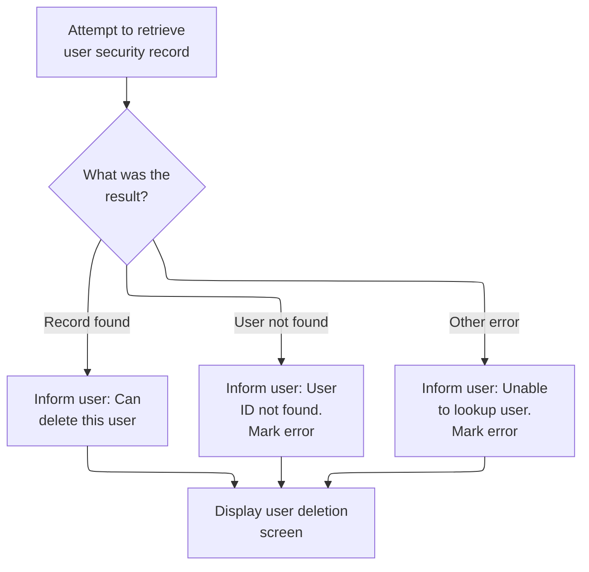

This section manages the lookup of a user record in the security file and determines the user-facing outcome based on whether the record is found, not found, or if another error occurs.

| Rule ID | Code Location      | Category       | Rule Name                    | Description                                                                                                                                          | Conditions                                                                     | Remarks                                                                                                                                                                                                                                                                     |
| ------- | ------------------ | -------------- | ---------------------------- | ---------------------------------------------------------------------------------------------------------------------------------------------------- | ------------------------------------------------------------------------------ | --------------------------------------------------------------------------------------------------------------------------------------------------------------------------------------------------------------------------------------------------------------------------- |
| BR-001  | READ-USER-SEC-FILE | Business logic | User found - deletion prompt | If the user record is found in the security file, the user is informed that they can delete this user and prompted to press PF5 to proceed.          | The user record lookup returns a normal response code.                         | The message displayed is: 'Press PF5 key to delete this user ...' (string, up to 80 characters). The error message code is set to neutral. The screen is updated to reflect this state.                                                                                     |
| BR-002  | READ-USER-SEC-FILE | Error handling | User not found error         | If the user record is not found in the security file, the user is informed that the User ID was not found and an error is marked.                    | The user record lookup returns a not found response code.                      | The message displayed is: 'User ID NOT found...' (string, up to 80 characters). The error flag is set to 'Y'. The input length for User ID is set to -1. The screen is updated to reflect this error.                                                                       |
| BR-003  | READ-USER-SEC-FILE | Error handling | Generic lookup error         | If an error other than 'not found' occurs during user record lookup, the user is informed that the lookup failed and debug information is displayed. | The user record lookup returns a response code other than normal or not found. | The message displayed is: 'Unable to lookup User...' (string, up to 80 characters). The error flag is set to 'Y'. The input length for the user name is set to -1. Debug information (response and reason codes) is displayed. The screen is updated to reflect this error. |

<SwmSnippet path="/app/cbl/COUSR03C.cbl" line="267" repo-id="Z2l0aHViJTNBJTNBa3luZHJ5bC1hd3MtbWFpbmZyYW1lLW1vZGVybml6YXRpb24tY2FyZGRlbW8lM0ElM0FTd2ltbS1EZW1v">

---

In READ-USER-SEC-FILE, we read the user record from the security file using the User ID as the key and lock it for update/delete. Depending on the response, we either prompt the user to confirm deletion, show a not found error, or display a generic error with debug info, always updating the screen accordingly.

```cobol
       READ-USER-SEC-FILE.

           EXEC CICS READ
                DATASET   (WS-USRSEC-FILE)
                INTO      (SEC-USER-DATA)
                LENGTH    (LENGTH OF SEC-USER-DATA)
                RIDFLD    (SEC-USR-ID)
                KEYLENGTH (LENGTH OF SEC-USR-ID)
                UPDATE
                RESP      (WS-RESP-CD)
                RESP2     (WS-REAS-CD)
           END-EXEC.
```

---

</SwmSnippet>

<SwmSnippet path="/app/cbl/COUSR03C.cbl" line="280" repo-id="Z2l0aHViJTNBJTNBa3luZHJ5bC1hd3MtbWFpbmZyYW1lLW1vZGVybml6YXRpb24tY2FyZGRlbW8lM0ElM0FTd2ltbS1EZW1v">

---

After reading the user record, we branch on the response code. For a normal read, we prompt the user to press PF5 to delete and show the screen. For not found or other errors, we set the right message and call SEND-USRDEL-SCREEN so the user sees exactly what happened.

```cobol
           EVALUATE WS-RESP-CD
               WHEN DFHRESP(NORMAL)
                   CONTINUE
                   MOVE 'Press PF5 key to delete this user ...' TO
                                   WS-MESSAGE
                   MOVE DFHNEUTR       TO ERRMSGC  OF COUSR3AO
                   PERFORM SEND-USRDEL-SCREEN
```

---

</SwmSnippet>

<SwmSnippet path="/app/cbl/COUSR03C.cbl" line="287" repo-id="Z2l0aHViJTNBJTNBa3luZHJ5bC1hd3MtbWFpbmZyYW1lLW1vZGVybml6YXRpb24tY2FyZGRlbW8lM0ElM0FTd2ltbS1EZW1v">

---

Back in READ-USER-SEC-FILE, if the user isn't found, we set the error flag, update the message, set the input length, and call SEND-USRDEL-SCREEN so the user sees the not found message and can retry.

```cobol
               WHEN DFHRESP(NOTFND)
                   MOVE 'Y'     TO WS-ERR-FLG
                   MOVE 'User ID NOT found...' TO
                                   WS-MESSAGE
                   MOVE -1       TO USRIDINL OF COUSR3AI
                   PERFORM SEND-USRDEL-SCREEN
```

---

</SwmSnippet>

<SwmSnippet path="/app/cbl/COUSR03C.cbl" line="293" repo-id="Z2l0aHViJTNBJTNBa3luZHJ5bC1hd3MtbWFpbmZyYW1lLW1vZGVybml6YXRpb24tY2FyZGRlbW8lM0ElM0FTd2ltbS1EZW1v">

---

After handling the CICS READ, we branch for not found and other errors. For not found, we show a specific message. For other errors, we display debug info, set the error flag, and show a generic error message. The screen is always updated so the user knows what happened.

```cobol
               WHEN OTHER
                   DISPLAY 'RESP:' WS-RESP-CD 'REAS:' WS-REAS-CD
                   MOVE 'Y'     TO WS-ERR-FLG
                   MOVE 'Unable to lookup User...' TO
                                   WS-MESSAGE
                   MOVE -1       TO FNAMEL OF COUSR3AI
                   PERFORM SEND-USRDEL-SCREEN
           END-EVALUATE.
```

---

</SwmSnippet>

### Displaying user details for confirmation

This section ensures that user details are displayed for confirmation before a deletion operation, provided no error is present. It governs what information is shown and under what conditions the confirmation screen is presented.

| Rule ID | Code Location     | Category       | Rule Name                           | Description                                                                                                  | Conditions                                                                                | Remarks                                                                                                                                                                                  |
| ------- | ----------------- | -------------- | ----------------------------------- | ------------------------------------------------------------------------------------------------------------ | ----------------------------------------------------------------------------------------- | ---------------------------------------------------------------------------------------------------------------------------------------------------------------------------------------- |
| BR-001  | PROCESS-ENTER-KEY | Business logic | Error-free confirmation display     | User details are displayed for confirmation only if no error is present.                                     | The error flag must not be set ('ERR-FLG-ON' is false).                                   | The error flag is considered set if its value is 'Y'. The user details displayed include first name (up to 20 characters), last name (up to 20 characters), and user type (1 character). |
| BR-002  | PROCESS-ENTER-KEY | Business logic | Confirmation screen fields          | The confirmation screen displays the user's first name, last name, and user type for review before deletion. | Triggered when user details are to be displayed for confirmation and no error is present. | First name: string, max 20 characters; Last name: string, max 20 characters; User type: string, 1 character.                                                                             |
| BR-003  | PROCESS-ENTER-KEY | Error handling | Error prevents confirmation display | If an error is present, the user details are not displayed for confirmation.                                 | The error flag is set ('ERR-FLG-ON' is true).                                             | The error flag is set when its value is 'Y'.                                                                                                                                             |

<SwmSnippet path="/app/cbl/COUSR03C.cbl" line="164" repo-id="Z2l0aHViJTNBJTNBa3luZHJ5bC1hd3MtbWFpbmZyYW1lLW1vZGVybml6YXRpb24tY2FyZGRlbW8lM0ElM0FTd2ltbS1EZW1v">

---

After returning from READ-USER-SEC-FILE, PROCESS-ENTER-KEY copies the user details into the input fields and calls SEND-USRDEL-SCREEN again so the user sees all the info before confirming deletion.

```cobol
           IF NOT ERR-FLG-ON
               MOVE SEC-USR-FNAME      TO FNAMEI    OF COUSR3AI
               MOVE SEC-USR-LNAME      TO LNAMEI    OF COUSR3AI
               MOVE SEC-USR-TYPE       TO USRTYPEI  OF COUSR3AI
               PERFORM SEND-USRDEL-SCREEN
           END-IF.
```

---

</SwmSnippet>

## Initializing the user deletion screen


This section manages the logic for initializing and displaying the user deletion screen, handling both new sessions and reentry scenarios, and processing any pre-selected user input.

| Rule ID | Code Location | Category       | Rule Name                             | Description                                                                                                                                          | Conditions                                                                                                      | Remarks                                                                                                                                                                                                                                                                                                                                     |
| ------- | ------------- | -------------- | ------------------------------------- | ---------------------------------------------------------------------------------------------------------------------------------------------------- | --------------------------------------------------------------------------------------------------------------- | ------------------------------------------------------------------------------------------------------------------------------------------------------------------------------------------------------------------------------------------------------------------------------------------------------------------------------------------- |
| BR-001  | MAIN-PARA     | Business logic | Session initialization on first entry | When a session is not a reentry, the user deletion screen is initialized and any pre-selected user is processed before displaying the screen.        | Session is not a reentry (CDEMO-PGM-REENTER is False).                                                          | The session reentry flag is set to True after initialization. The user deletion screen is prepared with default values (LOW-VALUES for output fields, -1 for input index). If a user is pre-selected and the value is not blank or LOW-VALUES, the user details are loaded and processed. Constants: CDEMO-PGM-REENTER = 1, LOW-VALUES, -1. |
| BR-002  | MAIN-PARA     | Business logic | Pre-selected user processing          | If a user is pre-selected and the value is not blank or LOW-VALUES, the user details are loaded and processed before displaying the deletion screen. | A user is pre-selected (CDEMO-CU03-USR-SELECTED is not blank and not LOW-VALUES) during session initialization. | Pre-selected user value must not be blank (spaces) or LOW-VALUES. The user details are loaded into the input field and processed before the screen is displayed.                                                                                                                                                                            |
| BR-003  | MAIN-PARA     | Business logic | Display user deletion screen          | After initialization or processing user selection, the user deletion screen is displayed to the user.                                                | Session is either a reentry or has just been initialized, or a user selection has been processed.               | The user deletion screen is presented regardless of whether a user was pre-selected or not. The format and content of the screen depend on prior processing steps.                                                                                                                                                                          |

<SwmSnippet path="/app/cbl/COUSR03C.cbl" line="93" repo-id="Z2l0aHViJTNBJTNBa3luZHJ5bC1hd3MtbWFpbmZyYW1lLW1vZGVybml6YXRpb24tY2FyZGRlbW8lM0ElM0FTd2ltbS1EZW1v">

---

After PROCESS-ENTER-KEY, MAIN-PARA checks if we're not reentering. If not, it sets up the screen, handles any pre-selected user, and calls SEND-USRDEL-SCREEN to show the initial state. This avoids resetting the screen on reentry.

```cobol
           ELSE
               MOVE DFHCOMMAREA(1:EIBCALEN) TO CARDDEMO-COMMAREA
               IF NOT CDEMO-PGM-REENTER
                   SET CDEMO-PGM-REENTER    TO TRUE
                   MOVE LOW-VALUES          TO COUSR3AO
                   MOVE -1       TO USRIDINL OF COUSR3AI
                   IF CDEMO-CU03-USR-SELECTED NOT =
                                              SPACES AND LOW-VALUES
                       MOVE CDEMO-CU03-USR-SELECTED TO
                            USRIDINI OF COUSR3AI
                       PERFORM PROCESS-ENTER-KEY
                   END-IF
                   PERFORM SEND-USRDEL-SCREEN
```

---

</SwmSnippet>

<SwmSnippet path="/app/cbl/COUSR03C.cbl" line="106" repo-id="Z2l0aHViJTNBJTNBa3luZHJ5bC1hd3MtbWFpbmZyYW1lLW1vZGVybml6YXRpb24tY2FyZGRlbW8lM0ElM0FTd2ltbS1EZW1v">

---

After showing the screen, MAIN-PARA calls RECEIVE-USRDEL-SCREEN to get the user's input or action so we can process what they do next.

```cobol
               ELSE
                   PERFORM RECEIVE-USRDEL-SCREEN
```

---

</SwmSnippet>

<SwmSnippet path="/app/cbl/COUSR03C.cbl" line="230" repo-id="Z2l0aHViJTNBJTNBa3luZHJ5bC1hd3MtbWFpbmZyYW1lLW1vZGVybml6YXRpb24tY2FyZGRlbW8lM0ElM0FTd2ltbS1EZW1v">

---

RECEIVE-USRDEL-SCREEN grabs the user's input from the COUSR3A map and puts it in COUSR3AI, along with response codes so we know if the receive worked and what the user did.

```cobol
       RECEIVE-USRDEL-SCREEN.

           EXEC CICS RECEIVE
                     MAP('COUSR3A')
                     MAPSET('COUSR03')
                     INTO(COUSR3AI)
                     RESP(WS-RESP-CD)
                     RESP2(WS-REAS-CD)
           END-EXEC.
```

---

</SwmSnippet>

<SwmSnippet path="/app/cbl/COUSR03C.cbl" line="108" repo-id="Z2l0aHViJTNBJTNBa3luZHJ5bC1hd3MtbWFpbmZyYW1lLW1vZGVybml6YXRpb24tY2FyZGRlbW8lM0ElM0FTd2ltbS1EZW1v">

---

After getting input in MAIN-PARA, we check EIBAID to see what the user did—enter, PF3, PF4, PF5, PF12, or something else—and branch to the right handler for each action.

```cobol
                   EVALUATE EIBAID
                       WHEN DFHENTER
                           PERFORM PROCESS-ENTER-KEY
```

---

</SwmSnippet>

<SwmSnippet path="/app/cbl/COUSR03C.cbl" line="111" repo-id="Z2l0aHViJTNBJTNBa3luZHJ5bC1hd3MtbWFpbmZyYW1lLW1vZGVybml6YXRpb24tY2FyZGRlbW8lM0ElM0FTd2ltbS1EZW1v">

---

After handling a key in MAIN-PARA, we either navigate away, clear the screen, delete a user, or just loop back for more input, depending on what the user did.

```cobol
                       WHEN DFHPF3
                           IF CDEMO-FROM-PROGRAM = SPACES OR LOW-VALUES
                               MOVE 'COADM01C' TO CDEMO-TO-PROGRAM
                           ELSE
                               MOVE CDEMO-FROM-PROGRAM TO
                               CDEMO-TO-PROGRAM
                           END-IF
                           PERFORM RETURN-TO-PREV-SCREEN
```

---

</SwmSnippet>

<SwmSnippet path="/app/cbl/COUSR03C.cbl" line="119" repo-id="Z2l0aHViJTNBJTNBa3luZHJ5bC1hd3MtbWFpbmZyYW1lLW1vZGVybml6YXRpb24tY2FyZGRlbW8lM0ElM0FTd2ltbS1EZW1v">

---

When the user hits PF4, we call CLEAR-CURRENT-SCREEN to reset all fields and messages, then show a blank user deletion screen for new input.

```cobol
                       WHEN DFHPF4
                           PERFORM CLEAR-CURRENT-SCREEN
                       WHEN DFHPF5
                           PERFORM DELETE-USER-INFO
                       WHEN DFHPF12
                           MOVE 'COADM01C' TO CDEMO-TO-PROGRAM
                           PERFORM RETURN-TO-PREV-SCREEN
```

---

</SwmSnippet>

## Resetting all fields for a fresh screen

This section ensures that all user input and message fields are reset to their default state and presents a blank deletion screen to the user, ready for new input.

| Rule ID | Code Location                               | Category       | Rule Name                   | Description                                                                                                                         | Conditions                                                                  | Remarks                                                                                                       |
| ------- | ------------------------------------------- | -------------- | --------------------------- | ----------------------------------------------------------------------------------------------------------------------------------- | --------------------------------------------------------------------------- | ------------------------------------------------------------------------------------------------------------- |
| BR-001  | CLEAR-CURRENT-SCREEN, INITIALIZE-ALL-FIELDS | Business logic | Field reset on screen clear | Whenever the screen is reset, all user input fields and message fields are cleared so that no previous data is visible to the user. | Triggered when CLEAR-CURRENT-SCREEN is performed.                           | All input fields (user ID, first name, last name, user type) and the message field are set to empty (spaces). |
| BR-002  | INITIALIZE-ALL-FIELDS                       | Business logic | User ID index reset         | The user ID index is set to -1 whenever the screen is reset, indicating no user is currently selected.                              | Triggered when INITIALIZE-ALL-FIELDS is performed.                          | The user ID index is set to the constant value -1.                                                            |
| BR-003  | CLEAR-CURRENT-SCREEN                        | Business logic | Show blank deletion screen  | After all fields are reset, the user is presented with the deletion screen, which is blank and ready for new input.                 | Triggered after INITIALIZE-ALL-FIELDS is performed in CLEAR-CURRENT-SCREEN. | The deletion screen is shown with all fields empty or set to their default values.                            |

<SwmSnippet path="/app/cbl/COUSR03C.cbl" line="341" repo-id="Z2l0aHViJTNBJTNBa3luZHJ5bC1hd3MtbWFpbmZyYW1lLW1vZGVybml6YXRpb24tY2FyZGRlbW8lM0ElM0FTd2ltbS1EZW1v">

---

In CLEAR-CURRENT-SCREEN, we call INITIALIZE-ALL-FIELDS to wipe all input and message fields, then show the user deletion screen so everything is blank and ready for new input.

```cobol
       CLEAR-CURRENT-SCREEN.

           PERFORM INITIALIZE-ALL-FIELDS.
           PERFORM SEND-USRDEL-SCREEN.
```

---

</SwmSnippet>

<SwmSnippet path="/app/cbl/COUSR03C.cbl" line="349" repo-id="Z2l0aHViJTNBJTNBa3luZHJ5bC1hd3MtbWFpbmZyYW1lLW1vZGVybml6YXRpb24tY2FyZGRlbW8lM0ElM0FTd2ltbS1EZW1v">

---

INITIALIZE-ALL-FIELDS sets USRIDINL to -1 and clears all the input and message fields, making sure nothing old leaks into the next operation.

```cobol
       INITIALIZE-ALL-FIELDS.

           MOVE -1              TO USRIDINL OF COUSR3AI
           MOVE SPACES          TO USRIDINI OF COUSR3AI
                                   FNAMEI   OF COUSR3AI
                                   LNAMEI   OF COUSR3AI
                                   USRTYPEI OF COUSR3AI
                                   WS-MESSAGE.
```

---

</SwmSnippet>

<SwmSnippet path="/app/cbl/COUSR03C.cbl" line="341" repo-id="Z2l0aHViJTNBJTNBa3luZHJ5bC1hd3MtbWFpbmZyYW1lLW1vZGVybml6YXRpb24tY2FyZGRlbW8lM0ElM0FTd2ltbS1EZW1v">

---

After resetting everything in INITIALIZE-ALL-FIELDS, CLEAR-CURRENT-SCREEN calls SEND-USRDEL-SCREEN so the user sees a fresh, empty screen and can start new input.

```cobol
       CLEAR-CURRENT-SCREEN.

           PERFORM INITIALIZE-ALL-FIELDS.
           PERFORM SEND-USRDEL-SCREEN.
```

---

</SwmSnippet>

## Validating and starting user deletion

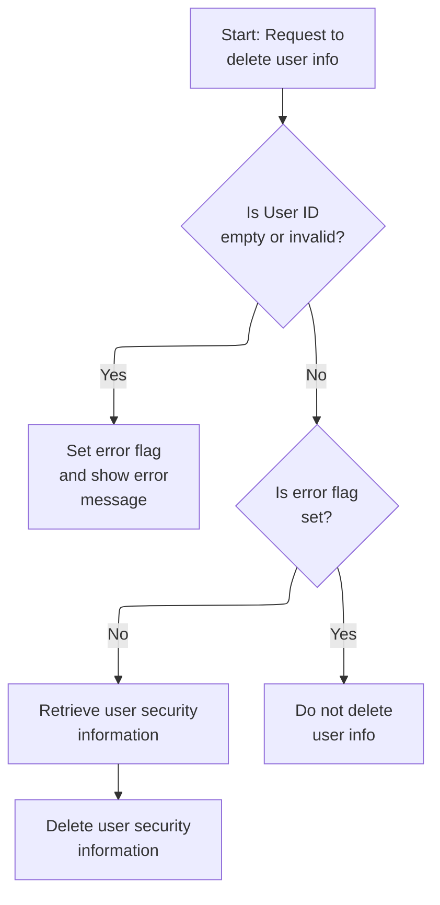

This section validates user deletion requests and ensures that only valid requests result in the deletion of user security information, providing immediate feedback to the user in case of errors.

| Rule ID | Code Location    | Category        | Rule Name                        | Description                                                                                                                                                                            | Conditions                                                                                                                              | Remarks                                                                                                                                                                               |
| ------- | ---------------- | --------------- | -------------------------------- | -------------------------------------------------------------------------------------------------------------------------------------------------------------------------------------- | --------------------------------------------------------------------------------------------------------------------------------------- | ------------------------------------------------------------------------------------------------------------------------------------------------------------------------------------- |
| BR-001  | DELETE-USER-INFO | Data validation | User ID required for deletion    | If the user ID is missing or contains only blank or non-printable characters, the system sets an error and displays a message to the user indicating that the user ID cannot be empty. | Triggered when the user deletion request is received and the user ID field is empty or contains only blank or non-printable characters. | The error message shown is: 'User ID can NOT be empty...'. The message is displayed as a string up to 80 characters. The user ID field is expected to be a string up to 8 characters. |
| BR-002  | DELETE-USER-INFO | Business logic  | Delete user security information | When the user ID is valid and no error is detected, the system retrieves the user's security information and deletes it.                                                               | Triggered when a valid user deletion request is received and no error flag is set.                                                      | The user ID is copied as a string up to 8 characters. The user's security information is retrieved and deleted from the security file.                                                |
| BR-003  | DELETE-USER-INFO | Error handling  | Abort deletion on error          | If an error is detected during validation, the system does not proceed with deleting the user's security information.                                                                  | Triggered after input validation when the error flag is set.                                                                            | The error flag is set to 'Y' when an error is detected. No deletion occurs if the flag is set.                                                                                        |

<SwmSnippet path="/app/cbl/COUSR03C.cbl" line="174" repo-id="Z2l0aHViJTNBJTNBa3luZHJ5bC1hd3MtbWFpbmZyYW1lLW1vZGVybml6YXRpb24tY2FyZGRlbW8lM0ElM0FTd2ltbS1EZW1v">

---

In DELETE-USER-INFO, we check the user ID input again. If it's missing, we set an error and show the screen with the message. If it's there, we keep going. Showing the screen after an error gives the user immediate feedback.

```cobol
       DELETE-USER-INFO.

           EVALUATE TRUE
               WHEN USRIDINI OF COUSR3AI = SPACES OR LOW-VALUES
                   MOVE 'Y'     TO WS-ERR-FLG
                   MOVE 'User ID can NOT be empty...' TO
                                   WS-MESSAGE
                   MOVE -1       TO USRIDINL OF COUSR3AI
                   PERFORM SEND-USRDEL-SCREEN
               WHEN OTHER
                   MOVE -1       TO USRIDINL OF COUSR3AI
                   CONTINUE
           END-EVALUATE
```

---

</SwmSnippet>

<SwmSnippet path="/app/cbl/COUSR03C.cbl" line="188" repo-id="Z2l0aHViJTNBJTNBa3luZHJ5bC1hd3MtbWFpbmZyYW1lLW1vZGVybml6YXRpb24tY2FyZGRlbW8lM0ElM0FTd2ltbS1EZW1v">

---

After showing the error (if any), DELETE-USER-INFO checks for errors. If none, it copies the user ID, reads the user record to lock it, and then deletes it. This prevents deleting a non-existent or wrong user.

```cobol
           IF NOT ERR-FLG-ON
               MOVE USRIDINI  OF COUSR3AI TO SEC-USR-ID
               PERFORM READ-USER-SEC-FILE
               PERFORM DELETE-USER-SEC-FILE
           END-IF.
```

---

</SwmSnippet>

## Deleting the user record

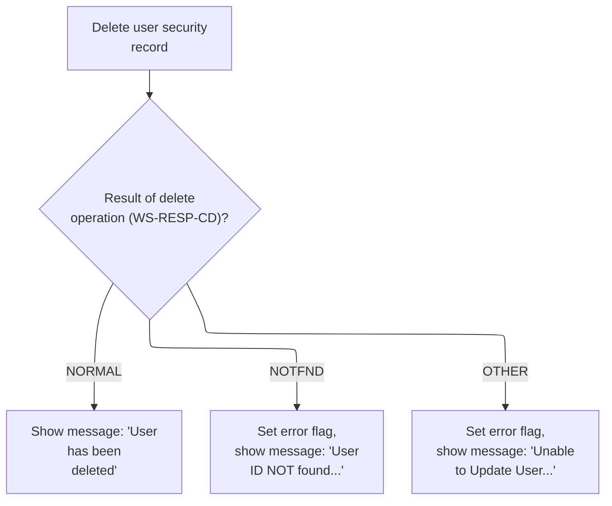

This section manages the deletion of user records from the security file, ensuring users receive clear feedback on the outcome of their delete request.

| Rule ID | Code Location        | Category       | Rule Name                             | Description                                                                                                                                                                                      | Conditions                                                                      | Remarks                                                                                                                                                                                          |
| ------- | -------------------- | -------------- | ------------------------------------- | ------------------------------------------------------------------------------------------------------------------------------------------------------------------------------------------------ | ------------------------------------------------------------------------------- | ------------------------------------------------------------------------------------------------------------------------------------------------------------------------------------------------ |
| BR-001  | DELETE-USER-SEC-FILE | Business logic | Successful user deletion confirmation | When a user record is successfully deleted, all fields are cleared, a confirmation message is displayed to the user, and the confirmation screen is shown.                                       | The delete operation returns a 'NORMAL' response code.                          | The confirmation message format is: 'User <user ID> has been deleted ...'. The message is left-aligned and padded to fit an 80-character display field. The error message color is set to green. |
| BR-002  | DELETE-USER-SEC-FILE | Error handling | User not found error handling         | If the user record is not found during deletion, an error flag is set, a 'User ID NOT found...' message is displayed, the input length is set for retry, and the error screen is shown.          | The delete operation returns a 'NOTFND' response code.                          | The error message is: 'User ID NOT found...'. The error flag is set to 'Y'. The input length is set to -1 to prompt for retry.                                                                   |
| BR-003  | DELETE-USER-SEC-FILE | Error handling | Generic delete error handling         | If the delete operation fails for reasons other than 'NOTFND', a generic error flag is set, a generic error message is displayed, debug information is shown, and the error screen is presented. | The delete operation returns any response code other than 'NORMAL' or 'NOTFND'. | The error message is: 'Unable to Update User...'. The error flag is set to 'Y'. Debug information includes the response and reason codes. The input length is set to -1 for retry.               |

<SwmSnippet path="/app/cbl/COUSR03C.cbl" line="305" repo-id="Z2l0aHViJTNBJTNBa3luZHJ5bC1hd3MtbWFpbmZyYW1lLW1vZGVybml6YXRpb24tY2FyZGRlbW8lM0ElM0FTd2ltbS1EZW1v">

---

In DELETE-USER-SEC-FILE, we call CICS DELETE to remove the user record. If it works, we reset all fields, set a success message, and show the confirmation screen. If not found or error, we set the right message and show the screen so the user knows what happened.

```cobol
       DELETE-USER-SEC-FILE.

           EXEC CICS DELETE
                DATASET   (WS-USRSEC-FILE)
                RESP      (WS-RESP-CD)
                RESP2     (WS-REAS-CD)
           END-EXEC.
```

---

</SwmSnippet>

<SwmSnippet path="/app/cbl/COUSR03C.cbl" line="313" repo-id="Z2l0aHViJTNBJTNBa3luZHJ5bC1hd3MtbWFpbmZyYW1lLW1vZGVybml6YXRpb24tY2FyZGRlbW8lM0ElM0FTd2ltbS1EZW1v">

---

After a successful delete, we call INITIALIZE-ALL-FIELDS to clear everything, then set a success message and show the confirmation screen. For errors, we set the right message and show the screen too.

```cobol
           EVALUATE WS-RESP-CD
               WHEN DFHRESP(NORMAL)
                   PERFORM INITIALIZE-ALL-FIELDS
                   MOVE SPACES             TO WS-MESSAGE
                   MOVE DFHGREEN           TO ERRMSGC  OF COUSR3AO
                   STRING 'User '     DELIMITED BY SIZE
                          SEC-USR-ID  DELIMITED BY SPACE
                          ' has been deleted ...' DELIMITED BY SIZE
                     INTO WS-MESSAGE
                   PERFORM SEND-USRDEL-SCREEN
```

---

</SwmSnippet>

<SwmSnippet path="/app/cbl/COUSR03C.cbl" line="313" repo-id="Z2l0aHViJTNBJTNBa3luZHJ5bC1hd3MtbWFpbmZyYW1lLW1vZGVybml6YXRpb24tY2FyZGRlbW8lM0ElM0FTd2ltbS1EZW1v">

---

After clearing all fields in INITIALIZE-ALL-FIELDS, DELETE-USER-SEC-FILE sets up the success message and calls SEND-USRDEL-SCREEN so the user sees confirmation right away.

```cobol
           EVALUATE WS-RESP-CD
               WHEN DFHRESP(NORMAL)
                   PERFORM INITIALIZE-ALL-FIELDS
                   MOVE SPACES             TO WS-MESSAGE
                   MOVE DFHGREEN           TO ERRMSGC  OF COUSR3AO
                   STRING 'User '     DELIMITED BY SIZE
                          SEC-USR-ID  DELIMITED BY SPACE
                          ' has been deleted ...' DELIMITED BY SIZE
                     INTO WS-MESSAGE
                   PERFORM SEND-USRDEL-SCREEN
```

---

</SwmSnippet>

<SwmSnippet path="/app/cbl/COUSR03C.cbl" line="323" repo-id="Z2l0aHViJTNBJTNBa3luZHJ5bC1hd3MtbWFpbmZyYW1lLW1vZGVybml6YXRpb24tY2FyZGRlbW8lM0ElM0FTd2ltbS1EZW1v">

---

Back in DELETE-USER-SEC-FILE, if the user wasn't found, we set the error flag, update the message, set the input length, and show the not found message so the user can retry.

```cobol
               WHEN DFHRESP(NOTFND)
                   MOVE 'Y'     TO WS-ERR-FLG
                   MOVE 'User ID NOT found...' TO
                                   WS-MESSAGE
                   MOVE -1       TO USRIDINL OF COUSR3AI
                   PERFORM SEND-USRDEL-SCREEN
```

---

</SwmSnippet>

<SwmSnippet path="/app/cbl/COUSR03C.cbl" line="329" repo-id="Z2l0aHViJTNBJTNBa3luZHJ5bC1hd3MtbWFpbmZyYW1lLW1vZGVybml6YXRpb24tY2FyZGRlbW8lM0ElM0FTd2ltbS1EZW1v">

---

After handling the CICS DELETE, we branch for not found and other errors. For not found, we show a specific message. For other errors, we display debug info, set the error flag, and show a generic error message. The screen is always updated so the user knows what happened.

```cobol
               WHEN OTHER
                   DISPLAY 'RESP:' WS-RESP-CD 'REAS:' WS-REAS-CD
                   MOVE 'Y'     TO WS-ERR-FLG
                   MOVE 'Unable to Update User...' TO
                                   WS-MESSAGE
                   MOVE -1       TO FNAMEL OF COUSR3AI
                   PERFORM SEND-USRDEL-SCREEN
           END-EVALUATE.
```

---

</SwmSnippet>

## Handling invalid key actions

This section manages the handling of unsupported key actions after user deletion attempts, providing error feedback to the user and ensuring proper continuation of the application flow by returning control to CICS.

| Rule ID | Code Location | Category       | Rule Name                      | Description                                                                                                                                                                                                                                     | Conditions                                                                                                                                                  | Remarks                                                                                                                                                                                                       |
| ------- | ------------- | -------------- | ------------------------------ | ----------------------------------------------------------------------------------------------------------------------------------------------------------------------------------------------------------------------------------------------- | ----------------------------------------------------------------------------------------------------------------------------------------------------------- | ------------------------------------------------------------------------------------------------------------------------------------------------------------------------------------------------------------- |
| BR-001  | MAIN-PARA     | Business logic | Return control to CICS         | After handling any key actions, including unsupported keys, the program returns control to CICS with the current transaction ID and communication area, allowing the next program or screen to continue processing.                             | This rule applies after all key handling logic in MAIN-PARA is complete.                                                                                    | The transaction ID is a 4-character string. The communication area is passed as a structured block containing user, account, and card information. Control is returned using the EXEC CICS RETURN statement.  |
| BR-002  | MAIN-PARA     | Error handling | Unsupported key error handling | If an unsupported key is pressed after returning from the user deletion operation, the system sets the error flag to 'Y', updates the user-facing message to indicate an invalid key was pressed, and displays the error message on the screen. | This rule applies when the key pressed does not match any explicitly supported key actions in the EVALUATE statement after returning from DELETE-USER-INFO. | The error flag is set to 'Y'. The message displayed is 'Invalid key pressed. Please see below...         ' (50 characters, left-aligned, padded with spaces). The error is shown on the user deletion screen. |

<SwmSnippet path="/app/cbl/COUSR03C.cbl" line="126" repo-id="Z2l0aHViJTNBJTNBa3luZHJ5bC1hd3MtbWFpbmZyYW1lLW1vZGVybml6YXRpb24tY2FyZGRlbW8lM0ElM0FTd2ltbS1EZW1v">

---

After returning from DELETE-USER-INFO, MAIN-PARA handles unsupported keys by setting the error flag, updating the message, and showing the error on the screen so the user knows what went wrong.

```cobol
                       WHEN OTHER
                           MOVE 'Y'                       TO WS-ERR-FLG
                           MOVE CCDA-MSG-INVALID-KEY      TO WS-MESSAGE
                           PERFORM SEND-USRDEL-SCREEN
                   END-EVALUATE
```

---

</SwmSnippet>

<SwmSnippet path="/app/cbl/COUSR03C.cbl" line="134" repo-id="Z2l0aHViJTNBJTNBa3luZHJ5bC1hd3MtbWFpbmZyYW1lLW1vZGVybml6YXRpb24tY2FyZGRlbW8lM0ElM0FTd2ltbS1EZW1v">

---

When MAIN-PARA is done, it returns control to CICS with the current transaction and commarea, letting the next program or screen take over.

```cobol
           EXEC CICS RETURN
                     TRANSID (WS-TRANID)
                     COMMAREA (CARDDEMO-COMMAREA)
           END-EXEC.
```

---

</SwmSnippet>

&nbsp;

*This is an auto-generated document by Swimm 🌊 and has not yet been verified by a human*

<SwmMeta version="3.0.0"><sup>Powered by [Swimm](https://staging.swimm.cloud/)</sup></SwmMeta>
