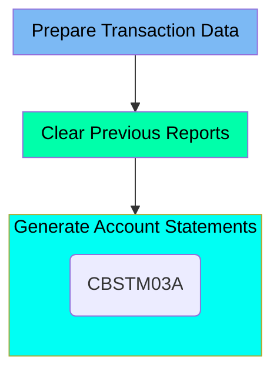

The CREASTMT job is responsible for creating account statements for each card present in the XREF file. This process involves preparing transaction data, clearing previous reports, and generating new account statements. The job starts by deleting and recreating transaction files, then it deletes outdated reports, and finally, it generates new statements in both plain text and HTML formats using the <SwmToken path="/app/cbl/CBSTM03A.CBL" pos="2:6:6" line-data="       PROGRAM-ID.    CBSTM03A.">`CBSTM03A`</SwmToken> program.

Here is a high level diagram of the file:



## Prepare Transaction Data

Steps in this section: <SwmToken path="/app/jcl/CREASTMT.JCL" pos="22:1:1" line-data="//DELDEF01 EXEC PGM=IDCAMS">`DELDEF01`</SwmToken>, <SwmToken path="/app/jcl/CREASTMT.JCL" pos="44:1:1" line-data="//STEP010  EXEC PGM=SORT">`STEP010`</SwmToken>, <SwmToken path="/app/jcl/CREASTMT.JCL" pos="56:1:1" line-data="//STEP020  EXEC PGM=IDCAMS,COND=(0,NE)">`STEP020`</SwmToken>.

This section is about preparing transaction data for statement creation. It involves deleting and recreating transaction files, creating a copy of the transaction file with card number and transaction ID as the key, and copying data from a sequential file to a VSAM KSDS file.

## Clear Previous Reports

Steps in this section: <SwmToken path="/app/jcl/CREASTMT.JCL" pos="66:1:1" line-data="//STEP030  EXEC PGM=IEFBR14,COND=(0,NE)">`STEP030`</SwmToken>.

This section is responsible for deleting transaction reports from the previous run to ensure that outdated data does not interfere with the new reports being generated.

## Generate Account Statements

Steps in this section: <SwmToken path="/app/jcl/CREASTMT.JCL" pos="79:1:1" line-data="//STEP040  EXEC PGM=CBSTM03A,COND=(0,NE)">`STEP040`</SwmToken>.

This section is responsible for generating account statements from transaction data, producing reports in both plain text and HTML formats. It involves reading data from multiple files and creating the statements using the <SwmToken path="/app/cbl/CBSTM03A.CBL" pos="2:6:6" line-data="       PROGRAM-ID.    CBSTM03A.">`CBSTM03A`</SwmToken> program.

<SwmSnippet path="/app/jcl/CREASTMT.JCL" line="79">

---

More about the <SwmToken path="/app/cbl/CBSTM03A.CBL" pos="2:6:6" line-data="       PROGRAM-ID.    CBSTM03A.">`CBSTM03A`</SwmToken> program: <SwmLink doc-title="Statement Generation Process (CBSTM03A)">[Statement Generation Process (CBSTM03A)](/.swm/statement-generation-process-cbstm03a.ulycyk8u.sw.md)</SwmLink>

```jcl
//STEP040  EXEC PGM=CBSTM03A,COND=(0,NE)
//STEPLIB  DD  DISP=SHR,DSN=AWS.M2.CARDDEMO.LOADLIB
//SYSPRINT DD  SYSOUT=*
//SYSOUT   DD  SYSOUT=*
//TRNXFILE DD  DISP=SHR,DSN=AWS.M2.CARDDEMO.TRXFL.VSAM.KSDS
//XREFFILE DD  DISP=SHR,DSN=AWS.M2.CARDDEMO.CARDXREF.VSAM.KSDS
//ACCTFILE DD  DISP=SHR,DSN=AWS.M2.CARDDEMO.ACCTDATA.VSAM.KSDS
//CUSTFILE DD  DISP=SHR,DSN=AWS.M2.CARDDEMO.CUSTDATA.VSAM.KSDS
//STMTFILE DD DISP=(NEW,CATLG,DELETE),
//         UNIT=SYSDA,
//         DCB=(LRECL=80,BLKSIZE=8000,RECFM=FB),
//         SPACE=(CYL,(1,1),RLSE), 00,RECFM=FB), ATA.VSAM.KSDS
//         DSN=AWS.M2.CARDDEMO.STATEMNT.PS
//HTMLFILE DD  DISP=(NEW,CATLG,DELETE),
//         UNIT=SYSDA,
//         DCB=(LRECL=100,BLKSIZE=800,RECFM=FB),
//         SPACE=(CYL,(1,1),RLSE),
//         DSN=AWS.M2.CARDDEMO.STATEMNT.HTML
```

---

</SwmSnippet>

&nbsp;

&nbsp;

*This is an auto-generated document by Swimm 🌊 and has not yet been verified by a human*

<SwmMeta version="3.0.0" repo-id="Z2l0aHViJTNBJTNBa3luZHJ5bC1hd3MtbWFpbmZyYW1lLW1vZGVybml6YXRpb24tY2FyZGRlbW8lM0ElM0FTd2ltbS1EZW1v" repo-name="kyndryl-aws-mainframe-modernization-carddemo"><sup>Powered by [Swimm](https://app.swimm.io/)</sup></SwmMeta>
