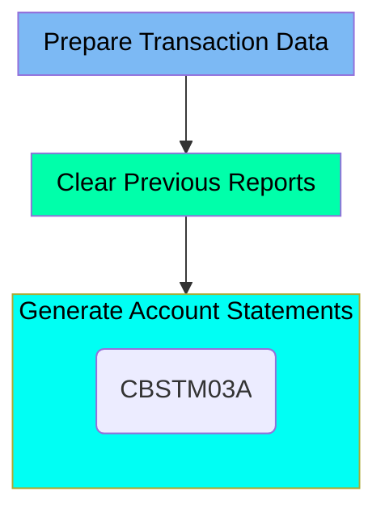

The CREASTMT job is responsible for creating account statements for each card present in the XREF file. This process involves preparing transaction data, clearing previous reports, and generating new account statements. The job starts by deleting and recreating transaction files, then it deletes outdated reports, and finally, it generates new statements in both plain text and HTML formats using the CBSTM03A program.

Here is a high level diagram of the file:

## Prepare Transaction Data

Steps in this section: `DELDEF01`, `STEP010`, `STEP020`.

This section is about preparing transaction data for statement creation. It involves deleting and recreating transaction files, creating a copy of the transaction file with card number and transaction ID as the key, and copying data from a sequential file to a VSAM KSDS file.

## Clear Previous Reports

Steps in this section: `STEP030`.

This section is responsible for deleting transaction reports from the previous run to ensure that outdated data does not interfere with the new reports being generated.

## Generate Account Statements

Steps in this section: `STEP040`.

This section is responsible for generating account statements from transaction data, producing reports in both plain text and HTML formats. It involves reading data from multiple files and creating the statements using the CBSTM03A program.

&nbsp;

*This is an auto-generated document by Swimm 🌊 and has not yet been verified by a human*

<SwmMeta version="3.0.0" repo-id="Z2l0aHViJTNBJTNBa3luZHJ5bC1hd3MtbWFpbmZyYW1lLW1vZGVybml6YXRpb24tY2FyZGRlbW8lM0ElM0FTd2ltbS1EZW1v" repo-name="kyndryl-aws-mainframe-modernization-carddemo">Powered by [Swimm](/)</SwmMeta>
