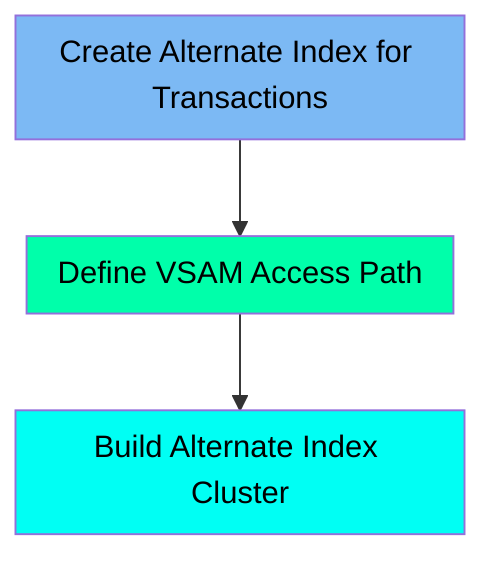

The TRANIDX job is responsible for creating an alternate index on the transaction master dataset within the mainframe application. This process involves defining the alternate index, establishing a path to relate the index to the base cluster, and building the alternate index cluster. The job ensures efficient data management and retrieval for transaction data, which is crucial for the application's performance.

For instance, the job defines an alternate index with specific keys and record sizes, relates it to the base cluster, and then builds the index using the IDCAMS utility. This allows for faster and more efficient access to transaction data.

Here is a high level diagram of the file:

## Create Alternate Index for Transactions

Steps in this section: `STEP20`.

This section is focused on defining and building an alternate index for transaction data within the mainframe application. It involves using IDCAMS to manage VSAM datasets, ensuring efficient data management and retrieval.

## Define VSAM Access Path

Steps in this section: `STEP25`.

This section is about defining a path to relate the alternate index to the base cluster for managing VSAM datasets, which are crucial for handling transaction data in the mainframe modernization process.

## Build Alternate Index Cluster

Steps in this section: `STEP30`.

This section involves creating an alternate index cluster for the transaction data managed in the CARDDEMO application. It uses the IDCAMS utility to build the index, linking the key-sequenced data set with the alternate index dataset.

&nbsp;

*This is an auto-generated document by Swimm 🌊 and has not yet been verified by a human*

<SwmMeta version="3.0.0" repo-id="Z2l0aHViJTNBJTNBa3luZHJ5bC1hd3MtbWFpbmZyYW1lLW1vZGVybml6YXRpb24tY2FyZGRlbW8lM0ElM0FTd2ltbS1EZW1v" repo-name="kyndryl-aws-mainframe-modernization-carddemo">Powered by [Swimm](/)</SwmMeta>
