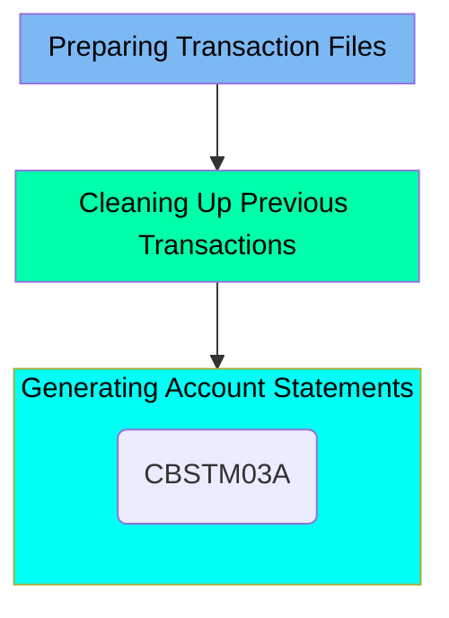

The CREASTMT job is responsible for creating statements for each card present in the XREF file. This process involves preparing transaction files, cleaning up previous transactions, and generating account statements. The job ensures that transaction data is sorted and copied into a VSAM KSDS file, old transaction reports are deleted, and new account statements are generated in both text and HTML formats.

For example, the job sorts transaction data by card number and transaction ID, deletes old HTML and PS statement files, and generates new statements using the <SwmToken path="app/jcl/CREASTMT.JCL" pos="79:7:7" line-data="//STEP040  EXEC PGM=CBSTM03A,COND=(0,NE)">`CBSTM03A`</SwmToken> program.

Here is a high level diagram of the file:



## Preparing Transaction Files

Steps in this section: <SwmToken path="app/jcl/CREASTMT.JCL" pos="22:1:1" line-data="//DELDEF01 EXEC PGM=IDCAMS">`DELDEF01`</SwmToken>, <SwmToken path="app/jcl/CREASTMT.JCL" pos="44:1:1" line-data="//STEP010  EXEC PGM=SORT">`STEP010`</SwmToken>, <SwmToken path="app/jcl/CREASTMT.JCL" pos="56:1:1" line-data="//STEP020  EXEC PGM=IDCAMS,COND=(0,NE)">`STEP020`</SwmToken>.

This section is responsible for preparing transaction files by creating statements for each card present in the XREF file. It involves deleting and defining datasets, sorting transaction data, and copying the sorted data into a VSAM KSDS file.

## Cleaning Up Previous Transactions

Steps in this section: <SwmToken path="app/jcl/CREASTMT.JCL" pos="66:1:1" line-data="//STEP030  EXEC PGM=IEFBR14,COND=(0,NE)">`STEP030`</SwmToken>.

This section is responsible for cleaning up old transaction reports by deleting specific datasets related to HTML and PS statement files, ensuring that only the most recent transaction data is retained.

## Generating Account Statements

Steps in this section: <SwmToken path="app/jcl/CREASTMT.JCL" pos="79:1:1" line-data="//STEP040  EXEC PGM=CBSTM03A,COND=(0,NE)">`STEP040`</SwmToken>.

This section is responsible for generating account statements in both text and HTML formats. It utilizes transaction, account, and customer data files to produce these statements, demonstrating the use of a called subroutine for the report generation process.

<SwmSnippet path="/app/jcl/CREASTMT.JCL" line="77">

---

Here we call the <SwmToken path="app/jcl/CREASTMT.JCL" pos="79:7:7" line-data="//STEP040  EXEC PGM=CBSTM03A,COND=(0,NE)">`CBSTM03A`</SwmToken> program.

More about <SwmToken path="app/jcl/CREASTMT.JCL" pos="79:7:7" line-data="//STEP040  EXEC PGM=CBSTM03A,COND=(0,NE)">`CBSTM03A`</SwmToken>: <SwmLink doc-title="Generating Account Statements (CBSTM03A)">[Generating Account Statements (CBSTM03A)](/.swm/generating-account-statements-cbstm03a.72jij1dq.sw.md)</SwmLink>

```jcl
//* PRODUCING REPORT IN TEXT AND HTML - DEMONSTRATES CALLED SUBROUTINE
//*********************************************************************
//STEP040  EXEC PGM=CBSTM03A,COND=(0,NE)
```

---

</SwmSnippet>

&nbsp;

*This is an auto-generated document by Swimm 🌊 and has not yet been verified by a human*

<SwmMeta version="3.0.0" repo-id="Z2l0aHViJTNBJTNBa3luZHJ5bC1hd3MtbWFpbmZyYW1lLW1vZGVybml6YXRpb24tY2FyZGRlbW8lM0ElM0FTd2ltbS1EZW1v" repo-name="kyndryl-aws-mainframe-modernization-carddemo"><sup>Powered by [Swimm](/)</sup></SwmMeta>
