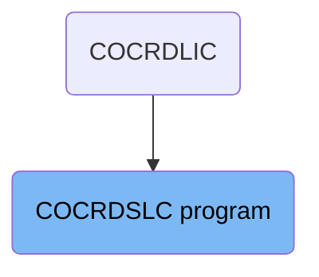
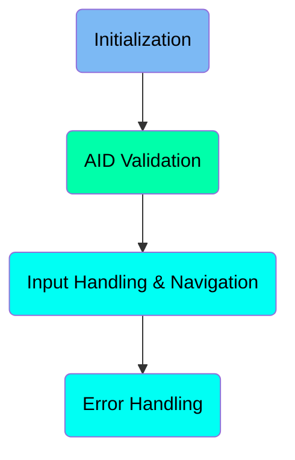
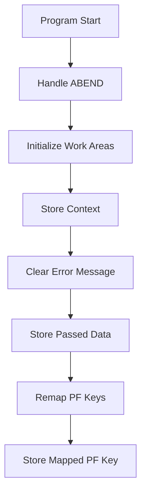
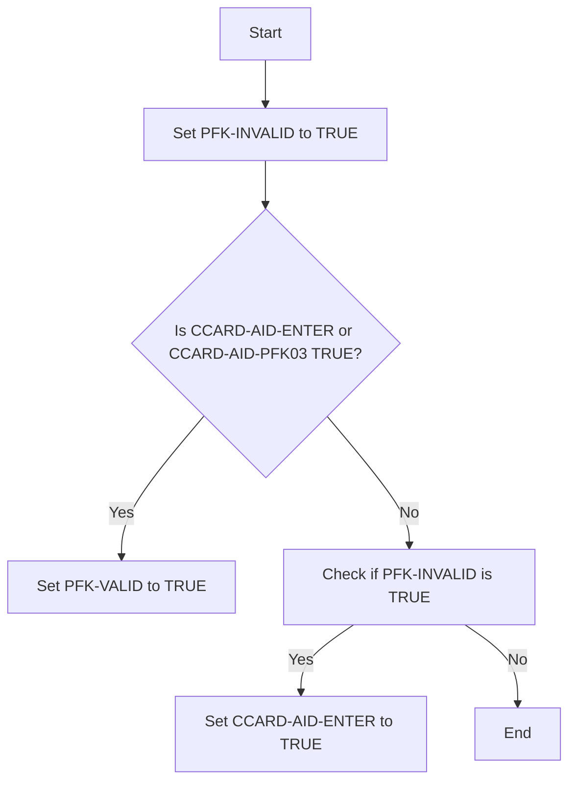
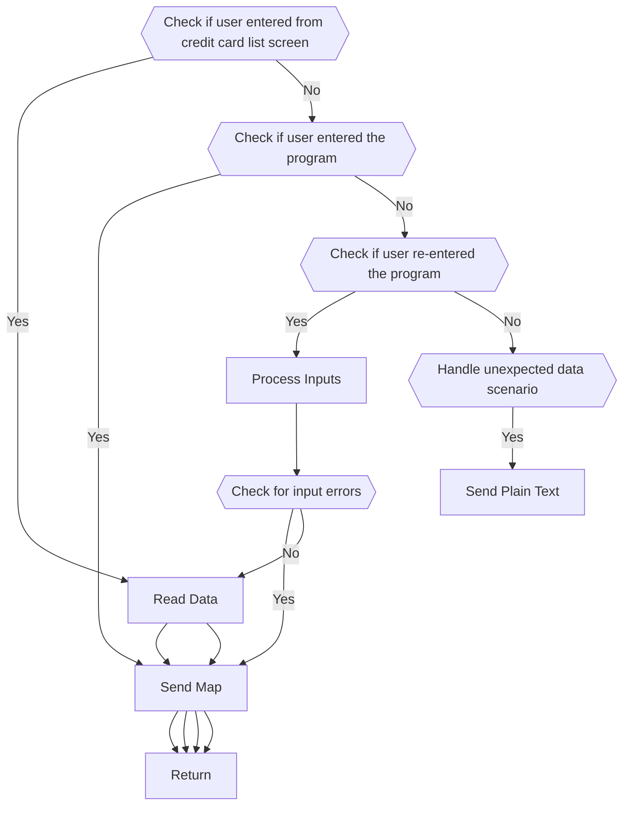
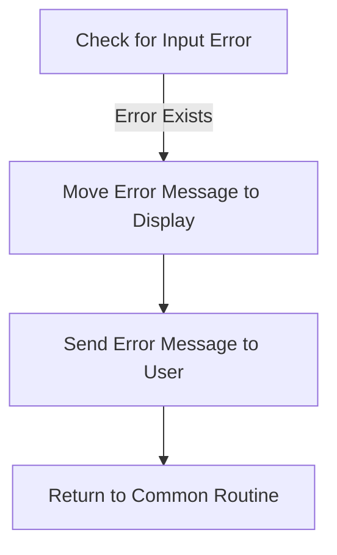

The COCRDSLC program handles the initialization, AID validation, input handling, navigation, and error handling within the CardDemo application. It ensures proper setup, user input validation, and navigation through different screens, while also managing errors effectively.

The COCRDSLC program starts by setting up necessary work areas and handling any abnormal terminations. It then validates user inputs and navigates through different screens based on these inputs. If any errors occur, it handles them by displaying appropriate error messages to the user.

# Where is this program used?

This program is used multiple times in the codebase as represented in the following diagram:



Here is a high level diagram of the program:



# Initialization



<SwmSnippet path="/app/cbl/COCRDSLC.cbl" line="249">

---

## Handle ABEND

First, the program sets up an ABEND (abnormal end) handler to manage unexpected terminations. This ensures that if the program encounters an error, it will jump to the <SwmToken path="app/cbl/COCRDSLC.cbl" pos="250:3:5" line-data="                     LABEL(ABEND-ROUTINE)                                       ">`ABEND-ROUTINE`</SwmToken> for proper handling.

```cobol
           EXEC CICS HANDLE ABEND                                               
                     LABEL(ABEND-ROUTINE)                                       
           END-EXEC                                                             
```

---

</SwmSnippet>

<SwmSnippet path="/app/cbl/COCRDSLC.cbl" line="253">

---

## Initialize Work Areas

Next, the program initializes various work areas such as <SwmToken path="app/cbl/COCRDSLC.cbl" pos="253:3:7" line-data="           INITIALIZE CC-WORK-AREA                                              ">`CC-WORK-AREA`</SwmToken>, <SwmToken path="app/cbl/COCRDSLC.cbl" pos="254:1:5" line-data="                      WS-MISC-STORAGE                                           ">`WS-MISC-STORAGE`</SwmToken>, and <SwmToken path="app/cbl/COCRDSLC.cbl" pos="255:1:3" line-data="                      WS-COMMAREA                                               ">`WS-COMMAREA`</SwmToken>. This step prepares the necessary storage areas for the program's operations.

```cobol
           INITIALIZE CC-WORK-AREA                                              
                      WS-MISC-STORAGE                                           
                      WS-COMMAREA                                               
```

---

</SwmSnippet>

<SwmSnippet path="/app/cbl/COCRDSLC.cbl" line="259">

---

## Store Context

Moving to storing the context, the program assigns the transaction ID to <SwmToken path="app/cbl/COCRDSLC.cbl" pos="259:9:11" line-data="           MOVE LIT-THISTRANID       TO WS-TRANID                               ">`WS-TRANID`</SwmToken>. This helps in tracking the current transaction throughout the program's execution.

```cobol
           MOVE LIT-THISTRANID       TO WS-TRANID                               
```

---

</SwmSnippet>

<SwmSnippet path="/app/cbl/COCRDSLC.cbl" line="263">

---

## Clear Error Message

Then, the program ensures that any previous error messages are cleared by setting <SwmToken path="app/cbl/COCRDSLC.cbl" pos="263:3:9" line-data="           SET WS-RETURN-MSG-OFF  TO TRUE                                       ">`WS-RETURN-MSG-OFF`</SwmToken> to TRUE. This step is crucial to avoid displaying outdated error messages to the user.

```cobol
           SET WS-RETURN-MSG-OFF  TO TRUE                                       
```

---

</SwmSnippet>

<SwmSnippet path="/app/cbl/COCRDSLC.cbl" line="267">

---

## Store Passed Data

Next, the program checks if there is any data passed from a previous transaction using <SwmToken path="app/cbl/COCRDSLC.cbl" pos="267:3:3" line-data="           IF EIBCALEN IS EQUAL TO 0                                            ">`EIBCALEN`</SwmToken>. If no data is passed or if the program is being called from a menu program and not re-entered, it initializes <SwmToken path="app/cbl/COCRDSLC.cbl" pos="270:3:5" line-data="              INITIALIZE CARDDEMO-COMMAREA                                      ">`CARDDEMO-COMMAREA`</SwmToken> and <SwmToken path="app/cbl/COCRDSLC.cbl" pos="271:1:5" line-data="                         WS-THIS-PROGCOMMAREA                                   ">`WS-THIS-PROGCOMMAREA`</SwmToken>. Otherwise, it moves the passed data into these areas for further processing.

```cobol
           IF EIBCALEN IS EQUAL TO 0                                            
               OR (CDEMO-FROM-PROGRAM = LIT-MENUPGM
               AND NOT CDEMO-PGM-REENTER)                               
              INITIALIZE CARDDEMO-COMMAREA                                      
                         WS-THIS-PROGCOMMAREA                                   
           ELSE                                                                 
              MOVE DFHCOMMAREA (1:LENGTH OF CARDDEMO-COMMAREA)  TO              
                                CARDDEMO-COMMAREA                               
              MOVE DFHCOMMAREA(LENGTH OF CARDDEMO-COMMAREA + 1:                 
                               LENGTH OF WS-THIS-PROGCOMMAREA ) TO              
                                WS-THIS-PROGCOMMAREA                            
           END-IF                                                               
```

---

</SwmSnippet>

<SwmSnippet path="/app/cbl/COCRDSLC.cbl" line="283">

---

## Remap PF Keys

Finally, the program performs the <SwmToken path="app/cbl/COCRDSLC.cbl" pos="283:3:7" line-data="           PERFORM YYYY-STORE-PFKEY                                             ">`YYYY-STORE-PFKEY`</SwmToken> routine to remap PF keys as needed and store the mapped PF key. This step ensures that function keys are correctly mapped for the user's session.

```cobol
           PERFORM YYYY-STORE-PFKEY                                             
              THRU YYYY-STORE-PFKEY-EXIT                                        
```

---

</SwmSnippet>

# AID Validation

This is the next section of the flow.



<SwmSnippet path="/app/cbl/COCRDSLC.cbl" line="290">

---

## Setting <SwmToken path="app/cbl/COCRDSLC.cbl" pos="290:3:5" line-data="           SET PFK-INVALID TO TRUE                                              ">`PFK-INVALID`</SwmToken> Flag

First, the program sets the <SwmToken path="app/cbl/COCRDSLC.cbl" pos="290:3:5" line-data="           SET PFK-INVALID TO TRUE                                              ">`PFK-INVALID`</SwmToken> flag to TRUE. This indicates that the initial state is invalid and needs validation.

```cobol
           SET PFK-INVALID TO TRUE                                              
```

---

</SwmSnippet>

<SwmSnippet path="/app/cbl/COCRDSLC.cbl" line="291">

---

## Checking User Input

Next, the program checks if either <SwmToken path="app/cbl/COCRDSLC.cbl" pos="291:3:7" line-data="           IF CCARD-AID-ENTER OR                                                ">`CCARD-AID-ENTER`</SwmToken> or <SwmToken path="app/cbl/COCRDSLC.cbl" pos="292:1:5" line-data="              CCARD-AID-PFK03                                                   ">`CCARD-AID-PFK03`</SwmToken> is TRUE. These flags represent specific user inputs. If either is TRUE, it sets the <SwmToken path="app/cbl/COCRDSLC.cbl" pos="293:3:5" line-data="              SET PFK-VALID TO TRUE                                             ">`PFK-VALID`</SwmToken> flag to TRUE, indicating valid input.

```cobol
           IF CCARD-AID-ENTER OR                                                
              CCARD-AID-PFK03                                                   
              SET PFK-VALID TO TRUE                                             
           END-IF                                                               
```

---

</SwmSnippet>

<SwmSnippet path="/app/cbl/COCRDSLC.cbl" line="296">

---

## Validating <SwmToken path="app/cbl/COCRDSLC.cbl" pos="296:3:5" line-data="           IF PFK-INVALID                                                       ">`PFK-INVALID`</SwmToken> Flag

Then, the program checks if <SwmToken path="app/cbl/COCRDSLC.cbl" pos="296:3:5" line-data="           IF PFK-INVALID                                                       ">`PFK-INVALID`</SwmToken> is still TRUE. If it is, it sets <SwmToken path="app/cbl/COCRDSLC.cbl" pos="297:3:7" line-data="              SET CCARD-AID-ENTER TO TRUE                                       ">`CCARD-AID-ENTER`</SwmToken> to TRUE, forcing the program to re-enter the input validation state.

```cobol
           IF PFK-INVALID                                                       
              SET CCARD-AID-ENTER TO TRUE                                       
           END-IF                                                               
```

---

</SwmSnippet>

## Interim Summary

So far, we saw the initialization process, including handling ABEND, initializing work areas, storing context, clearing error messages, storing passed data, and remapping PF keys. Now, we will focus on AID validation, where the program validates user inputs and sets appropriate flags.

# Input Handling & Navigation



<SwmSnippet path="/app/cbl/COCRDSLC.cbl" line="300">

---

## Handling User Navigation and Data Processing

This section of the code handles user navigation and data processing based on the inputs received. It evaluates different conditions to determine the appropriate actions to take.

```cobol
      *****************************************************************         
      * Decide what to do based on inputs received                              
      *****************************************************************         
           EVALUATE TRUE                                                        
              WHEN CCARD-AID-PFK03                                              
      ******************************************************************        
      *            XCTL TO CALLING PROGRAM OR MAIN MENU                         
      ******************************************************************        
                   IF CDEMO-FROM-TRANID    EQUAL LOW-VALUES                     
                   OR CDEMO-FROM-TRANID    EQUAL SPACES                         
                      MOVE LIT-MENUTRANID  TO CDEMO-TO-TRANID                   
                   ELSE                                                         
                      MOVE CDEMO-FROM-TRANID  TO CDEMO-TO-TRANID                
                   END-IF                                                       
                                                                                
                   IF CDEMO-FROM-PROGRAM   EQUAL LOW-VALUES                     
                   OR CDEMO-FROM-PROGRAM   EQUAL SPACES                         
                      MOVE LIT-MENUPGM     TO CDEMO-TO-PROGRAM                  
                   ELSE                                                         
                      MOVE CDEMO-FROM-PROGRAM TO CDEMO-TO-PROGRAM               
                   END-IF                                                       
```

---

</SwmSnippet>

<SwmSnippet path="/app/cbl/COCRDSLC.cbl" line="338">

---

### Check if user entered from credit card list screen

First, the code checks if the user entered from the credit card list screen. If true, it sets the input as valid, moves account and card numbers to respective fields, and performs the <SwmToken path="app/cbl/COCRDSLC.cbl" pos="343:3:7" line-data="                   PERFORM 9000-READ-DATA                                       ">`9000-READ-DATA`</SwmToken> and <SwmToken path="app/cbl/COCRDSLC.cbl" pos="345:3:7" line-data="                   PERFORM 1000-SEND-MAP                                        ">`1000-SEND-MAP`</SwmToken> functions before returning.

```cobol
              WHEN CDEMO-PGM-ENTER                                              
               AND CDEMO-FROM-PROGRAM  EQUAL LIT-CCLISTPGM                      
                   SET INPUT-OK TO TRUE                                         
                   MOVE CDEMO-ACCT-ID       TO CC-ACCT-ID-N                     
                   MOVE CDEMO-CARD-NUM      TO CC-CARD-NUM-N                    
                   PERFORM 9000-READ-DATA                                       
                      THRU 9000-READ-DATA-EXIT                                  
                   PERFORM 1000-SEND-MAP                                        
                     THRU 1000-SEND-MAP-EXIT                                    
                   GO TO COMMON-RETURN                                          
```

---

</SwmSnippet>

<SwmSnippet path="/app/cbl/COCRDSLC.cbl" line="348">

---

### Check if user entered the program

Next, the code checks if the user entered the program. If true, it performs the <SwmToken path="app/cbl/COCRDSLC.cbl" pos="353:3:7" line-data="                   PERFORM 1000-SEND-MAP THRU                                   ">`1000-SEND-MAP`</SwmToken> function and then returns.

```cobol
              WHEN CDEMO-PGM-ENTER                                              
      ******************************************************************        
      *            COMING FROM SOME OTHER CONTEXT                               
      *            SELECTION CRITERIA TO BE GATHERED                            
      ******************************************************************        
                   PERFORM 1000-SEND-MAP THRU                                   
                           1000-SEND-MAP-EXIT                                   
                   GO TO COMMON-RETURN                                          
```

---

</SwmSnippet>

<SwmSnippet path="/app/cbl/COCRDSLC.cbl" line="356">

---

### Check if user re-entered the program

Then, the code checks if the user re-entered the program. If true, it performs the <SwmToken path="app/cbl/COCRDSLC.cbl" pos="357:3:7" line-data="                   PERFORM 2000-PROCESS-INPUTS                                  ">`2000-PROCESS-INPUTS`</SwmToken> function. If there are input errors, it performs the <SwmToken path="app/cbl/COCRDSLC.cbl" pos="360:3:7" line-data="                      PERFORM 1000-SEND-MAP                                     ">`1000-SEND-MAP`</SwmToken> function and returns. Otherwise, it performs the <SwmToken path="app/cbl/COCRDSLC.cbl" pos="364:3:7" line-data="                      PERFORM 9000-READ-DATA                                    ">`9000-READ-DATA`</SwmToken> and <SwmToken path="app/cbl/COCRDSLC.cbl" pos="360:3:7" line-data="                      PERFORM 1000-SEND-MAP                                     ">`1000-SEND-MAP`</SwmToken> functions before returning.

```cobol
              WHEN CDEMO-PGM-REENTER                                            
                   PERFORM 2000-PROCESS-INPUTS                                  
                      THRU 2000-PROCESS-INPUTS-EXIT                             
                   IF INPUT-ERROR                                               
                      PERFORM 1000-SEND-MAP                                     
                         THRU 1000-SEND-MAP-EXIT                                
                      GO TO COMMON-RETURN                                       
                   ELSE                                                         
                      PERFORM 9000-READ-DATA                                    
                         THRU 9000-READ-DATA-EXIT                               
                      PERFORM 1000-SEND-MAP                                     
                         THRU 1000-SEND-MAP-EXIT                                
                      GO TO COMMON-RETURN                                       
                                                                                
                   END-IF                                                       
```

---

</SwmSnippet>

<SwmSnippet path="/app/cbl/COCRDSLC.cbl" line="371">

---

### Handle unexpected data scenario

Finally, if none of the previous conditions are met, the code handles an unexpected data scenario by setting appropriate error messages and performing the <SwmToken path="app/cbl/COCRDSLC.cbl" pos="378:3:7" line-data="                   PERFORM SEND-PLAIN-TEXT                                      ">`SEND-PLAIN-TEXT`</SwmToken> function.

```cobol
                                                                                
              WHEN OTHER                                                        
                   MOVE LIT-THISPGM    TO ABEND-CULPRIT                         
                   MOVE '0001'         TO ABEND-CODE                            
                   MOVE SPACES         TO ABEND-REASON                          
                   MOVE 'UNEXPECTED DATA SCENARIO'                              
                                       TO WS-RETURN-MSG                         
                   PERFORM SEND-PLAIN-TEXT                                      
                      THRU SEND-PLAIN-TEXT-EXIT                                 
           END-EVALUATE                                                         
```

---

</SwmSnippet>

# Error Handling



<SwmSnippet path="/app/cbl/COCRDSLC.cbl" line="385">

---

## Handling Input Errors

First, the code checks if there is an input error by evaluating the <SwmToken path="app/cbl/COCRDSLC.cbl" pos="385:3:5" line-data="           IF INPUT-ERROR                                                       ">`INPUT-ERROR`</SwmToken> condition. If an error is detected, it proceeds to handle it.

```cobol
           IF INPUT-ERROR                                                       
              MOVE WS-RETURN-MSG  TO CCARD-ERROR-MSG                            
              PERFORM 1000-SEND-MAP                                             
                 THRU 1000-SEND-MAP-EXIT                                        
              GO TO COMMON-RETURN                                               
           END-IF                                                               
```

---

</SwmSnippet>

<SwmSnippet path="/app/cbl/COCRDSLC.cbl" line="386">

---

## Moving Error Message to Display

Next, the code moves the error message stored in <SwmToken path="app/cbl/COCRDSLC.cbl" pos="386:3:7" line-data="              MOVE WS-RETURN-MSG  TO CCARD-ERROR-MSG                            ">`WS-RETURN-MSG`</SwmToken> to <SwmToken path="app/cbl/COCRDSLC.cbl" pos="386:11:15" line-data="              MOVE WS-RETURN-MSG  TO CCARD-ERROR-MSG                            ">`CCARD-ERROR-MSG`</SwmToken>, which is used for displaying the error message to the user.

```cobol
              MOVE WS-RETURN-MSG  TO CCARD-ERROR-MSG                            
```

---

</SwmSnippet>

<SwmSnippet path="/app/cbl/COCRDSLC.cbl" line="387">

---

## Sending Error Message to User

Then, the code performs the <SwmToken path="app/cbl/COCRDSLC.cbl" pos="387:3:7" line-data="              PERFORM 1000-SEND-MAP                                             ">`1000-SEND-MAP`</SwmToken> routine to send the error message to the user interface. This routine ensures that the user is informed about the error.

```cobol
              PERFORM 1000-SEND-MAP                                             
                 THRU 1000-SEND-MAP-EXIT                                        
```

---

</SwmSnippet>

<SwmSnippet path="/app/cbl/COCRDSLC.cbl" line="389">

---

## Returning to Common Routine

Finally, the code uses <SwmToken path="app/cbl/COCRDSLC.cbl" pos="389:1:7" line-data="              GO TO COMMON-RETURN                                               ">`GO TO COMMON-RETURN`</SwmToken> to return to the common routine, ensuring that the program flow continues correctly after handling the error.

```cobol
              GO TO COMMON-RETURN                                               
           END-IF                                                               
```

---

</SwmSnippet>

&nbsp;

*This is an auto-generated document by Swimm 🌊 and has not yet been verified by a human*

<SwmMeta version="3.0.0" repo-id="Z2l0aHViJTNBJTNBa3luZHJ5bC1hd3MtbWFpbmZyYW1lLW1vZGVybml6YXRpb24tY2FyZGRlbW8lM0ElM0FTd2ltbS1EZW1v" repo-name="kyndryl-aws-mainframe-modernization-carddemo"><sup>Powered by [Swimm](https://staging.swimm.cloud/)</sup></SwmMeta>
