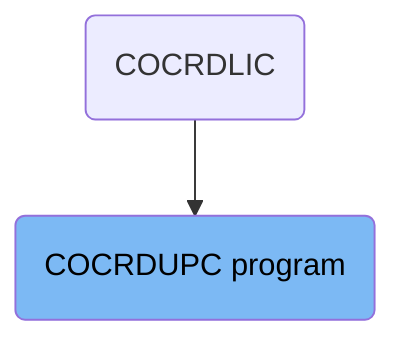
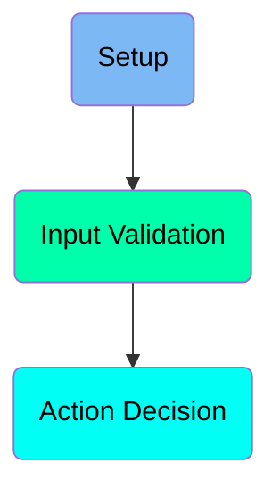
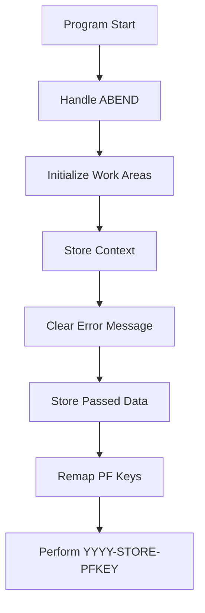
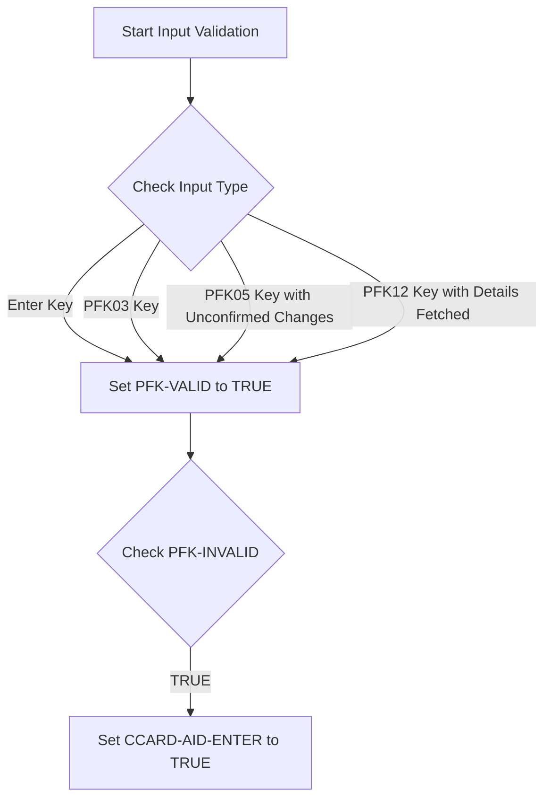
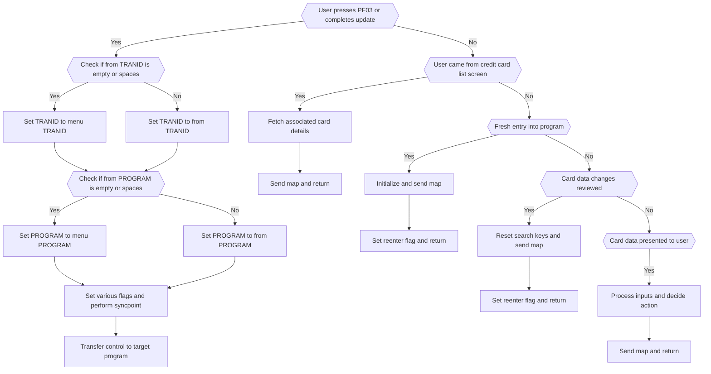

The COCRDUPC program is responsible for handling user exits and transitions within the mainframe application. It ensures smooth navigation and data consistency by managing abnormal terminations, initializing work areas, storing context, clearing error messages, and remapping PF keys. The program also validates user inputs and sets appropriate flags to guide the flow of actions based on user interactions.

The COCRDUPC program starts by setting up an ABEND handler to manage unexpected terminations. It then initializes various work areas and stores the transaction context. Any previous error messages are cleared, and passed data is stored appropriately. The program remaps PF keys for the user's session and validates user inputs by checking different conditions and setting flags. Based on these flags, the program decides the next actions, such as transferring control to another program, fetching card details, or sending maps to the user.

# Where is this program used?

This program is used multiple times in the codebase as represented in the following diagram:



Here is a high level diagram of the program:



# Setup



<SwmSnippet path="/app/cbl/COCRDUPC.cbl" line="369">

---

## Handle ABEND

First, the program sets up an ABEND (abnormal end) handler to manage unexpected terminations. This ensures that if the program encounters an error, it can handle it gracefully and execute the <SwmToken path="app/cbl/COCRDUPC.cbl" pos="370:3:5" line-data="                     LABEL(ABEND-ROUTINE)                                       ">`ABEND-ROUTINE`</SwmToken>.

```cobol
           EXEC CICS HANDLE ABEND                                               
                     LABEL(ABEND-ROUTINE)                                       
           END-EXEC                                                             
```

---

</SwmSnippet>

<SwmSnippet path="/app/cbl/COCRDUPC.cbl" line="373">

---

## Initialize Work Areas

Next, the program initializes various work areas such as <SwmToken path="app/cbl/COCRDUPC.cbl" pos="373:3:7" line-data="           INITIALIZE CC-WORK-AREA                                              ">`CC-WORK-AREA`</SwmToken>, <SwmToken path="app/cbl/COCRDUPC.cbl" pos="374:1:5" line-data="                      WS-MISC-STORAGE                                           ">`WS-MISC-STORAGE`</SwmToken>, and <SwmToken path="app/cbl/COCRDUPC.cbl" pos="375:1:3" line-data="                      WS-COMMAREA                                               ">`WS-COMMAREA`</SwmToken>. This step prepares the necessary storage areas for subsequent operations.

```cobol
           INITIALIZE CC-WORK-AREA                                              
                      WS-MISC-STORAGE                                           
                      WS-COMMAREA                                               
```

---

</SwmSnippet>

<SwmSnippet path="/app/cbl/COCRDUPC.cbl" line="379">

---

## Store Context

Moving to storing the context, the program assigns the transaction ID to <SwmToken path="app/cbl/COCRDUPC.cbl" pos="379:9:11" line-data="           MOVE LIT-THISTRANID       TO WS-TRANID                               ">`WS-TRANID`</SwmToken> to keep track of the current transaction.

```cobol
           MOVE LIT-THISTRANID       TO WS-TRANID                               
```

---

</SwmSnippet>

<SwmSnippet path="/app/cbl/COCRDUPC.cbl" line="383">

---

## Clear Error Message

Then, the program ensures that any previous error messages are cleared by setting <SwmToken path="app/cbl/COCRDUPC.cbl" pos="383:3:9" line-data="           SET WS-RETURN-MSG-OFF  TO TRUE                                       ">`WS-RETURN-MSG-OFF`</SwmToken> to TRUE.

```cobol
           SET WS-RETURN-MSG-OFF  TO TRUE                                       
```

---

</SwmSnippet>

<SwmSnippet path="/app/cbl/COCRDUPC.cbl" line="387">

---

## Store Passed Data

Next, the program checks if there is any data passed to it. If <SwmToken path="app/cbl/COCRDUPC.cbl" pos="387:3:3" line-data="           IF EIBCALEN IS EQUAL TO 0                                            ">`EIBCALEN`</SwmToken> is 0 or the program is called from the menu program and not re-entered, it initializes the communication areas and sets relevant flags. Otherwise, it moves the passed data to the appropriate areas.

```cobol
           IF EIBCALEN IS EQUAL TO 0                                            
               OR (CDEMO-FROM-PROGRAM = LIT-MENUPGM                             
               AND NOT CDEMO-PGM-REENTER)                                       
              INITIALIZE CARDDEMO-COMMAREA                                      
                         WS-THIS-PROGCOMMAREA                                   
              SET CDEMO-PGM-ENTER TO TRUE                                       
              SET CCUP-DETAILS-NOT-FETCHED TO TRUE                              
           ELSE                                                                 
              MOVE DFHCOMMAREA (1:LENGTH OF CARDDEMO-COMMAREA)  TO              
                                CARDDEMO-COMMAREA                               
              MOVE DFHCOMMAREA(LENGTH OF CARDDEMO-COMMAREA + 1:                 
                               LENGTH OF WS-THIS-PROGCOMMAREA ) TO              
                                WS-THIS-PROGCOMMAREA                            
           END-IF                                                               
```

---

</SwmSnippet>

<SwmSnippet path="/app/cbl/COCRDUPC.cbl" line="405">

---

## Remap PF Keys

Finally, the program remaps the PF keys as needed by performing the <SwmToken path="app/cbl/COCRDUPC.cbl" pos="405:3:7" line-data="           PERFORM YYYY-STORE-PFKEY                                             ">`YYYY-STORE-PFKEY`</SwmToken> paragraph, ensuring that the function keys are correctly mapped for the user's session.

```cobol
           PERFORM YYYY-STORE-PFKEY                                             
              THRU YYYY-STORE-PFKEY-EXIT                                        
```

---

</SwmSnippet>

# Input Validation

This is the next section of the flow.



<SwmSnippet path="/app/cbl/COCRDUPC.cbl" line="412">

---

## Setting <SwmToken path="app/cbl/COCRDUPC.cbl" pos="412:3:5" line-data="           SET PFK-INVALID TO TRUE                                              ">`PFK-INVALID`</SwmToken> Flag

First, the <SwmToken path="app/cbl/COCRDUPC.cbl" pos="412:3:5" line-data="           SET PFK-INVALID TO TRUE                                              ">`PFK-INVALID`</SwmToken> flag is set to TRUE to indicate that the initial state is invalid and needs validation.

```cobol
           SET PFK-INVALID TO TRUE                                              
```

---

</SwmSnippet>

<SwmSnippet path="/app/cbl/COCRDUPC.cbl" line="413">

---

## Checking Input Type

Moving to the input type checks, the program evaluates different conditions such as if the Enter key (<SwmToken path="app/cbl/COCRDUPC.cbl" pos="413:3:7" line-data="           IF CCARD-AID-ENTER OR                                                ">`CCARD-AID-ENTER`</SwmToken>), <SwmToken path="app/cbl/COCRDUPC.cbl" pos="414:5:5" line-data="              CCARD-AID-PFK03 OR                                                ">`PFK03`</SwmToken> key (<SwmToken path="app/cbl/COCRDUPC.cbl" pos="414:1:5" line-data="              CCARD-AID-PFK03 OR                                                ">`CCARD-AID-PFK03`</SwmToken>), <SwmToken path="app/cbl/COCRDUPC.cbl" pos="415:6:6" line-data="              (CCARD-AID-PFK05 AND CCUP-CHANGES-OK-NOT-CONFIRMED)               ">`PFK05`</SwmToken> key with unconfirmed changes (<SwmToken path="app/cbl/COCRDUPC.cbl" pos="415:2:6" line-data="              (CCARD-AID-PFK05 AND CCUP-CHANGES-OK-NOT-CONFIRMED)               ">`CCARD-AID-PFK05`</SwmToken> and <SwmToken path="app/cbl/COCRDUPC.cbl" pos="415:10:18" line-data="              (CCARD-AID-PFK05 AND CCUP-CHANGES-OK-NOT-CONFIRMED)               ">`CCUP-CHANGES-OK-NOT-CONFIRMED`</SwmToken>), or <SwmToken path="app/cbl/COCRDUPC.cbl" pos="417:6:6" line-data="              (CCARD-AID-PFK12 AND NOT CCUP-DETAILS-NOT-FETCHED)                ">`PFK12`</SwmToken> key with details fetched (<SwmToken path="app/cbl/COCRDUPC.cbl" pos="417:2:6" line-data="              (CCARD-AID-PFK12 AND NOT CCUP-DETAILS-NOT-FETCHED)                ">`CCARD-AID-PFK12`</SwmToken> and <SwmToken path="app/cbl/COCRDUPC.cbl" pos="417:10:18" line-data="              (CCARD-AID-PFK12 AND NOT CCUP-DETAILS-NOT-FETCHED)                ">`NOT CCUP-DETAILS-NOT-FETCHED`</SwmToken>) are pressed. If any of these conditions are met, the <SwmToken path="app/cbl/COCRDUPC.cbl" pos="418:3:5" line-data="              SET PFK-VALID TO TRUE                                             ">`PFK-VALID`</SwmToken> flag is set to TRUE.

```cobol
           IF CCARD-AID-ENTER OR                                                
              CCARD-AID-PFK03 OR                                                
              (CCARD-AID-PFK05 AND CCUP-CHANGES-OK-NOT-CONFIRMED)               
                              OR                                                
              (CCARD-AID-PFK12 AND NOT CCUP-DETAILS-NOT-FETCHED)                
              SET PFK-VALID TO TRUE                                             
           END-IF                                                               
```

---

</SwmSnippet>

<SwmSnippet path="/app/cbl/COCRDUPC.cbl" line="421">

---

## Setting <SwmToken path="app/cbl/COCRDUPC.cbl" pos="422:3:7" line-data="              SET CCARD-AID-ENTER TO TRUE                                       ">`CCARD-AID-ENTER`</SwmToken> Flag

Then, the program checks if the <SwmToken path="app/cbl/COCRDUPC.cbl" pos="421:3:5" line-data="           IF PFK-INVALID                                                       ">`PFK-INVALID`</SwmToken> flag is still TRUE. If it is, the <SwmToken path="app/cbl/COCRDUPC.cbl" pos="422:3:7" line-data="              SET CCARD-AID-ENTER TO TRUE                                       ">`CCARD-AID-ENTER`</SwmToken> flag is set to TRUE to indicate that the Enter key action should be processed.

```cobol
           IF PFK-INVALID                                                       
              SET CCARD-AID-ENTER TO TRUE                                       
           END-IF                                                               
```

---

</SwmSnippet>

## Interim Summary

So far, we saw how the program handles ABENDs, initializes work areas, stores context, clears error messages, stores passed data, and remaps PF keys. Now, we will focus on input validation, where the program checks the validity of user inputs and sets appropriate flags.

# Action Decision



<SwmSnippet path="/app/cbl/COCRDUPC.cbl" line="427">

---

## Handling User Exits and Transitions

This section handles user exits and transitions between programs or the main menu. It evaluates various conditions to determine the appropriate action based on user inputs and program states.

```cobol
      *****************************************************************         
           EVALUATE TRUE                                                        
      ******************************************************************        
      *       USER PRESSES PF03 TO EXIT                                         
      *  OR   USER IS DONE WITH UPDATE                                          
      *            XCTL TO CALLING PROGRAM OR MAIN MENU                         
      ******************************************************************        
              WHEN CCARD-AID-PFK03                                              
              WHEN (CCUP-CHANGES-OKAYED-AND-DONE                                
               AND  CDEMO-LAST-MAPSET   EQUAL LIT-CCLISTMAPSET)                 
              WHEN (CCUP-CHANGES-FAILED                                         
               AND  CDEMO-LAST-MAPSET   EQUAL LIT-CCLISTMAPSET)                 
                   SET CCARD-AID-PFK03     TO TRUE                              
                                                                                
                   IF CDEMO-FROM-TRANID    EQUAL LOW-VALUES                     
                   OR CDEMO-FROM-TRANID    EQUAL SPACES                         
                      MOVE LIT-MENUTRANID  TO CDEMO-TO-TRANID                   
                   ELSE                                                         
                      MOVE CDEMO-FROM-TRANID  TO CDEMO-TO-TRANID                
                   END-IF                                                       
                                                                                
```

---

</SwmSnippet>

<SwmSnippet path="/app/cbl/COCRDUPC.cbl" line="434">

---

### User Presses <SwmToken path="app/cbl/COCRDUPC.cbl" pos="430:7:7" line-data="      *       USER PRESSES PF03 TO EXIT                                         ">`PF03`</SwmToken> or Completes Update

First, the code checks if the user pressed <SwmToken path="app/cbl/COCRDUPC.cbl" pos="430:7:7" line-data="      *       USER PRESSES PF03 TO EXIT                                         ">`PF03`</SwmToken> to exit or if the update process is completed. If either condition is true, it sets the <SwmToken path="app/cbl/COCRDUPC.cbl" pos="434:3:7" line-data="              WHEN CCARD-AID-PFK03                                              ">`CCARD-AID-PFK03`</SwmToken> flag to true.

```cobol
              WHEN CCARD-AID-PFK03                                              
              WHEN (CCUP-CHANGES-OKAYED-AND-DONE                                
               AND  CDEMO-LAST-MAPSET   EQUAL LIT-CCLISTMAPSET)                 
              WHEN (CCUP-CHANGES-FAILED                                         
               AND  CDEMO-LAST-MAPSET   EQUAL LIT-CCLISTMAPSET)                 
                   SET CCARD-AID-PFK03     TO TRUE                              
```

---

</SwmSnippet>

<SwmSnippet path="/app/cbl/COCRDUPC.cbl" line="441">

---

### Check TRANID and PROGRAM Values

Next, the code checks if <SwmToken path="app/cbl/COCRDUPC.cbl" pos="441:3:7" line-data="                   IF CDEMO-FROM-TRANID    EQUAL LOW-VALUES                     ">`CDEMO-FROM-TRANID`</SwmToken> is empty or contains spaces. If true, it sets <SwmToken path="app/cbl/COCRDUPC.cbl" pos="443:9:13" line-data="                      MOVE LIT-MENUTRANID  TO CDEMO-TO-TRANID                   ">`CDEMO-TO-TRANID`</SwmToken> to the menu TRANID. Otherwise, it sets <SwmToken path="app/cbl/COCRDUPC.cbl" pos="443:9:13" line-data="                      MOVE LIT-MENUTRANID  TO CDEMO-TO-TRANID                   ">`CDEMO-TO-TRANID`</SwmToken> to <SwmToken path="app/cbl/COCRDUPC.cbl" pos="441:3:7" line-data="                   IF CDEMO-FROM-TRANID    EQUAL LOW-VALUES                     ">`CDEMO-FROM-TRANID`</SwmToken>. Similarly, it checks <SwmToken path="app/cbl/COCRDUPC.cbl" pos="448:3:7" line-data="                   IF CDEMO-FROM-PROGRAM   EQUAL LOW-VALUES                     ">`CDEMO-FROM-PROGRAM`</SwmToken> and sets <SwmToken path="app/cbl/COCRDUPC.cbl" pos="450:9:13" line-data="                      MOVE LIT-MENUPGM     TO CDEMO-TO-PROGRAM                  ">`CDEMO-TO-PROGRAM`</SwmToken> accordingly.

```cobol
                   IF CDEMO-FROM-TRANID    EQUAL LOW-VALUES                     
                   OR CDEMO-FROM-TRANID    EQUAL SPACES                         
                      MOVE LIT-MENUTRANID  TO CDEMO-TO-TRANID                   
                   ELSE                                                         
                      MOVE CDEMO-FROM-TRANID  TO CDEMO-TO-TRANID                
                   END-IF                                                       
                                                                                
                   IF CDEMO-FROM-PROGRAM   EQUAL LOW-VALUES                     
                   OR CDEMO-FROM-PROGRAM   EQUAL SPACES                         
                      MOVE LIT-MENUPGM     TO CDEMO-TO-PROGRAM                  
                   ELSE                                                         
                      MOVE CDEMO-FROM-PROGRAM TO CDEMO-TO-PROGRAM               
                   END-IF                                                       
```

---

</SwmSnippet>

<SwmSnippet path="/app/cbl/COCRDUPC.cbl" line="455">

---

### Set Flags and Perform Syncpoint

Then, the code sets various flags such as <SwmToken path="app/cbl/COCRDUPC.cbl" pos="463:3:7" line-data="                   SET  CDEMO-USRTYP-USER  TO TRUE                              ">`CDEMO-USRTYP-USER`</SwmToken> and <SwmToken path="app/cbl/COCRDUPC.cbl" pos="464:3:7" line-data="                   SET  CDEMO-PGM-ENTER    TO TRUE                              ">`CDEMO-PGM-ENTER`</SwmToken>. It also updates <SwmToken path="app/cbl/COCRDUPC.cbl" pos="458:3:7" line-data="                   IF CDEMO-LAST-MAPSET    EQUAL LIT-CCLISTMAPSET               ">`CDEMO-LAST-MAPSET`</SwmToken> and <SwmToken path="app/cbl/COCRDUPC.cbl" pos="466:9:13" line-data="                   MOVE LIT-THISMAP        TO CDEMO-LAST-MAP                    ">`CDEMO-LAST-MAP`</SwmToken>. Finally, it performs a CICS SYNCPOINT to ensure data consistency.

```cobol
                   MOVE LIT-THISTRANID     TO CDEMO-FROM-TRANID                 
                   MOVE LIT-THISPGM        TO CDEMO-FROM-PROGRAM                
                                                                                
                   IF CDEMO-LAST-MAPSET    EQUAL LIT-CCLISTMAPSET               
                       MOVE ZEROS          TO CDEMO-ACCT-ID                     
                                              CDEMO-CARD-NUM                    
                   END-IF                                                       
                                                                                
                   SET  CDEMO-USRTYP-USER  TO TRUE                              
                   SET  CDEMO-PGM-ENTER    TO TRUE                              
                   MOVE LIT-THISMAPSET     TO CDEMO-LAST-MAPSET                 
                   MOVE LIT-THISMAP        TO CDEMO-LAST-MAP                    
                                                                                
                   EXEC CICS                                                    
                        SYNCPOINT                                               
                   END-EXEC                                                     
```

---

</SwmSnippet>

<SwmSnippet path="/app/cbl/COCRDUPC.cbl" line="472">

---

### Transfer Control to Target Program

After setting the necessary flags and performing the syncpoint, the code transfers control to the target program specified in <SwmToken path="app/cbl/COCRDUPC.cbl" pos="473:4:8" line-data="                        PROGRAM (CDEMO-TO-PROGRAM)                              ">`CDEMO-TO-PROGRAM`</SwmToken> using the CICS XCTL command.

```cobol
                   EXEC CICS XCTL                                               
                        PROGRAM (CDEMO-TO-PROGRAM)                              
                        COMMAREA(CARDDEMO-COMMAREA)                             
                   END-EXEC                                                     
```

---

</SwmSnippet>

<SwmSnippet path="/app/cbl/COCRDUPC.cbl" line="481">

---

### Fetch Associated Card Details

If the user came from the credit card list screen, the code fetches the associated card details for update. It sets several flags to indicate the state and performs the <SwmToken path="app/cbl/COCRDUPC.cbl" pos="491:3:7" line-data="                   PERFORM 9000-READ-DATA                                       ">`9000-READ-DATA`</SwmToken> and <SwmToken path="app/cbl/COCRDUPC.cbl" pos="494:3:7" line-data="                   PERFORM 3000-SEND-MAP                                        ">`3000-SEND-MAP`</SwmToken> functions to read the data and send the map to the user.

```cobol
              WHEN CDEMO-PGM-ENTER                                              
               AND CDEMO-FROM-PROGRAM  EQUAL LIT-CCLISTPGM                      
              WHEN CCARD-AID-PFK12                                              
               AND CDEMO-FROM-PROGRAM  EQUAL LIT-CCLISTPGM                      
                   SET CDEMO-PGM-REENTER    TO TRUE                             
                   SET INPUT-OK             TO TRUE                             
                   SET FLG-ACCTFILTER-ISVALID  TO TRUE                          
                   SET FLG-CARDFILTER-ISVALID  TO TRUE                          
                   MOVE CDEMO-ACCT-ID       TO CC-ACCT-ID-N                     
                   MOVE CDEMO-CARD-NUM      TO CC-CARD-NUM-N                    
                   PERFORM 9000-READ-DATA                                       
                      THRU 9000-READ-DATA-EXIT                                  
                   SET CCUP-SHOW-DETAILS TO TRUE                                
                   PERFORM 3000-SEND-MAP                                        
                      THRU 3000-SEND-MAP-EXIT                                   
                   GO TO COMMON-RETURN                                          
```

---

</SwmSnippet>

<SwmSnippet path="/app/cbl/COCRDUPC.cbl" line="501">

---

### Initialize and Send Map

For a fresh entry into the program, the code initializes the working storage and performs the <SwmToken path="app/cbl/COCRDUPC.cbl" pos="506:3:7" line-data="                   PERFORM 3000-SEND-MAP THRU                                   ">`3000-SEND-MAP`</SwmToken> function to send the map to the user. It then sets the reenter flag and returns.

```cobol
              WHEN CCUP-DETAILS-NOT-FETCHED                                     
               AND CDEMO-PGM-ENTER                                              
              WHEN CDEMO-FROM-PROGRAM   EQUAL LIT-MENUPGM                       
               AND NOT CDEMO-PGM-REENTER                                        
                   INITIALIZE WS-THIS-PROGCOMMAREA                              
                   PERFORM 3000-SEND-MAP THRU                                   
                           3000-SEND-MAP-EXIT                                   
                   SET CDEMO-PGM-REENTER        TO TRUE                         
                   SET CCUP-DETAILS-NOT-FETCHED TO TRUE                         
                   GO TO COMMON-RETURN                                          
```

---

</SwmSnippet>

<SwmSnippet path="/app/cbl/COCRDUPC.cbl" line="516">

---

### Reset Search Keys and Send Map

If card data changes are reviewed and either okay or failed, the code resets the search keys and performs the <SwmToken path="app/cbl/COCRDUPC.cbl" pos="523:3:7" line-data="                   PERFORM 3000-SEND-MAP THRU                                   ">`3000-SEND-MAP`</SwmToken> function to send the map to the user. It then sets the reenter flag and returns.

```cobol
              WHEN CCUP-CHANGES-OKAYED-AND-DONE                                 
              WHEN CCUP-CHANGES-FAILED                                          
                   INITIALIZE WS-THIS-PROGCOMMAREA                              
                              WS-MISC-STORAGE                                   
                              CDEMO-ACCT-ID                                     
                              CDEMO-CARD-NUM                                    
                   SET CDEMO-PGM-ENTER            TO TRUE                       
                   PERFORM 3000-SEND-MAP THRU                                   
                           3000-SEND-MAP-EXIT                                   
                   SET CDEMO-PGM-REENTER          TO TRUE                       
                   SET CCUP-DETAILS-NOT-FETCHED   TO TRUE                       
                   GO TO COMMON-RETURN                                          
```

---

</SwmSnippet>

<SwmSnippet path="/app/cbl/COCRDUPC.cbl" line="534">

---

### Process Inputs and Decide Action

If card data has been presented to the user, the code performs the <SwmToken path="app/cbl/COCRDUPC.cbl" pos="535:3:7" line-data="                   PERFORM 1000-PROCESS-INPUTS                                  ">`1000-PROCESS-INPUTS`</SwmToken> and <SwmToken path="app/cbl/COCRDUPC.cbl" pos="537:3:7" line-data="                   PERFORM 2000-DECIDE-ACTION                                   ">`2000-DECIDE-ACTION`</SwmToken> functions to process the inputs and decide the next action. It then performs the <SwmToken path="app/cbl/COCRDUPC.cbl" pos="539:3:7" line-data="                   PERFORM 3000-SEND-MAP                                        ">`3000-SEND-MAP`</SwmToken> function to send the map to the user and returns.

```cobol
              WHEN OTHER                                                        
                   PERFORM 1000-PROCESS-INPUTS                                  
                      THRU 1000-PROCESS-INPUTS-EXIT                             
                   PERFORM 2000-DECIDE-ACTION                                   
                      THRU 2000-DECIDE-ACTION-EXIT                              
                   PERFORM 3000-SEND-MAP                                        
                      THRU 3000-SEND-MAP-EXIT                                   
                   GO TO COMMON-RETURN                                          
           END-EVALUATE                                                         
```

---

</SwmSnippet>

&nbsp;

*This is an auto-generated document by Swimm 🌊 and has not yet been verified by a human*

<SwmMeta version="3.0.0" repo-id="Z2l0aHViJTNBJTNBa3luZHJ5bC1hd3MtbWFpbmZyYW1lLW1vZGVybml6YXRpb24tY2FyZGRlbW8lM0ElM0FTd2ltbS1EZW1v" repo-name="kyndryl-aws-mainframe-modernization-carddemo"><sup>Powered by [Swimm](https://staging.swimm.cloud/)</sup></SwmMeta>
