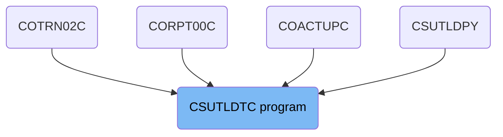
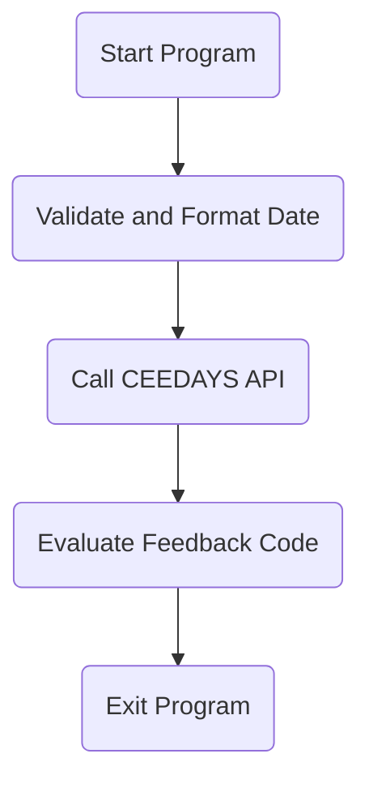

The CSUTLDTC program is responsible for validating and formatting dates within the system. It achieves this by calling the CEEDAYS API to validate the date and then evaluating the feedback code to determine the result message. The program is used in multiple parts of the codebase, ensuring consistent date validation across different modules.

The CSUTLDTC program starts by initializing variables and performing the main logic to validate and format a date. It calls the CEEDAYS API to validate the date and then evaluates the feedback code to determine the result message, which is then prepared for output. Finally, the program exits, completing the execution.

# Where is this program used?

This program is used multiple times in the codebase as represented in the following diagram:



Lets' zoom into the flow:



<SwmSnippet path="/app/cbl/CSUTLDTC.cbl" line="90">

---

## Initializing Variables

First, the `PROCEDURE-DIVISION` initializes the <SwmToken path="app/cbl/CSUTLDTC.cbl" pos="90:3:5" line-data="           INITIALIZE WS-MESSAGE">`WS-MESSAGE`</SwmToken> and sets <SwmToken path="app/cbl/CSUTLDTC.cbl" pos="91:7:9" line-data="           MOVE SPACES TO WS-DATE">`WS-DATE`</SwmToken> to spaces. This prepares the working storage variables for further processing.

```cobol
           INITIALIZE WS-MESSAGE
           MOVE SPACES TO WS-DATE
                                                                        
           PERFORM A000-MAIN                                                    
              THRU A000-MAIN-EXIT                                               
```

---

</SwmSnippet>

<SwmSnippet path="/app/cbl/CSUTLDTC.cbl" line="95">

---

## Performing Main Logic

Next, the program performs the <SwmToken path="app/cbl/CSUTLDTC.cbl" pos="93:3:5" line-data="           PERFORM A000-MAIN                                                    ">`A000-MAIN`</SwmToken> paragraph, which contains the main logic for validating and formatting the date.

```cobol

      *    DISPLAY WS-MESSAGE                                                   
```

---

</SwmSnippet>

<SwmSnippet path="/app/cbl/CSUTLDTC.cbl" line="99">

---

## Moving Results

Then, the program moves the <SwmToken path="app/cbl/CSUTLDTC.cbl" pos="90:3:5" line-data="           INITIALIZE WS-MESSAGE">`WS-MESSAGE`</SwmToken> to <SwmToken path="app/cbl/CSUTLDTC.cbl" pos="86:3:5" line-data="          01 LS-RESULT       PIC X(80).                                         ">`LS-RESULT`</SwmToken> and the <SwmToken path="app/cbl/CSUTLDTC.cbl" pos="123:13:17" line-data="           MOVE SEVERITY OF FEEDBACK-CODE  TO WS-SEVERITY-N                     ">`WS-SEVERITY-N`</SwmToken> to <SwmToken path="app/cbl/CSUTLDTC.cbl" pos="98:11:13" line-data="           MOVE WS-SEVERITY-N              TO RETURN-CODE          ">`RETURN-CODE`</SwmToken>. This step prepares the results for output.

```cobol
                                                                                
           EXIT PROGRAM                                                         
```

---

</SwmSnippet>

<SwmSnippet path="/app/cbl/CSUTLDTC.cbl" line="102">

---

## Exiting the Program

Finally, the program exits, completing the execution of the `PROCEDURE-DIVISION`.

```cobol
           .                                                                    
```

---

</SwmSnippet>

<SwmSnippet path="/app/cbl/CSUTLDTC.cbl" line="105">

---

## Main Logic in <SwmToken path="app/cbl/CSUTLDTC.cbl" pos="93:3:5" line-data="           PERFORM A000-MAIN                                                    ">`A000-MAIN`</SwmToken>

Moving to the <SwmToken path="app/cbl/CSUTLDTC.cbl" pos="93:3:5" line-data="           PERFORM A000-MAIN                                                    ">`A000-MAIN`</SwmToken> paragraph, the program sets up the date and format strings for validation by moving the lengths and values of <SwmToken path="app/cbl/CSUTLDTC.cbl" pos="105:7:9" line-data="           MOVE LENGTH OF LS-DATE                                               ">`LS-DATE`</SwmToken> and <SwmToken path="app/cbl/CSUTLDTC.cbl" pos="109:7:11" line-data="           MOVE LENGTH OF LS-DATE-FORMAT                                        ">`LS-DATE-FORMAT`</SwmToken> to <SwmToken path="app/cbl/CSUTLDTC.cbl" pos="106:9:15" line-data="                        TO VSTRING-LENGTH  OF WS-DATE-TO-TEST                   ">`WS-DATE-TO-TEST`</SwmToken> and <SwmToken path="app/cbl/CSUTLDTC.cbl" pos="110:9:13" line-data="                         TO VSTRING-LENGTH OF WS-DATE-FORMAT                    ">`WS-DATE-FORMAT`</SwmToken> respectively.

```cobol
           MOVE LENGTH OF LS-DATE                                               
                        TO VSTRING-LENGTH  OF WS-DATE-TO-TEST                   
           MOVE LS-DATE TO VSTRING-TEXT    OF WS-DATE-TO-TEST
                           WS-DATE                  
           MOVE LENGTH OF LS-DATE-FORMAT                                        
                         TO VSTRING-LENGTH OF WS-DATE-FORMAT                    
           MOVE LS-DATE-FORMAT                                                  
                         TO VSTRING-TEXT   OF WS-DATE-FORMAT   
                            WS-DATE-FMT  
           MOVE 0        TO OUTPUT-LILLIAN                              
                                                                        
```

---

</SwmSnippet>

<SwmSnippet path="/app/cbl/CSUTLDTC.cbl" line="118">

---

## Calling CEEDAYS API

Next, the program calls the <SwmToken path="app/cbl/CSUTLDTC.cbl" pos="2:7:7" line-data="      *****       CALL TO CEEDAYS                                *******        ">`CEEDAYS`</SwmToken> API using the prepared date and format strings. This API validates the date and returns a feedback code.

```cobol
                  WS-DATE-FORMAT,                                               
                  OUTPUT-LILLIAN,                                               
                  FEEDBACK-CODE                                                 
                                                                                
           MOVE WS-DATE-TO-TEST            TO WS-DATE                           
```

---

</SwmSnippet>

<SwmSnippet path="/app/cbl/CSUTLDTC.cbl" line="123">

---

## Handling Feedback

Then, the program moves the feedback code's severity and message number to <SwmToken path="app/cbl/CSUTLDTC.cbl" pos="123:13:17" line-data="           MOVE SEVERITY OF FEEDBACK-CODE  TO WS-SEVERITY-N                     ">`WS-SEVERITY-N`</SwmToken> and <SwmToken path="app/cbl/CSUTLDTC.cbl" pos="124:15:21" line-data="           MOVE MSG-NO OF FEEDBACK-CODE    TO WS-MSG-NO-N                       ">`WS-MSG-NO-N`</SwmToken> respectively. This step captures the results of the date validation.

```cobol
           MOVE SEVERITY OF FEEDBACK-CODE  TO WS-SEVERITY-N                     
           MOVE MSG-NO OF FEEDBACK-CODE    TO WS-MSG-NO-N                       
                                                                 
      *    WS-RESULT IS 15 CHARACTERS                                           
```

---

</SwmSnippet>

<SwmSnippet path="/app/cbl/CSUTLDTC.cbl" line="130">

---

## Evaluating Feedback Code

Finally, the program evaluates the feedback code to determine the result message. Depending on the feedback code, it sets <SwmToken path="app/cbl/CSUTLDTC.cbl" pos="130:13:15" line-data="                 MOVE &#39;Date is valid&#39;      TO WS-RESULT              ">`WS-RESULT`</SwmToken> to an appropriate message such as 'Date is valid', 'Insufficient', or 'Date is invalid'.

```cobol
                 MOVE 'Date is valid'      TO WS-RESULT              
              WHEN FC-INSUFFICIENT-DATA                              
                 MOVE 'Insufficient'       TO WS-RESULT              
              WHEN FC-BAD-DATE-VALUE                                 
                 MOVE 'Datevalue error'    TO WS-RESULT              
              WHEN FC-INVALID-ERA                                    
                 MOVE 'Invalid Era    '    TO WS-RESULT              
              WHEN FC-UNSUPP-RANGE                                   
                 MOVE 'Unsupp. Range  '    TO WS-RESULT              
              WHEN FC-INVALID-MONTH                                  
                 MOVE 'Invalid month  '    TO WS-RESULT              
              WHEN FC-BAD-PIC-STRING                                 
                 MOVE 'Bad Pic String '    TO WS-RESULT              
              WHEN FC-NON-NUMERIC-DATA                               
                 MOVE 'Nonnumeric data'    TO WS-RESULT              
              WHEN FC-YEAR-IN-ERA-ZERO                               
                 MOVE 'YearInEra is 0 '    TO WS-RESULT              
              WHEN OTHER                                             
                 MOVE 'Date is invalid'    TO WS-RESULT 
           END-EVALUATE                                                         
                                                                                
```

---

</SwmSnippet>

&nbsp;

*This is an auto-generated document by Swimm 🌊 and has not yet been verified by a human*

<SwmMeta version="3.0.0" repo-id="Z2l0aHViJTNBJTNBa3luZHJ5bC1hd3MtbWFpbmZyYW1lLW1vZGVybml6YXRpb24tY2FyZGRlbW8lM0ElM0FTd2ltbS1EZW1v" repo-name="kyndryl-aws-mainframe-modernization-carddemo"><sup>Powered by [Swimm](/)</sup></SwmMeta>
