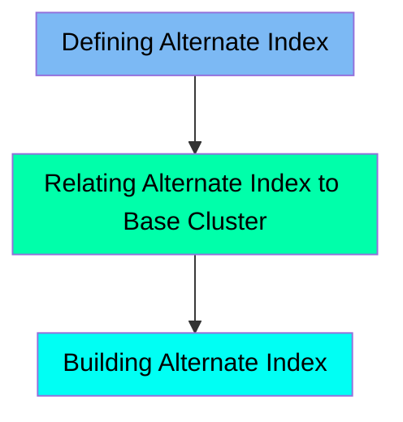

The TRANIDX job is responsible for defining, relating, and building an alternate index on the VSAM dataset within the CardDemo application. This process ensures efficient data access and organization for transaction data. The job involves defining the alternate index, relating it to the base cluster, and then building the index to enable efficient transaction processing.

Here is a high level diagram of the file:

## Defining Alternate Index

Steps in this section: `STEP20`.

This section is about defining an alternate index on the VSAM dataset to manage and index transaction data, ensuring efficient data access and organization.

## Relating Alternate Index to Base Cluster

Steps in this section: `STEP25`.

This section is about defining a path to relate the alternate index to the base cluster in the CardDemo application. It ensures that the alternate index is properly linked to the main dataset for efficient data management and retrieval.

## Building Alternate Index

Steps in this section: `STEP30`.

This section is about building an alternate index on the VSAM dataset to enable efficient data access and organization for transaction processing.

&nbsp;

*This is an auto-generated document by Swimm 🌊 and has not yet been verified by a human*

<SwmMeta version="3.0.0" repo-id="Z2l0aHViJTNBJTNBa3luZHJ5bC1hd3MtbWFpbmZyYW1lLW1vZGVybml6YXRpb24tY2FyZGRlbW8lM0ElM0FTd2ltbS1EZW1v" repo-name="kyndryl-aws-mainframe-modernization-carddemo">Powered by [Swimm](/)</SwmMeta>
