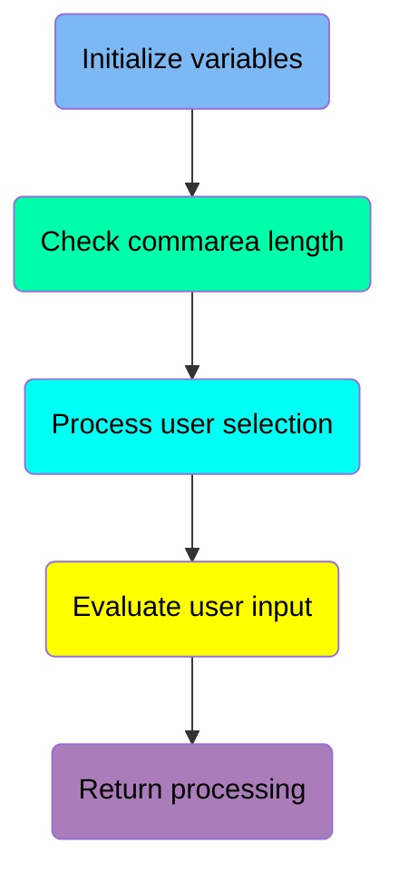
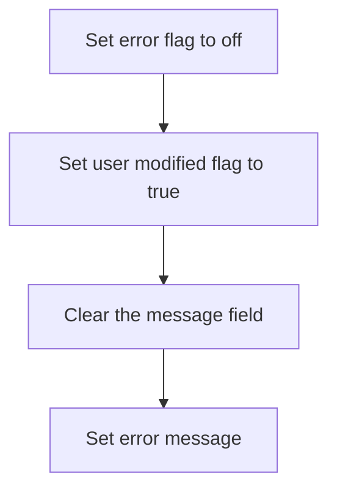
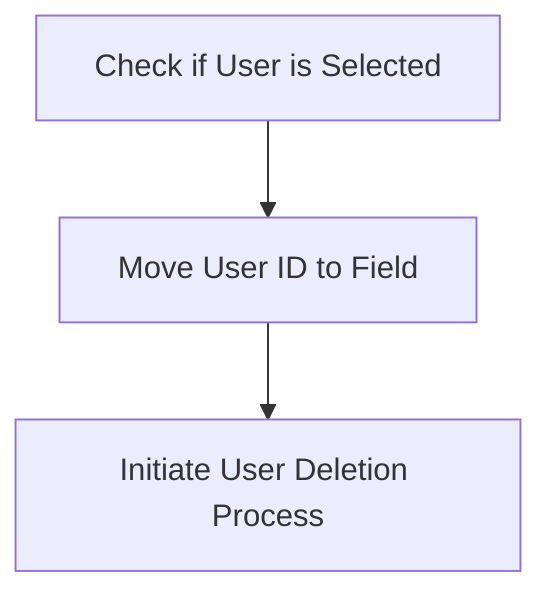
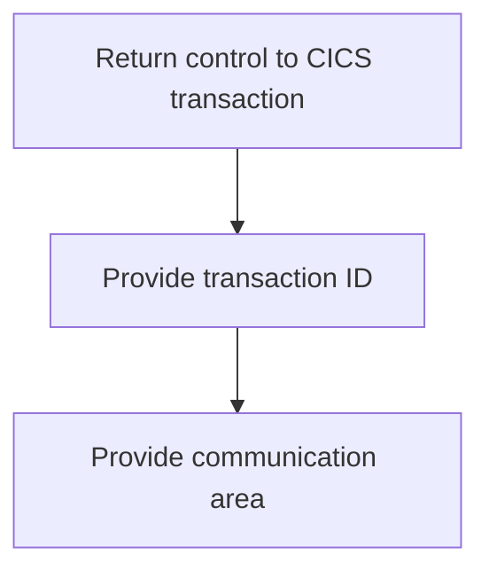

The document describes the process of deleting a user from the USRSEC file using the <SwmToken path="app/cbl/COUSR03C.cbl" pos="2:7:7" line-data="      * Program     : COUSR03C.CBL">`COUSR03C`</SwmToken> program. This program is part of the <SwmToken path="app/cbl/COUSR03C.cbl" pos="3:7:7" line-data="      * Application : CardDemo">`CardDemo`</SwmToken> application, which is designed to test and showcase AWS and partner technology for mainframe migration and modernization use-cases. The deletion process involves initializing variables, checking the communication area length, processing user selection, evaluating user input, and returning control to the CICS transaction.

The flow starts with initializing variables to ensure no errors are present. It then checks the communication area length to determine the next steps. If a user is selected, the user ID is prepared for deletion, and the deletion process is initiated. The program evaluates user input to determine the appropriate action and finally returns control to the CICS transaction with the necessary transaction ID and communication area.

Here is a high level diagram of the program:



## Initialize variables

First, we'll zoom into this section of the flow:



<SwmSnippet path="/app/cbl/COUSR03C.cbl" line="84">

---

First, the error flag is set to off, indicating that there are no errors at the start of the process.

```cobol
           SET ERR-FLG-OFF     TO TRUE
```

---

</SwmSnippet>

<SwmSnippet path="/app/cbl/COUSR03C.cbl" line="85">

---

Next, the user modified flag is set to true, which indicates that the user data has been modified.

```cobol
           SET USR-MODIFIED-NO TO TRUE
```

---

</SwmSnippet>

## Check commarea length

Now, lets zoom into this section of the flow:



The function first checks if the communication area length (<SwmToken path="app/cbl/COUSR03C.cbl" pos="76:15:15" line-data="             OCCURS 1 TO 32767 TIMES DEPENDING ON EIBCALEN.">`EIBCALEN`</SwmToken>) is zero. If it is zero, it sets the target program to <SwmToken path="app/cbl/COUSR03C.cbl" pos="91:4:4" line-data="               MOVE &#39;COSGN00C&#39; TO CDEMO-TO-PROGRAM">`COSGN00C`</SwmToken> (<SwmToken path="app/cbl/COUSR03C.cbl" pos="91:9:13" line-data="               MOVE &#39;COSGN00C&#39; TO CDEMO-TO-PROGRAM">`CDEMO-TO-PROGRAM`</SwmToken>) and transfers control to the previous screen. This ensures that the user is redirected appropriately when no communication data is present.

If the communication area length is not zero, the function moves the communication area data to <SwmToken path="app/cbl/COUSR03C.cbl" pos="136:4:6" line-data="                     COMMAREA (CARDDEMO-COMMAREA)">`CARDDEMO-COMMAREA`</SwmToken>. This step is crucial for preserving the context and data needed for subsequent operations.

```mermaid
graph TD
  A[Check if communication area length is zero] -->|Yes| B[Set target program to COSGN00C] --> C[Transfer control to previous screen]
  A[Check if communication area length is zero] -->|No| D[Move communication area data to CARDDEMO-COMMAREA] --> E[Check if program needs re-entry] -->|No| F[Continue processing]
  E[Check if program needs re-entry] -->|Yes| G[Set re-entry flag] --> H[Initialize variables]

%% Swimm:
%% graph TD
%%   A[Check if communication area length is zero] -->|Yes| B[Set target program to <SwmToken path="app/cbl/COUSR03C.cbl" pos="91:4:4" line-data="               MOVE &#39;COSGN00C&#39; TO CDEMO-TO-PROGRAM">`COSGN00C`</SwmToken>] --> C[Transfer control to previous screen]
%%   A[Check if communication area length is zero] -->|No| D[Move communication area data to <SwmToken path="app/cbl/COUSR03C.cbl" pos="136:4:6" line-data="                     COMMAREA (CARDDEMO-COMMAREA)">`CARDDEMO-COMMAREA`</SwmToken>] --> E[Check if program needs re-entry] -->|No| F[Continue processing]
%%   E[Check if program needs re-entry] -->|Yes| G[Set re-entry flag] --> H[Initialize variables]
```

## Process user selection

Now, lets zoom into this section of the flow:



<SwmSnippet path="/app/cbl/COUSR03C.cbl" line="99">

---

First, the code checks if a user has been selected by verifying that <SwmToken path="app/cbl/COUSR03C.cbl" pos="99:3:9" line-data="                   IF CDEMO-CU03-USR-SELECTED NOT =">`CDEMO-CU03-USR-SELECTED`</SwmToken> is not empty or contains low-values. This ensures that there is a valid user to process for deletion.

```cobol
                   IF CDEMO-CU03-USR-SELECTED NOT =
                                              SPACES AND LOW-VALUES
```

---

</SwmSnippet>

<SwmSnippet path="/app/cbl/COUSR03C.cbl" line="101">

---

Next, if a user is selected, the selected user ID is moved to the <SwmToken path="app/cbl/COUSR03C.cbl" pos="102:1:1" line-data="                            USRIDINI OF COUSR3AI">`USRIDINI`</SwmToken> field of <SwmToken path="app/cbl/COUSR03C.cbl" pos="102:5:5" line-data="                            USRIDINI OF COUSR3AI">`COUSR3AI`</SwmToken>. This prepares the user ID for the deletion process. Then, the <SwmToken path="app/cbl/COUSR03C.cbl" pos="103:3:7" line-data="                       PERFORM PROCESS-ENTER-KEY">`PROCESS-ENTER-KEY`</SwmToken> routine is performed to initiate the user deletion process.

```cobol
                       MOVE CDEMO-CU03-USR-SELECTED TO
                            USRIDINI OF COUSR3AI
                       PERFORM PROCESS-ENTER-KEY
                   END-IF
```

---

</SwmSnippet>

## Evaluate user input

Now, lets zoom into this section of the flow:



```mermaid
graph TD
  A[Send or Receive User Deletion Screen] --> B{Evaluate User Action}
  B -->|Enter Key| C[Process Enter Key]
  B -->|PF3 Key| D[Return to Previous Screen]
  B -->|PF4 Key| E[Clear Current Screen]
  B -->|PF5 Key| F[Delete User Info]
  B -->|PF12 Key| D
  B -->|Other Key| G[Set Error Flag and Message]

%% Swimm:
%% graph TD
%%   A[Send or Receive User Deletion Screen] --> B{Evaluate User Action}
%%   B -->|Enter Key| C[Process Enter Key]
%%   B -->|PF3 Key| D[Return to Previous Screen]
%%   B -->|PF4 Key| E[Clear Current Screen]
%%   B -->|<SwmToken path="app/cbl/COUSR03C.cbl" pos="283:6:6" line-data="                   MOVE &#39;Press PF5 key to delete this user ...&#39; TO">`PF5`</SwmToken> Key| F[Delete User Info]
%%   B -->|PF12 Key| D
%%   B -->|Other Key| G[Set Error Flag and Message]
```

## Return processing

Now, lets zoom into this section of the flow:



<SwmSnippet path="/app/cbl/COUSR03C.cbl" line="134">

---

The function returns control to the CICS transaction, ensuring that the appropriate transaction ID (<SwmToken path="app/cbl/COUSR03C.cbl" pos="135:4:6" line-data="                     TRANSID (WS-TRANID)">`WS-TRANID`</SwmToken>) and communication area (<SwmToken path="app/cbl/COUSR03C.cbl" pos="136:4:6" line-data="                     COMMAREA (CARDDEMO-COMMAREA)">`CARDDEMO-COMMAREA`</SwmToken>) are provided. This step is crucial for maintaining the flow of the application and ensuring that the next transaction can proceed with the correct context and data.

```cobol
           EXEC CICS RETURN
                     TRANSID (WS-TRANID)
                     COMMAREA (CARDDEMO-COMMAREA)
           END-EXEC.
```

---

</SwmSnippet>

&nbsp;

*This is an auto-generated document by Swimm 🌊 and has not yet been verified by a human*

<SwmMeta version="3.0.0" repo-id="Z2l0aHViJTNBJTNBa3luZHJ5bC1hd3MtbWFpbmZyYW1lLW1vZGVybml6YXRpb24tY2FyZGRlbW8lM0ElM0FTd2ltbS1EZW1v" repo-name="kyndryl-aws-mainframe-modernization-carddemo"><sup>Powered by [Swimm](https://staging.swimm.cloud/)</sup></SwmMeta>
