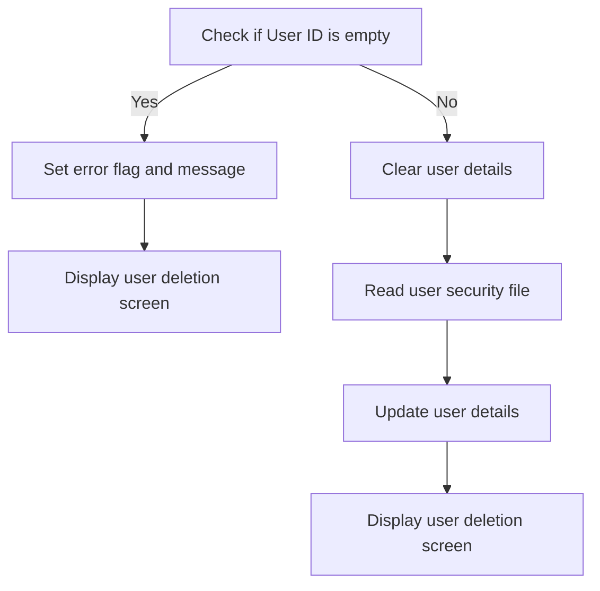
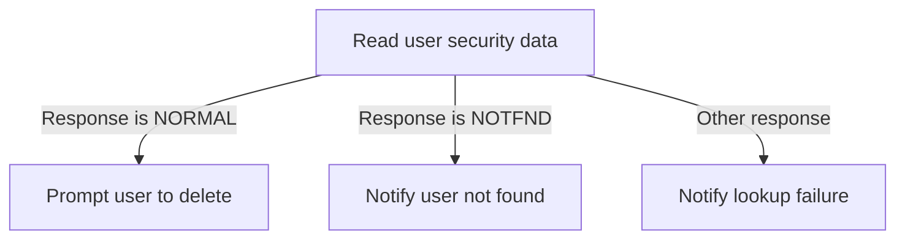

```mermaid
graph TD
  A[Check if EIBCALEN is 0] -->|Yes| B[Set next program to COSGN00C]
  A -->|No| C[Move DFHCOMMAREA to CARDDEMO-COMMAREA]
  C --> D[Check if program is not re-entered]
  D -->|Yes| E[Set re-enter flag to true]
  E --> F[Move low values to COUSR3AO]
  F --> G[Move -1 to USRIDINL]
  G --> H[Check if user is selected]
  H -->|Yes| I[Move selected user to USRIDINI]
  I --> J[Process enter key]
  J --> K[Send user deletion screen]
  D -->|No| L[Receive user deletion screen]
  L --> M[Evaluate EIBAID]
  M -->|DFHENTER| N[Process enter key]
  M -->|DFHPF3| O[Check if from program is spaces or low values]
  O -->|Yes| P[Set next program to COADM01C]
  O -->|No| Q[Move from program to next program]
  Q --> R[Return to previous screen]
  M -->|DFHPF4| S[Clear current screen]
  M -->|DFHPF5| T[Delete user info]
  M -->|DFHPF12| U[Set next program to COADM01C]
  U --> V[Return to previous screen]
  M -->|Other| W[Set error flag to Y]
  W --> X[Move invalid key message to WS-MESSAGE]
  X --> Y[Send user deletion screen]

%% Swimm:
%% graph TD
%%   A[Check if EIBCALEN is 0] -->|Yes| B[Set next program to <SwmToken path="app/cbl/COUSR03C.cbl" pos="91:4:4" line-data="               MOVE &#39;COSGN00C&#39; TO CDEMO-TO-PROGRAM">`COSGN00C`</SwmToken>]
%%   A -->|No| C[Move DFHCOMMAREA to <SwmToken path="app/cbl/COUSR03C.cbl" pos="94:12:14" line-data="               MOVE DFHCOMMAREA(1:EIBCALEN) TO CARDDEMO-COMMAREA">`CARDDEMO-COMMAREA`</SwmToken>]
%%   C --> D[Check if program is not re-entered]
%%   D -->|Yes| E[Set re-enter flag to true]
%%   E --> F[Move low values to <SwmToken path="app/cbl/COUSR03C.cbl" pos="88:5:5" line-data="                          ERRMSGO OF COUSR3AO">`COUSR3AO`</SwmToken>]
%%   F --> G[Move -1 to USRIDINL]
%%   G --> H[Check if user is selected]
%%   H -->|Yes| I[Move selected user to USRIDINI]
%%   I --> J[Process enter key]
%%   J --> K[Send user deletion screen]
%%   D -->|No| L[Receive user deletion screen]
%%   L --> M[Evaluate EIBAID]
%%   M -->|DFHENTER| N[Process enter key]
%%   M -->|<SwmToken path="app/cbl/COUSR03C.cbl" pos="111:3:3" line-data="                       WHEN DFHPF3">`DFHPF3`</SwmToken>| O[Check if from program is spaces or low values]
%%   O -->|Yes| P[Set next program to <SwmToken path="app/cbl/COUSR03C.cbl" pos="113:4:4" line-data="                               MOVE &#39;COADM01C&#39; TO CDEMO-TO-PROGRAM">`COADM01C`</SwmToken>]
%%   O -->|No| Q[Move from program to next program]
%%   Q --> R[Return to previous screen]
%%   M -->|<SwmToken path="app/cbl/COUSR03C.cbl" pos="119:3:3" line-data="                       WHEN DFHPF4">`DFHPF4`</SwmToken>| S[Clear current screen]
%%   M -->|<SwmToken path="app/cbl/COUSR03C.cbl" pos="121:3:3" line-data="                       WHEN DFHPF5">`DFHPF5`</SwmToken>| T[Delete user info]
%%   M -->|<SwmToken path="app/cbl/COUSR03C.cbl" pos="123:3:3" line-data="                       WHEN DFHPF12">`DFHPF12`</SwmToken>| U[Set next program to <SwmToken path="app/cbl/COUSR03C.cbl" pos="113:4:4" line-data="                               MOVE &#39;COADM01C&#39; TO CDEMO-TO-PROGRAM">`COADM01C`</SwmToken>]
%%   U --> V[Return to previous screen]
%%   M -->|Other| W[Set error flag to Y]
%%   W --> X[Move invalid key message to <SwmToken path="app/cbl/COUSR03C.cbl" pos="87:7:9" line-data="           MOVE SPACES TO WS-MESSAGE">`WS-MESSAGE`</SwmToken>]
%%   X --> Y[Send user deletion screen]
```

This document describes the flow for deleting a user in the <SwmToken path="app/cbl/COUSR03C.cbl" pos="3:7:7" line-data="      * Application : CardDemo">`CardDemo`</SwmToken> application. The process ensures that the user deletion is handled correctly by checking various conditions and updating the necessary fields. The program ID for this process is <SwmToken path="app/cbl/COUSR03C.cbl" pos="2:7:7" line-data="      * Program     : COUSR03C.CBL">`COUSR03C`</SwmToken>.

For example, if an admin selects a user for deletion, the program will verify the user ID, clear user details, and update the user security file before confirming the deletion.

# Mainframe user deletion (<SwmToken path="app/cbl/COUSR03C.cbl" pos="82:1:3" line-data="       MAIN-PARA.">`MAIN-PARA`</SwmToken>)

Lets' zoom into the program flow:



<SwmSnippet path="/app/cbl/COUSR03C.cbl" line="82">

---

Going into the <SwmToken path="app/cbl/COUSR03C.cbl" pos="82:1:3" line-data="       MAIN-PARA.">`MAIN-PARA`</SwmToken> function, the initial steps involve ensuring that the process starts with a clean state, free of errors.

```cobol
       MAIN-PARA.

           SET ERR-FLG-OFF     TO TRUE
           SET USR-MODIFIED-NO TO TRUE

           MOVE SPACES TO WS-MESSAGE
                          ERRMSGO OF COUSR3AO
```

---

</SwmSnippet>

<SwmSnippet path="/app/cbl/COUSR03C.cbl" line="90">

---

Next, the function checks if the communication area length is zero. If it is, it sets the next program to the sign-on program and returns to the previous screen to ensure proper user sign-on.

```cobol
           IF EIBCALEN = 0
               MOVE 'COSGN00C' TO CDEMO-TO-PROGRAM
               PERFORM RETURN-TO-PREV-SCREEN
```

---

</SwmSnippet>

<SwmSnippet path="/app/cbl/COUSR03C.cbl" line="93">

---

If the communication area length is not zero, the function moves the communication area data and checks if the program is being re-entered. If not, it sets the re-enter flag, initializes certain values, and processes the user selection if a user is selected.

```cobol
           ELSE
               MOVE DFHCOMMAREA(1:EIBCALEN) TO CARDDEMO-COMMAREA
               IF NOT CDEMO-PGM-REENTER
                   SET CDEMO-PGM-REENTER    TO TRUE
                   MOVE LOW-VALUES          TO COUSR3AO
                   MOVE -1       TO USRIDINL OF COUSR3AI
                   IF CDEMO-CU03-USR-SELECTED NOT =
                                              SPACES AND LOW-VALUES
                       MOVE CDEMO-CU03-USR-SELECTED TO
                            USRIDINI OF COUSR3AI
                       PERFORM PROCESS-ENTER-KEY
                   END-IF
                   PERFORM SEND-USRDEL-SCREEN
```

---

</SwmSnippet>

<SwmSnippet path="/app/cbl/COUSR03C.cbl" line="106">

---

If the program is being re-entered, the function proceeds to receive the user deletion screen to ensure it is properly received and displayed.

```cobol
               ELSE
                   PERFORM RECEIVE-USRDEL-SCREEN
```

---

</SwmSnippet>

<SwmSnippet path="/app/cbl/COUSR03C.cbl" line="108">

---

The function then evaluates the user action. If the user presses the enter key, it processes the enter key action to handle the user's input accordingly.

```cobol
                   EVALUATE EIBAID
                       WHEN DFHENTER
                           PERFORM PROCESS-ENTER-KEY
```

---

</SwmSnippet>

<SwmSnippet path="/app/cbl/COUSR03C.cbl" line="111">

---

If the user presses the PF3 key, the function checks if the from program variable is empty or has low values. If it is, it sets the next program to the administrative functions program. Otherwise, it moves the from program value to the next program variable and returns to the previous screen.

```cobol
                       WHEN DFHPF3
                           IF CDEMO-FROM-PROGRAM = SPACES OR LOW-VALUES
                               MOVE 'COADM01C' TO CDEMO-TO-PROGRAM
                           ELSE
                               MOVE CDEMO-FROM-PROGRAM TO
                               CDEMO-TO-PROGRAM
                           END-IF
                           PERFORM RETURN-TO-PREV-SCREEN
```

---

</SwmSnippet>

<SwmSnippet path="/app/cbl/COUSR03C.cbl" line="119">

---

If the user presses the PF4 key, the function clears the current screen. If the user presses the <SwmToken path="app/cbl/COUSR03C.cbl" pos="283:6:6" line-data="                   MOVE &#39;Press PF5 key to delete this user ...&#39; TO">`PF5`</SwmToken> key, it deletes the user information. If the user presses the PF12 key, it sets the next program to the administrative functions program and returns to the previous screen.

```cobol
                       WHEN DFHPF4
                           PERFORM CLEAR-CURRENT-SCREEN
                       WHEN DFHPF5
                           PERFORM DELETE-USER-INFO
                       WHEN DFHPF12
                           MOVE 'COADM01C' TO CDEMO-TO-PROGRAM
                           PERFORM RETURN-TO-PREV-SCREEN
```

---

</SwmSnippet>

<SwmSnippet path="/app/cbl/COUSR03C.cbl" line="126">

---

For any other user action, the function sets the error flag to indicate an error, moves the invalid key message to the message variable, and sends the user deletion screen with the error message.

```cobol
                       WHEN OTHER
                           MOVE 'Y'                       TO WS-ERR-FLG
                           MOVE CCDA-MSG-INVALID-KEY      TO WS-MESSAGE
                           PERFORM SEND-USRDEL-SCREEN
                   END-EVALUATE
```

---

</SwmSnippet>

# Navigate to Program (<SwmToken path="app/cbl/COUSR03C.cbl" pos="92:3:9" line-data="               PERFORM RETURN-TO-PREV-SCREEN">`RETURN-TO-PREV-SCREEN`</SwmToken>)

<SwmSnippet path="/app/cbl/COUSR03C.cbl" line="197">

---

Going into the <SwmToken path="app/cbl/COUSR03C.cbl" pos="197:1:7" line-data="       RETURN-TO-PREV-SCREEN.">`RETURN-TO-PREV-SCREEN`</SwmToken> function, the code first checks if <SwmToken path="app/cbl/COUSR03C.cbl" pos="199:3:7" line-data="           IF CDEMO-TO-PROGRAM = LOW-VALUES OR SPACES">`CDEMO-TO-PROGRAM`</SwmToken> (the next program to be executed) is either uninitialized or set to spaces. If it is, the code sets it to <SwmToken path="app/cbl/COUSR03C.cbl" pos="200:4:4" line-data="               MOVE &#39;COSGN00C&#39; TO CDEMO-TO-PROGRAM">`COSGN00C`</SwmToken>, which is the program for handling sign-on operations.

```cobol
       RETURN-TO-PREV-SCREEN.

           IF CDEMO-TO-PROGRAM = LOW-VALUES OR SPACES
               MOVE 'COSGN00C' TO CDEMO-TO-PROGRAM
           END-IF
```

---

</SwmSnippet>

<SwmSnippet path="/app/cbl/COUSR03C.cbl" line="202">

---

Next, the function sets <SwmToken path="app/cbl/COUSR03C.cbl" pos="202:9:13" line-data="           MOVE WS-TRANID    TO CDEMO-FROM-TRANID">`CDEMO-FROM-TRANID`</SwmToken> (the transaction ID) and <SwmToken path="app/cbl/COUSR03C.cbl" pos="203:9:13" line-data="           MOVE WS-PGMNAME   TO CDEMO-FROM-PROGRAM">`CDEMO-FROM-PROGRAM`</SwmToken> (the current program name) to their respective values. It then resets <SwmToken path="app/cbl/COUSR03C.cbl" pos="204:7:11" line-data="           MOVE ZEROS        TO CDEMO-PGM-CONTEXT">`CDEMO-PGM-CONTEXT`</SwmToken> (the program context) to zero. Finally, it executes a CICS <SwmToken path="app/cbl/COUSR03C.cbl" pos="206:1:1" line-data="               XCTL PROGRAM(CDEMO-TO-PROGRAM)">`XCTL`</SwmToken> command to transfer control to the program specified in <SwmToken path="app/cbl/COUSR03C.cbl" pos="206:5:9" line-data="               XCTL PROGRAM(CDEMO-TO-PROGRAM)">`CDEMO-TO-PROGRAM`</SwmToken>, passing along the <SwmToken path="app/cbl/COUSR03C.cbl" pos="207:3:5" line-data="               COMMAREA(CARDDEMO-COMMAREA)">`CARDDEMO-COMMAREA`</SwmToken>.

```cobol
           MOVE WS-TRANID    TO CDEMO-FROM-TRANID
           MOVE WS-PGMNAME   TO CDEMO-FROM-PROGRAM
           MOVE ZEROS        TO CDEMO-PGM-CONTEXT
           EXEC CICS
               XCTL PROGRAM(CDEMO-TO-PROGRAM)
               COMMAREA(CARDDEMO-COMMAREA)
           END-EXEC.
```

---

</SwmSnippet>

# Process User Deletion (<SwmToken path="app/cbl/COUSR03C.cbl" pos="103:3:7" line-data="                       PERFORM PROCESS-ENTER-KEY">`PROCESS-ENTER-KEY`</SwmToken>)

Lets' zoom into the program flow:



<SwmSnippet path="/app/cbl/COUSR03C.cbl" line="142">

---

### Checking User ID

Going into the first snippet, the code checks if the User ID is empty or invalid. If it is, an error flag is set, and an error message is prepared to inform the user that the User ID cannot be empty. The user deletion screen is then displayed with this error message.

```cobol
       PROCESS-ENTER-KEY.

           EVALUATE TRUE
               WHEN USRIDINI OF COUSR3AI = SPACES OR LOW-VALUES
                   MOVE 'Y'     TO WS-ERR-FLG
                   MOVE 'User ID can NOT be empty...' TO
                                   WS-MESSAGE
                   MOVE -1       TO USRIDINL OF COUSR3AI
                   PERFORM SEND-USRDEL-SCREEN
               WHEN OTHER
                   MOVE -1       TO USRIDINL OF COUSR3AI
                   CONTINUE
           END-EVALUATE
```

---

</SwmSnippet>

<SwmSnippet path="/app/cbl/COUSR03C.cbl" line="156">

---

### Clearing User Details

Next, if no error flag is set, the code clears the user details fields and sets the User ID for further processing. It then calls the <SwmToken path="app/cbl/COUSR03C.cbl" pos="161:3:9" line-data="               PERFORM READ-USER-SEC-FILE">`READ-USER-SEC-FILE`</SwmToken> program to read the user details from the security file.

```cobol
           IF NOT ERR-FLG-ON
               MOVE SPACES      TO FNAMEI   OF COUSR3AI
                                   LNAMEI   OF COUSR3AI
                                   USRTYPEI OF COUSR3AI
               MOVE USRIDINI  OF COUSR3AI TO SEC-USR-ID
               PERFORM READ-USER-SEC-FILE
           END-IF.
```

---

</SwmSnippet>

<SwmSnippet path="/app/cbl/COUSR03C.cbl" line="164">

---

### Updating and Displaying User Details

Then, if no error flag is set, the code updates the user details fields with the information retrieved from the security file. Finally, it displays the user deletion screen with the updated user details.

```cobol
           IF NOT ERR-FLG-ON
               MOVE SEC-USR-FNAME      TO FNAMEI    OF COUSR3AI
               MOVE SEC-USR-LNAME      TO LNAMEI    OF COUSR3AI
               MOVE SEC-USR-TYPE       TO USRTYPEI  OF COUSR3AI
               PERFORM SEND-USRDEL-SCREEN
           END-IF.
```

---

</SwmSnippet>

# Confirm User Deletion Display (<SwmToken path="app/cbl/COUSR03C.cbl" pos="105:3:7" line-data="                   PERFORM SEND-USRDEL-SCREEN">`SEND-USRDEL-SCREEN`</SwmToken>)

<SwmSnippet path="/app/cbl/COUSR03C.cbl" line="213">

---

### Populating header information

Going into the first snippet, the <SwmToken path="app/cbl/COUSR03C.cbl" pos="213:1:5" line-data="       SEND-USRDEL-SCREEN.">`SEND-USRDEL-SCREEN`</SwmToken> function starts by calling <SwmToken path="app/cbl/COUSR03C.cbl" pos="215:3:7" line-data="           PERFORM POPULATE-HEADER-INFO">`POPULATE-HEADER-INFO`</SwmToken>. This step is responsible for populating the header information with the current date and time, ensuring that the user deletion screen displays the most up-to-date information.

```cobol
       SEND-USRDEL-SCREEN.

           PERFORM POPULATE-HEADER-INFO
```

---

</SwmSnippet>

<SwmSnippet path="/app/cbl/COUSR03C.cbl" line="217">

---

### Sending the user deletion screen

Next, the function moves the message stored in <SwmToken path="app/cbl/COUSR03C.cbl" pos="217:3:5" line-data="           MOVE WS-MESSAGE TO ERRMSGO OF COUSR3AO">`WS-MESSAGE`</SwmToken> to the <SwmToken path="app/cbl/COUSR03C.cbl" pos="217:9:9" line-data="           MOVE WS-MESSAGE TO ERRMSGO OF COUSR3AO">`ERRMSGO`</SwmToken> field of <SwmToken path="app/cbl/COUSR03C.cbl" pos="217:13:13" line-data="           MOVE WS-MESSAGE TO ERRMSGO OF COUSR3AO">`COUSR3AO`</SwmToken>. This message could be an error message, a user prompt, or a status update. Then, the <SwmToken path="app/cbl/COUSR03C.cbl" pos="105:3:7" line-data="                   PERFORM SEND-USRDEL-SCREEN">`SEND-USRDEL-SCREEN`</SwmToken> function sends the <SwmToken path="app/cbl/COUSR03C.cbl" pos="220:4:4" line-data="                     MAP(&#39;COUSR3A&#39;)">`COUSR3A`</SwmToken> map from the <SwmToken path="app/cbl/COUSR03C.cbl" pos="221:4:4" line-data="                     MAPSET(&#39;COUSR03&#39;)">`COUSR03`</SwmToken> mapset to the user interface. This ensures that the user sees the appropriate screen, with the message displayed at the correct position.

```cobol
           MOVE WS-MESSAGE TO ERRMSGO OF COUSR3AO

           EXEC CICS SEND
                     MAP('COUSR3A')
                     MAPSET('COUSR03')
                     FROM(COUSR3AO)
                     ERASE
                     CURSOR
           END-EXEC.
```

---

</SwmSnippet>

# Populate Header (<SwmToken path="app/cbl/COUSR03C.cbl" pos="215:3:7" line-data="           PERFORM POPULATE-HEADER-INFO">`POPULATE-HEADER-INFO`</SwmToken>)

<SwmSnippet path="/app/cbl/COUSR03C.cbl" line="243">

---

### Populating Header Information

The <SwmToken path="app/cbl/COUSR03C.cbl" pos="243:1:5" line-data="       POPULATE-HEADER-INFO.">`POPULATE-HEADER-INFO`</SwmToken> function starts by retrieving the current date and time. It then assigns titles and transaction details to the header structure. The function also formats the current date and time into separate components and assigns them to the header structure.

```cobol
       POPULATE-HEADER-INFO.

           MOVE FUNCTION CURRENT-DATE  TO WS-CURDATE-DATA

           MOVE CCDA-TITLE01           TO TITLE01O OF COUSR3AO
           MOVE CCDA-TITLE02           TO TITLE02O OF COUSR3AO
           MOVE WS-TRANID              TO TRNNAMEO OF COUSR3AO
           MOVE WS-PGMNAME             TO PGMNAMEO OF COUSR3AO

           MOVE WS-CURDATE-MONTH       TO WS-CURDATE-MM
           MOVE WS-CURDATE-DAY         TO WS-CURDATE-DD
           MOVE WS-CURDATE-YEAR(3:2)   TO WS-CURDATE-YY

           MOVE WS-CURDATE-MM-DD-YY    TO CURDATEO OF COUSR3AO

           MOVE WS-CURTIME-HOURS       TO WS-CURTIME-HH
           MOVE WS-CURTIME-MINUTE      TO WS-CURTIME-MM
           MOVE WS-CURTIME-SECOND      TO WS-CURTIME-SS

           MOVE WS-CURTIME-HH-MM-SS    TO CURTIMEO OF COUSR3AO.
```

---

</SwmSnippet>

# Read User Details (<SwmToken path="app/cbl/COUSR03C.cbl" pos="161:3:9" line-data="               PERFORM READ-USER-SEC-FILE">`READ-USER-SEC-FILE`</SwmToken>)

Lets' zoom into the program flow:



<SwmSnippet path="/app/cbl/COUSR03C.cbl" line="267">

---

### Reading user security data

Going into the function, the code reads the user security data from the user security file. It fetches the data based on the user ID and uses response codes to determine the outcome of the read operation.

```cobol
       READ-USER-SEC-FILE.

           EXEC CICS READ
                DATASET   (WS-USRSEC-FILE)
                INTO      (SEC-USER-DATA)
                LENGTH    (LENGTH OF SEC-USER-DATA)
                RIDFLD    (SEC-USR-ID)
                KEYLENGTH (LENGTH OF SEC-USR-ID)
                UPDATE
                RESP      (WS-RESP-CD)
                RESP2     (WS-REAS-CD)
           END-EXEC.
```

---

</SwmSnippet>

<SwmSnippet path="/app/cbl/COUSR03C.cbl" line="280">

---

### Handling successful read

Now, if the read operation is successful, the user is prompted to delete the user by pressing the <SwmToken path="app/cbl/COUSR03C.cbl" pos="283:6:6" line-data="                   MOVE &#39;Press PF5 key to delete this user ...&#39; TO">`PF5`</SwmToken> key. A message is displayed to the user, and the function to show the user deletion screen is called.

```cobol
           EVALUATE WS-RESP-CD
               WHEN DFHRESP(NORMAL)
                   CONTINUE
                   MOVE 'Press PF5 key to delete this user ...' TO
                                   WS-MESSAGE
                   MOVE DFHNEUTR       TO ERRMSGC  OF COUSR3AO
                   PERFORM SEND-USRDEL-SCREEN
```

---

</SwmSnippet>

<SwmSnippet path="/app/cbl/COUSR03C.cbl" line="287">

---

### Handling user not found

Next, if the user ID was not found, an error flag is set, and a message is displayed to inform the user. The function to show the user deletion screen is called.

```cobol
               WHEN DFHRESP(NOTFND)
                   MOVE 'Y'     TO WS-ERR-FLG
                   MOVE 'User ID NOT found...' TO
                                   WS-MESSAGE
                   MOVE -1       TO USRIDINL OF COUSR3AI
                   PERFORM SEND-USRDEL-SCREEN
```

---

</SwmSnippet>

<SwmSnippet path="/app/cbl/COUSR03C.cbl" line="293">

---

### Handling other responses

Then, for any other responses, an error flag is set, and a message is displayed to inform the user that the lookup was unsuccessful. The function to show the user deletion screen is called.

```cobol
               WHEN OTHER
                   DISPLAY 'RESP:' WS-RESP-CD 'REAS:' WS-REAS-CD
                   MOVE 'Y'     TO WS-ERR-FLG
                   MOVE 'Unable to lookup User...' TO
                                   WS-MESSAGE
                   MOVE -1       TO FNAMEL OF COUSR3AI
                   PERFORM SEND-USRDEL-SCREEN
           END-EVALUATE.
```

---

</SwmSnippet>

# Receive User Deletion Screen (<SwmToken path="app/cbl/COUSR03C.cbl" pos="107:3:7" line-data="                   PERFORM RECEIVE-USRDEL-SCREEN">`RECEIVE-USRDEL-SCREEN`</SwmToken>)

<SwmSnippet path="/app/cbl/COUSR03C.cbl" line="230">

---

### Receiving user deletion screen data

The <SwmToken path="app/cbl/COUSR03C.cbl" pos="230:1:5" line-data="       RECEIVE-USRDEL-SCREEN.">`RECEIVE-USRDEL-SCREEN`</SwmToken> function receives data from the user deletion screen. It uses the <SwmToken path="app/cbl/COUSR03C.cbl" pos="233:4:4" line-data="                     MAP(&#39;COUSR3A&#39;)">`COUSR3A`</SwmToken> map and <SwmToken path="app/cbl/COUSR03C.cbl" pos="234:4:4" line-data="                     MAPSET(&#39;COUSR03&#39;)">`COUSR03`</SwmToken> mapset to populate the user deletion information structure with the received data.

```cobol
       RECEIVE-USRDEL-SCREEN.

           EXEC CICS RECEIVE
                     MAP('COUSR3A')
                     MAPSET('COUSR03')
                     INTO(COUSR3AI)
                     RESP(WS-RESP-CD)
                     RESP2(WS-REAS-CD)
           END-EXEC.
```

---

</SwmSnippet>

&nbsp;

*This is an auto-generated document by Swimm 🌊 and has not yet been verified by a human*

<SwmMeta version="3.0.0" repo-id="Z2l0aHViJTNBJTNBa3luZHJ5bC1hd3MtbWFpbmZyYW1lLW1vZGVybml6YXRpb24tY2FyZGRlbW8lM0ElM0FTd2ltbS1EZW1v" repo-name="kyndryl-aws-mainframe-modernization-carddemo"><sup>Powered by [Swimm](/)</sup></SwmMeta>
