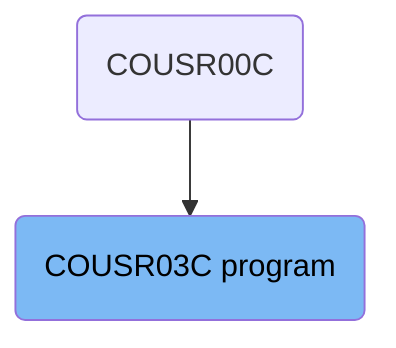
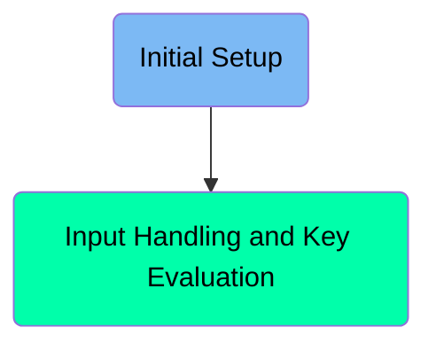
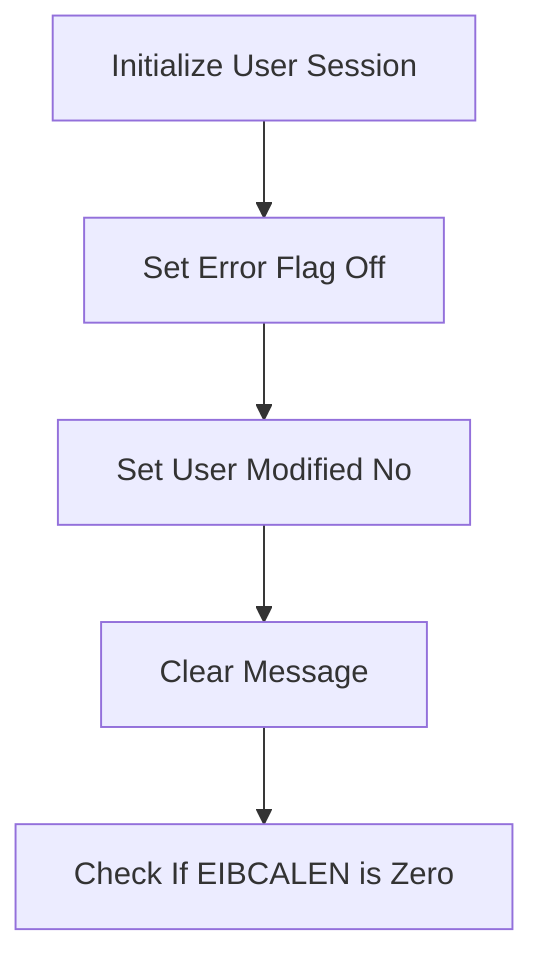
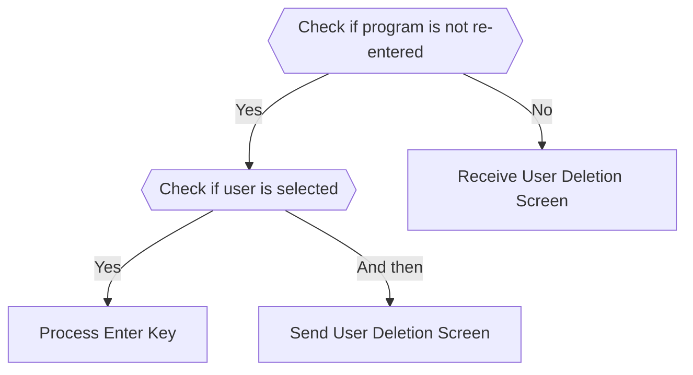

The <SwmToken path="app/cbl/COUSR03C.cbl" pos="2:7:7" line-data="      * Program     : COUSR03C.CBL">`COUSR03C`</SwmToken> program is responsible for handling user sessions and managing user deletion processes. It initializes the user session, handles input and key evaluations, and processes user actions based on the input received. The program ensures that user sessions start with a clean state by setting error flags and clearing previous messages.

The <SwmToken path="app/cbl/COUSR03C.cbl" pos="2:7:7" line-data="      * Program     : COUSR03C.CBL">`COUSR03C`</SwmToken> program starts by initializing the user session, setting error flags, and clearing previous messages. It then handles user input and key evaluations, checking if a user is selected and processing the corresponding actions. The program evaluates user actions based on the input received and performs different tasks such as processing the enter key, returning to the previous screen, clearing the current screen, deleting user information, or setting an error flag.

# Where is this program used?

This program is used multiple times in the codebase as represented in the following diagram:



Here is a high level diagram of the program:



# Initial Setup



<SwmSnippet path="/app/cbl/COUSR03C.cbl" line="82">

---

## Initialize User Session

The <SwmToken path="app/cbl/COUSR03C.cbl" pos="82:1:3" line-data="       MAIN-PARA.">`MAIN-PARA`</SwmToken> section starts by initializing the user session and preparing the environment. This involves setting error flags, user modification flags, and clearing any previous messages.

```cobol
       MAIN-PARA.

           SET ERR-FLG-OFF     TO TRUE
           SET USR-MODIFIED-NO TO TRUE

           MOVE SPACES TO WS-MESSAGE
                          ERRMSGO OF COUSR3AO

           IF EIBCALEN = 0
```

---

</SwmSnippet>

<SwmSnippet path="/app/cbl/COUSR03C.cbl" line="84">

---

### Set Error Flag Off

First, the error flag is set to off using <SwmToken path="app/cbl/COUSR03C.cbl" pos="84:1:1" line-data="           SET ERR-FLG-OFF     TO TRUE">`SET`</SwmToken>` `<SwmToken path="app/cbl/COUSR03C.cbl" pos="84:3:7" line-data="           SET ERR-FLG-OFF     TO TRUE">`ERR-FLG-OFF`</SwmToken>` `<SwmToken path="app/cbl/COUSR03C.cbl" pos="84:9:9" line-data="           SET ERR-FLG-OFF     TO TRUE">`TO`</SwmToken>` TRUE`. This ensures that any previous errors are cleared and the session starts with a clean state.

```cobol
           SET ERR-FLG-OFF     TO TRUE
```

---

</SwmSnippet>

<SwmSnippet path="/app/cbl/COUSR03C.cbl" line="85">

---

### Set User Modified No

Next, the user modified flag is set to no using <SwmToken path="app/cbl/COUSR03C.cbl" pos="85:1:11" line-data="           SET USR-MODIFIED-NO TO TRUE">`SET USR-MODIFIED-NO TO TRUE`</SwmToken>. This indicates that no user modifications have been made yet in the current session.

```cobol
           SET USR-MODIFIED-NO TO TRUE
```

---

</SwmSnippet>

<SwmSnippet path="/app/cbl/COUSR03C.cbl" line="87">

---

### Clear Message

Then, any previous messages are cleared by moving spaces to <SwmToken path="app/cbl/COUSR03C.cbl" pos="87:7:9" line-data="           MOVE SPACES TO WS-MESSAGE">`WS-MESSAGE`</SwmToken>. This ensures that the message area is clean and ready for new messages.

```cobol
           MOVE SPACES TO WS-MESSAGE
```

---

</SwmSnippet>

<SwmSnippet path="/app/cbl/COUSR03C.cbl" line="90">

---

### Check If EIBCALEN is Zero

Finally, the program checks if <SwmToken path="app/cbl/COUSR03C.cbl" pos="90:3:3" line-data="           IF EIBCALEN = 0">`EIBCALEN`</SwmToken> is zero. If it is, the program will move to a different section to handle the scenario where no data is passed in the communication area.

```cobol
           IF EIBCALEN = 0
```

---

</SwmSnippet>

# Input Handling and Key Evaluation



<SwmSnippet path="/app/cbl/COUSR03C.cbl" line="91">

---

## Initial Program Check

First, the program checks if it is not being re-entered by evaluating <SwmToken path="app/cbl/COUSR03C.cbl" pos="95:5:9" line-data="               IF NOT CDEMO-PGM-REENTER">`CDEMO-PGM-REENTER`</SwmToken>. If it is not re-entered, it sets the re-enter flag to true and initializes some variables.

```cobol
               MOVE 'COSGN00C' TO CDEMO-TO-PROGRAM
               PERFORM RETURN-TO-PREV-SCREEN
           ELSE
               MOVE DFHCOMMAREA(1:EIBCALEN) TO CARDDEMO-COMMAREA
               IF NOT CDEMO-PGM-REENTER
```

---

</SwmSnippet>

<SwmSnippet path="/app/cbl/COUSR03C.cbl" line="99">

---

## User Selection Check

Next, the program checks if a user has been selected by evaluating <SwmToken path="app/cbl/COUSR03C.cbl" pos="99:3:9" line-data="                   IF CDEMO-CU03-USR-SELECTED NOT =">`CDEMO-CU03-USR-SELECTED`</SwmToken>. If a user is selected, it moves the selected user ID to <SwmToken path="app/cbl/COUSR03C.cbl" pos="102:1:1" line-data="                            USRIDINI OF COUSR3AI">`USRIDINI`</SwmToken> and performs the <SwmToken path="app/cbl/COUSR03C.cbl" pos="103:3:7" line-data="                       PERFORM PROCESS-ENTER-KEY">`PROCESS-ENTER-KEY`</SwmToken> paragraph.

```cobol
                   IF CDEMO-CU03-USR-SELECTED NOT =
                                              SPACES AND LOW-VALUES
                       MOVE CDEMO-CU03-USR-SELECTED TO
                            USRIDINI OF COUSR3AI
                       PERFORM PROCESS-ENTER-KEY
                   END-IF
```

---

</SwmSnippet>

<SwmSnippet path="/app/cbl/COUSR03C.cbl" line="105">

---

## Sending User Deletion Screen

Then, the program performs the <SwmToken path="app/cbl/COUSR03C.cbl" pos="105:3:7" line-data="                   PERFORM SEND-USRDEL-SCREEN">`SEND-USRDEL-SCREEN`</SwmToken> paragraph to send the user deletion screen to the user.

```cobol
                   PERFORM SEND-USRDEL-SCREEN
```

---

</SwmSnippet>

<SwmSnippet path="/app/cbl/COUSR03C.cbl" line="107">

---

## Receiving User Deletion Screen

If the program is being re-entered, it performs the <SwmToken path="app/cbl/COUSR03C.cbl" pos="107:3:7" line-data="                   PERFORM RECEIVE-USRDEL-SCREEN">`RECEIVE-USRDEL-SCREEN`</SwmToken> paragraph to receive the user deletion screen input.

```cobol
                   PERFORM RECEIVE-USRDEL-SCREEN
```

---

</SwmSnippet>

<SwmSnippet path="/app/cbl/COUSR03C.cbl" line="108">

---

## Evaluating User Actions

The program evaluates the user action based on the <SwmToken path="app/cbl/COUSR03C.cbl" pos="108:3:3" line-data="                   EVALUATE EIBAID">`EIBAID`</SwmToken> value. Depending on the action, it performs different paragraphs such as <SwmToken path="app/cbl/COUSR03C.cbl" pos="110:3:7" line-data="                           PERFORM PROCESS-ENTER-KEY">`PROCESS-ENTER-KEY`</SwmToken>, <SwmToken path="app/cbl/COUSR03C.cbl" pos="118:3:9" line-data="                           PERFORM RETURN-TO-PREV-SCREEN">`RETURN-TO-PREV-SCREEN`</SwmToken>, <SwmToken path="app/cbl/COUSR03C.cbl" pos="120:3:7" line-data="                           PERFORM CLEAR-CURRENT-SCREEN">`CLEAR-CURRENT-SCREEN`</SwmToken>, <SwmToken path="app/cbl/COUSR03C.cbl" pos="122:3:7" line-data="                           PERFORM DELETE-USER-INFO">`DELETE-USER-INFO`</SwmToken>, or sets an error flag and sends the user deletion screen again.

```cobol
                   EVALUATE EIBAID
                       WHEN DFHENTER
                           PERFORM PROCESS-ENTER-KEY
                       WHEN DFHPF3
                           IF CDEMO-FROM-PROGRAM = SPACES OR LOW-VALUES
                               MOVE 'COADM01C' TO CDEMO-TO-PROGRAM
                           ELSE
                               MOVE CDEMO-FROM-PROGRAM TO
                               CDEMO-TO-PROGRAM
                           END-IF
                           PERFORM RETURN-TO-PREV-SCREEN
                       WHEN DFHPF4
                           PERFORM CLEAR-CURRENT-SCREEN
                       WHEN DFHPF5
                           PERFORM DELETE-USER-INFO
                       WHEN DFHPF12
                           MOVE 'COADM01C' TO CDEMO-TO-PROGRAM
                           PERFORM RETURN-TO-PREV-SCREEN
                       WHEN OTHER
                           MOVE 'Y'                       TO WS-ERR-FLG
                           MOVE CCDA-MSG-INVALID-KEY      TO WS-MESSAGE
```

---

</SwmSnippet>

&nbsp;

*This is an auto-generated document by Swimm 🌊 and has not yet been verified by a human*

<SwmMeta version="3.0.0" repo-id="Z2l0aHViJTNBJTNBa3luZHJ5bC1hd3MtbWFpbmZyYW1lLW1vZGVybml6YXRpb24tY2FyZGRlbW8lM0ElM0FTd2ltbS1EZW1v" repo-name="kyndryl-aws-mainframe-modernization-carddemo"><sup>Powered by [Swimm](https://staging.swimm.cloud/)</sup></SwmMeta>
