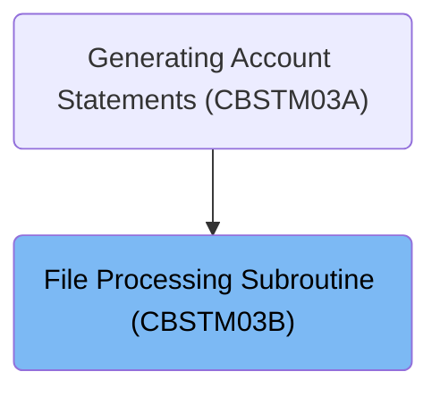

The <SwmToken path="app/cbl/CBSTM03B.CBL" pos="2:6:6" line-data="       PROGRAM-ID.    CBSTM03B.">`CBSTM03B`</SwmToken> program is a batch COBOL subroutine designed to handle file processing related to the Transact Report. This program is called by the statement create program and performs various file operations based on the file type. It evaluates the file type and processes transactions, cross-references, customer files, or account files accordingly.

For instance, if the file type is 'TRNXFILE', the program will open the transaction file, read its contents, and then close the file after processing.

# Where is this program used?

This program is used once, in a flow starting from `CBSTM03A` as represented in the following diagram:



# Evaluate File Processing (<SwmToken path="app/cbl/CBSTM03B.CBL" pos="116:1:3" line-data="       0000-START.">`0000-START`</SwmToken>)

<SwmSnippet path="/app/cbl/CBSTM03B.CBL" line="116">

---

Going into the <SwmToken path="app/cbl/CBSTM03B.CBL" pos="116:1:3" line-data="       0000-START.">`0000-START`</SwmToken> function, it evaluates the file type to determine the appropriate processing procedure. If the file type is 'TRNXFILE', it processes transactions. If the file type is 'XREFFILE', it handles cross-references. If the file type is 'CUSTFILE', it processes customer files. If the file type is 'ACCTFILE', it handles account files. For any other file type, it ends the program.

```cobol
       0000-START.

           EVALUATE LK-M03B-DD
             WHEN 'TRNXFILE'
               PERFORM 1000-TRNXFILE-PROC THRU 1999-EXIT
             WHEN 'XREFFILE'
               PERFORM 2000-XREFFILE-PROC THRU 2999-EXIT
             WHEN 'CUSTFILE'
               PERFORM 3000-CUSTFILE-PROC THRU 3999-EXIT
             WHEN 'ACCTFILE'
               PERFORM 4000-ACCTFILE-PROC THRU 4999-EXIT
             WHEN OTHER
               GO TO 9999-GOBACK.
```

---

</SwmSnippet>

# File Operations Processing (<SwmToken path="app/cbl/CBSTM03B.CBL" pos="120:3:7" line-data="               PERFORM 1000-TRNXFILE-PROC THRU 1999-EXIT">`1000-TRNXFILE-PROC`</SwmToken>)

<SwmSnippet path="/app/cbl/CBSTM03B.CBL" line="133">

---

Going into the first snippet, the code checks if the file should be opened. If it should, the file is opened for input operations, ensuring it is ready for subsequent read operations.

```cobol
       1000-TRNXFILE-PROC.

           IF M03B-OPEN
               OPEN INPUT TRNX-FILE
               GO TO 1900-EXIT
           END-IF.
```

---

</SwmSnippet>

<SwmSnippet path="/app/cbl/CBSTM03B.CBL" line="140">

---

Next, the code checks if the file should be read. If it should, the file is read into a working storage variable, allowing the program to process the data from the file.

```cobol
           IF M03B-READ
               READ TRNX-FILE INTO LK-M03B-FLDT
               END-READ
               GO TO 1900-EXIT
           END-IF.
```

---

</SwmSnippet>

<SwmSnippet path="/app/cbl/CBSTM03B.CBL" line="146">

---

Then, the code checks if the file should be closed. If it should, the file is closed, ensuring it is properly closed after all operations are completed.

```cobol
           IF M03B-CLOSE
               CLOSE TRNX-FILE
               GO TO 1900-EXIT
           END-IF.
```

---

</SwmSnippet>

# File Operations (<SwmToken path="app/cbl/CBSTM03B.CBL" pos="122:3:7" line-data="               PERFORM 2000-XREFFILE-PROC THRU 2999-EXIT">`2000-XREFFILE-PROC`</SwmToken>)

<SwmSnippet path="/app/cbl/CBSTM03B.CBL" line="157">

---

### Opening the XREF file

Going into the first snippet, the code checks if the <SwmToken path="app/cbl/CBSTM03B.CBL" pos="159:3:5" line-data="           IF M03B-OPEN">`M03B-OPEN`</SwmToken> flag is set. If it is, the XREF file is opened for input operations. This ensures that the file is ready for subsequent read operations.

```cobol
       2000-XREFFILE-PROC.

           IF M03B-OPEN
               OPEN INPUT XREF-FILE
               GO TO 2900-EXIT
           END-IF.
```

---

</SwmSnippet>

<SwmSnippet path="/app/cbl/CBSTM03B.CBL" line="164">

---

### Reading from the XREF file

Next, the code checks if the <SwmToken path="app/cbl/CBSTM03B.CBL" pos="164:3:5" line-data="           IF M03B-READ">`M03B-READ`</SwmToken> flag is set. If it is, the XREF file is read into the <SwmToken path="app/cbl/CBSTM03B.CBL" pos="165:9:13" line-data="               READ XREF-FILE INTO LK-M03B-FLDT">`LK-M03B-FLDT`</SwmToken> storage area. This step is crucial for processing the data contained in the XREF file.

```cobol
           IF M03B-READ
               READ XREF-FILE INTO LK-M03B-FLDT
               END-READ
               GO TO 2900-EXIT
           END-IF.
```

---

</SwmSnippet>

<SwmSnippet path="/app/cbl/CBSTM03B.CBL" line="170">

---

### Closing the XREF file

Then, the code checks if the <SwmToken path="app/cbl/CBSTM03B.CBL" pos="170:3:5" line-data="           IF M03B-CLOSE">`M03B-CLOSE`</SwmToken> flag is set. If it is, the XREF file is closed. This step ensures that the file is properly closed after all necessary operations are completed.

```cobol
           IF M03B-CLOSE
               CLOSE XREF-FILE
               GO TO 2900-EXIT
           END-IF.
```

---

</SwmSnippet>

# Customer File Operations (<SwmToken path="app/cbl/CBSTM03B.CBL" pos="124:3:7" line-data="               PERFORM 3000-CUSTFILE-PROC THRU 3999-EXIT">`3000-CUSTFILE-PROC`</SwmToken>)

<SwmSnippet path="/app/cbl/CBSTM03B.CBL" line="181">

---

Going into the first snippet, the code checks if the file should be opened. If it should, the customer file is opened for input operations, ensuring that the file is ready for subsequent read or write operations.

```cobol
       3000-CUSTFILE-PROC.

           IF M03B-OPEN
               OPEN INPUT CUST-FILE
               GO TO 3900-EXIT
           END-IF.
```

---

</SwmSnippet>

<SwmSnippet path="/app/cbl/CBSTM03B.CBL" line="188">

---

Now, the second snippet checks if the file should be read. If it should, the customer ID is set, and the customer file is read into a working storage variable. This step is crucial for retrieving customer data for processing.

```cobol
           IF M03B-READ-K
               MOVE LK-M03B-KEY (1:LK-M03B-KEY-LN) TO FD-CUST-ID
               READ CUST-FILE INTO LK-M03B-FLDT
               END-READ
               GO TO 3900-EXIT
           END-IF.
```

---

</SwmSnippet>

<SwmSnippet path="/app/cbl/CBSTM03B.CBL" line="195">

---

Moving to the third snippet, the code checks if the file should be closed. If it should, the customer file is closed. This ensures that the file is properly closed after all operations are completed, maintaining data integrity.

```cobol
           IF M03B-CLOSE
               CLOSE CUST-FILE
               GO TO 3900-EXIT
           END-IF.
```

---

</SwmSnippet>

&nbsp;

*This is an auto-generated document by Swimm 🌊 and has not yet been verified by a human*

<SwmMeta version="3.0.0" repo-id="Z2l0aHViJTNBJTNBa3luZHJ5bC1hd3MtbWFpbmZyYW1lLW1vZGVybml6YXRpb24tY2FyZGRlbW8lM0ElM0FTd2ltbS1EZW1v" repo-name="kyndryl-aws-mainframe-modernization-carddemo"><sup>Powered by [Swimm](/)</sup></SwmMeta>
