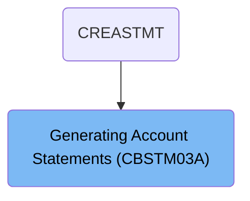
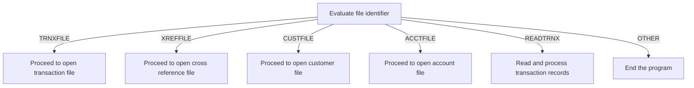
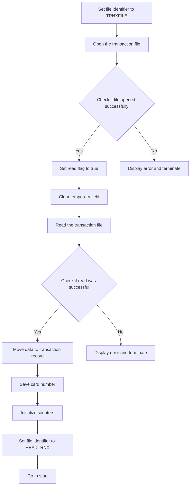
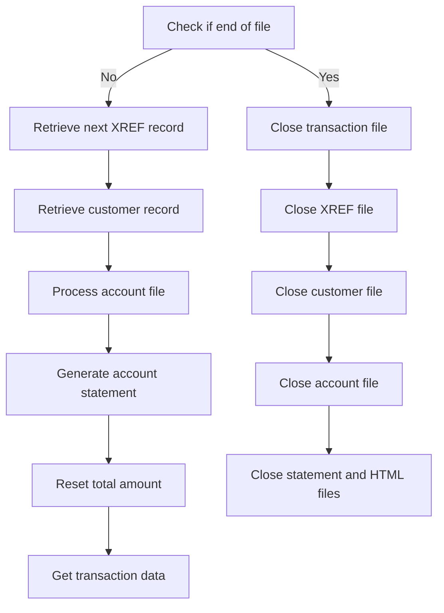

```mermaid
graph TD
  A[Set PSA-BLOCK address] --> B[Set TCB-BLOCK address] --> C[Set TIOT-BLOCK address] --> D[Set TIOT-INDEX] --> E[Display JCL and Step] --> F[Compute BUMP-TIOT] --> G[Set TIOT-ENTRY address] --> H[Display DD Names] --> I{Check END-OF-TIOT or TIO-LEN} --> |No| J[Check UCB] --> K{Is UCB null?} --> |No| L[Display valid UCB] --> M[Compute BUMP-TIOT] --> N[Set TIOT-ENTRY address] --> O[Repeat until END-OF-TIOT] --> P[Check UCB again] --> Q{Is UCB null?} --> |No| R[Display valid UCB] --> |Yes| S[Display null UCB]

%% Swimm:
%% graph TD
%%   A[Set <SwmToken path="app/cbl/CBSTM03A.CBL" pos="266:7:9" line-data="           SET ADDRESS OF PSA-BLOCK   TO PSAPTR.">`PSA-BLOCK`</SwmToken> address] --> B[Set <SwmToken path="app/cbl/CBSTM03A.CBL" pos="267:7:9" line-data="           SET ADDRESS OF TCB-BLOCK   TO TCB-POINT.">`TCB-BLOCK`</SwmToken> address] --> C[Set <SwmToken path="app/cbl/CBSTM03A.CBL" pos="268:7:9" line-data="           SET ADDRESS OF TIOT-BLOCK  TO TIOT-POINT.">`TIOT-BLOCK`</SwmToken> address] --> D[Set <SwmToken path="app/cbl/CBSTM03A.CBL" pos="269:3:5" line-data="           SET TIOT-INDEX             TO TIOT-POINT.">`TIOT-INDEX`</SwmToken>] --> E[Display JCL and Step] --> F[Compute <SwmToken path="app/cbl/CBSTM03A.CBL" pos="272:3:5" line-data="           COMPUTE BUMP-TIOT = BUMP-TIOT + LENGTH OF TIOT-BLOCK.">`BUMP-TIOT`</SwmToken>] --> G[Set <SwmToken path="app/cbl/CBSTM03A.CBL" pos="273:7:9" line-data="           SET ADDRESS OF TIOT-ENTRY  TO TIOT-INDEX.">`TIOT-ENTRY`</SwmToken> address] --> H[Display DD Names] --> I{Check <SwmToken path="app/cbl/CBSTM03A.CBL" pos="276:5:9" line-data="           PERFORM UNTIL END-OF-TIOT">`END-OF-TIOT`</SwmToken> or <SwmToken path="app/cbl/CBSTM03A.CBL" pos="277:3:5" line-data="                      OR TIO-LEN = LOW-VALUES">`TIO-LEN`</SwmToken>} --> |No| J[Check UCB] --> K{Is UCB null?} --> |No| L[Display valid UCB] --> M[Compute <SwmToken path="app/cbl/CBSTM03A.CBL" pos="272:3:5" line-data="           COMPUTE BUMP-TIOT = BUMP-TIOT + LENGTH OF TIOT-BLOCK.">`BUMP-TIOT`</SwmToken>] --> N[Set <SwmToken path="app/cbl/CBSTM03A.CBL" pos="273:7:9" line-data="           SET ADDRESS OF TIOT-ENTRY  TO TIOT-INDEX.">`TIOT-ENTRY`</SwmToken> address] --> O[Repeat until <SwmToken path="app/cbl/CBSTM03A.CBL" pos="276:5:9" line-data="           PERFORM UNTIL END-OF-TIOT">`END-OF-TIOT`</SwmToken>] --> P[Check UCB again] --> Q{Is UCB null?} --> |No| R[Display valid UCB] --> |Yes| S[Display null UCB]
```

```mermaid
graph TD
  A[Check if card number matches] -->|Yes| B[Increment transaction count]
  A -->|No| C[Store transaction count]
  C --> D[Increment card count]
  D --> E[Reset transaction count]
  F[Move transaction details to working storage] --> G[Set read flag]
  G --> H[Call CBSTM03B for file processing]
  I[Evaluate return code] -->|00| J[Move data to transaction record]
  I -->|10| K[Exit process]
  I -->|Other| L[Display error and abend]

%% Swimm:
%% graph TD
%%   A[Check if card number matches] -->|Yes| B[Increment transaction count]
%%   A -->|No| C[Store transaction count]
%%   C --> D[Increment card count]
%%   D --> E[Reset transaction count]
%%   F[Move transaction details to working storage] --> G[Set read flag]
%%   G --> H[Call <SwmToken path="app/cbl/CBSTM03A.CBL" pos="351:4:4" line-data="           CALL &#39;CBSTM03B&#39; USING WS-M03B-AREA.">`CBSTM03B`</SwmToken> for file processing]
%%   I[Evaluate return code] -->|00| J[Move data to transaction record]
%%   I -->|10| K[Exit process]
%%   I -->|Other| L[Display error and abend]
```

```mermaid
graph TD
  A[Set file identifier to XREFFILE] --> B[Set read flag to true] --> C[Initialize return code to zero] --> D[Clear temporary data field] --> E[Call CBSTM03B to read file] --> F{Check return code}
  F -- '00' --> G[Continue processing]
  F -- '10' --> H[Set end-of-file flag]
  F -- 'Other' --> I[Display error message] --> J[Perform abend program]
  G --> K[Move data to cross-reference record]

%% Swimm:
%% graph TD
%%   A[Set file identifier to XREFFILE] --> B[Set read flag to true] --> C[Initialize return code to zero] --> D[Clear temporary data field] --> E[Call <SwmToken path="app/cbl/CBSTM03A.CBL" pos="351:4:4" line-data="           CALL &#39;CBSTM03B&#39; USING WS-M03B-AREA.">`CBSTM03B`</SwmToken> to read file] --> F{Check return code}
%%   F -- '00' --> G[Continue processing]
%%   F -- '10' --> H[Set end-of-file flag]
%%   F -- 'Other' --> I[Display error message] --> J[Perform abend program]
%%   G --> K[Move data to cross-reference record]
```

The <SwmToken path="app/cbl/CBSTM03A.CBL" pos="2:6:6" line-data="       PROGRAM-ID.    CBSTM03A.">`CBSTM03A`</SwmToken> program is a batch COBOL program designed to print account statements from transaction data in two formats: plain text and HTML. This program is part of the <SwmToken path="app/cbl/CBSTM03A.CBL" pos="6:7:7" line-data="      * Application : CardDemo">`CardDemo`</SwmToken> application and is used to create statements based on data in the transaction file, exercising various modernization tooling features.

For example, the program processes transaction records, generates account statements, and outputs them in both plain text and HTML formats.

# Where is this program used?

This program is used once, in a flow starting from `CREASTMT` as represented in the following diagram:



# Check Control Blocks (PROCEDURE-DIVISION)

Lets' zoom into the program flow:



<SwmSnippet path="/app/cbl/CBSTM03A.CBL" line="262">

---

### Setting Control Block Addresses

Going into the PROCEDURE-DIVISION, the code sets the addresses for various control blocks. This is essential for managing and accessing these control blocks within the mainframe environment.

```cobol
       PROCEDURE DIVISION.
      *****************************************************************
      *    Check Unit Control blocks                                  *
      *****************************************************************
           SET ADDRESS OF PSA-BLOCK   TO PSAPTR.
           SET ADDRESS OF TCB-BLOCK   TO TCB-POINT.
           SET ADDRESS OF TIOT-BLOCK  TO TIOT-POINT.
           SET TIOT-INDEX             TO TIOT-POINT.
           DISPLAY 'Running JCL : ' TIOTNJOB ' Step ' TIOTJSTP.

           COMPUTE BUMP-TIOT = BUMP-TIOT + LENGTH OF TIOT-BLOCK.
           SET ADDRESS OF TIOT-ENTRY  TO TIOT-INDEX.

           DISPLAY 'DD Names from TIOT: '.
           PERFORM UNTIL END-OF-TIOT
                      OR TIO-LEN = LOW-VALUES
```

---

</SwmSnippet>

<SwmSnippet path="/app/cbl/CBSTM03A.CBL" line="262">

---

### Displaying JCL and Step Information

Next, the code displays the JCL and Step information. This helps in identifying the current job and step being executed.

```cobol
       PROCEDURE DIVISION.
      *****************************************************************
      *    Check Unit Control blocks                                  *
      *****************************************************************
           SET ADDRESS OF PSA-BLOCK   TO PSAPTR.
           SET ADDRESS OF TCB-BLOCK   TO TCB-POINT.
           SET ADDRESS OF TIOT-BLOCK  TO TIOT-POINT.
           SET TIOT-INDEX             TO TIOT-POINT.
           DISPLAY 'Running JCL : ' TIOTNJOB ' Step ' TIOTJSTP.

           COMPUTE BUMP-TIOT = BUMP-TIOT + LENGTH OF TIOT-BLOCK.
           SET ADDRESS OF TIOT-ENTRY  TO TIOT-INDEX.

           DISPLAY 'DD Names from TIOT: '.
           PERFORM UNTIL END-OF-TIOT
                      OR TIO-LEN = LOW-VALUES
```

---

</SwmSnippet>

<SwmSnippet path="/app/cbl/CBSTM03A.CBL" line="262">

---

### Computing <SwmToken path="app/cbl/CBSTM03A.CBL" pos="272:3:5" line-data="           COMPUTE BUMP-TIOT = BUMP-TIOT + LENGTH OF TIOT-BLOCK.">`BUMP-TIOT`</SwmToken>

Then, the code computes the <SwmToken path="app/cbl/CBSTM03A.CBL" pos="272:3:5" line-data="           COMPUTE BUMP-TIOT = BUMP-TIOT + LENGTH OF TIOT-BLOCK.">`BUMP-TIOT`</SwmToken> value by adding the length of the <SwmToken path="app/cbl/CBSTM03A.CBL" pos="268:7:9" line-data="           SET ADDRESS OF TIOT-BLOCK  TO TIOT-POINT.">`TIOT-BLOCK`</SwmToken>. This is used to manage the memory addressing for the TIOT entries.

```cobol
       PROCEDURE DIVISION.
      *****************************************************************
      *    Check Unit Control blocks                                  *
      *****************************************************************
           SET ADDRESS OF PSA-BLOCK   TO PSAPTR.
           SET ADDRESS OF TCB-BLOCK   TO TCB-POINT.
           SET ADDRESS OF TIOT-BLOCK  TO TIOT-POINT.
           SET TIOT-INDEX             TO TIOT-POINT.
           DISPLAY 'Running JCL : ' TIOTNJOB ' Step ' TIOTJSTP.

           COMPUTE BUMP-TIOT = BUMP-TIOT + LENGTH OF TIOT-BLOCK.
           SET ADDRESS OF TIOT-ENTRY  TO TIOT-INDEX.

           DISPLAY 'DD Names from TIOT: '.
           PERFORM UNTIL END-OF-TIOT
                      OR TIO-LEN = LOW-VALUES
```

---

</SwmSnippet>

<SwmSnippet path="/app/cbl/CBSTM03A.CBL" line="262">

---

### Displaying DD Names

Moving to the next part, the code displays the DD Names from the TIOT. This is done in a loop until the end of the TIOT is reached or a specific condition is met.

```cobol
       PROCEDURE DIVISION.
      *****************************************************************
      *    Check Unit Control blocks                                  *
      *****************************************************************
           SET ADDRESS OF PSA-BLOCK   TO PSAPTR.
           SET ADDRESS OF TCB-BLOCK   TO TCB-POINT.
           SET ADDRESS OF TIOT-BLOCK  TO TIOT-POINT.
           SET TIOT-INDEX             TO TIOT-POINT.
           DISPLAY 'Running JCL : ' TIOTNJOB ' Step ' TIOTJSTP.

           COMPUTE BUMP-TIOT = BUMP-TIOT + LENGTH OF TIOT-BLOCK.
           SET ADDRESS OF TIOT-ENTRY  TO TIOT-INDEX.

           DISPLAY 'DD Names from TIOT: '.
           PERFORM UNTIL END-OF-TIOT
                      OR TIO-LEN = LOW-VALUES
```

---

</SwmSnippet>

<SwmSnippet path="/app/cbl/CBSTM03A.CBL" line="278">

---

### Checking UCB

Next, the code checks if the UCB is null. If it is not null, it displays that the UCB is valid; otherwise, it displays that the UCB is null.

```cobol
               IF NOT NULL-UCB
                   DISPLAY ': ' TIOCDDNM ' -- valid UCB'
               ELSE
                   DISPLAY ': ' TIOCDDNM ' --  null UCB'
               END-IF
```

---

</SwmSnippet>

<SwmSnippet path="/app/cbl/CBSTM03A.CBL" line="283">

---

### Recomputing <SwmToken path="app/cbl/CBSTM03A.CBL" pos="283:3:5" line-data="               COMPUTE BUMP-TIOT = BUMP-TIOT + LENGTH OF TIOT-SEG">`BUMP-TIOT`</SwmToken>

Then, the code recomputes the <SwmToken path="app/cbl/CBSTM03A.CBL" pos="283:3:5" line-data="               COMPUTE BUMP-TIOT = BUMP-TIOT + LENGTH OF TIOT-SEG">`BUMP-TIOT`</SwmToken> value by adding the length of the <SwmToken path="app/cbl/CBSTM03A.CBL" pos="283:19:21" line-data="               COMPUTE BUMP-TIOT = BUMP-TIOT + LENGTH OF TIOT-SEG">`TIOT-SEG`</SwmToken>. This is part of the loop to manage the memory addressing for the TIOT entries.

```cobol
               COMPUTE BUMP-TIOT = BUMP-TIOT + LENGTH OF TIOT-SEG
               SET ADDRESS OF TIOT-ENTRY TO TIOT-INDEX
           END-PERFORM.

           IF NOT NULL-UCB
               DISPLAY ': ' TIOCDDNM ' -- valid UCB'
           ELSE
               DISPLAY ': ' TIOCDDNM ' -- null  UCB'
           END-IF.
```

---

</SwmSnippet>

<SwmSnippet path="/app/cbl/CBSTM03A.CBL" line="283">

---

### Final UCB Check

Finally, the code performs another check on the UCB. If it is not null, it displays that the UCB is valid; otherwise, it displays that the UCB is null.

```cobol
               COMPUTE BUMP-TIOT = BUMP-TIOT + LENGTH OF TIOT-SEG
               SET ADDRESS OF TIOT-ENTRY TO TIOT-INDEX
           END-PERFORM.

           IF NOT NULL-UCB
               DISPLAY ': ' TIOCDDNM ' -- valid UCB'
           ELSE
               DISPLAY ': ' TIOCDDNM ' -- null  UCB'
           END-IF.
```

---

</SwmSnippet>

<SwmSnippet path="/app/cbl/CBSTM03A.CBL" line="293">

---

### Opening Output Files

Next, the code opens the output files for the statement and HTML formats. This is necessary for writing the account statements in the respective formats.

```cobol
           OPEN OUTPUT STMT-FILE HTML-FILE.
           INITIALIZE WS-TRNX-TABLE WS-TRN-TBL-CNTR.

       0000-START.
```

---

</SwmSnippet>

<SwmSnippet path="/app/cbl/CBSTM03A.CBL" line="293">

---

### Initializing Transaction Table

Finally, the code initializes the transaction table and its counter. This prepares the table for storing transaction data during the processing of account statements.

```cobol
           OPEN OUTPUT STMT-FILE HTML-FILE.
           INITIALIZE WS-TRNX-TABLE WS-TRN-TBL-CNTR.

       0000-START.
```

---

</SwmSnippet>

# Alter File Opening (<SwmToken path="app/cbl/CBSTM03A.CBL" pos="296:1:3" line-data="       0000-START.">`0000-START`</SwmToken>)

Lets' zoom into the program flow:



<SwmSnippet path="/app/cbl/CBSTM03A.CBL" line="296">

---

### Evaluating the file identifier

Diving into the code, it evaluates the <SwmToken path="app/cbl/CBSTM03A.CBL" pos="298:3:7" line-data="           EVALUATE WS-FL-DD">`WS-FL-DD`</SwmToken> (file identifier) to determine the specific file operation. If the identifier is <SwmToken path="app/cbl/CBSTM03A.CBL" pos="299:4:4" line-data="             WHEN &#39;TRNXFILE&#39;">`TRNXFILE`</SwmToken>, it proceeds to open the transaction file. For <SwmToken path="app/cbl/CBSTM03A.CBL" pos="302:4:4" line-data="             WHEN &#39;XREFFILE&#39;">`XREFFILE`</SwmToken>, it opens the cross-reference file. If it is <SwmToken path="app/cbl/CBSTM03A.CBL" pos="305:4:4" line-data="             WHEN &#39;CUSTFILE&#39;">`CUSTFILE`</SwmToken>, it opens the customer file, and for <SwmToken path="app/cbl/CBSTM03A.CBL" pos="308:4:4" line-data="             WHEN &#39;ACCTFILE&#39;">`ACCTFILE`</SwmToken>, it opens the account file. If the identifier is <SwmToken path="app/cbl/CBSTM03A.CBL" pos="311:4:4" line-data="             WHEN &#39;READTRNX&#39;">`READTRNX`</SwmToken>, it reads and processes transaction records. If none of these identifiers match, the program ends.

```cobol
       0000-START.

           EVALUATE WS-FL-DD
             WHEN 'TRNXFILE'
               ALTER 8100-FILE-OPEN TO PROCEED TO 8100-TRNXFILE-OPEN
               GO TO 8100-FILE-OPEN
             WHEN 'XREFFILE'
               ALTER 8100-FILE-OPEN TO PROCEED TO 8200-XREFFILE-OPEN
               GO TO 8100-FILE-OPEN
             WHEN 'CUSTFILE'
               ALTER 8100-FILE-OPEN TO PROCEED TO 8300-CUSTFILE-OPEN
               GO TO 8100-FILE-OPEN
             WHEN 'ACCTFILE'
               ALTER 8100-FILE-OPEN TO PROCEED TO 8400-ACCTFILE-OPEN
               GO TO 8100-FILE-OPEN
             WHEN 'READTRNX'
               GO TO 8500-READTRNX-READ
             WHEN OTHER
               GO TO 9999-GOBACK.
```

---

</SwmSnippet>

# Open Transaction File (<SwmToken path="app/cbl/CBSTM03A.CBL" pos="300:3:7" line-data="               ALTER 8100-FILE-OPEN TO PROCEED TO 8100-TRNXFILE-OPEN">`8100-FILE-OPEN`</SwmToken>)

<SwmSnippet path="/app/cbl/CBSTM03A.CBL" line="726">

---

The <SwmToken path="app/cbl/CBSTM03A.CBL" pos="726:1:5" line-data="       8100-FILE-OPEN.">`8100-FILE-OPEN`</SwmToken> function is responsible for opening the transaction file. It directly transfers control to the <SwmToken path="app/cbl/CBSTM03A.CBL" pos="727:5:9" line-data="           GO TO 8100-TRNXFILE-OPEN">`8100-TRNXFILE-OPEN`</SwmToken> function, which handles the actual file opening, setting initial values, and error handling.

```cobol
       8100-FILE-OPEN.
           GO TO 8100-TRNXFILE-OPEN
           .
```

---

</SwmSnippet>

# Open and Read Transaction File (<SwmToken path="app/cbl/CBSTM03A.CBL" pos="300:15:19" line-data="               ALTER 8100-FILE-OPEN TO PROCEED TO 8100-TRNXFILE-OPEN">`8100-TRNXFILE-OPEN`</SwmToken>)

Lets' zoom into the program flow:



<SwmSnippet path="/app/cbl/CBSTM03A.CBL" line="730">

---

### Opening the transaction file

Going into the first snippet, the code sets the file identifier to 'TRNXFILE' and attempts to open the transaction file. If the file opens successfully, it continues; otherwise, it displays an error message and terminates the program.

```cobol
       8100-TRNXFILE-OPEN.
           MOVE 'TRNXFILE' TO WS-M03B-DD.
           SET M03B-OPEN TO TRUE.
           MOVE ZERO TO WS-M03B-RC.
           CALL 'CBSTM03B' USING WS-M03B-AREA.

           IF WS-M03B-RC = '00' OR '04'
               CONTINUE
           ELSE
               DISPLAY 'ERROR OPENING TRNXFILE'
               DISPLAY 'RETURN CODE: ' WS-M03B-RC
               PERFORM 9999-ABEND-PROGRAM
           END-IF.
```

---

</SwmSnippet>

<SwmSnippet path="/app/cbl/CBSTM03A.CBL" line="744">

---

### Reading the transaction file

Next, the code sets the read flag to true and clears the temporary field before attempting to read the transaction file. If the read operation is successful, it continues; otherwise, it displays an error message and terminates the program.

```cobol
           SET M03B-READ TO TRUE.
           MOVE SPACES TO WS-M03B-FLDT.
           CALL 'CBSTM03B' USING WS-M03B-AREA.

           IF WS-M03B-RC = '00' OR '04'
               CONTINUE
           ELSE
               DISPLAY 'ERROR READING TRNXFILE'
               DISPLAY 'RETURN CODE: ' WS-M03B-RC
               PERFORM 9999-ABEND-PROGRAM
           END-IF.
```

---

</SwmSnippet>

<SwmSnippet path="/app/cbl/CBSTM03A.CBL" line="756">

---

### Processing the transaction data

Then, the code moves the data from the temporary field to the transaction record, saves the card number, initializes counters, and sets the file identifier to 'READTRNX' before proceeding to the next step in the process.

```cobol
           MOVE WS-M03B-FLDT TO TRNX-RECORD.
           MOVE TRNX-CARD-NUM TO WS-SAVE-CARD.
           MOVE 1 TO CR-CNT.
           MOVE 0 TO TR-CNT.
           MOVE 'READTRNX' TO WS-FL-DD.
           GO TO 0000-START.
           EXIT.
```

---

</SwmSnippet>

# Process Transactions (<SwmToken path="app/cbl/CBSTM03A.CBL" pos="312:5:9" line-data="               GO TO 8500-READTRNX-READ">`8500-READTRNX-READ`</SwmToken>)

Lets' zoom into the program flow:



<SwmSnippet path="/app/cbl/CBSTM03A.CBL" line="818">

---

### Checking card number and updating counts

Going into the first snippet, the code checks if the current transaction card number matches the previously saved card number. If they match, it increments the transaction count, indicating that multiple transactions are associated with the same card. If they do not match, it stores the current transaction count for the previous card, increments the card count to track a new card, and resets the transaction count to 1 for the new card.

```cobol
       8500-READTRNX-READ.
           IF WS-SAVE-CARD = TRNX-CARD-NUM
               ADD 1 TO TR-CNT
           ELSE
               MOVE TR-CNT TO WS-TRCT (CR-CNT)
               ADD 1 TO CR-CNT
               MOVE 1 TO TR-CNT
           END-IF.
```

---

</SwmSnippet>

<SwmSnippet path="/app/cbl/CBSTM03A.CBL" line="827">

---

### Moving transaction details and calling file processing

Now, the second snippet moves the transaction details, including the card number, transaction ID, and other transaction-related data, to working storage variables. It sets a read flag to indicate that a read operation is required and calls the <SwmToken path="app/cbl/CBSTM03A.CBL" pos="835:4:4" line-data="           CALL &#39;CBSTM03B&#39; USING WS-M03B-AREA.">`CBSTM03B`</SwmToken> program to handle file processing related to the transaction report.

```cobol
           MOVE TRNX-CARD-NUM TO WS-CARD-NUM (CR-CNT).
           MOVE TRNX-ID TO WS-TRAN-NUM (CR-CNT, TR-CNT).
           MOVE TRNX-REST TO WS-TRAN-REST (CR-CNT, TR-CNT).
           MOVE TRNX-CARD-NUM TO WS-SAVE-CARD.

           MOVE 'TRNXFILE' TO WS-M03B-DD.
           SET M03B-READ TO TRUE.
           MOVE SPACES TO WS-M03B-FLDT.
           CALL 'CBSTM03B' USING WS-M03B-AREA.
```

---

</SwmSnippet>

<SwmSnippet path="/app/cbl/CBSTM03A.CBL" line="837">

---

### Evaluating return code and handling outcomes

Next, the third snippet evaluates the return code from the file processing call. If the return code is '00', indicating a successful read, it moves the data to the transaction record and continues reading the next transaction. If the return code is '10', indicating the end of the file, it exits the process. For any other return code, it displays an error message and abends the program to prevent further processing and ensure data integrity.

```cobol
           EVALUATE WS-M03B-RC
             WHEN '00'
               MOVE WS-M03B-FLDT TO TRNX-RECORD
               GO TO 8500-READTRNX-READ
             WHEN '10'
               GO TO 8599-EXIT
             WHEN OTHER
               DISPLAY 'ERROR READING TRNXFILE'
               DISPLAY 'RETURN CODE: ' WS-M03B-RC
               PERFORM 9999-ABEND-PROGRAM
           END-EVALUATE.
```

---

</SwmSnippet>

# Process and Close Files (<SwmToken path="app/cbl/CBSTM03A.CBL" pos="316:1:3" line-data="       1000-MAINLINE.">`1000-MAINLINE`</SwmToken>)

Lets' zoom into the program flow:



<SwmSnippet path="/app/cbl/CBSTM03A.CBL" line="316">

---

### Processing Records and Generating Statements

Going into the <SwmToken path="app/cbl/CBSTM03A.CBL" pos="316:1:3" line-data="       1000-MAINLINE.">`1000-MAINLINE`</SwmToken> function, it starts by checking if the end of the file has been reached. If not, it retrieves the next record from the XREF file, followed by retrieving the customer record and processing the account file. It then generates the account statement, resets the total amount, and gets the transaction data. This loop continues until the end of the file is reached.

```cobol
       1000-MAINLINE.
           PERFORM UNTIL END-OF-FILE = 'Y'
               IF  END-OF-FILE = 'N'
                   PERFORM 1000-XREFFILE-GET-NEXT
                   IF  END-OF-FILE = 'N'
                       PERFORM 2000-CUSTFILE-GET
                       PERFORM 3000-ACCTFILE-GET
                       PERFORM 5000-CREATE-STATEMENT
                       MOVE 1 TO CR-JMP
                       MOVE ZERO TO WS-TOTAL-AMT
                       PERFORM 4000-TRNXFILE-GET
                   END-IF
               END-IF
```

---

</SwmSnippet>

<SwmSnippet path="/app/cbl/CBSTM03A.CBL" line="329">

---

### Closing Files

Next, the function proceeds to close all the files that were opened during the process. It closes the transaction file, XREF file, customer file, and account file. Finally, it closes the statement and HTML files.

```cobol
           END-PERFORM.

           PERFORM 9100-TRNXFILE-CLOSE.

           PERFORM 9200-XREFFILE-CLOSE.

           PERFORM 9300-CUSTFILE-CLOSE.

           PERFORM 9400-ACCTFILE-CLOSE.

           CLOSE STMT-FILE HTML-FILE.
```

---

</SwmSnippet>

# Get Next Record (<SwmToken path="app/cbl/CBSTM03A.CBL" pos="319:3:9" line-data="                   PERFORM 1000-XREFFILE-GET-NEXT">`1000-XREFFILE-GET-NEXT`</SwmToken>)

Lets' zoom into the program flow:



<SwmSnippet path="/app/cbl/CBSTM03A.CBL" line="345">

---

### Reading the next record from the cross-reference file

Going into the <SwmToken path="app/cbl/CBSTM03A.CBL" pos="345:1:7" line-data="       1000-XREFFILE-GET-NEXT.">`1000-XREFFILE-GET-NEXT`</SwmToken> function, the first step is to set the file identifier to 'XREFFILE' and indicate that a read operation is required. The function then calls the <SwmToken path="app/cbl/CBSTM03A.CBL" pos="351:4:4" line-data="           CALL &#39;CBSTM03B&#39; USING WS-M03B-AREA.">`CBSTM03B`</SwmToken> program to read the next record from the file. The return code is evaluated to determine the outcome of the read operation. If the read is successful, processing continues. If the end of the file is reached, the end-of-file flag is set. For any other return code, an error message is displayed, and the abend program is performed. Finally, the data read from the file is moved to the cross-reference record.

```cobol
       1000-XREFFILE-GET-NEXT.

           MOVE 'XREFFILE' TO WS-M03B-DD.
           SET M03B-READ TO TRUE.
           MOVE ZERO TO WS-M03B-RC.
           MOVE SPACES TO WS-M03B-FLDT.
           CALL 'CBSTM03B' USING WS-M03B-AREA.

           EVALUATE WS-M03B-RC
             WHEN '00'
               CONTINUE
             WHEN '10'
               MOVE 'Y' TO END-OF-FILE
             WHEN OTHER
               DISPLAY 'ERROR READING XREFFILE'
               DISPLAY 'RETURN CODE: ' WS-M03B-RC
               PERFORM 9999-ABEND-PROGRAM
           END-EVALUATE.

           MOVE WS-M03B-FLDT TO CARD-XREF-RECORD.

           EXIT.
```

---

</SwmSnippet>

# Get Customer Record (<SwmToken path="app/cbl/CBSTM03A.CBL" pos="321:3:7" line-data="                       PERFORM 2000-CUSTFILE-GET">`2000-CUSTFILE-GET`</SwmToken>)

<SwmSnippet path="/app/cbl/CBSTM03A.CBL" line="368">

---

### Setting up and calling <SwmToken path="app/cbl/CBSTM03A.CBL" pos="377:4:4" line-data="           CALL &#39;CBSTM03B&#39; USING WS-M03B-AREA.">`CBSTM03B`</SwmToken>

Going into the <SwmToken path="app/cbl/CBSTM03A.CBL" pos="368:1:5" line-data="       2000-CUSTFILE-GET.">`2000-CUSTFILE-GET`</SwmToken> function, the code sets up the necessary parameters to retrieve customer data. It assigns the file identifier and sets the read operation flag. The customer ID is moved to the key field, and its length is calculated. The return code and data field are initialized before calling the <SwmToken path="app/cbl/CBSTM03A.CBL" pos="377:4:4" line-data="           CALL &#39;CBSTM03B&#39; USING WS-M03B-AREA.">`CBSTM03B`</SwmToken> program to perform the file read operation.

```cobol
       2000-CUSTFILE-GET.

           MOVE 'CUSTFILE' TO WS-M03B-DD.
           SET M03B-READ-K TO TRUE.
           MOVE XREF-CUST-ID TO WS-M03B-KEY.
           MOVE ZERO TO WS-M03B-KEY-LN.
           COMPUTE WS-M03B-KEY-LN = LENGTH OF XREF-CUST-ID.
           MOVE ZERO TO WS-M03B-RC.
           MOVE SPACES TO WS-M03B-FLDT.
           CALL 'CBSTM03B' USING WS-M03B-AREA.
```

---

</SwmSnippet>

<SwmSnippet path="/app/cbl/CBSTM03A.CBL" line="379">

---

### Handling the file read result

Next, the code evaluates the return code from the file read operation. If the operation is successful, it continues; otherwise, it displays an error message and performs an abnormal termination of the program. Finally, the retrieved customer data is moved to the customer record field.

```cobol
           EVALUATE WS-M03B-RC
             WHEN '00'
               CONTINUE
             WHEN OTHER
               DISPLAY 'ERROR READING CUSTFILE'
               DISPLAY 'RETURN CODE: ' WS-M03B-RC
               PERFORM 9999-ABEND-PROGRAM
           END-EVALUATE.

           MOVE WS-M03B-FLDT TO CUSTOMER-RECORD.

           EXIT.
```

---

</SwmSnippet>

&nbsp;

*This is an auto-generated document by Swimm 🌊 and has not yet been verified by a human*

<SwmMeta version="3.0.0" repo-id="Z2l0aHViJTNBJTNBa3luZHJ5bC1hd3MtbWFpbmZyYW1lLW1vZGVybml6YXRpb24tY2FyZGRlbW8lM0ElM0FTd2ltbS1EZW1v" repo-name="kyndryl-aws-mainframe-modernization-carddemo"><sup>Powered by [Swimm](/)</sup></SwmMeta>
