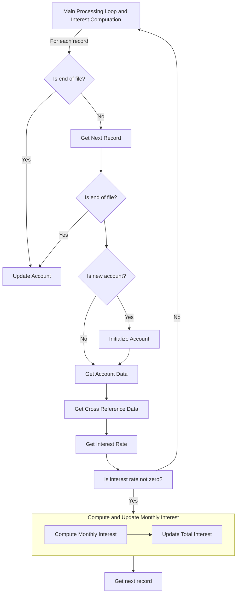

This document explains the process of calculating interest and fees for account balances.



<SwmSnippet path="app/cbl/CBACT04C.cbl" line="180" repo-id="Z2l0aHViJTNBJTNBa3luZHJ5bC1hd3MtbWFpbmZyYW1lLW1vZGVybml6YXRpb24tY2FyZGRlbW8lM0ElM0FTd2ltbS1EZW1v">

---

## Main Processing Loop and Interest Computation

The program begins by opening the necessary files:

- Transaction category balance file (<SwmToken path="/app/cbl/CBACT04C.cbl" pos="28:3:5" line-data="           SELECT TCATBAL-FILE ASSIGN TO TCATBALF                               " repo-id="Z2l0aHViJTNBJTNBa3luZHJ5bC1hd3MtbWFpbmZyYW1lLW1vZGVybml6YXRpb24tY2FyZGRlbW8lM0ElM0FTd2ltbS1EZW1v" repo-name="aws-mainframe-modernization-carddemo">`TCATBAL-FILE`</SwmToken>)
- Cross-reference file that links card numbers to account IDs (<SwmToken path="/app/cbl/CBACT04C.cbl" pos="34:3:5" line-data="           SELECT XREF-FILE ASSIGN TO   XREFFILE                                " repo-id="Z2l0aHViJTNBJTNBa3luZHJ5bC1hd3MtbWFpbmZyYW1lLW1vZGVybml6YXRpb24tY2FyZGRlbW8lM0ElM0FTd2ltbS1EZW1v" repo-name="aws-mainframe-modernization-carddemo">`XREF-FILE`</SwmToken>)
- Disclosure group file containing interest rates (<SwmToken path="/app/cbl/CBACT04C.cbl" pos="47:3:5" line-data="           SELECT DISCGRP-FILE ASSIGN TO DISCGRP                                " repo-id="Z2l0aHViJTNBJTNBa3luZHJ5bC1hd3MtbWFpbmZyYW1lLW1vZGVybml6YXRpb24tY2FyZGRlbW8lM0ElM0FTd2ltbS1EZW1v" repo-name="aws-mainframe-modernization-carddemo">`DISCGRP-FILE`</SwmToken>)
- Account file (<SwmToken path="/app/cbl/CBACT04C.cbl" pos="41:3:5" line-data="           SELECT ACCOUNT-FILE ASSIGN TO ACCTFILE                               " repo-id="Z2l0aHViJTNBJTNBa3luZHJ5bC1hd3MtbWFpbmZyYW1lLW1vZGVybml6YXRpb24tY2FyZGRlbW8lM0ElM0FTd2ltbS1EZW1v" repo-name="aws-mainframe-modernization-carddemo">`ACCOUNT-FILE`</SwmToken>)
- Transaction file (<SwmToken path="/app/cbl/CBACT04C.cbl" pos="53:3:5" line-data="           SELECT TRANSACT-FILE ASSIGN TO TRANSACT                              " repo-id="Z2l0aHViJTNBJTNBa3luZHJ5bC1hd3MtbWFpbmZyYW1lLW1vZGVybml6YXRpb24tY2FyZGRlbW8lM0ElM0FTd2ltbS1EZW1v" repo-name="aws-mainframe-modernization-carddemo">`TRANSACT-FILE`</SwmToken>)

```
       PROCEDURE DIVISION USING EXTERNAL-PARMS.                                 
           DISPLAY 'START OF EXECUTION OF PROGRAM CBACT04C'.                    
           PERFORM 0000-TCATBALF-OPEN.                                          
           PERFORM 0100-XREFFILE-OPEN.                                          
           PERFORM 0200-DISCGRP-OPEN.                                           
           PERFORM 0300-ACCTFILE-OPEN.                                          
           PERFORM 0400-TRANFILE-OPEN.                                          
```

---

</SwmSnippet>

<SwmSnippet path="app/cbl/CBACT04C.cbl" line="188" repo-id="Z2l0aHViJTNBJTNBa3luZHJ5bC1hd3MtbWFpbmZyYW1lLW1vZGVybml6YXRpb24tY2FyZGRlbW8lM0ElM0FTd2ltbS1EZW1v">

---

It then begins a loop that continues until the end of the transaction category balance file. Within this loop, it reads the next transaction category balance record and checks if the account ID has changed since the last record processed. If they're different, it means we've moved to processing a new account.

If we've moved to a new account and this isn't the first record being processed, we need to update the previous account with the accumulated interest.

```
           PERFORM UNTIL END-OF-FILE = 'Y'                                      
               IF  END-OF-FILE = 'N'                                            
                   PERFORM 1000-TCATBALF-GET-NEXT                               
                   IF  END-OF-FILE = 'N'                                        
                     ADD 1 TO WS-RECORD-COUNT                                   
                     DISPLAY TRAN-CAT-BAL-RECORD                                
                     IF TRANCAT-ACCT-ID NOT= WS-LAST-ACCT-NUM                   
                       IF WS-FIRST-TIME NOT = 'Y'                               
                          PERFORM 1050-UPDATE-ACCOUNT                           
                       ELSE                                                     
                          MOVE 'N' TO WS-FIRST-TIME                             
                       END-IF                                                   
```

---

</SwmSnippet>

<SwmSnippet path="app/cbl/CBACT04C.cbl" line="200" repo-id="Z2l0aHViJTNBJTNBa3luZHJ5bC1hd3MtbWFpbmZyYW1lLW1vZGVybml6YXRpb24tY2FyZGRlbW8lM0ElM0FTd2ltbS1EZW1v">

---

Then it sets up the current account by retrieving the account master information for the current account (<SwmToken path="/app/cbl/CBACT04C.cbl" pos="203:3:9" line-data="                       PERFORM 1100-GET-ACCT-DATA                               " repo-id="Z2l0aHViJTNBJTNBa3luZHJ5bC1hd3MtbWFpbmZyYW1lLW1vZGVybml6YXRpb24tY2FyZGRlbW8lM0ElM0FTd2ltbS1EZW1v" repo-name="aws-mainframe-modernization-carddemo">`1100-GET-ACCT-DATA`</SwmToken>) and the cross-reference information that links this account to a card number (<SwmToken path="/app/cbl/CBACT04C.cbl" pos="205:3:9" line-data="                       PERFORM 1110-GET-XREF-DATA                               " repo-id="Z2l0aHViJTNBJTNBa3luZHJ5bC1hd3MtbWFpbmZyYW1lLW1vZGVybml6YXRpb24tY2FyZGRlbW8lM0ElM0FTd2ltbS1EZW1v" repo-name="aws-mainframe-modernization-carddemo">`1110-GET-XREF-DATA`</SwmToken>).

```
                       MOVE 0 TO WS-TOTAL-INT                                   
                       MOVE TRANCAT-ACCT-ID TO WS-LAST-ACCT-NUM                 
                       MOVE TRANCAT-ACCT-ID TO FD-ACCT-ID                       
                       PERFORM 1100-GET-ACCT-DATA                               
                       MOVE TRANCAT-ACCT-ID TO FD-XREF-ACCT-ID                  
                       PERFORM 1110-GET-XREF-DATA                               
```

---

</SwmSnippet>

<SwmSnippet path="app/cbl/CBACT04C.cbl" line="210" repo-id="Z2l0aHViJTNBJTNBa3luZHJ5bC1hd3MtbWFpbmZyYW1lLW1vZGVybml6YXRpb24tY2FyZGRlbW8lM0ElM0FTd2ltbS1EZW1v">

---

After that, it will look up the interest rate in the disclosure group file according to the transaction category code and the transaction type code using <SwmToken path="/app/cbl/CBACT04C.cbl" pos="213:3:9" line-data="                     PERFORM 1200-GET-INTEREST-RATE                             " repo-id="Z2l0aHViJTNBJTNBa3luZHJ5bC1hd3MtbWFpbmZyYW1lLW1vZGVybml6YXRpb24tY2FyZGRlbW8lM0ElM0FTd2ltbS1EZW1v" repo-name="aws-mainframe-modernization-carddemo">`1200-GET-INTEREST-RATE`</SwmToken>.

```
                     MOVE ACCT-GROUP-ID TO FD-DIS-ACCT-GROUP-ID                 
                     MOVE TRANCAT-CD TO FD-DIS-TRAN-CAT-CD                      
                     MOVE TRANCAT-TYPE-CD TO FD-DIS-TRAN-TYPE-CD                
                     PERFORM 1200-GET-INTEREST-RATE                             
```

---

</SwmSnippet>

<SwmSnippet path="app/cbl/CBACT04C.cbl" line="214" repo-id="Z2l0aHViJTNBJTNBa3luZHJ5bC1hd3MtbWFpbmZyYW1lLW1vZGVybml6YXRpb24tY2FyZGRlbW8lM0ElM0FTd2ltbS1EZW1v">

---

If the interest rate is not zero, the function proceeds to compute the interest by calling the <SwmToken path="/app/cbl/CBACT04C.cbl" pos="215:3:7" line-data="                       PERFORM 1300-COMPUTE-INTEREST                            " repo-id="Z2l0aHViJTNBJTNBa3luZHJ5bC1hd3MtbWFpbmZyYW1lLW1vZGVybml6YXRpb24tY2FyZGRlbW8lM0ElM0FTd2ltbS1EZW1v" repo-name="aws-mainframe-modernization-carddemo">`1300-COMPUTE-INTEREST`</SwmToken> function.&nbsp;

```
                     IF DIS-INT-RATE NOT = 0                                    
                       PERFORM 1300-COMPUTE-INTEREST                            
                       PERFORM 1400-COMPUTE-FEES                                
                     END-IF                                                     
```

---

</SwmSnippet>

<SwmSnippet path="app/cbl/CBACT04C.cbl" line="462" repo-id="Z2l0aHViJTNBJTNBa3luZHJ5bC1hd3MtbWFpbmZyYW1lLW1vZGVybml6YXRpb24tY2FyZGRlbW8lM0ElM0FTd2ltbS1EZW1v">

---

## Compute and Update Monthly Interest

The <SwmToken path="/app/cbl/CBACT04C.cbl" pos="462:1:5" line-data="       1300-COMPUTE-INTEREST.                                                   " repo-id="Z2l0aHViJTNBJTNBa3luZHJ5bC1hd3MtbWFpbmZyYW1lLW1vZGVybml6YXRpb24tY2FyZGRlbW8lM0ElM0FTd2ltbS1EZW1v" repo-name="aws-mainframe-modernization-carddemo">`1300-COMPUTE-INTEREST`</SwmToken> function is responsible for computing the monthly interest. It calculates the interest by multiplying the transaction balance (<SwmToken path="/app/cbl/CBACT04C.cbl" pos="465:5:9" line-data="            = ( TRAN-CAT-BAL * DIS-INT-RATE) / 1200                             " repo-id="Z2l0aHViJTNBJTNBa3luZHJ5bC1hd3MtbWFpbmZyYW1lLW1vZGVybml6YXRpb24tY2FyZGRlbW8lM0ElM0FTd2ltbS1EZW1v" repo-name="aws-mainframe-modernization-carddemo">`TRAN-CAT-BAL`</SwmToken>) with the discount interest rate (<SwmToken path="/app/cbl/CBACT04C.cbl" pos="465:13:17" line-data="            = ( TRAN-CAT-BAL * DIS-INT-RATE) / 1200                             " repo-id="Z2l0aHViJTNBJTNBa3luZHJ5bC1hd3MtbWFpbmZyYW1lLW1vZGVybml6YXRpb24tY2FyZGRlbW8lM0ElM0FTd2ltbS1EZW1v" repo-name="aws-mainframe-modernization-carddemo">`DIS-INT-RATE`</SwmToken>). Then it's divided by 1200 to convert the annual percentage rate to a monthly decimal rate.

```
       1300-COMPUTE-INTEREST.                                                   
                                                                                
           COMPUTE WS-MONTHLY-INT                                               
            = ( TRAN-CAT-BAL * DIS-INT-RATE) / 1200                             
```

---

</SwmSnippet>

<SwmSnippet path="app/cbl/CBACT04C.cbl" line="467" repo-id="Z2l0aHViJTNBJTNBa3luZHJ5bC1hd3MtbWFpbmZyYW1lLW1vZGVybml6YXRpb24tY2FyZGRlbW8lM0ElM0FTd2ltbS1EZW1v">

---

The computed monthly interest is then added to the total interest (<SwmToken path="/app/cbl/CBACT04C.cbl" pos="467:11:15" line-data="           ADD WS-MONTHLY-INT  TO WS-TOTAL-INT                                  " repo-id="Z2l0aHViJTNBJTNBa3luZHJ5bC1hd3MtbWFpbmZyYW1lLW1vZGVybml6YXRpb24tY2FyZGRlbW8lM0ElM0FTd2ltbS1EZW1v" repo-name="aws-mainframe-modernization-carddemo">`WS-TOTAL-INT`</SwmToken>). Finally, the function writes the transaction by calling the <SwmToken path="/app/cbl/CBACT04C.cbl" pos="468:3:9" line-data="           PERFORM 1300-B-WRITE-TX.                                             " repo-id="Z2l0aHViJTNBJTNBa3luZHJ5bC1hd3MtbWFpbmZyYW1lLW1vZGVybml6YXRpb24tY2FyZGRlbW8lM0ElM0FTd2ltbS1EZW1v" repo-name="aws-mainframe-modernization-carddemo">`1300-B-WRITE-TX`</SwmToken> function.

```
           ADD WS-MONTHLY-INT  TO WS-TOTAL-INT                                  
           PERFORM 1300-B-WRITE-TX.                                             
```

---

</SwmSnippet>

<SwmSnippet path="app/cbl/CBACT04C.cbl" line="224" repo-id="Z2l0aHViJTNBJTNBa3luZHJ5bC1hd3MtbWFpbmZyYW1lLW1vZGVybml6YXRpb24tY2FyZGRlbW8lM0ElM0FTd2ltbS1EZW1v">

---

After the loop goes over all the records in the transaction category balance file, the program closes all the files it opened.

```
           PERFORM 9000-TCATBALF-CLOSE.                                         
           PERFORM 9100-XREFFILE-CLOSE.                                         
           PERFORM 9200-DISCGRP-CLOSE.                                          
           PERFORM 9300-ACCTFILE-CLOSE.                                         
           PERFORM 9400-TRANFILE-CLOSE.                                         
```

---

</SwmSnippet>

*This is an auto-generated document by Swimm 🌊 and has not yet been verified by a human*

<SwmMeta version="3.0.0"><sup>Powered by [Swimm](https://app.swimm.io/)</sup></SwmMeta>
