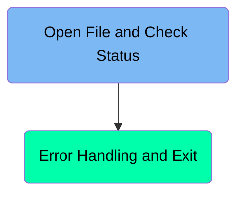
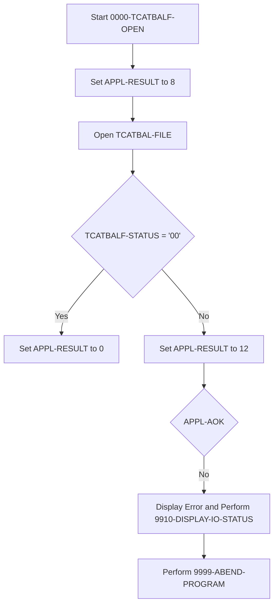
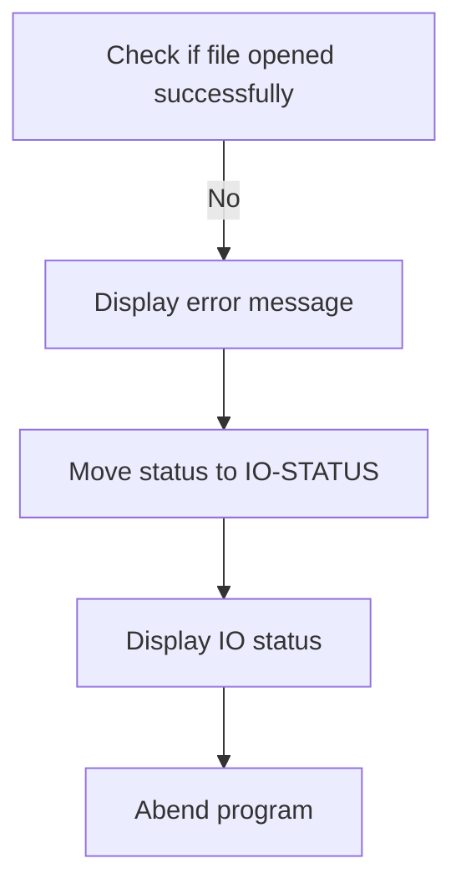

The <SwmToken path="app/cbl/CBACT04C.cbl" pos="2:7:7" line-data="      * Program     : CBACT04C.CBL                                      ">`CBACT04C`</SwmToken> program is responsible for opening the Transaction Category Balance file and checking its status. This program sets an initial application result, attempts to open the file, and handles any errors that occur during the process. If the file is successfully opened, the application result is updated accordingly. If an error occurs, the program displays an error message, updates the IO status, and abends the program to prevent further processing.

The <SwmToken path="app/cbl/CBACT04C.cbl" pos="2:7:7" line-data="      * Program     : CBACT04C.CBL                                      ">`CBACT04C`</SwmToken> program starts by setting an initial application result to indicate a default error state. It then attempts to open the Transaction Category Balance file. If the file opens successfully, the application result is updated to indicate success. If the file fails to open, the program displays an error message, updates the IO status to reflect the error, and abends the program to stop any further processing.

Here is a high level diagram of the program:



# Open File and Check Status



<SwmSnippet path="/app/cbl/CBACT04C.cbl" line="235">

---

## Setting Initial Application Result

First, the application result is set to 8, indicating a default error state before attempting to open the file.

```cobol
           MOVE 8 TO APPL-RESULT.                                               
           OPEN INPUT TCATBAL-FILE                                              
```

---

</SwmSnippet>

<SwmSnippet path="/app/cbl/CBACT04C.cbl" line="237">

---

## Opening the Transaction Category Balance File

Next, the transaction category balance file (<SwmToken path="app/cbl/CBACT04C.cbl" pos="236:5:7" line-data="           OPEN INPUT TCATBAL-FILE                                              ">`TCATBAL-FILE`</SwmToken>) is opened for input. This step is crucial for accessing the balance data.

```cobol
           IF  TCATBALF-STATUS = '00'                                           
```

---

</SwmSnippet>

<SwmSnippet path="/app/cbl/CBACT04C.cbl" line="238">

---

## Checking File Status

Then, the status of the file open operation is checked. If the status is '00' (indicating success), the application result is set to 0. Otherwise, it is set to 12, indicating an error.

```cobol
               MOVE 0 TO APPL-RESULT                                            
           ELSE                                                                 
               MOVE 12 TO APPL-RESULT                                           
           END-IF                                                               
           IF  APPL-AOK                                                         
```

---

</SwmSnippet>

<SwmSnippet path="/app/cbl/CBACT04C.cbl" line="243">

---

## Handling File Open Errors

If the application is not okay (<SwmToken path="app/cbl/CBACT04C.cbl" pos="242:3:5" line-data="           IF  APPL-AOK                                                         ">`APPL-AOK`</SwmToken>), an error message is displayed, the file status is moved to <SwmToken path="app/cbl/CBACT04C.cbl" pos="246:9:11" line-data="               MOVE TCATBALF-STATUS TO IO-STATUS                                ">`IO-STATUS`</SwmToken>, and the <SwmToken path="app/cbl/CBACT04C.cbl" pos="247:3:9" line-data="               PERFORM 9910-DISPLAY-IO-STATUS                                   ">`9910-DISPLAY-IO-STATUS`</SwmToken> and <SwmToken path="app/cbl/CBACT04C.cbl" pos="248:3:7" line-data="               PERFORM 9999-ABEND-PROGRAM                                       ">`9999-ABEND-PROGRAM`</SwmToken> routines are performed to handle the error.

```cobol
               CONTINUE                                                         
           ELSE                                                                 
               DISPLAY 'ERROR OPENING TRANSACTION CATEGORY BALANCE'             
               MOVE TCATBALF-STATUS TO IO-STATUS                                
               PERFORM 9910-DISPLAY-IO-STATUS                                   
               PERFORM 9999-ABEND-PROGRAM                                       
           END-IF                                                               
           EXIT.                                                                
```

---

</SwmSnippet>

<SwmSnippet path="/app/cbl/CBACT04C.cbl" line="636">

---

### Displaying IO Status

The <SwmToken path="app/cbl/CBACT04C.cbl" pos="247:3:9" line-data="               PERFORM 9910-DISPLAY-IO-STATUS                                   ">`9910-DISPLAY-IO-STATUS`</SwmToken> routine displays the file status. If the <SwmToken path="app/cbl/CBACT04C.cbl" pos="636:3:5" line-data="           IF  IO-STATUS NOT NUMERIC                                            ">`IO-STATUS`</SwmToken> is not numeric or <SwmToken path="app/cbl/CBACT04C.cbl" pos="637:3:5" line-data="           OR  IO-STAT1 = &#39;9&#39;                                                   ">`IO-STAT1`</SwmToken> is '9', it formats and displays the status accordingly.

```cobol
           IF  IO-STATUS NOT NUMERIC                                            
           OR  IO-STAT1 = '9'                                                   
               MOVE IO-STAT1 TO IO-STATUS-04(1:1)                               
               MOVE 0        TO TWO-BYTES-BINARY                                
               MOVE IO-STAT2 TO TWO-BYTES-RIGHT                                 
               MOVE TWO-BYTES-BINARY TO IO-STATUS-0403                          
               DISPLAY 'FILE STATUS IS: NNNN' IO-STATUS-04                      
           ELSE                                                                 
               MOVE '0000' TO IO-STATUS-04                                      
               MOVE IO-STATUS TO IO-STATUS-04(3:2)                              
               DISPLAY 'FILE STATUS IS: NNNN' IO-STATUS-04                      
           END-IF                                                               
           EXIT.                                                                
                                                                                
```

---

</SwmSnippet>

# Error Handling and Exit



<SwmSnippet path="/app/cbl/CBACT04C.cbl" line="244">

---

## Handling Errors During File Opening

First, the code checks if the transaction category balance file was opened successfully. If not, it proceeds to handle the error by displaying an error message, moving the status to <SwmToken path="app/cbl/CBACT04C.cbl" pos="246:9:11" line-data="               MOVE TCATBALF-STATUS TO IO-STATUS                                ">`IO-STATUS`</SwmToken>, displaying the IO status, and then abending the program.

```cobol
           ELSE                                                                 
               DISPLAY 'ERROR OPENING TRANSACTION CATEGORY BALANCE'             
               MOVE TCATBALF-STATUS TO IO-STATUS                                
               PERFORM 9910-DISPLAY-IO-STATUS                                   
               PERFORM 9999-ABEND-PROGRAM                                       
           END-IF                                                               
           EXIT.                                                                
      *---------------------------------------------------------------*         
       0100-XREFFILE-OPEN.                                                      
```

---

</SwmSnippet>

<SwmSnippet path="/app/cbl/CBACT04C.cbl" line="246">

---

### Displaying Error Message

If the file opening fails, an error message 'ERROR OPENING TRANSACTION CATEGORY BALANCE' is displayed to inform the user about the issue.

```cobol
               MOVE TCATBALF-STATUS TO IO-STATUS                                
```

---

</SwmSnippet>

<SwmSnippet path="/app/cbl/CBACT04C.cbl" line="247">

---

### Moving Status to <SwmToken path="app/cbl/CBACT04C.cbl" pos="247:7:9" line-data="               PERFORM 9910-DISPLAY-IO-STATUS                                   ">`IO-STATUS`</SwmToken>

The status of the file operation is moved to <SwmToken path="app/cbl/CBACT04C.cbl" pos="247:7:9" line-data="               PERFORM 9910-DISPLAY-IO-STATUS                                   ">`IO-STATUS`</SwmToken> to keep track of the error state.

```cobol
               PERFORM 9910-DISPLAY-IO-STATUS                                   
```

---

</SwmSnippet>

<SwmSnippet path="/app/cbl/CBACT04C.cbl" line="248">

---

### Displaying IO Status

The paragraph <SwmToken path="app/cbl/CBACT04C.cbl" pos="247:3:9" line-data="               PERFORM 9910-DISPLAY-IO-STATUS                                   ">`9910-DISPLAY-IO-STATUS`</SwmToken> is performed to display the current IO status, providing more details about the error.

```cobol
               PERFORM 9999-ABEND-PROGRAM                                       
```

---

</SwmSnippet>

<SwmSnippet path="/app/cbl/CBACT04C.cbl" line="241">

---

### Abending the Program

Finally, the paragraph <SwmToken path="app/cbl/CBACT04C.cbl" pos="248:3:7" line-data="               PERFORM 9999-ABEND-PROGRAM                                       ">`9999-ABEND-PROGRAM`</SwmToken> is performed to abend (abnormally end) the program, ensuring that no further processing occurs after the error.

```cobol
           END-IF                                                               
```

---

</SwmSnippet>

<SwmSnippet path="/app/cbl/CBACT04C.cbl" line="629">

---

### <SwmToken path="app/cbl/CBACT04C.cbl" pos="248:3:7" line-data="               PERFORM 9999-ABEND-PROGRAM                                       ">`9999-ABEND-PROGRAM`</SwmToken>

The <SwmToken path="app/cbl/CBACT04C.cbl" pos="248:3:7" line-data="               PERFORM 9999-ABEND-PROGRAM                                       ">`9999-ABEND-PROGRAM`</SwmToken> paragraph displays 'ABENDING PROGRAM', sets the timing to 0, sets the abend code to 999, and calls <SwmToken path="app/cbl/CBACT04C.cbl" pos="632:4:4" line-data="           CALL &#39;CEE3ABD&#39;.                                                      ">`CEE3ABD`</SwmToken> to abend the program.

```cobol
           DISPLAY 'ABENDING PROGRAM'                                           
           MOVE 0 TO TIMING                                                     
           MOVE 999 TO ABCODE                                                   
           CALL 'CEE3ABD'.                                                      
                                                                                
```

---

</SwmSnippet>

&nbsp;

*This is an auto-generated document by Swimm 🌊 and has not yet been verified by a human*

<SwmMeta version="3.0.0" repo-id="Z2l0aHViJTNBJTNBa3luZHJ5bC1hd3MtbWFpbmZyYW1lLW1vZGVybml6YXRpb24tY2FyZGRlbW8lM0ElM0FTd2ltbS1EZW1v" repo-name="kyndryl-aws-mainframe-modernization-carddemo"><sup>Powered by [Swimm](https://staging.swimm.cloud/)</sup></SwmMeta>
