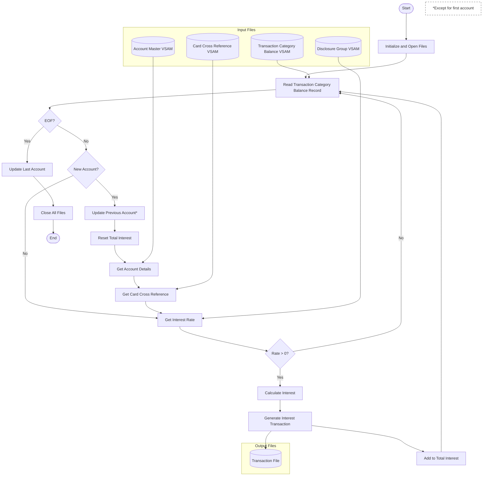

# Interest Calculator Batch Job Specification

## Overview

The Interest Calculator (CBACT04C) is a COBOL batch program that calculates interest charges for credit card accounts based on transaction category balances. It processes account balances, applies appropriate interest rates, and generates interest transactions.

## Input Files

1. **Transaction Category Balance File (TCATBALF)**

   - VSAM KSDS file

   - Contains account balances by transaction category

   - Key: Account ID (11 digits) + Transaction Type (2 chars) + Transaction Category (4 digits)

   - Record length: 50 bytes

2. **Card Cross Reference File (XREFFILE)**

   - VSAM KSDS file with alternate index

   - Maps between card numbers, customer IDs, and account IDs

   - Key: Card Number (16 chars)

   - Alternate Key: Account ID (11 digits)

   - Record length: 50 bytes

3. **Account Master File (ACCTFILE)**

   - VSAM KSDS file

   - Contains account details including balances and limits

   - Key: Account ID (11 digits)

   - Record length: 300 bytes

   - Opened in I-O mode for balance updates

4. **Disclosure Group File (DISCGRP)**

   - VSAM KSDS file

   - Contains interest rates by account group and transaction type

   - Key: Account Group ID (10 chars) + Transaction Type (2 chars) + Category Code (4 digits)

   - Record length: 50 bytes

## Output Files

1. **Transaction File (TRANSACT)**

   - Sequential file

   - Contains generated interest transactions

   - Record length: 350 bytes

## Processing Logic

1. **Initialization**

   - Opens all required files

   - Validates successful file operations

2. **Main Processing Loop**

   - Reads transaction category balance records sequentially

   - For each new account encountered:

     - Updates previous account's balances if not first record

     - Retrieves account details

     - Retrieves card cross-reference data

   - For each balance record:

     - Looks up interest rate from disclosure group

     - If interest rate is not zero:

       - Calculates monthly interest: (Balance × Rate) / 1200

       - Adds to total interest for account

       - Generates interest transaction record

3. **Interest Transaction Generation**

   - Creates unique transaction ID using date parameter and sequence

   - Sets transaction type '01' and category '05'

   - Records interest amount and relevant account/card details

   - Includes current timestamp for transaction dates

4. **Account Update**

   - Updates account master record when switching to new account:

     - Adds accumulated interest to current balance

     - Resets cycle credit/debit amounts to zero

5. **Error Handling**

   - Validates all file operations

   - Displays detailed error messages with file status

   - Terminates with abend code 999 on critical errors

## Input Parameters

- Date parameter in format YYYYMMDDHH required for transaction ID generation

## File Status Handling

- Validates status after each file operation

- Specific handling for end-of-file condition (status '10')

- Special handling for "record not found" in disclosure group (status '23')

<SwmMeta version="3.0.0" repo-id="Z2l0aHViJTNBJTNBa3luZHJ5bC1hd3MtbWFpbmZyYW1lLW1vZGVybml6YXRpb24tY2FyZGRlbW8lM0ElM0FTd2ltbS1EZW1v" repo-name="aws-mainframe-modernization-carddemo">Powered by [Swimm](https://app.swimm.io/)</SwmMeta>
