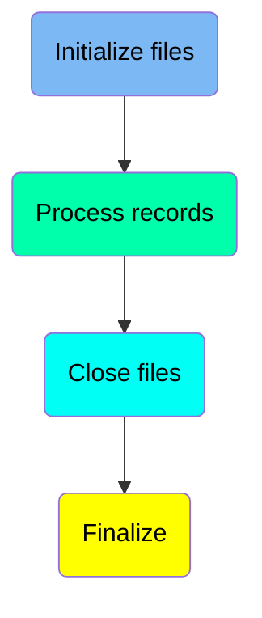
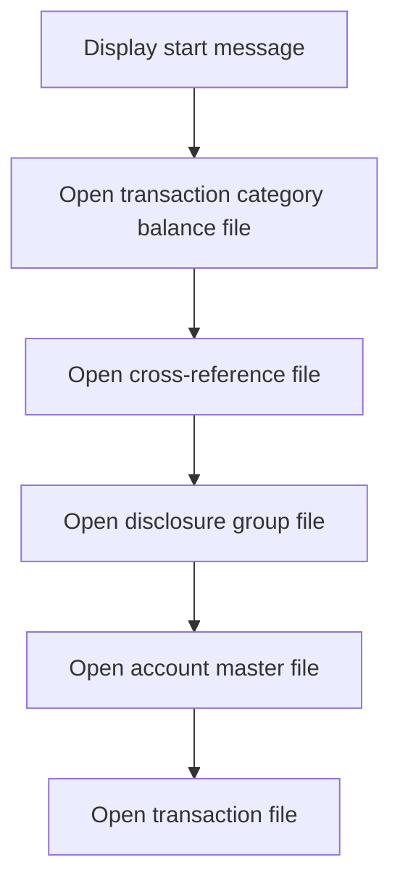
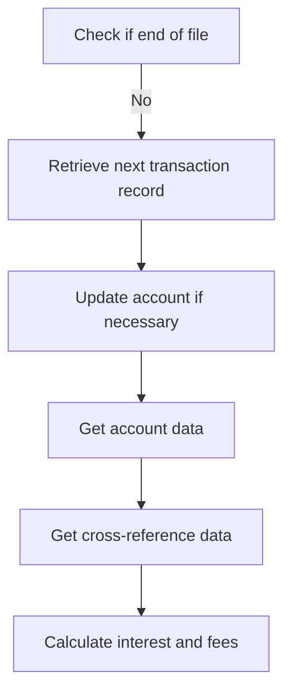
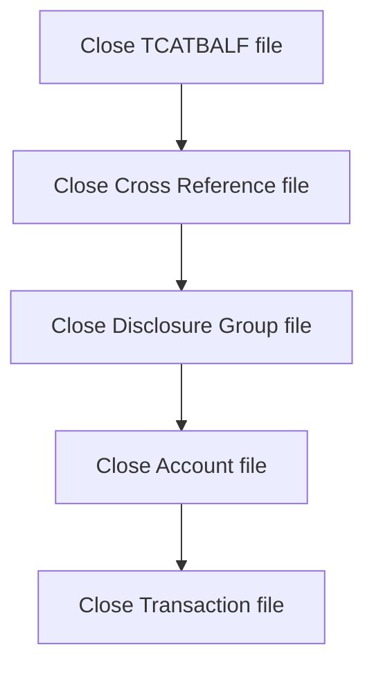
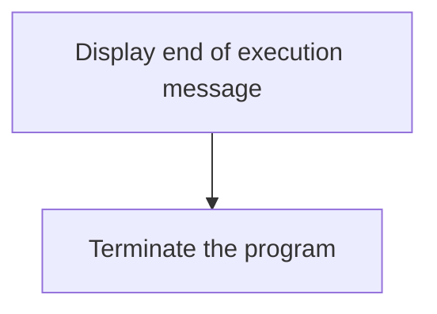

The Interest Calculator (<SwmToken path="app/cbl/CBACT04C.cbl" pos="182:14:14" line-data="           DISPLAY &#39;START OF EXECUTION OF PROGRAM CBACT04C&#39;.                    ">`CBACT04C`</SwmToken>) is a batch COBOL program designed to calculate interest for accounts within the <SwmToken path="app/cbl/CBACT04C.cbl" pos="3:7:7" line-data="      * Application : CardDemo                                          ">`CardDemo`</SwmToken> application. This program processes transaction and account data to compute the interest accrued over a period, updating the account balances accordingly. The flow involves initializing necessary files, processing records to calculate interest, and closing the files to ensure all data is properly saved.

The flow involves initializing files, processing records to calculate interest, and closing the files to ensure all data is properly saved. It starts by opening various files needed for the calculation, then processes each transaction record to update account balances with the calculated interest, and finally closes the files to finalize the data.

Here is a high level diagram of the program:



## Initialize files

First, we'll zoom into this section of the flow:



<SwmSnippet path="/app/cbl/CBACT04C.cbl" line="181">

---

The MAIN function begins by displaying a message indicating the start of the program execution. This helps in tracking the program's execution flow and is useful for debugging and monitoring purposes.

```cobol
       MAIN SECTION.                               
           DISPLAY 'START OF EXECUTION OF PROGRAM CBACT04C'.                    
```

---

</SwmSnippet>

<SwmSnippet path="/app/cbl/CBACT04C.cbl" line="183">

---

Next, the function opens the transaction category balance file. This file is essential for reading the balance of various transaction categories, which is crucial for calculating interest accurately.

```cobol
           PERFORM 0000-TCATBALF-OPEN.                                          
```

---

</SwmSnippet>

<SwmSnippet path="/app/cbl/CBACT04C.cbl" line="184">

---

The function then opens the cross-reference file. This file contains mappings between different account identifiers and is necessary for ensuring that transactions are correctly associated with the appropriate accounts.

```cobol
           PERFORM 0100-XREFFILE-OPEN.                                          
```

---

</SwmSnippet>

<SwmSnippet path="/app/cbl/CBACT04C.cbl" line="185">

---

Following this, the disclosure group file is opened. This file holds information about various disclosure groups, including interest rates, which are needed for the interest calculation process.

```cobol
           PERFORM 0200-DISCGRP-OPEN.                                           
```

---

</SwmSnippet>

<SwmSnippet path="/app/cbl/CBACT04C.cbl" line="186">

---

The account master file is then opened. This file contains detailed information about each account, including current balances and transaction histories, which are essential for calculating interest and updating account balances.

```cobol
           PERFORM 0300-ACCTFILE-OPEN.                                          
```

---

</SwmSnippet>

<SwmSnippet path="/app/cbl/CBACT04C.cbl" line="187">

---

Finally, the transaction file is opened for writing. This file will store the transaction records generated during the interest calculation process, ensuring that all transactions are properly recorded and can be referenced in future operations.

```cobol
           PERFORM 0400-TRANFILE-OPEN.                                          
```

---

</SwmSnippet>

## Process records

Now, lets zoom into this section of the flow:



<SwmSnippet path="/app/cbl/CBACT04C.cbl" line="189">

---

### Check if the end of the file has been reached

First, we check if the end of the file has been reached by evaluating the <SwmToken path="app/cbl/CBACT04C.cbl" pos="189:5:9" line-data="           PERFORM UNTIL END-OF-FILE = &#39;Y&#39;                                      ">`END-OF-FILE`</SwmToken> variable. If it is 'N', we proceed to retrieve the next transaction record.

```cobol
           PERFORM UNTIL END-OF-FILE = 'Y'                                      
               IF  END-OF-FILE = 'N'                                            
```

---

</SwmSnippet>

<SwmSnippet path="/app/cbl/CBACT04C.cbl" line="191">

---

### Retrieve the next transaction record

Next, we retrieve the next transaction record by performing the <SwmToken path="app/cbl/CBACT04C.cbl" pos="191:3:9" line-data="                   PERFORM 1000-TCATBALF-GET-NEXT                               ">`1000-TCATBALF-GET-NEXT`</SwmToken> operation. If the end of the file is still not reached, we increment the record count and display the transaction category balance record.

```cobol
                   PERFORM 1000-TCATBALF-GET-NEXT                               
                   IF  END-OF-FILE = 'N'                                        
                     ADD 1 TO WS-RECORD-COUNT                                   
                     DISPLAY TRAN-CAT-BAL-RECORD                                
```

---

</SwmSnippet>

## Interim Summary

So far, we saw how the program initializes various files necessary for processing transactions, including the transaction category balance file, cross-reference file, disclosure group file, account master file, and transaction file. We also explored the process of checking if the end of the file has been reached and retrieving the next transaction record. Now, we will focus on the steps involved in closing these files to ensure that all data is properly finalized and saved.

## Close files

Now, lets zoom into this section of the flow:



The first step is to close the TCATBALF file, which is essential for ensuring that all transactions related to the interest calculation are properly finalized and saved.

Next, the Cross Reference file is closed. This file likely contains mappings or references used during the interest calculation process, and closing it ensures that all references are properly stored.

The Disclosure Group file is then closed. This file might contain information related to disclosure requirements or groupings of accounts, and closing it ensures that all relevant data is saved.

Following that, the Account file is closed. This file holds the account details and balances, and closing it ensures that all updates to account balances from the interest calculation are properly recorded.

## Finalize

This is the next section of the flow.



<SwmSnippet path="/app/cbl/CBACT04C.cbl" line="231">

---

The program displays a message 'END OF EXECUTION OF PROGRAM <SwmToken path="app/cbl/CBACT04C.cbl" pos="231:14:14" line-data="           DISPLAY &#39;END OF EXECUTION OF PROGRAM CBACT04C&#39;.                      ">`CBACT04C`</SwmToken>' to indicate that the interest calculation process has completed. This message serves as a clear indicator to the user or system that the batch processing has finished successfully.

```cobol
           DISPLAY 'END OF EXECUTION OF PROGRAM CBACT04C'.                      
```

---

</SwmSnippet>

<SwmSnippet path="/app/cbl/CBACT04C.cbl" line="233">

---

After displaying the completion message, the program terminates its execution using the <SwmToken path="app/cbl/CBACT04C.cbl" pos="233:1:1" line-data="           GOBACK.                                                              ">`GOBACK`</SwmToken> statement. This ensures that all resources are properly released and the program ends gracefully.

```cobol
           GOBACK.                                                              
```

---

</SwmSnippet>

&nbsp;

*This is an auto-generated document by Swimm 🌊 and has not yet been verified by a human*

<SwmMeta version="3.0.0" repo-id="Z2l0aHViJTNBJTNBa3luZHJ5bC1hd3MtbWFpbmZyYW1lLW1vZGVybml6YXRpb24tY2FyZGRlbW8lM0ElM0FTd2ltbS1EZW1v" repo-name="kyndryl-aws-mainframe-modernization-carddemo"><sup>Powered by [Swimm](/)</sup></SwmMeta>
