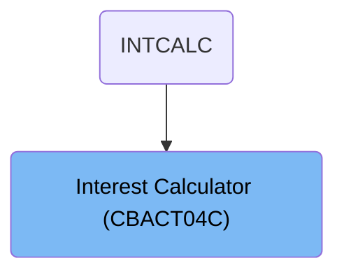
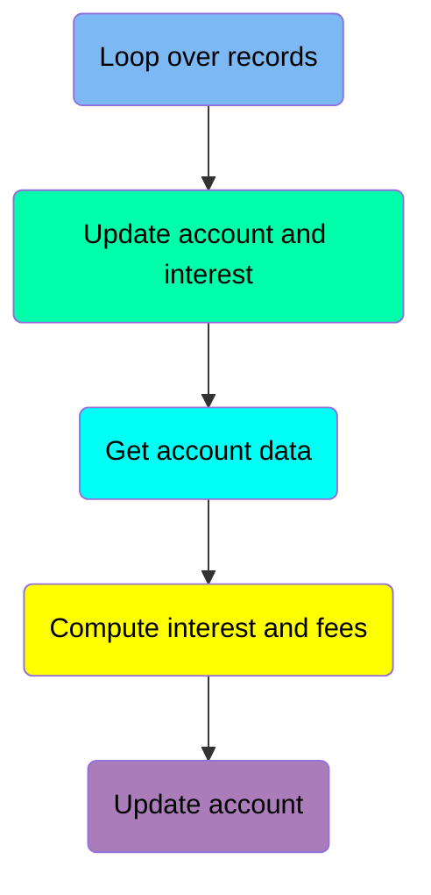
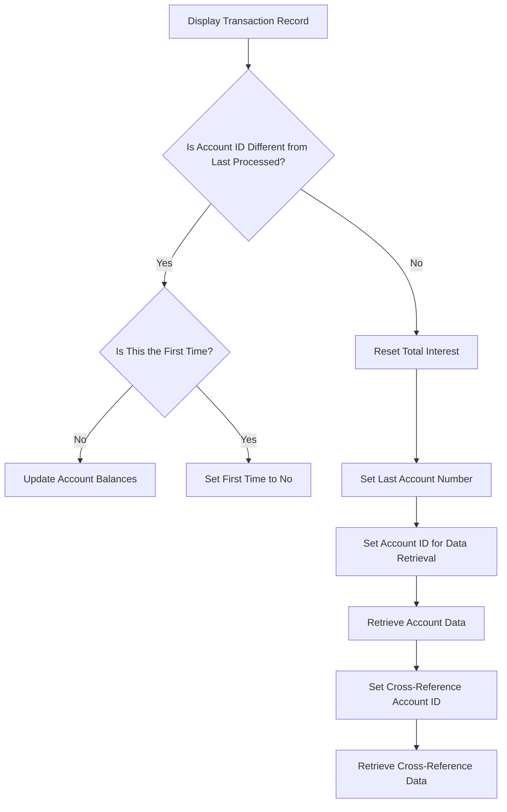
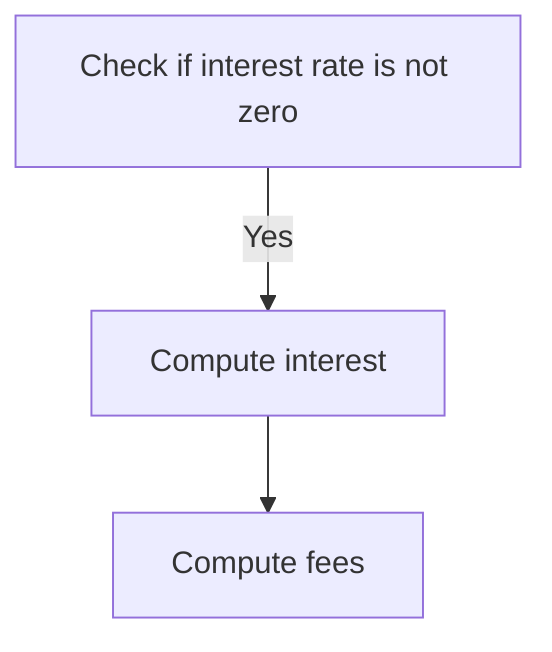
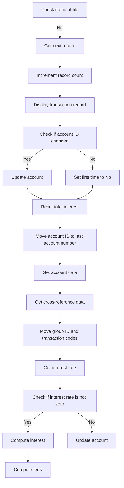
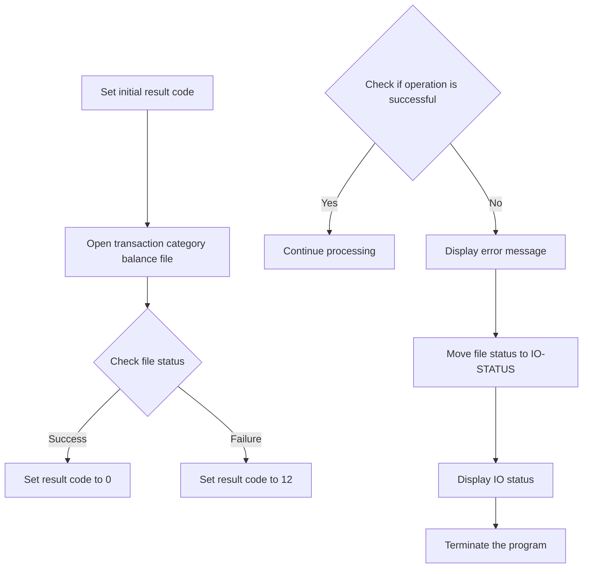
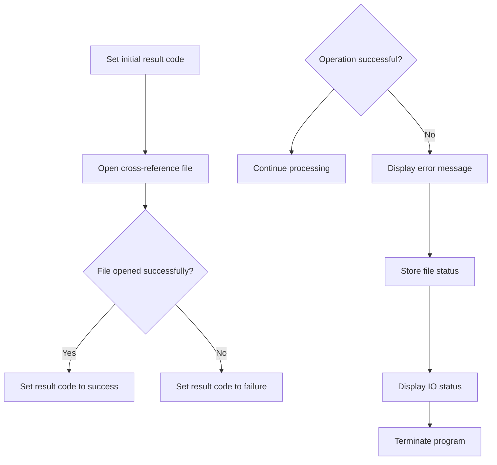
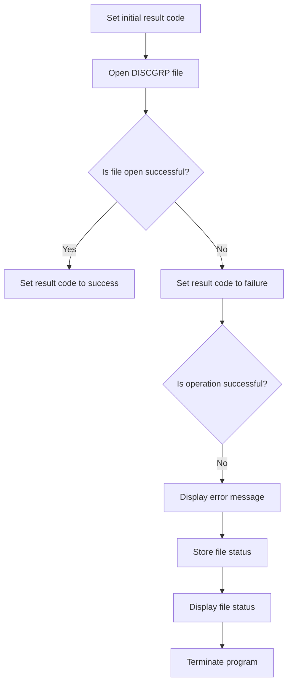

```mermaid
graph TD
  A[Check if IO-STATUS is numeric or IO-STAT1 is '9'] -->|Yes| B[Move IO-STAT1 to IO-STATUS-04]
  B --> C[Move 0 to TWO-BYTES-BINARY]
  C --> D[Move IO-STAT2 to TWO-BYTES-RIGHT]
  D --> E[Move TWO-BYTES-BINARY to IO-STATUS-0403]
  E --> F[Display 'FILE STATUS IS: NNNN' with IO-STATUS-04]
  A -->|No| G[Move '0000' to IO-STATUS-04]
  G --> H[Move IO-STATUS to IO-STATUS-04]
  H --> I[Display 'FILE STATUS IS: NNNN' with IO-STATUS-04]

%% Swimm:
%% graph TD
%%   A[Check if <SwmToken path="app/cbl/CBACT04C.cbl" pos="246:9:11" line-data="               MOVE TCATBALF-STATUS TO IO-STATUS                                ">`IO-STATUS`</SwmToken> is numeric or <SwmToken path="app/cbl/CBACT04C.cbl" pos="637:3:5" line-data="           OR  IO-STAT1 = &#39;9&#39;                                                   ">`IO-STAT1`</SwmToken> is '9'] -->|Yes| B[Move <SwmToken path="app/cbl/CBACT04C.cbl" pos="637:3:5" line-data="           OR  IO-STAT1 = &#39;9&#39;                                                   ">`IO-STAT1`</SwmToken> to <SwmToken path="app/cbl/CBACT04C.cbl" pos="638:9:13" line-data="               MOVE IO-STAT1 TO IO-STATUS-04(1:1)                               ">`IO-STATUS-04`</SwmToken>]
%%   B --> C[Move 0 to <SwmToken path="app/cbl/CBACT04C.cbl" pos="639:7:11" line-data="               MOVE 0        TO TWO-BYTES-BINARY                                ">`TWO-BYTES-BINARY`</SwmToken>]
%%   C --> D[Move <SwmToken path="app/cbl/CBACT04C.cbl" pos="640:3:5" line-data="               MOVE IO-STAT2 TO TWO-BYTES-RIGHT                                 ">`IO-STAT2`</SwmToken> to <SwmToken path="app/cbl/CBACT04C.cbl" pos="640:9:13" line-data="               MOVE IO-STAT2 TO TWO-BYTES-RIGHT                                 ">`TWO-BYTES-RIGHT`</SwmToken>]
%%   D --> E[Move <SwmToken path="app/cbl/CBACT04C.cbl" pos="639:7:11" line-data="               MOVE 0        TO TWO-BYTES-BINARY                                ">`TWO-BYTES-BINARY`</SwmToken> to <SwmToken path="app/cbl/CBACT04C.cbl" pos="641:11:15" line-data="               MOVE TWO-BYTES-BINARY TO IO-STATUS-0403                          ">`IO-STATUS-0403`</SwmToken>]
%%   E --> F[Display 'FILE STATUS IS: NNNN' with <SwmToken path="app/cbl/CBACT04C.cbl" pos="638:9:13" line-data="               MOVE IO-STAT1 TO IO-STATUS-04(1:1)                               ">`IO-STATUS-04`</SwmToken>]
%%   A -->|No| G[Move '0000' to <SwmToken path="app/cbl/CBACT04C.cbl" pos="638:9:13" line-data="               MOVE IO-STAT1 TO IO-STATUS-04(1:1)                               ">`IO-STATUS-04`</SwmToken>]
%%   G --> H[Move <SwmToken path="app/cbl/CBACT04C.cbl" pos="246:9:11" line-data="               MOVE TCATBALF-STATUS TO IO-STATUS                                ">`IO-STATUS`</SwmToken> to <SwmToken path="app/cbl/CBACT04C.cbl" pos="638:9:13" line-data="               MOVE IO-STAT1 TO IO-STATUS-04(1:1)                               ">`IO-STATUS-04`</SwmToken>]
%%   H --> I[Display 'FILE STATUS IS: NNNN' with <SwmToken path="app/cbl/CBACT04C.cbl" pos="638:9:13" line-data="               MOVE IO-STAT1 TO IO-STATUS-04(1:1)                               ">`IO-STATUS-04`</SwmToken>]
```

The <SwmToken path="app/cbl/CBACT04C.cbl" pos="2:7:7" line-data="      * Program     : CBACT04C.CBL                                      ">`CBACT04C`</SwmToken> program is a batch COBOL program designed to calculate interest within the <SwmToken path="app/cbl/CBACT04C.cbl" pos="3:7:7" line-data="      * Application : CardDemo                                          ">`CardDemo`</SwmToken> application. This document details the flow starting from `INTCALC`, showing how the program processes transaction records, updates account balances, and computes interest and fees.

For instance, when processing a batch of transaction records, the program loops over each record, retrieves account data, computes the interest and fees, and updates the account balances accordingly.

# Where is this program used?

This program is used once, in a flow starting from `INTCALC` as represented in the following diagram:



Here is a high level diagram of the program:



## Loop over records

<SwmSnippet path="/app/cbl/CBACT04C.cbl" line="188">

---

Diving into the code snippet, it processes transaction records by repeatedly checking if there are more records to read. If there are, it retrieves the next record and increments the count of processed records.

```cobol
           PERFORM UNTIL END-OF-FILE = 'Y'                                      
               IF  END-OF-FILE = 'N'                                            
                   PERFORM 1000-TCATBALF-GET-NEXT                               
                   IF  END-OF-FILE = 'N'                                        
                     ADD 1 TO WS-RECORD-COUNT                                   
```

---

</SwmSnippet>

## Update account and interest

Now, lets zoom into this section of the flow:



<SwmSnippet path="/app/cbl/CBACT04C.cbl" line="193">

---

### Displaying Transaction Record and Checking Account ID

Going into the first snippet, the code displays the transaction record and checks if the current account ID is different from the last processed account ID. If it is different and it's not the first time processing, it updates the account balances. Otherwise, it sets the first-time flag to 'No'.

```cobol
                     DISPLAY TRAN-CAT-BAL-RECORD                                
                     IF TRANCAT-ACCT-ID NOT= WS-LAST-ACCT-NUM                   
                       IF WS-FIRST-TIME NOT = 'Y'                               
                          PERFORM 1050-UPDATE-ACCOUNT                           
                       ELSE                                                     
                          MOVE 'N' TO WS-FIRST-TIME                             
                       END-IF                                                   
```

---

</SwmSnippet>

<SwmSnippet path="/app/cbl/CBACT04C.cbl" line="200">

---

### Resetting Interest and Retrieving Account Data

Next, the code resets the total interest and sets the last account number to the current account ID. It then sets the account ID for data retrieval and performs the necessary operations to retrieve account and cross-reference data.

```cobol
                       MOVE 0 TO WS-TOTAL-INT                                   
                       MOVE TRANCAT-ACCT-ID TO WS-LAST-ACCT-NUM                 
                       MOVE TRANCAT-ACCT-ID TO FD-ACCT-ID                       
                       PERFORM 1100-GET-ACCT-DATA                               
                       MOVE TRANCAT-ACCT-ID TO FD-XREF-ACCT-ID                  
                       PERFORM 1110-GET-XREF-DATA                               
```

---

</SwmSnippet>

## Get account data

<SwmSnippet path="/app/cbl/CBACT04C.cbl" line="203">

---

Going into the snippet, the code first retrieves the account data. It then sets up the cross-reference account ID and retrieves the cross-reference data.

```cobol
                       PERFORM 1100-GET-ACCT-DATA                               
                       MOVE TRANCAT-ACCT-ID TO FD-XREF-ACCT-ID                  
                       PERFORM 1110-GET-XREF-DATA                               
```

---

</SwmSnippet>

## Compute interest and fees

Now, lets zoom into this section of the flow:



<SwmSnippet path="/app/cbl/CBACT04C.cbl" line="206">

---

### Moving account and transaction details

Going into the snippet, the code transfers the account group ID, transaction category code, and transaction type code to their respective fields for further processing. It then calls the function to retrieve the interest rate for the transaction.

```cobol
                     END-IF                                                     
      *              DISPLAY 'ACCT-GROUP-ID: ' ACCT-GROUP-ID                    
      *              DISPLAY 'TRANCAT-CD: ' TRANCAT-CD                          
      *              DISPLAY 'TRANCAT-TYPE-CD: ' TRANCAT-TYPE-CD                
                     MOVE ACCT-GROUP-ID TO FD-DIS-ACCT-GROUP-ID                 
                     MOVE TRANCAT-CD TO FD-DIS-TRAN-CAT-CD                      
                     MOVE TRANCAT-TYPE-CD TO FD-DIS-TRAN-TYPE-CD                
                     PERFORM 1200-GET-INTEREST-RATE                             
```

---

</SwmSnippet>

<SwmSnippet path="/app/cbl/CBACT04C.cbl" line="214">

---

### Calculating interest and fees

Now, the code checks if the discount interest rate is not zero. If it is not zero, it proceeds to calculate the interest and then compute the fees for the transaction.

```cobol
                     IF DIS-INT-RATE NOT = 0                                    
                       PERFORM 1300-COMPUTE-INTEREST                            
                       PERFORM 1400-COMPUTE-FEES                                
                     END-IF                                                     
```

---

</SwmSnippet>

## Update account

Now, lets zoom into this section of the flow:



<SwmSnippet path="/app/cbl/CBACT04C.cbl" line="218">

---

### Updating account when end of file is reached

Next, the code checks if the end of the file has been reached. If it has not, it proceeds to update the account balances to reflect posted transactions. This involves resetting cycle credits and debits and rewriting the updated account record. This ensures that the account information is up-to-date and accurate.

```cobol
                   END-IF                                                       
               ELSE                                                             
                    PERFORM 1050-UPDATE-ACCOUNT                                 
               END-IF                                                           
           END-PERFORM.                                                         
```

---

</SwmSnippet>

# Open Transaction Category Balance File (<SwmToken path="app/cbl/CBACT04C.cbl" pos="234:1:5" line-data="       0000-TCATBALF-OPEN.                                                      ">`0000-TCATBALF-OPEN`</SwmToken>)

Lets' zoom into the program flow:



<SwmSnippet path="/app/cbl/CBACT04C.cbl" line="234">

---

Going into the first snippet, the code sets an initial result code and attempts to open the transaction category balance file. If the file is successfully opened, the result code is updated to indicate success. Otherwise, it is set to indicate a failure in opening the file.

```cobol
       0000-TCATBALF-OPEN.                                                      
           MOVE 8 TO APPL-RESULT.                                               
           OPEN INPUT TCATBAL-FILE                                              
           IF  TCATBALF-STATUS = '00'                                           
               MOVE 0 TO APPL-RESULT                                            
           ELSE                                                                 
               MOVE 12 TO APPL-RESULT                                           
           END-IF                                                               
```

---

</SwmSnippet>

<SwmSnippet path="/app/cbl/CBACT04C.cbl" line="242">

---

Next, the code checks if the operation was successful. If it was not, it displays an error message, updates the IO status, and performs routines to display the IO status and terminate the program abruptly.

```cobol
           IF  APPL-AOK                                                         
               CONTINUE                                                         
           ELSE                                                                 
               DISPLAY 'ERROR OPENING TRANSACTION CATEGORY BALANCE'             
               MOVE TCATBALF-STATUS TO IO-STATUS                                
               PERFORM 9910-DISPLAY-IO-STATUS                                   
               PERFORM 9999-ABEND-PROGRAM                                       
           END-IF                                                               
           EXIT.                                                                
```

---

</SwmSnippet>

# Display File Status (<SwmToken path="app/cbl/CBACT04C.cbl" pos="247:3:9" line-data="               PERFORM 9910-DISPLAY-IO-STATUS                                   ">`9910-DISPLAY-IO-STATUS`</SwmToken>)

Lets' zoom into the program flow:



<SwmSnippet path="/app/cbl/CBACT04C.cbl" line="635">

---

### Displaying File Operation Status

Diving into the function, it first checks if the file operation status is either non-numeric or indicates a specific error. If so, it processes the status to display a detailed error message. Otherwise, it sets a default success status and displays it.

```cobol
       9910-DISPLAY-IO-STATUS.                                                  
           IF  IO-STATUS NOT NUMERIC                                            
           OR  IO-STAT1 = '9'                                                   
               MOVE IO-STAT1 TO IO-STATUS-04(1:1)                               
               MOVE 0        TO TWO-BYTES-BINARY                                
               MOVE IO-STAT2 TO TWO-BYTES-RIGHT                                 
               MOVE TWO-BYTES-BINARY TO IO-STATUS-0403                          
               DISPLAY 'FILE STATUS IS: NNNN' IO-STATUS-04                      
           ELSE                                                                 
               MOVE '0000' TO IO-STATUS-04                                      
               MOVE IO-STATUS TO IO-STATUS-04(3:2)                              
               DISPLAY 'FILE STATUS IS: NNNN' IO-STATUS-04                      
           END-IF                                                               
           EXIT.                                                                
```

---

</SwmSnippet>

# Open Cross-Reference File (<SwmToken path="app/cbl/CBACT04C.cbl" pos="252:1:5" line-data="       0100-XREFFILE-OPEN.                                                      ">`0100-XREFFILE-OPEN`</SwmToken>)

Lets' zoom into the program flow:



<SwmSnippet path="/app/cbl/CBACT04C.cbl" line="252">

---

### Setting initial result code and opening the file

Going into the first part of the function, the initial result code is set to indicate a pending operation. The function then attempts to open the cross-reference file for reading. If the file opens successfully, the result code is updated to indicate success. Otherwise, the result code is set to indicate failure.

```cobol
       0100-XREFFILE-OPEN.                                                      
           MOVE 8 TO APPL-RESULT.                                               
           OPEN INPUT XREF-FILE                                                 
           IF  XREFFILE-STATUS = '00'                                           
               MOVE 0 TO APPL-RESULT                                            
           ELSE                                                                 
               MOVE 12 TO APPL-RESULT                                           
           END-IF                                                               
```

---

</SwmSnippet>

<SwmSnippet path="/app/cbl/CBACT04C.cbl" line="260">

---

### Handling the result of the file open operation

Next, the function checks if the operation was successful. If the operation was successful, it continues processing. Otherwise, it displays an error message, stores the file status, displays the IO status, and then terminates the program.

```cobol
           IF  APPL-AOK                                                         
               CONTINUE                                                         
           ELSE                                                                 
               DISPLAY 'ERROR OPENING CROSS REF FILE'   XREFFILE-STATUS         
               MOVE XREFFILE-STATUS TO IO-STATUS                                
               PERFORM 9910-DISPLAY-IO-STATUS                                   
               PERFORM 9999-ABEND-PROGRAM                                       
           END-IF                                                               
           EXIT.                                                                
```

---

</SwmSnippet>

# Open File (<SwmToken path="app/cbl/CBACT04C.cbl" pos="270:1:5" line-data="       0200-DISCGRP-OPEN.                                                       ">`0200-DISCGRP-OPEN`</SwmToken>)

Lets' zoom into the program flow:



<SwmSnippet path="/app/cbl/CBACT04C.cbl" line="270">

---

### Opening the DISCGRP file

Going into the first snippet, the code sets an initial result code to indicate a pending operation. It then attempts to open the DISCGRP file for input. If the file opens successfully, the result code is updated to indicate success. Otherwise, the result code is set to indicate a failure.

```cobol
       0200-DISCGRP-OPEN.                                                       
           MOVE 8 TO APPL-RESULT.                                               
           OPEN INPUT DISCGRP-FILE                                              
           IF  DISCGRP-STATUS = '00'                                            
               MOVE 0 TO APPL-RESULT                                            
           ELSE                                                                 
               MOVE 12 TO APPL-RESULT                                           
           END-IF                                                               
```

---

</SwmSnippet>

<SwmSnippet path="/app/cbl/CBACT04C.cbl" line="278">

---

### Handling file open errors

Next, the code checks if the operation was successful. If not, it displays an error message indicating that there was an issue opening the DISCGRP file. It then stores the file status and calls a function to display this status. Finally, it terminates the program to prevent further processing.

```cobol
           IF  APPL-AOK                                                         
               CONTINUE                                                         
           ELSE                                                                 
               DISPLAY 'ERROR OPENING DALY REJECTS FILE'                        
               MOVE DISCGRP-STATUS TO IO-STATUS                                 
               PERFORM 9910-DISPLAY-IO-STATUS                                   
               PERFORM 9999-ABEND-PROGRAM                                       
           END-IF                                                               
           EXIT.                                                                
```

---

</SwmSnippet>

&nbsp;

*This is an auto-generated document by Swimm 🌊 and has not yet been verified by a human*

<SwmMeta version="3.0.0" repo-id="Z2l0aHViJTNBJTNBa3luZHJ5bC1hd3MtbWFpbmZyYW1lLW1vZGVybml6YXRpb24tY2FyZGRlbW8lM0ElM0FTd2ltbS1EZW1v" repo-name="kyndryl-aws-mainframe-modernization-carddemo"><sup>Powered by [Swimm](/)</sup></SwmMeta>
