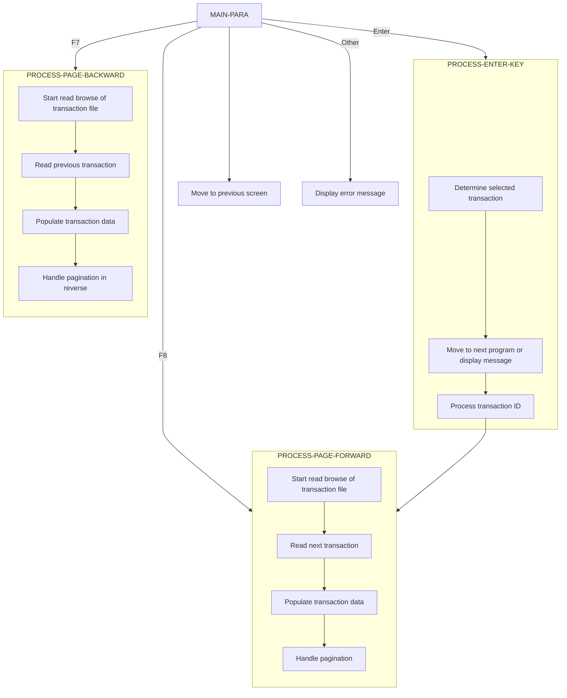

In the CardDemo application, users are presented with a list of transactions and can navigate through these listings using pagination. The document outlines handling user inputs, processing transactions, and managing pagination.



<SwmSnippet path="/app/cbl/COTRN00C.cbl" line="118" repo-id="Z2l0aHViJTNBJTNBa3luZHJ5bC1hd3MtbWFpbmZyYW1lLW1vZGVybml6YXRpb24tY2FyZGRlbW8lM0ElM0FTd2ltbS1EZW1v">

---

## <SwmToken path="/app/cbl/COTRN00C.cbl" pos="95:1:3" line-data="       MAIN-PARA." repo-id="Z2l0aHViJTNBJTNBa3luZHJ5bC1hd3MtbWFpbmZyYW1lLW1vZGVybml6YXRpb24tY2FyZGRlbW8lM0ElM0FTd2ltbS1EZW1v" repo-name="aws-mainframe-modernization-carddemo">`MAIN-PARA`</SwmToken>

The <SwmToken path="/app/cbl/COTRN00C.cbl" pos="95:1:3" line-data="       MAIN-PARA." repo-id="Z2l0aHViJTNBJTNBa3luZHJ5bC1hd3MtbWFpbmZyYW1lLW1vZGVybml6YXRpb24tY2FyZGRlbW8lM0ElM0FTd2ltbS1EZW1v" repo-name="aws-mainframe-modernization-carddemo">`MAIN-PARA`</SwmToken> handles the initialization and main flow control for displaying and managing a transaction list screen. It evaluates the user input (<SwmToken path="/app/cbl/COUSR00C.cbl" pos="122:3:3" line-data="                   EVALUATE EIBAID" repo-id="Z2l0aHViJTNBJTNBa3luZHJ5bC1hd3MtbWFpbmZyYW1lLW1vZGVybml6YXRpb24tY2FyZGRlbW8lM0ElM0FTd2ltbS1EZW1v" repo-name="aws-mainframe-modernization-carddemo">`EIBAID`</SwmToken>) to determine the next action:

- If the user presses the Enter key (<SwmToken path="/app/cbl/COUSR00C.cbl" pos="123:3:3" line-data="                       WHEN DFHENTER" repo-id="Z2l0aHViJTNBJTNBa3luZHJ5bC1hd3MtbWFpbmZyYW1lLW1vZGVybml6YXRpb24tY2FyZGRlbW8lM0ElM0FTd2ltbS1EZW1v" repo-name="aws-mainframe-modernization-carddemo">`DFHENTER`</SwmToken>), it performs the <SwmToken path="/app/cbl/COUSR00C.cbl" pos="124:3:7" line-data="                           PERFORM PROCESS-ENTER-KEY" repo-id="Z2l0aHViJTNBJTNBa3luZHJ5bC1hd3MtbWFpbmZyYW1lLW1vZGVybml6YXRpb24tY2FyZGRlbW8lM0ElM0FTd2ltbS1EZW1v" repo-name="aws-mainframe-modernization-carddemo">`PROCESS-ENTER-KEY`</SwmToken> function to show a transaction (<SwmLink doc-title="View Transaction (COTRN01C)" repo-id="Z2l0aHViJTNBJTNBa3luZHJ5bC1hd3MtbWFpbmZyYW1lLW1vZGVybml6YXRpb24tY2FyZGRlbW8lM0ElM0FTd2ltbS1EZW1v" repo-name="aws-mainframe-modernization-carddemo" path="/.swm/view-transaction-cotrn01c.7an4bkg7.sw.md">[View Transaction (COTRN01C)](https://app.swimm.io/repos/Z2l0aHViJTNBJTNBa3luZHJ5bC1hd3MtbWFpbmZyYW1lLW1vZGVybml6YXRpb24tY2FyZGRlbW8lM0ElM0FTd2ltbS1EZW1v/docs/7an4bkg7)</SwmLink>).&nbsp;
- If the user presses the PF3 key (<SwmToken path="/app/cbl/COUSR00C.cbl" pos="125:3:3" line-data="                       WHEN DFHPF3" repo-id="Z2l0aHViJTNBJTNBa3luZHJ5bC1hd3MtbWFpbmZyYW1lLW1vZGVybml6YXRpb24tY2FyZGRlbW8lM0ElM0FTd2ltbS1EZW1v" repo-name="aws-mainframe-modernization-carddemo">`DFHPF3`</SwmToken>), it performs the <SwmToken path="/app/cbl/COUSR00C.cbl" pos="127:3:9" line-data="                           PERFORM RETURN-TO-PREV-SCREEN" repo-id="Z2l0aHViJTNBJTNBa3luZHJ5bC1hd3MtbWFpbmZyYW1lLW1vZGVybml6YXRpb24tY2FyZGRlbW8lM0ElM0FTd2ltbS1EZW1v" repo-name="aws-mainframe-modernization-carddemo">`RETURN-TO-PREV-SCREEN`</SwmToken> which navigates to the <SwmToken path="/app/cbl/COTRN00C.cbl" pos="123:4:4" line-data="                           MOVE &#39;COMEN01C&#39; TO CDEMO-TO-PROGRAM" repo-id="Z2l0aHViJTNBJTNBa3luZHJ5bC1hd3MtbWFpbmZyYW1lLW1vZGVybml6YXRpb24tY2FyZGRlbW8lM0ElM0FTd2ltbS1EZW1v" repo-name="aws-mainframe-modernization-carddemo">`COMEN01C`</SwmToken> program which shows the main menu.
- If the user presses the `PF7` key (<SwmToken path="/app/cbl/COUSR00C.cbl" pos="128:3:3" line-data="                       WHEN DFHPF7" repo-id="Z2l0aHViJTNBJTNBa3luZHJ5bC1hd3MtbWFpbmZyYW1lLW1vZGVybml6YXRpb24tY2FyZGRlbW8lM0ElM0FTd2ltbS1EZW1v" repo-name="aws-mainframe-modernization-carddemo">`DFHPF7`</SwmToken>), it performs the <SwmToken path="/app/cbl/COUSR00C.cbl" pos="237:1:5" line-data="       PROCESS-PF7-KEY." repo-id="Z2l0aHViJTNBJTNBa3luZHJ5bC1hd3MtbWFpbmZyYW1lLW1vZGVybml6YXRpb24tY2FyZGRlbW8lM0ElM0FTd2ltbS1EZW1v" repo-name="aws-mainframe-modernization-carddemo">`PROCESS-PF7-KEY`</SwmToken> function to handle page backward navigation.&nbsp;
- If the user presses the PF8 key (<SwmToken path="/app/cbl/COUSR00C.cbl" pos="130:3:3" line-data="                       WHEN DFHPF8" repo-id="Z2l0aHViJTNBJTNBa3luZHJ5bC1hd3MtbWFpbmZyYW1lLW1vZGVybml6YXRpb24tY2FyZGRlbW8lM0ElM0FTd2ltbS1EZW1v" repo-name="aws-mainframe-modernization-carddemo">`DFHPF8`</SwmToken>), it performs the <SwmToken path="/app/cbl/COUSR00C.cbl" pos="131:3:7" line-data="                           PERFORM PROCESS-PF8-KEY" repo-id="Z2l0aHViJTNBJTNBa3luZHJ5bC1hd3MtbWFpbmZyYW1lLW1vZGVybml6YXRpb24tY2FyZGRlbW8lM0ElM0FTd2ltbS1EZW1v" repo-name="aws-mainframe-modernization-carddemo">`PROCESS-PF8-KEY`</SwmToken> function to handle page forward navigation.&nbsp;
- For any other input, it calls the <SwmToken path="/app/cbl/COTRN00C.cbl" pos="133:3:7" line-data="                           PERFORM SEND-TRNLST-SCREEN" repo-id="Z2l0aHViJTNBJTNBa3luZHJ5bC1hd3MtbWFpbmZyYW1lLW1vZGVybml6YXRpb24tY2FyZGRlbW8lM0ElM0FTd2ltbS1EZW1v" repo-name="aws-mainframe-modernization-carddemo">`SEND-TRNLST-SCREEN`</SwmToken> operation to show an error.

```
                   PERFORM RECEIVE-TRNLST-SCREEN
                   EVALUATE EIBAID
                       WHEN DFHENTER
                           PERFORM PROCESS-ENTER-KEY
                       WHEN DFHPF3
                           MOVE 'COMEN01C' TO CDEMO-TO-PROGRAM
                           PERFORM RETURN-TO-PREV-SCREEN
                       WHEN DFHPF7
                           PERFORM PROCESS-PF7-KEY
                       WHEN DFHPF8
                           PERFORM PROCESS-PF8-KEY
                       WHEN OTHER
                           MOVE 'Y'                       TO WS-ERR-FLG
                           MOVE -1       TO TRNIDINL OF COTRN0AI
                           MOVE CCDA-MSG-INVALID-KEY      TO WS-MESSAGE
                           PERFORM SEND-TRNLST-SCREEN
```

---

</SwmSnippet>

<SwmSnippet path="/app/cbl/COTRN00C.cbl" line="148" repo-id="Z2l0aHViJTNBJTNBa3luZHJ5bC1hd3MtbWFpbmZyYW1lLW1vZGVybml6YXRpb24tY2FyZGRlbW8lM0ElM0FTd2ltbS1EZW1v">

---

## <SwmToken path="/app/cbl/COUSR00C.cbl" pos="124:3:7" line-data="                           PERFORM PROCESS-ENTER-KEY" repo-id="Z2l0aHViJTNBJTNBa3luZHJ5bC1hd3MtbWFpbmZyYW1lLW1vZGVybml6YXRpb24tY2FyZGRlbW8lM0ElM0FTd2ltbS1EZW1v" repo-name="aws-mainframe-modernization-carddemo">`PROCESS-ENTER-KEY`</SwmToken>

The <SwmToken path="/app/cbl/COUSR00C.cbl" pos="124:3:7" line-data="                           PERFORM PROCESS-ENTER-KEY" repo-id="Z2l0aHViJTNBJTNBa3luZHJ5bC1hd3MtbWFpbmZyYW1lLW1vZGVybml6YXRpb24tY2FyZGRlbW8lM0ElM0FTd2ltbS1EZW1v" repo-name="aws-mainframe-modernization-carddemo">`PROCESS-ENTER-KEY`</SwmToken> function handles the input from the Enter key to select a transaction. It evaluates which transaction has been selected by checking various selection flags (<SwmToken path="/app/cbl/COTRN00C.cbl" pos="149:3:3" line-data="               WHEN SEL0001I OF COTRN0AI NOT = SPACES AND LOW-VALUES" repo-id="Z2l0aHViJTNBJTNBa3luZHJ5bC1hd3MtbWFpbmZyYW1lLW1vZGVybml6YXRpb24tY2FyZGRlbW8lM0ElM0FTd2ltbS1EZW1v" repo-name="aws-mainframe-modernization-carddemo">`SEL0001I`</SwmToken> to <SwmToken path="/app/cbl/COTRN00C.cbl" pos="176:3:3" line-data="               WHEN SEL0010I OF COTRN0AI NOT = SPACES AND LOW-VALUES" repo-id="Z2l0aHViJTNBJTNBa3luZHJ5bC1hd3MtbWFpbmZyYW1lLW1vZGVybml6YXRpb24tY2FyZGRlbW8lM0ElM0FTd2ltbS1EZW1v" repo-name="aws-mainframe-modernization-carddemo">`SEL0010I`</SwmToken>). If a transaction is selected, it moves the transaction ID to <SwmToken path="/app/cbl/COTRN00C.cbl" pos="151:11:17" line-data="                   MOVE TRNID01I OF COTRN0AI TO CDEMO-CT00-TRN-SELECTED" repo-id="Z2l0aHViJTNBJTNBa3luZHJ5bC1hd3MtbWFpbmZyYW1lLW1vZGVybml6YXRpb24tY2FyZGRlbW8lM0ElM0FTd2ltbS1EZW1v" repo-name="aws-mainframe-modernization-carddemo">`CDEMO-CT00-TRN-SELECTED`</SwmToken>.

```cobol
           EVALUATE TRUE
               WHEN SEL0001I OF COTRN0AI NOT = SPACES AND LOW-VALUES
                   MOVE SEL0001I OF COTRN0AI TO CDEMO-CT00-TRN-SEL-FLG
                   MOVE TRNID01I OF COTRN0AI TO CDEMO-CT00-TRN-SELECTED
               WHEN SEL0002I OF COTRN0AI NOT = SPACES AND LOW-VALUES
                   MOVE SEL0002I OF COTRN0AI TO CDEMO-CT00-TRN-SEL-FLG
                   MOVE TRNID02I OF COTRN0AI TO CDEMO-CT00-TRN-SELECTED
               WHEN SEL0003I OF COTRN0AI NOT = SPACES AND LOW-VALUES
                   MOVE SEL0003I OF COTRN0AI TO CDEMO-CT00-TRN-SEL-FLG
                   MOVE TRNID03I OF COTRN0AI TO CDEMO-CT00-TRN-SELECTED
               WHEN SEL0004I OF COTRN0AI NOT = SPACES AND LOW-VALUES
                   MOVE SEL0004I OF COTRN0AI TO CDEMO-CT00-TRN-SEL-FLG
                   MOVE TRNID04I OF COTRN0AI TO CDEMO-CT00-TRN-SELECTED
               WHEN SEL0005I OF COTRN0AI NOT = SPACES AND LOW-VALUES
                   MOVE SEL0005I OF COTRN0AI TO CDEMO-CT00-TRN-SEL-FLG
                   MOVE TRNID05I OF COTRN0AI TO CDEMO-CT00-TRN-SELECTED
               WHEN SEL0006I OF COTRN0AI NOT = SPACES AND LOW-VALUES
                   MOVE SEL0006I OF COTRN0AI TO CDEMO-CT00-TRN-SEL-FLG
                   MOVE TRNID06I OF COTRN0AI TO CDEMO-CT00-TRN-SELECTED
               WHEN SEL0007I OF COTRN0AI NOT = SPACES AND LOW-VALUES
                   MOVE SEL0007I OF COTRN0AI TO CDEMO-CT00-TRN-SEL-FLG
                   MOVE TRNID07I OF COTRN0AI TO CDEMO-CT00-TRN-SELECTED
               WHEN SEL0008I OF COTRN0AI NOT = SPACES AND LOW-VALUES
                   MOVE SEL0008I OF COTRN0AI TO CDEMO-CT00-TRN-SEL-FLG
                   MOVE TRNID08I OF COTRN0AI TO CDEMO-CT00-TRN-SELECTED
               WHEN SEL0009I OF COTRN0AI NOT = SPACES AND LOW-VALUES
                   MOVE SEL0009I OF COTRN0AI TO CDEMO-CT00-TRN-SEL-FLG
                   MOVE TRNID09I OF COTRN0AI TO CDEMO-CT00-TRN-SELECTED
               WHEN SEL0010I OF COTRN0AI NOT = SPACES AND LOW-VALUES
                   MOVE SEL0010I OF COTRN0AI TO CDEMO-CT00-TRN-SEL-FLG
                   MOVE TRNID10I OF COTRN0AI TO CDEMO-CT00-TRN-SELECTED
               WHEN OTHER
                   MOVE SPACES   TO CDEMO-CT00-TRN-SEL-FLG
                   MOVE SPACES   TO CDEMO-CT00-TRN-SELECTED
           END-EVALUATE
```

---

</SwmSnippet>

<SwmSnippet path="/app/cbl/COTRN00C.cbl" line="183" repo-id="Z2l0aHViJTNBJTNBa3luZHJ5bC1hd3MtbWFpbmZyYW1lLW1vZGVybml6YXRpb24tY2FyZGRlbW8lM0ElM0FTd2ltbS1EZW1v">

---

If a valid transaction is selected, and the user pressed 'S' or 's', the function calls the <SwmToken path="/app/cbl/COTRN00C.cbl" pos="188:4:4" line-data="                        MOVE &#39;COTRN01C&#39;   TO CDEMO-TO-PROGRAM" repo-id="Z2l0aHViJTNBJTNBa3luZHJ5bC1hd3MtbWFpbmZyYW1lLW1vZGVybml6YXRpb24tY2FyZGRlbW8lM0ElM0FTd2ltbS1EZW1v" repo-name="aws-mainframe-modernization-carddemo">`COTRN01C`</SwmToken> program to view the selected transaction.

```
           IF (CDEMO-CT00-TRN-SEL-FLG NOT = SPACES AND LOW-VALUES) AND
              (CDEMO-CT00-TRN-SELECTED NOT = SPACES AND LOW-VALUES)
               EVALUATE CDEMO-CT00-TRN-SEL-FLG
                   WHEN 'S'
                   WHEN 's'
                        MOVE 'COTRN01C'   TO CDEMO-TO-PROGRAM
                        MOVE WS-TRANID    TO CDEMO-FROM-TRANID
                        MOVE WS-PGMNAME   TO CDEMO-FROM-PROGRAM
                        MOVE 0        TO CDEMO-PGM-CONTEXT
                        EXEC CICS
                            XCTL PROGRAM(CDEMO-TO-PROGRAM)
                            COMMAREA(CARDDEMO-COMMAREA)
                        END-EXEC
```

---

</SwmSnippet>

<SwmSnippet path="/app/cbl/COTRN00C.cbl" line="221" repo-id="Z2l0aHViJTNBJTNBa3luZHJ5bC1hd3MtbWFpbmZyYW1lLW1vZGVybml6YXRpb24tY2FyZGRlbW8lM0ElM0FTd2ltbS1EZW1v">

---

The function then checks if the transaction ID is numeric and sets the transaction ID accordingly. It also initializes the page number and performs the <SwmToken path="/app/cbl/COTRN00C.cbl" pos="225:3:7" line-data="           PERFORM PROCESS-PAGE-FORWARD" repo-id="Z2l0aHViJTNBJTNBa3luZHJ5bC1hd3MtbWFpbmZyYW1lLW1vZGVybml6YXRpb24tY2FyZGRlbW8lM0ElM0FTd2ltbS1EZW1v" repo-name="aws-mainframe-modernization-carddemo">`PROCESS-PAGE-FORWARD`</SwmToken> function to handle The next page of transactions.

```cobol
           MOVE -1       TO TRNIDINL OF COTRN0AI


           MOVE 0       TO CDEMO-CT00-PAGE-NUM
           PERFORM PROCESS-PAGE-FORWARD

           IF NOT ERR-FLG-ON
               MOVE SPACE   TO TRNIDINO  OF COTRN0AO
           END-IF.
```

---

</SwmSnippet>

<SwmSnippet path="/app/cbl/COTRN00C.cbl" line="281" repo-id="Z2l0aHViJTNBJTNBa3luZHJ5bC1hd3MtbWFpbmZyYW1lLW1vZGVybml6YXRpb24tY2FyZGRlbW8lM0ElM0FTd2ltbS1EZW1v">

---

## <SwmToken path="/app/cbl/COTRN00C.cbl" pos="225:3:7" line-data="           PERFORM PROCESS-PAGE-FORWARD" repo-id="Z2l0aHViJTNBJTNBa3luZHJ5bC1hd3MtbWFpbmZyYW1lLW1vZGVybml6YXRpb24tY2FyZGRlbW8lM0ElM0FTd2ltbS1EZW1v" repo-name="aws-mainframe-modernization-carddemo">`PROCESS-PAGE-FORWARD`</SwmToken>

The <SwmToken path="/app/cbl/COTRN00C.cbl" pos="225:3:7" line-data="           PERFORM PROCESS-PAGE-FORWARD" repo-id="Z2l0aHViJTNBJTNBa3luZHJ5bC1hd3MtbWFpbmZyYW1lLW1vZGVybml6YXRpb24tY2FyZGRlbW8lM0ElM0FTd2ltbS1EZW1v" repo-name="aws-mainframe-modernization-carddemo">`PROCESS-PAGE-FORWARD`</SwmToken> function processes the next page by reading transactions from the <SwmToken path="/app/cbl/COTRN00C.cbl" pos="335:5:5" line-data="           PERFORM STARTBR-TRANSACT-FILE" repo-id="Z2l0aHViJTNBJTNBa3luZHJ5bC1hd3MtbWFpbmZyYW1lLW1vZGVybml6YXRpb24tY2FyZGRlbW8lM0ElM0FTd2ltbS1EZW1v" repo-name="aws-mainframe-modernization-carddemo">`TRANSACT`</SwmToken> file. It starts a read browse of the transaction file and reads the next transaction record. If there are more transactions to process, it populates the transaction data and handles pagination.

```cobol
           PERFORM STARTBR-TRANSACT-FILE

           IF NOT ERR-FLG-ON

               IF EIBAID NOT = DFHENTER AND DFHPF7 AND DFHPF3
                   PERFORM READNEXT-TRANSACT-FILE
               END-IF

               IF TRANSACT-NOT-EOF AND ERR-FLG-OFF
                  PERFORM VARYING WS-IDX FROM 1 BY 1 UNTIL WS-IDX > 10
                      PERFORM INITIALIZE-TRAN-DATA
                  END-PERFORM
               END-IF

               MOVE 1             TO  WS-IDX

               PERFORM UNTIL WS-IDX >= 11 OR TRANSACT-EOF OR ERR-FLG-ON
                   PERFORM READNEXT-TRANSACT-FILE
                   IF TRANSACT-NOT-EOF AND ERR-FLG-OFF
                       PERFORM POPULATE-TRAN-DATA
                       COMPUTE WS-IDX = WS-IDX + 1
                   END-IF
               END-PERFORM

               IF TRANSACT-NOT-EOF AND ERR-FLG-OFF
                   COMPUTE CDEMO-CT00-PAGE-NUM =
                           CDEMO-CT00-PAGE-NUM + 1
                   PERFORM READNEXT-TRANSACT-FILE
                   IF TRANSACT-NOT-EOF AND ERR-FLG-OFF
                       SET NEXT-PAGE-YES TO TRUE
                   ELSE
                       SET NEXT-PAGE-NO TO TRUE
                   END-IF
               ELSE
                   SET NEXT-PAGE-NO TO TRUE
                   IF WS-IDX > 1
                       COMPUTE CDEMO-CT00-PAGE-NUM = CDEMO-CT00-PAGE-NUM
                        + 1
                   END-IF
               END-IF

               PERFORM ENDBR-TRANSACT-FILE

               MOVE CDEMO-CT00-PAGE-NUM TO PAGENUMI  OF COTRN0AI
               MOVE SPACE   TO TRNIDINO  OF COTRN0AO
               PERFORM SEND-TRNLST-SCREEN

           END-IF.
```

---

</SwmSnippet>

<SwmSnippet path="/app/cbl/COTRN00C.cbl" line="335" repo-id="Z2l0aHViJTNBJTNBa3luZHJ5bC1hd3MtbWFpbmZyYW1lLW1vZGVybml6YXRpb24tY2FyZGRlbW8lM0ElM0FTd2ltbS1EZW1v">

---

## <SwmToken path="/app/cbl/COTRN00C.cbl" pos="246:3:7" line-data="               PERFORM PROCESS-PAGE-BACKWARD" repo-id="Z2l0aHViJTNBJTNBa3luZHJ5bC1hd3MtbWFpbmZyYW1lLW1vZGVybml6YXRpb24tY2FyZGRlbW8lM0ElM0FTd2ltbS1EZW1v" repo-name="aws-mainframe-modernization-carddemo">`PROCESS-PAGE-BACKWARD`</SwmToken>

The <SwmToken path="/app/cbl/COTRN00C.cbl" pos="246:3:7" line-data="               PERFORM PROCESS-PAGE-BACKWARD" repo-id="Z2l0aHViJTNBJTNBa3luZHJ5bC1hd3MtbWFpbmZyYW1lLW1vZGVybml6YXRpb24tY2FyZGRlbW8lM0ElM0FTd2ltbS1EZW1v" repo-name="aws-mainframe-modernization-carddemo">`PROCESS-PAGE-BACKWARD`</SwmToken> function processes the previous page by reading previous transactions from the <SwmToken path="/app/cbl/COTRN00C.cbl" pos="335:5:5" line-data="           PERFORM STARTBR-TRANSACT-FILE" repo-id="Z2l0aHViJTNBJTNBa3luZHJ5bC1hd3MtbWFpbmZyYW1lLW1vZGVybml6YXRpb24tY2FyZGRlbW8lM0ElM0FTd2ltbS1EZW1v" repo-name="aws-mainframe-modernization-carddemo">`TRANSACT`</SwmToken> file. It starts a read browse of the transaction file and reads the previous transaction record. If there are more transactions to process, it populates the transaction data and handles pagination in reverse order.

```cobol
           PERFORM STARTBR-TRANSACT-FILE

           IF NOT ERR-FLG-ON

               IF EIBAID NOT = DFHENTER AND DFHPF8
                   PERFORM READPREV-TRANSACT-FILE
               END-IF

               IF TRANSACT-NOT-EOF AND ERR-FLG-OFF
                  PERFORM VARYING WS-IDX FROM 1 BY 1 UNTIL WS-IDX > 10
                     PERFORM INITIALIZE-TRAN-DATA
                  END-PERFORM
               END-IF

               MOVE 10          TO  WS-IDX

               PERFORM UNTIL WS-IDX <= 0 OR TRANSACT-EOF OR ERR-FLG-ON
                   PERFORM READPREV-TRANSACT-FILE
                   IF TRANSACT-NOT-EOF AND ERR-FLG-OFF
                       PERFORM POPULATE-TRAN-DATA
                       COMPUTE WS-IDX = WS-IDX - 1
                   END-IF
               END-PERFORM

               IF TRANSACT-NOT-EOF AND ERR-FLG-OFF
                  PERFORM READPREV-TRANSACT-FILE
                  IF NEXT-PAGE-YES
                     IF TRANSACT-NOT-EOF AND ERR-FLG-OFF AND
                        CDEMO-CT00-PAGE-NUM > 1
                        SUBTRACT 1 FROM CDEMO-CT00-PAGE-NUM
                     ELSE
                        MOVE 1 TO CDEMO-CT00-PAGE-NUM
                     END-IF
                  END-IF
               END-IF

               PERFORM ENDBR-TRANSACT-FILE

               MOVE CDEMO-CT00-PAGE-NUM TO PAGENUMI  OF COTRN0AI
               PERFORM SEND-TRNLST-SCREEN

           END-IF.
```

---

</SwmSnippet>

&nbsp;

_This is an auto-generated document by Swimm 🌊 and has not yet been verified by a human_

<SwmMeta version="3.0.0"><sup>Powered by [Swimm](https://app.swimm.io/)</sup></SwmMeta>
