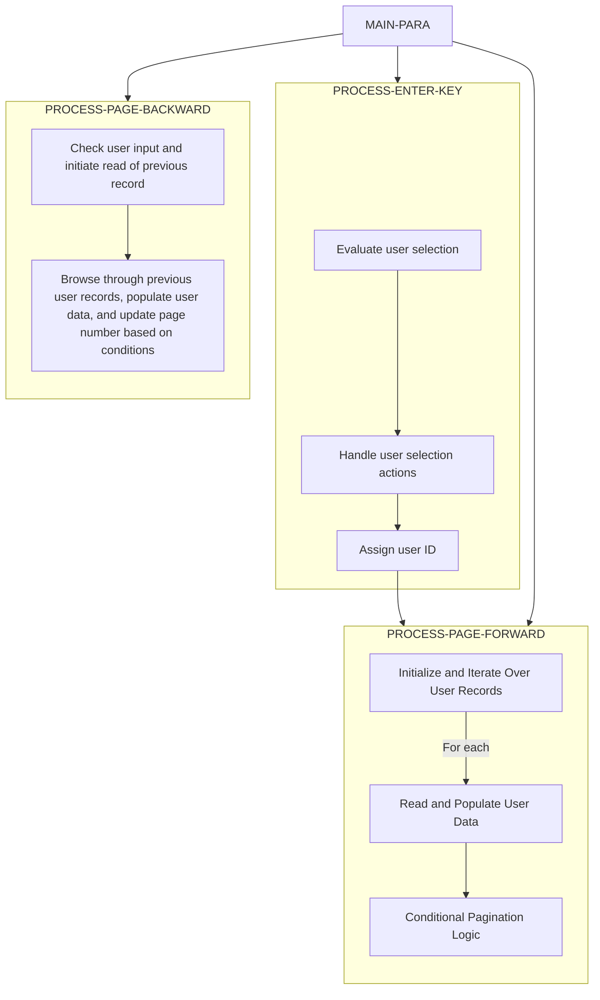

This program navigates through user records and manages pagination for displaying user data. It interacts with user input to either move through the records or update/delete user records based on the user's selection.



<SwmSnippet path="/app/cbl/COUSR00C.cbl" line="121" repo-id="Z2l0aHViJTNBJTNBa3luZHJ5bC1hd3MtbWFpbmZyYW1lLW1vZGVybml6YXRpb24tY2FyZGRlbW8lM0ElM0FTd2ltbS1EZW1v">

---

## <SwmToken path="/app/cbl/COUSR00C.cbl" pos="98:1:3" line-data="       MAIN-PARA." repo-id="Z2l0aHViJTNBJTNBa3luZHJ5bC1hd3MtbWFpbmZyYW1lLW1vZGVybml6YXRpb24tY2FyZGRlbW8lM0ElM0FTd2ltbS1EZW1v" repo-name="aws-mainframe-modernization-carddemo">`MAIN-PARA`</SwmToken>

The <SwmToken path="/app/cbl/COUSR00C.cbl" pos="98:1:3" line-data="       MAIN-PARA." repo-id="Z2l0aHViJTNBJTNBa3luZHJ5bC1hd3MtbWFpbmZyYW1lLW1vZGVybml6YXRpb24tY2FyZGRlbW8lM0ElM0FTd2ltbS1EZW1v" repo-name="aws-mainframe-modernization-carddemo">`MAIN-PARA`</SwmToken> function initializes the program by setting various flags and preparing the environment for user interaction. It then evaluates the user input (<SwmToken path="/app/cbl/COUSR00C.cbl" pos="122:3:3" line-data="                   EVALUATE EIBAID" repo-id="Z2l0aHViJTNBJTNBa3luZHJ5bC1hd3MtbWFpbmZyYW1lLW1vZGVybml6YXRpb24tY2FyZGRlbW8lM0ElM0FTd2ltbS1EZW1v" repo-name="aws-mainframe-modernization-carddemo">`EIBAID`</SwmToken>) to determine the next action:

- If the user presses the Enter key (<SwmToken path="/app/cbl/COUSR00C.cbl" pos="123:3:3" line-data="                       WHEN DFHENTER" repo-id="Z2l0aHViJTNBJTNBa3luZHJ5bC1hd3MtbWFpbmZyYW1lLW1vZGVybml6YXRpb24tY2FyZGRlbW8lM0ElM0FTd2ltbS1EZW1v" repo-name="aws-mainframe-modernization-carddemo">`DFHENTER`</SwmToken>), it performs the <SwmToken path="/app/cbl/COUSR00C.cbl" pos="124:3:7" line-data="                           PERFORM PROCESS-ENTER-KEY" repo-id="Z2l0aHViJTNBJTNBa3luZHJ5bC1hd3MtbWFpbmZyYW1lLW1vZGVybml6YXRpb24tY2FyZGRlbW8lM0ElM0FTd2ltbS1EZW1v" repo-name="aws-mainframe-modernization-carddemo">`PROCESS-ENTER-KEY`</SwmToken> function.&nbsp;
- If the user presses the PF3 key (<SwmToken path="/app/cbl/COUSR00C.cbl" pos="125:3:3" line-data="                       WHEN DFHPF3" repo-id="Z2l0aHViJTNBJTNBa3luZHJ5bC1hd3MtbWFpbmZyYW1lLW1vZGVybml6YXRpb24tY2FyZGRlbW8lM0ElM0FTd2ltbS1EZW1v" repo-name="aws-mainframe-modernization-carddemo">`DFHPF3`</SwmToken>), it performs the <SwmToken path="/app/cbl/COUSR00C.cbl" pos="127:3:9" line-data="                           PERFORM RETURN-TO-PREV-SCREEN" repo-id="Z2l0aHViJTNBJTNBa3luZHJ5bC1hd3MtbWFpbmZyYW1lLW1vZGVybml6YXRpb24tY2FyZGRlbW8lM0ElM0FTd2ltbS1EZW1v" repo-name="aws-mainframe-modernization-carddemo">`RETURN-TO-PREV-SCREEN`</SwmToken> which navigates to the <SwmToken path="/app/cbl/COUSR00C.cbl" pos="126:4:4" line-data="                           MOVE &#39;COADM01C&#39; TO CDEMO-TO-PROGRAM" repo-id="Z2l0aHViJTNBJTNBa3luZHJ5bC1hd3MtbWFpbmZyYW1lLW1vZGVybml6YXRpb24tY2FyZGRlbW8lM0ElM0FTd2ltbS1EZW1v" repo-name="aws-mainframe-modernization-carddemo">`COADM01C`</SwmToken> program which shows the admin menu.
- If the user presses the `PF7` key (<SwmToken path="/app/cbl/COUSR00C.cbl" pos="128:3:3" line-data="                       WHEN DFHPF7" repo-id="Z2l0aHViJTNBJTNBa3luZHJ5bC1hd3MtbWFpbmZyYW1lLW1vZGVybml6YXRpb24tY2FyZGRlbW8lM0ElM0FTd2ltbS1EZW1v" repo-name="aws-mainframe-modernization-carddemo">`DFHPF7`</SwmToken>), it performs the <SwmToken path="/app/cbl/COUSR00C.cbl" pos="237:1:5" line-data="       PROCESS-PF7-KEY." repo-id="Z2l0aHViJTNBJTNBa3luZHJ5bC1hd3MtbWFpbmZyYW1lLW1vZGVybml6YXRpb24tY2FyZGRlbW8lM0ElM0FTd2ltbS1EZW1v" repo-name="aws-mainframe-modernization-carddemo">`PROCESS-PF7-KEY`</SwmToken> function to handle page backward navigation.&nbsp;
- If the user presses the PF8 key (<SwmToken path="/app/cbl/COUSR00C.cbl" pos="130:3:3" line-data="                       WHEN DFHPF8" repo-id="Z2l0aHViJTNBJTNBa3luZHJ5bC1hd3MtbWFpbmZyYW1lLW1vZGVybml6YXRpb24tY2FyZGRlbW8lM0ElM0FTd2ltbS1EZW1v" repo-name="aws-mainframe-modernization-carddemo">`DFHPF8`</SwmToken>), it performs the <SwmToken path="/app/cbl/COUSR00C.cbl" pos="131:3:7" line-data="                           PERFORM PROCESS-PF8-KEY" repo-id="Z2l0aHViJTNBJTNBa3luZHJ5bC1hd3MtbWFpbmZyYW1lLW1vZGVybml6YXRpb24tY2FyZGRlbW8lM0ElM0FTd2ltbS1EZW1v" repo-name="aws-mainframe-modernization-carddemo">`PROCESS-PF8-KEY`</SwmToken> function to handle page forward navigation.&nbsp;
- For any other input, it calls the <SwmToken path="/app/cbl/COUSR00C.cbl" pos="254:3:7" line-data="               PERFORM SEND-USRLST-SCREEN" repo-id="Z2l0aHViJTNBJTNBa3luZHJ5bC1hd3MtbWFpbmZyYW1lLW1vZGVybml6YXRpb24tY2FyZGRlbW8lM0ElM0FTd2ltbS1EZW1v" repo-name="aws-mainframe-modernization-carddemo">`SEND-USRLST-SCREEN`</SwmToken> operation to show an error.

```cobol
                   PERFORM RECEIVE-USRLST-SCREEN
                   EVALUATE EIBAID
                       WHEN DFHENTER
                           PERFORM PROCESS-ENTER-KEY
                       WHEN DFHPF3
                           MOVE 'COADM01C' TO CDEMO-TO-PROGRAM
                           PERFORM RETURN-TO-PREV-SCREEN
                       WHEN DFHPF7
                           PERFORM PROCESS-PF7-KEY
                       WHEN DFHPF8
                           PERFORM PROCESS-PF8-KEY
                       WHEN OTHER
                           MOVE 'Y'                       TO WS-ERR-FLG
                           MOVE -1       TO USRIDINL OF COUSR0AI
                           MOVE CCDA-MSG-INVALID-KEY      TO WS-MESSAGE
                           PERFORM SEND-USRLST-SCREEN
                   END-EVALUATE
```

---

</SwmSnippet>

<SwmSnippet path="/app/cbl/COUSR00C.cbl" line="151" repo-id="Z2l0aHViJTNBJTNBa3luZHJ5bC1hd3MtbWFpbmZyYW1lLW1vZGVybml6YXRpb24tY2FyZGRlbW8lM0ElM0FTd2ltbS1EZW1v">

---

## <SwmToken path="/app/cbl/COUSR00C.cbl" pos="124:3:7" line-data="                           PERFORM PROCESS-ENTER-KEY" repo-id="Z2l0aHViJTNBJTNBa3luZHJ5bC1hd3MtbWFpbmZyYW1lLW1vZGVybml6YXRpb24tY2FyZGRlbW8lM0ElM0FTd2ltbS1EZW1v" repo-name="aws-mainframe-modernization-carddemo">`PROCESS-ENTER-KEY`</SwmToken>

The <SwmToken path="/app/cbl/COUSR00C.cbl" pos="124:3:7" line-data="                           PERFORM PROCESS-ENTER-KEY" repo-id="Z2l0aHViJTNBJTNBa3luZHJ5bC1hd3MtbWFpbmZyYW1lLW1vZGVybml6YXRpb24tY2FyZGRlbW8lM0ElM0FTd2ltbS1EZW1v" repo-name="aws-mainframe-modernization-carddemo">`PROCESS-ENTER-KEY`</SwmToken> function handles user selections and directs the program flow based on the user's choice. It evaluates the user selection flags (<SwmToken path="/app/cbl/COUSR00C.cbl" pos="152:3:3" line-data="               WHEN SEL0001I OF COUSR0AI NOT = SPACES AND LOW-VALUES" repo-id="Z2l0aHViJTNBJTNBa3luZHJ5bC1hd3MtbWFpbmZyYW1lLW1vZGVybml6YXRpb24tY2FyZGRlbW8lM0ElM0FTd2ltbS1EZW1v" repo-name="aws-mainframe-modernization-carddemo">`SEL0001I`</SwmToken> to <SwmToken path="/app/cbl/COUSR00C.cbl" pos="179:3:3" line-data="               WHEN SEL0010I OF COUSR0AI NOT = SPACES AND LOW-VALUES" repo-id="Z2l0aHViJTNBJTNBa3luZHJ5bC1hd3MtbWFpbmZyYW1lLW1vZGVybml6YXRpb24tY2FyZGRlbW8lM0ElM0FTd2ltbS1EZW1v" repo-name="aws-mainframe-modernization-carddemo">`SEL0010I`</SwmToken>) to determine which user record is selected. If a selection is made, it moves the selection flag and user ID to <SwmToken path="/app/cbl/COUSR00C.cbl" pos="153:11:19" line-data="                   MOVE SEL0001I OF COUSR0AI TO CDEMO-CU00-USR-SEL-FLG" repo-id="Z2l0aHViJTNBJTNBa3luZHJ5bC1hd3MtbWFpbmZyYW1lLW1vZGVybml6YXRpb24tY2FyZGRlbW8lM0ElM0FTd2ltbS1EZW1v" repo-name="aws-mainframe-modernization-carddemo">`CDEMO-CU00-USR-SEL-FLG`</SwmToken> and <SwmToken path="/app/cbl/COUSR00C.cbl" pos="154:11:17" line-data="                   MOVE USRID01I OF COUSR0AI TO CDEMO-CU00-USR-SELECTED" repo-id="Z2l0aHViJTNBJTNBa3luZHJ5bC1hd3MtbWFpbmZyYW1lLW1vZGVybml6YXRpb24tY2FyZGRlbW8lM0ElM0FTd2ltbS1EZW1v" repo-name="aws-mainframe-modernization-carddemo">`CDEMO-CU00-USR-SELECTED`</SwmToken>, respectively.

```cobol
           EVALUATE TRUE
               WHEN SEL0001I OF COUSR0AI NOT = SPACES AND LOW-VALUES
                   MOVE SEL0001I OF COUSR0AI TO CDEMO-CU00-USR-SEL-FLG
                   MOVE USRID01I OF COUSR0AI TO CDEMO-CU00-USR-SELECTED
               WHEN SEL0002I OF COUSR0AI NOT = SPACES AND LOW-VALUES
                   MOVE SEL0002I OF COUSR0AI TO CDEMO-CU00-USR-SEL-FLG
                   MOVE USRID02I OF COUSR0AI TO CDEMO-CU00-USR-SELECTED
               WHEN SEL0003I OF COUSR0AI NOT = SPACES AND LOW-VALUES
                   MOVE SEL0003I OF COUSR0AI TO CDEMO-CU00-USR-SEL-FLG
                   MOVE USRID03I OF COUSR0AI TO CDEMO-CU00-USR-SELECTED
               WHEN SEL0004I OF COUSR0AI NOT = SPACES AND LOW-VALUES
                   MOVE SEL0004I OF COUSR0AI TO CDEMO-CU00-USR-SEL-FLG
                   MOVE USRID04I OF COUSR0AI TO CDEMO-CU00-USR-SELECTED
               WHEN SEL0005I OF COUSR0AI NOT = SPACES AND LOW-VALUES
                   MOVE SEL0005I OF COUSR0AI TO CDEMO-CU00-USR-SEL-FLG
                   MOVE USRID05I OF COUSR0AI TO CDEMO-CU00-USR-SELECTED
               WHEN SEL0006I OF COUSR0AI NOT = SPACES AND LOW-VALUES
                   MOVE SEL0006I OF COUSR0AI TO CDEMO-CU00-USR-SEL-FLG
                   MOVE USRID06I OF COUSR0AI TO CDEMO-CU00-USR-SELECTED
               WHEN SEL0007I OF COUSR0AI NOT = SPACES AND LOW-VALUES
                   MOVE SEL0007I OF COUSR0AI TO CDEMO-CU00-USR-SEL-FLG
                   MOVE USRID07I OF COUSR0AI TO CDEMO-CU00-USR-SELECTED
               WHEN SEL0008I OF COUSR0AI NOT = SPACES AND LOW-VALUES
                   MOVE SEL0008I OF COUSR0AI TO CDEMO-CU00-USR-SEL-FLG
                   MOVE USRID08I OF COUSR0AI TO CDEMO-CU00-USR-SELECTED
               WHEN SEL0009I OF COUSR0AI NOT = SPACES AND LOW-VALUES
                   MOVE SEL0009I OF COUSR0AI TO CDEMO-CU00-USR-SEL-FLG
                   MOVE USRID09I OF COUSR0AI TO CDEMO-CU00-USR-SELECTED
               WHEN SEL0010I OF COUSR0AI NOT = SPACES AND LOW-VALUES
                   MOVE SEL0010I OF COUSR0AI TO CDEMO-CU00-USR-SEL-FLG
                   MOVE USRID10I OF COUSR0AI TO CDEMO-CU00-USR-SELECTED
               WHEN OTHER
                   MOVE SPACES   TO CDEMO-CU00-USR-SEL-FLG
                   MOVE SPACES   TO CDEMO-CU00-USR-SELECTED
           END-EVALUATE
```

---

</SwmSnippet>

<SwmSnippet path="/app/cbl/COUSR00C.cbl" line="187" repo-id="Z2l0aHViJTNBJTNBa3luZHJ5bC1hd3MtbWFpbmZyYW1lLW1vZGVybml6YXRpb24tY2FyZGRlbW8lM0ElM0FTd2ltbS1EZW1v">

---

If a valid user selection is made, the function evaluates the selection flag (<SwmToken path="/app/cbl/COUSR00C.cbl" pos="187:4:12" line-data="           IF (CDEMO-CU00-USR-SEL-FLG NOT = SPACES AND LOW-VALUES) AND" repo-id="Z2l0aHViJTNBJTNBa3luZHJ5bC1hd3MtbWFpbmZyYW1lLW1vZGVybml6YXRpb24tY2FyZGRlbW8lM0ElM0FTd2ltbS1EZW1v" repo-name="aws-mainframe-modernization-carddemo">`CDEMO-CU00-USR-SEL-FLG`</SwmToken>):

- If the user wants to update the record ('U' or 'u'), it sets the target program ID to <SwmToken path="/app/cbl/COUSR00C.cbl" pos="192:4:4" line-data="                        MOVE &#39;COUSR02C&#39;   TO CDEMO-TO-PROGRAM" repo-id="Z2l0aHViJTNBJTNBa3luZHJ5bC1hd3MtbWFpbmZyYW1lLW1vZGVybml6YXRpb24tY2FyZGRlbW8lM0ElM0FTd2ltbS1EZW1v" repo-name="aws-mainframe-modernization-carddemo">`COUSR02C`</SwmToken> and transfers control to the update program.&nbsp;
- If the user wants to delete the record ('D' or 'd'), it sets the target program ID to <SwmToken path="/app/cbl/COUSR00C.cbl" pos="202:4:4" line-data="                        MOVE &#39;COUSR03C&#39;   TO CDEMO-TO-PROGRAM" repo-id="Z2l0aHViJTNBJTNBa3luZHJ5bC1hd3MtbWFpbmZyYW1lLW1vZGVybml6YXRpb24tY2FyZGRlbW8lM0ElM0FTd2ltbS1EZW1v" repo-name="aws-mainframe-modernization-carddemo">`COUSR03C`</SwmToken> and transfers control to the delete program.&nbsp;
- For any other selection, it sets an invalid selection message and initializes the user ID input field with -1.

```cobol
           IF (CDEMO-CU00-USR-SEL-FLG NOT = SPACES AND LOW-VALUES) AND
              (CDEMO-CU00-USR-SELECTED NOT = SPACES AND LOW-VALUES)
               EVALUATE CDEMO-CU00-USR-SEL-FLG
                   WHEN 'U'
                   WHEN 'u'
                        MOVE 'COUSR02C'   TO CDEMO-TO-PROGRAM
                        MOVE WS-TRANID    TO CDEMO-FROM-TRANID
                        MOVE WS-PGMNAME   TO CDEMO-FROM-PROGRAM
                        MOVE 0        TO CDEMO-PGM-CONTEXT
                        EXEC CICS
                            XCTL PROGRAM(CDEMO-TO-PROGRAM)
                            COMMAREA(CARDDEMO-COMMAREA)
                        END-EXEC
                   WHEN 'D'
                   WHEN 'd'
                        MOVE 'COUSR03C'   TO CDEMO-TO-PROGRAM
                        MOVE WS-TRANID    TO CDEMO-FROM-TRANID
                        MOVE WS-PGMNAME   TO CDEMO-FROM-PROGRAM
                        MOVE 0        TO CDEMO-PGM-CONTEXT
                        EXEC CICS
                            XCTL PROGRAM(CDEMO-TO-PROGRAM)
                            COMMAREA(CARDDEMO-COMMAREA)
                        END-EXEC
                   WHEN OTHER
                       MOVE
                       'Invalid selection. Valid values are U and D' TO
                                       WS-MESSAGE
                       MOVE -1       TO USRIDINL OF COUSR0AI
               END-EVALUATE
```

---

</SwmSnippet>

<SwmSnippet path="/app/cbl/COUSR00C.cbl" line="218" repo-id="Z2l0aHViJTNBJTNBa3luZHJ5bC1hd3MtbWFpbmZyYW1lLW1vZGVybml6YXRpb24tY2FyZGRlbW8lM0ElM0FTd2ltbS1EZW1v">

---

Then the function checks if the initial user ID input (<SwmToken path="/app/cbl/COUSR00C.cbl" pos="218:3:3" line-data="           IF USRIDINI OF COUSR0AI = SPACES OR LOW-VALUES" repo-id="Z2l0aHViJTNBJTNBa3luZHJ5bC1hd3MtbWFpbmZyYW1lLW1vZGVybml6YXRpb24tY2FyZGRlbW8lM0ElM0FTd2ltbS1EZW1v" repo-name="aws-mainframe-modernization-carddemo">`USRIDINI`</SwmToken>) is empty or contains low values. If it is, it sets the security user ID (<SwmToken path="/app/cbl/COUSR00C.cbl" pos="219:9:13" line-data="               MOVE LOW-VALUES TO SEC-USR-ID" repo-id="Z2l0aHViJTNBJTNBa3luZHJ5bC1hd3MtbWFpbmZyYW1lLW1vZGVybml6YXRpb24tY2FyZGRlbW8lM0ElM0FTd2ltbS1EZW1v" repo-name="aws-mainframe-modernization-carddemo">`SEC-USR-ID`</SwmToken>) to low values. Otherwise, it moves the initial user ID input to the security user ID.&nbsp;

Finally the function performs the <SwmToken path="/app/cbl/COUSR00C.cbl" pos="228:3:7" line-data="           PERFORM PROCESS-PAGE-FORWARD" repo-id="Z2l0aHViJTNBJTNBa3luZHJ5bC1hd3MtbWFpbmZyYW1lLW1vZGVybml6YXRpb24tY2FyZGRlbW8lM0ElM0FTd2ltbS1EZW1v" repo-name="aws-mainframe-modernization-carddemo">`PROCESS-PAGE-FORWARD`</SwmToken> function to display the first page of user records.

```
           IF USRIDINI OF COUSR0AI = SPACES OR LOW-VALUES
               MOVE LOW-VALUES TO SEC-USR-ID
           ELSE
               MOVE USRIDINI  OF COUSR0AI TO SEC-USR-ID
           END-IF

           MOVE -1       TO USRIDINL OF COUSR0AI


           MOVE 0       TO CDEMO-CU00-PAGE-NUM
           PERFORM PROCESS-PAGE-FORWARD
```

---

</SwmSnippet>

<SwmSnippet path="/app/cbl/COUSR00C.cbl" line="292" repo-id="Z2l0aHViJTNBJTNBa3luZHJ5bC1hd3MtbWFpbmZyYW1lLW1vZGVybml6YXRpb24tY2FyZGRlbW8lM0ElM0FTd2ltbS1EZW1v">

---

## <SwmToken path="/app/cbl/COUSR00C.cbl" pos="228:3:7" line-data="           PERFORM PROCESS-PAGE-FORWARD" repo-id="Z2l0aHViJTNBJTNBa3luZHJ5bC1hd3MtbWFpbmZyYW1lLW1vZGVybml6YXRpb24tY2FyZGRlbW8lM0ElM0FTd2ltbS1EZW1v" repo-name="aws-mainframe-modernization-carddemo">`PROCESS-PAGE-FORWARD`</SwmToken>

The <SwmToken path="/app/cbl/COUSR00C.cbl" pos="228:3:7" line-data="           PERFORM PROCESS-PAGE-FORWARD" repo-id="Z2l0aHViJTNBJTNBa3luZHJ5bC1hd3MtbWFpbmZyYW1lLW1vZGVybml6YXRpb24tY2FyZGRlbW8lM0ElM0FTd2ltbS1EZW1v" repo-name="aws-mainframe-modernization-carddemo">`PROCESS-PAGE-FORWARD`</SwmToken> function navigates through user records, populates user data, and manages pagination. It starts by performing the <SwmToken path="/app/cbl/COUSR00C.cbl" pos="284:3:9" line-data="           PERFORM STARTBR-USER-SEC-FILE" repo-id="Z2l0aHViJTNBJTNBa3luZHJ5bC1hd3MtbWFpbmZyYW1lLW1vZGVybml6YXRpb24tY2FyZGRlbW8lM0ElM0FTd2ltbS1EZW1v" repo-name="aws-mainframe-modernization-carddemo">`STARTBR-USER-SEC-FILE`</SwmToken> operation to begin browsing the user security file.&nbsp;

```cobol
               IF USER-SEC-NOT-EOF AND ERR-FLG-OFF
               PERFORM VARYING WS-IDX FROM 1 BY 1 UNTIL WS-IDX > 10
                   PERFORM INITIALIZE-USER-DATA
               END-PERFORM
               END-IF
```

---

</SwmSnippet>

<SwmSnippet path="/app/cbl/COUSR00C.cbl" line="300" repo-id="Z2l0aHViJTNBJTNBa3luZHJ5bC1hd3MtbWFpbmZyYW1lLW1vZGVybml6YXRpb24tY2FyZGRlbW8lM0ElM0FTd2ltbS1EZW1v">

---

The function then initializes user data fields and iterates over the user records, reading and populating user data until the end of the file is reached or an error occurs. If there are more user records to read, it increments the page number and sets the next page flag (<SwmToken path="/app/cbl/COUSR00C.cbl" pos="364:3:7" line-data="               IF NEXT-PAGE-YES" repo-id="Z2l0aHViJTNBJTNBa3luZHJ5bC1hd3MtbWFpbmZyYW1lLW1vZGVybml6YXRpb24tY2FyZGRlbW8lM0ElM0FTd2ltbS1EZW1v" repo-name="aws-mainframe-modernization-carddemo">`NEXT-PAGE-YES`</SwmToken>) to true. Otherwise, it sets the next page flag to false and increments the page number if there are user records on the current page.

```cobol
               PERFORM UNTIL WS-IDX >= 11 OR USER-SEC-EOF OR ERR-FLG-ON
                   PERFORM READNEXT-USER-SEC-FILE
                   IF USER-SEC-NOT-EOF AND ERR-FLG-OFF
                       PERFORM POPULATE-USER-DATA
                       COMPUTE WS-IDX = WS-IDX + 1
                   END-IF
               END-PERFORM

               IF USER-SEC-NOT-EOF AND ERR-FLG-OFF
                   COMPUTE CDEMO-CU00-PAGE-NUM =
                           CDEMO-CU00-PAGE-NUM + 1
                   PERFORM READNEXT-USER-SEC-FILE
                   IF USER-SEC-NOT-EOF AND ERR-FLG-OFF
                       SET NEXT-PAGE-YES TO TRUE
                   ELSE
                       SET NEXT-PAGE-NO TO TRUE
                   END-IF
               ELSE
                   SET NEXT-PAGE-NO TO TRUE
                   IF WS-IDX > 1
                       COMPUTE CDEMO-CU00-PAGE-NUM = CDEMO-CU00-PAGE-NUM
                        + 1
                   END-IF
```

---

</SwmSnippet>

<SwmSnippet path="/app/cbl/COUSR00C.cbl" line="342" repo-id="Z2l0aHViJTNBJTNBa3luZHJ5bC1hd3MtbWFpbmZyYW1lLW1vZGVybml6YXRpb24tY2FyZGRlbW8lM0ElM0FTd2ltbS1EZW1v">

---

## <SwmToken path="/app/cbl/COUSR00C.cbl" pos="249:3:7" line-data="               PERFORM PROCESS-PAGE-BACKWARD" repo-id="Z2l0aHViJTNBJTNBa3luZHJ5bC1hd3MtbWFpbmZyYW1lLW1vZGVybml6YXRpb24tY2FyZGRlbW8lM0ElM0FTd2ltbS1EZW1v" repo-name="aws-mainframe-modernization-carddemo">`PROCESS-PAGE-BACKWARD`</SwmToken>

The <SwmToken path="/app/cbl/COUSR00C.cbl" pos="249:3:7" line-data="               PERFORM PROCESS-PAGE-BACKWARD" repo-id="Z2l0aHViJTNBJTNBa3luZHJ5bC1hd3MtbWFpbmZyYW1lLW1vZGVybml6YXRpb24tY2FyZGRlbW8lM0ElM0FTd2ltbS1EZW1v" repo-name="aws-mainframe-modernization-carddemo">`PROCESS-PAGE-BACKWARD`</SwmToken> function navigates through user records in reverse order and updates user data and page number accordingly. It starts by performing the <SwmToken path="/app/cbl/COUSR00C.cbl" pos="284:3:9" line-data="           PERFORM STARTBR-USER-SEC-FILE" repo-id="Z2l0aHViJTNBJTNBa3luZHJ5bC1hd3MtbWFpbmZyYW1lLW1vZGVybml6YXRpb24tY2FyZGRlbW8lM0ElM0FTd2ltbS1EZW1v" repo-name="aws-mainframe-modernization-carddemo">`STARTBR-USER-SEC-FILE`</SwmToken> operation to begin browsing the user security file.&nbsp;

```cobol
               IF EIBAID NOT = DFHENTER  AND DFHPF8
                   PERFORM READPREV-USER-SEC-FILE
               END-IF
```

---

</SwmSnippet>

<SwmSnippet path="/app/cbl/COUSR00C.cbl" line="352" repo-id="Z2l0aHViJTNBJTNBa3luZHJ5bC1hd3MtbWFpbmZyYW1lLW1vZGVybml6YXRpb24tY2FyZGRlbW8lM0ElM0FTd2ltbS1EZW1v">

---

The function then initializes user data fields and iterates over the user records, reading and populating user data until the beginning of the file is reached or an error occurs. If there are more user records to read, it reads the previous user record again and decrements the page number if the next page flag (<SwmToken path="/app/cbl/COUSR00C.cbl" pos="364:3:7" line-data="               IF NEXT-PAGE-YES" repo-id="Z2l0aHViJTNBJTNBa3luZHJ5bC1hd3MtbWFpbmZyYW1lLW1vZGVybml6YXRpb24tY2FyZGRlbW8lM0ElM0FTd2ltbS1EZW1v" repo-name="aws-mainframe-modernization-carddemo">`NEXT-PAGE-YES`</SwmToken>) is set and the current page number is greater than 1. Otherwise, it sets the page number to 1.

```cobol
               MOVE 10          TO  WS-IDX

               PERFORM UNTIL WS-IDX <= 0 OR USER-SEC-EOF OR ERR-FLG-ON
                   PERFORM READPREV-USER-SEC-FILE
                   IF USER-SEC-NOT-EOF AND ERR-FLG-OFF
                       PERFORM POPULATE-USER-DATA
                       COMPUTE WS-IDX = WS-IDX - 1
                   END-IF
               END-PERFORM

               IF USER-SEC-NOT-EOF AND ERR-FLG-OFF
               PERFORM READPREV-USER-SEC-FILE
               IF NEXT-PAGE-YES
                   IF USER-SEC-NOT-EOF AND ERR-FLG-OFF AND
                       CDEMO-CU00-PAGE-NUM > 1
                       SUBTRACT 1 FROM CDEMO-CU00-PAGE-NUM
                   ELSE
                       MOVE 1 TO CDEMO-CU00-PAGE-NUM
                   END-IF
               END-IF
```

---

</SwmSnippet>

&nbsp;

_This is an auto-generated document by Swimm 🌊 and has not yet been verified by a human_

<SwmMeta version="3.0.0"><sup>Powered by [Swimm](https://staging.swimm.cloud/)</sup></SwmMeta>
