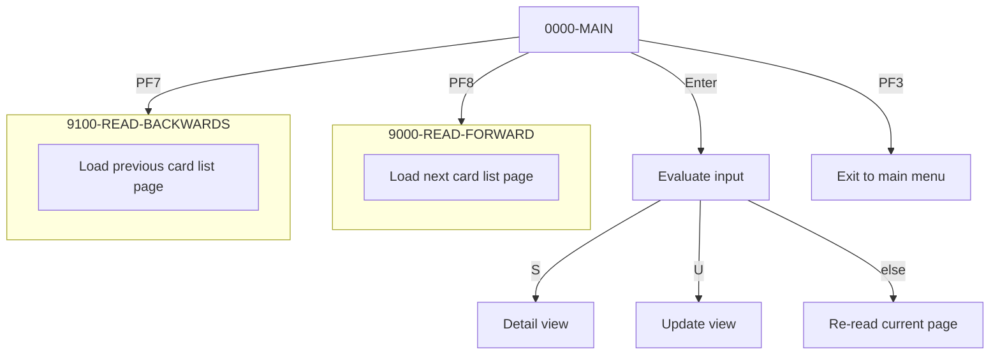

This document provides a comprehensive overview of the program responsible for listing credit cards. It details the initialization of the program state, reading and validating inputs, handling user action keys, and managing pagination and navigation through the list of credit cards.



<SwmSnippet path="/app/cbl/COCRDLIC.cbl" line="364" repo-id="Z2l0aHViJTNBJTNBa3luZHJ5bC1hd3MtbWFpbmZyYW1lLW1vZGVybml6YXRpb24tY2FyZGRlbW8lM0ElM0FTd2ltbS1EZW1v">

---

## <SwmToken path="/app/cbl/COCRDLIC.cbl" pos="298:1:4" line-data="       0000-MAIN.                                                               " repo-id="Z2l0aHViJTNBJTNBa3luZHJ5bC1hd3MtbWFpbmZyYW1lLW1vZGVybml6YXRpb24tY2FyZGRlbW8lM0ElM0FTd2ltbS1EZW1v" repo-name="aws-mainframe-modernization-carddemo">`0000-MAIN.`</SwmToken>

The program then checks and validates user action keys to determine the next steps based on user inputs.

- If the user presses the Enter key (<SwmToken path="/app/cbl/COCRDLIC.cbl" pos="371:3:7" line-data="           IF CCARD-AID-ENTER OR                                                " repo-id="Z2l0aHViJTNBJTNBa3luZHJ5bC1hd3MtbWFpbmZyYW1lLW1vZGVybml6YXRpb24tY2FyZGRlbW8lM0ElM0FTd2ltbS1EZW1v" repo-name="aws-mainframe-modernization-carddemo">`CCARD-AID-ENTER`</SwmToken>), it handles row selection actions:
  - 'S' - Transfers to detail view (COCRDSLC).
  - 'U' - Transfers to update screen (COCRDUPC).
  - Without selection - Re-reads current page.
- If the user presses the PF3 key (<SwmToken path="/app/cbl/COCRDLIC.cbl" pos="372:1:5" line-data="              CCARD-AID-PFK03 OR                                                " repo-id="Z2l0aHViJTNBJTNBa3luZHJ5bC1hd3MtbWFpbmZyYW1lLW1vZGVybml6YXRpb24tY2FyZGRlbW8lM0ElM0FTd2ltbS1EZW1v" repo-name="aws-mainframe-modernization-carddemo">`CCARD-AID-PFK03`</SwmToken>), it exits to main menu.
- If the user presses the `PF7` key (<SwmToken path="/app/cbl/COCRDLIC.cbl" pos="373:1:5" line-data="              CCARD-AID-PFK07 OR                                                " repo-id="Z2l0aHViJTNBJTNBa3luZHJ5bC1hd3MtbWFpbmZyYW1lLW1vZGVybml6YXRpb24tY2FyZGRlbW8lM0ElM0FTd2ltbS1EZW1v" repo-name="aws-mainframe-modernization-carddemo">`CCARD-AID-PFK07`</SwmToken>), it shows previous cards page.
- If the user presses the PF8 key (<SwmToken path="/app/cbl/COCRDLIC.cbl" pos="374:1:5" line-data="              CCARD-AID-PFK08                                                   " repo-id="Z2l0aHViJTNBJTNBa3luZHJ5bC1hd3MtbWFpbmZyYW1lLW1vZGVybml6YXRpb24tY2FyZGRlbW8lM0ElM0FTd2ltbS1EZW1v" repo-name="aws-mainframe-modernization-carddemo">`CCARD-AID-PFK08`</SwmToken>), it shows next card page.

```cobol
      * Check the mapped key  to see if its valid at this point       *         
      * F3    - Exit                                                            
      * Enter - List of cards for current start key                             
      * F8    - Page down                                                       
      * F7    - Page up                                                         
      *****************************************************************         
           SET PFK-INVALID TO TRUE                                              
           IF CCARD-AID-ENTER OR                                                
              CCARD-AID-PFK03 OR                                                
              CCARD-AID-PFK07 OR                                                
              CCARD-AID-PFK08                                                   
               SET PFK-VALID TO TRUE                                            
           END-IF                                                               
                                                                                
           IF PFK-INVALID                                                       
              SET CCARD-AID-ENTER TO TRUE                                       
           END-IF                                                               
```

---

</SwmSnippet>

<SwmSnippet path="/app/cbl/COCRDLIC.cbl" line="486" repo-id="Z2l0aHViJTNBJTNBa3luZHJ5bC1hd3MtbWFpbmZyYW1lLW1vZGVybml6YXRpb24tY2FyZGRlbW8lM0ElM0FTd2ltbS1EZW1v">

---

## Load next card list page

The program loads the next page of the card list by performing the <SwmToken path="/app/cbl/COCRDLIC.cbl" pos="493:3:7" line-data="                    PERFORM 9000-READ-FORWARD                                   " repo-id="Z2l0aHViJTNBJTNBa3luZHJ5bC1hd3MtbWFpbmZyYW1lLW1vZGVybml6YXRpb24tY2FyZGRlbW8lM0ElM0FTd2ltbS1EZW1v" repo-name="aws-mainframe-modernization-carddemo">`9000-READ-FORWARD`</SwmToken> function.

```cobol
               WHEN CCARD-AID-PFK08                                             
                    AND CA-NEXT-PAGE-EXISTS                                     
                    MOVE WS-CA-LAST-CARD-NUM                                    
                                  TO WS-CARD-RID-CARDNUM                        
      *             MOVE WS-CA-LAST-CARD-ACCT-ID                                
      *                           TO WS-CARD-RID-ACCT-ID                        
                    ADD   +1       TO WS-CA-SCREEN-NUM                          
                    PERFORM 9000-READ-FORWARD                                   
                       THRU 9000-READ-FORWARD-EXIT                              
                    PERFORM 1000-SEND-MAP                                       
                       THRU 1000-SEND-MAP-EXIT                                  
                    GO TO COMMON-RETURN                                         
```

---

</SwmSnippet>

<SwmSnippet path="/app/cbl/COCRDLIC.cbl" line="1156" repo-id="Z2l0aHViJTNBJTNBa3luZHJ5bC1hd3MtbWFpbmZyYW1lLW1vZGVybml6YXRpb24tY2FyZGRlbW8lM0ElM0FTd2ltbS1EZW1v">

---

## Filter and handle valid records

The <SwmToken path="/app/cbl/COCRDLIC.cbl" pos="1123:1:5" line-data="       9000-READ-FORWARD.                                                       " repo-id="Z2l0aHViJTNBJTNBa3luZHJ5bC1hd3MtbWFpbmZyYW1lLW1vZGVybml6YXRpb24tY2FyZGRlbW8lM0ElM0FTd2ltbS1EZW1v" repo-name="aws-mainframe-modernization-carddemo">`9000-READ-FORWARD`</SwmToken>unction filters, evaluates, and handles valid records. This involves browsing and reading credit card records, adding them to a list until a page limit is reached or no more records are available.

```cobol
           EVALUATE WS-RESP-CD                                                  
               WHEN DFHRESP(NORMAL)                                             
               WHEN DFHRESP(DUPREC)                                             
                   PERFORM 9500-FILTER-RECORDS                                  
                      THRU 9500-FILTER-RECORDS-EXIT                             
                                                                                
                   IF WS-DONOT-EXCLUDE-THIS-RECORD                              
                      ADD 1             TO WS-SCRN-COUNTER                      
                                                                                
                      MOVE CARD-NUM     TO WS-ROW-CARD-NUM(                     
                      WS-SCRN-COUNTER)                                          
                      MOVE CARD-ACCT-ID TO                                      
                      WS-ROW-ACCTNO(WS-SCRN-COUNTER)                            
                      MOVE CARD-ACTIVE-STATUS                                   
                                        TO WS-ROW-CARD-STATUS(                  
                                        WS-SCRN-COUNTER)                        
                                                                                
                      IF WS-SCRN-COUNTER = 1                                    
                         MOVE CARD-ACCT-ID                                      
                                        TO WS-CA-FIRST-CARD-ACCT-ID             
                         MOVE CARD-NUM  TO WS-CA-FIRST-CARD-NUM                 
                         IF   WS-CA-SCREEN-NUM = 0                              
                           ADD   +1     TO WS-CA-SCREEN-NUM                     
                         ELSE                                                   
                           CONTINUE                                             
                         END-IF                                                 
                      ELSE                                                      
                         CONTINUE                                               
                      END-IF                                                    
```

---

</SwmSnippet>

<SwmSnippet path="/app/cbl/COCRDLIC.cbl" line="1191" repo-id="Z2l0aHViJTNBJTNBa3luZHJ5bC1hd3MtbWFpbmZyYW1lLW1vZGVybml6YXRpb24tY2FyZGRlbW8lM0ElM0FTd2ltbS1EZW1v">

---

## Handle pagination and end of file

The <SwmToken path="/app/cbl/COCRDLIC.cbl" pos="1123:1:5" line-data="       9000-READ-FORWARD.                                                       " repo-id="Z2l0aHViJTNBJTNBa3luZHJ5bC1hd3MtbWFpbmZyYW1lLW1vZGVybml6YXRpb24tY2FyZGRlbW8lM0ElM0FTd2ltbS1EZW1v" repo-name="aws-mainframe-modernization-carddemo">`9000-READ-FORWARD`</SwmToken> function also evaluates the maximum screen size, handles pagination, and manages the end-of-file conditions. This ensures that the user can navigate through the list of credit cards seamlessly.

```cobol
                   IF WS-SCRN-COUNTER = WS-MAX-SCREEN-LINES                     
                      SET READ-LOOP-EXIT  TO TRUE                               
                                                                                
                      MOVE CARD-ACCT-ID     TO WS-CA-LAST-CARD-ACCT-ID          
                      MOVE CARD-NUM         TO WS-CA-LAST-CARD-NUM              
                                                                                
                      EXEC CICS READNEXT                                        
                        DATASET(LIT-CARD-FILE)                                  
                        INTO (CARD-RECORD)                                      
                        LENGTH(LENGTH OF CARD-RECORD)                           
                        RIDFLD(WS-CARD-RID-CARDNUM)                             
                        KEYLENGTH(LENGTH OF WS-CARD-RID-CARDNUM)                
                        RESP(WS-RESP-CD)                                        
                        RESP2(WS-REAS-CD)                                       
                      END-EXEC                                                  
                                                                                
                      EVALUATE WS-RESP-CD                                       
                         WHEN DFHRESP(NORMAL)                                   
                         WHEN DFHRESP(DUPREC)                                   
                              SET CA-NEXT-PAGE-EXISTS                           
                                                TO TRUE                         
                              MOVE CARD-ACCT-ID TO                              
                                   WS-CA-LAST-CARD-ACCT-ID                      
                              MOVE CARD-NUM     TO WS-CA-LAST-CARD-NUM          
                        WHEN DFHRESP(ENDFILE)                                   
                            SET CA-NEXT-PAGE-NOT-EXISTS     TO TRUE             
                                                                                
                            IF WS-ERROR-MSG-OFF                                 
                                MOVE 'NO MORE RECORDS TO SHOW'                  
                                                TO WS-ERROR-MSG                 
                            END-IF                                              
                            WHEN OTHER                                          
      *                     This is some kind of error. Change to END BR        
      *                     And exit                                            
                            SET READ-LOOP-EXIT      TO TRUE                     
                            MOVE 'READ'              TO ERROR-OPNAME            
                            MOVE LIT-CARD-FILE       TO ERROR-FILE              
                            MOVE WS-RESP-CD          TO ERROR-RESP              
                            MOVE WS-REAS-CD          TO ERROR-RESP2             
                          MOVE WS-FILE-ERROR-MESSAGE TO WS-ERROR-MSG            
                      END-EVALUATE                                              
```

---

</SwmSnippet>

<SwmSnippet path="/app/cbl/COCRDLIC.cbl" line="1385" repo-id="Z2l0aHViJTNBJTNBa3luZHJ5bC1hd3MtbWFpbmZyYW1lLW1vZGVybml6YXRpb24tY2FyZGRlbW8lM0ElM0FTd2ltbS1EZW1v">

---

## Filter credit card records

The <SwmToken path="/app/cbl/COCRDLIC.cbl" pos="1382:1:5" line-data="       9500-FILTER-RECORDS.                                                     " repo-id="Z2l0aHViJTNBJTNBa3luZHJ5bC1hd3MtbWFpbmZyYW1lLW1vZGVybml6YXRpb24tY2FyZGRlbW8lM0ElM0FTd2ltbS1EZW1v" repo-name="aws-mainframe-modernization-carddemo">`9500-FILTER-RECORDS`</SwmToken> function filters credit card records based on account and card validity. This ensures that only relevant records are included in the list displayed to the user.

```cobol
           IF FLG-ACCTFILTER-ISVALID                                            
              IF  CARD-ACCT-ID = CC-ACCT-ID                                     
                  CONTINUE                                                      
              ELSE                                                              
                  SET WS-EXCLUDE-THIS-RECORD  TO TRUE                           
                  GO TO 9500-FILTER-RECORDS-EXIT                                
              END-IF                                                            
           ELSE                                                                 
             CONTINUE                                                           
           END-IF                                                               
                                                                                
           IF FLG-CARDFILTER-ISVALID                                            
              IF  CARD-NUM = CC-CARD-NUM-N                                      
                  CONTINUE                                                      
              ELSE                                                              
                  SET WS-EXCLUDE-THIS-RECORD TO TRUE                            
                  GO TO 9500-FILTER-RECORDS-EXIT                                
              END-IF                                                            
```

---

</SwmSnippet>

<SwmSnippet path="/app/cbl/COCRDLIC.cbl" line="501" repo-id="Z2l0aHViJTNBJTNBa3luZHJ5bC1hd3MtbWFpbmZyYW1lLW1vZGVybml6YXRpb24tY2FyZGRlbW8lM0ElM0FTd2ltbS1EZW1v">

---

## Load previous card list page

The program loads the previous page of the card list by performing the <SwmToken path="/app/cbl/COCRDLIC.cbl" pos="509:3:7" line-data="                    PERFORM 9100-READ-BACKWARDS                                 " repo-id="Z2l0aHViJTNBJTNBa3luZHJ5bC1hd3MtbWFpbmZyYW1lLW1vZGVybml6YXRpb24tY2FyZGRlbW8lM0ElM0FTd2ltbS1EZW1v" repo-name="aws-mainframe-modernization-carddemo">`9100-READ-BACKWARDS`</SwmToken> funtion.

```cobol
               WHEN CCARD-AID-PFK07                                             
                    AND NOT CA-FIRST-PAGE                                       
                                                                                
                    MOVE WS-CA-FIRST-CARD-NUM                                   
                                  TO WS-CARD-RID-CARDNUM                        
      *             MOVE WS-CA-FIRST-CARD-ACCT-ID                               
      *                           TO WS-CARD-RID-ACCT-ID                        
                    SUBTRACT 1    FROM WS-CA-SCREEN-NUM                         
                    PERFORM 9100-READ-BACKWARDS                                 
                       THRU 9100-READ-BACKWARDS-EXIT                            
                    PERFORM 1000-SEND-MAP                                       
                       THRU 1000-SEND-MAP-EXIT                                  
                    GO TO COMMON-RETURN                                         
```

---

</SwmSnippet>

<SwmSnippet path="/app/cbl/COCRDLIC.cbl" line="1337" repo-id="Z2l0aHViJTNBJTNBa3luZHJ5bC1hd3MtbWFpbmZyYW1lLW1vZGVybml6YXRpb24tY2FyZGRlbW8lM0ElM0FTd2ltbS1EZW1v">

---

## Handle reverse pagination

The <SwmToken path="/app/cbl/COCRDLIC.cbl" pos="1264:1:5" line-data="       9100-READ-BACKWARDS.                                                     " repo-id="Z2l0aHViJTNBJTNBa3luZHJ5bC1hd3MtbWFpbmZyYW1lLW1vZGVybml6YXRpb24tY2FyZGRlbW8lM0ElM0FTd2ltbS1EZW1v" repo-name="aws-mainframe-modernization-carddemo">`9100-READ-BACKWARDS`</SwmToken> function moves valid credit card records to screen rows and handles pagination limits. This ensures that the user can navigate backward through the list of credit cards efficiently.

```cobol
                   IF WS-DONOT-EXCLUDE-THIS-RECORD                              
                      MOVE CARD-NUM                                             
                                  TO WS-ROW-CARD-NUM(WS-SCRN-COUNTER)           
                      MOVE CARD-ACCT-ID                                         
                                  TO WS-ROW-ACCTNO(WS-SCRN-COUNTER)             
                      MOVE CARD-ACTIVE-STATUS                                   
                                  TO                                            
                                  WS-ROW-CARD-STATUS(WS-SCRN-COUNTER)           
                                                                                
                      SUBTRACT 1  FROM WS-SCRN-COUNTER                          
                      IF WS-SCRN-COUNTER = 0                                    
                         SET READ-LOOP-EXIT  TO TRUE                            
                                                                                
                         MOVE CARD-ACCT-ID                                      
                                  TO WS-CA-FIRST-CARD-ACCT-ID                   
                         MOVE CARD-NUM                                          
                                  TO WS-CA-FIRST-CARD-NUM                       
                      ELSE                                                      
                         CONTINUE                                               
                      END-IF                                                    
```

---

</SwmSnippet>

<SwmSnippet path="/app/cbl/COCRDLIC.cbl" line="517" repo-id="Z2l0aHViJTNBJTNBa3luZHJ5bC1hd3MtbWFpbmZyYW1lLW1vZGVybml6YXRpb24tY2FyZGRlbW8lM0ElM0FTd2ltbS1EZW1v">

---

## Transfer to card detail view

The program handles the transfer to the card detail view if the user requests it. This involves setting the necessary variables and calling the appropriate program to display the card details.

```cobol
               WHEN CCARD-AID-ENTER                                             
                AND VIEW-REQUESTED-ON(I-SELECTED)                               
                AND CDEMO-FROM-PROGRAM  EQUAL LIT-THISPGM                       
                   MOVE LIT-THISTRANID    TO CDEMO-FROM-TRANID                  
                   MOVE LIT-THISPGM       TO CDEMO-FROM-PROGRAM                 
                   SET  CDEMO-USRTYP-USER TO TRUE                               
                   SET  CDEMO-PGM-ENTER   TO TRUE                               
                   MOVE LIT-THISMAPSET    TO CDEMO-LAST-MAPSET                  
                   MOVE LIT-THISMAP       TO CDEMO-LAST-MAP                     
                   MOVE LIT-CARDDTLPGM    TO CCARD-NEXT-PROG                    
                                                                                
                   MOVE LIT-CARDDTLMAPSET TO CCARD-NEXT-MAPSET                  
                   MOVE LIT-CARDDTLMAP    TO CCARD-NEXT-MAP                     
                                                                                
                   MOVE WS-ROW-ACCTNO (I-SELECTED)                              
                                          TO CDEMO-ACCT-ID                      
                   MOVE WS-ROW-CARD-NUM (I-SELECTED)                            
                                          TO CDEMO-CARD-NUM                     
                                                                                
      *            CALL CARD DETAIL PROGRAM                                     
      *                                                                         
                   EXEC CICS XCTL                                               
                        PROGRAM (CCARD-NEXT-PROG)                               
                        COMMAREA(CARDDEMO-COMMAREA)                             
                   END-EXEC                                                     
```

---

</SwmSnippet>

<SwmSnippet path="/app/cbl/COCRDLIC.cbl" line="545" repo-id="Z2l0aHViJTNBJTNBa3luZHJ5bC1hd3MtbWFpbmZyYW1lLW1vZGVybml6YXRpb24tY2FyZGRlbW8lM0ElM0FTd2ltbS1EZW1v">

---

## Transfer to card update view

The program handles the transfer to the card update view if the user requests it. This involves setting the necessary variables and calling the appropriate program to update the card details.

```cobol
               WHEN CCARD-AID-ENTER                                             
                AND UPDATE-REQUESTED-ON(I-SELECTED)                             
                AND CDEMO-FROM-PROGRAM  EQUAL LIT-THISPGM                       
                   MOVE LIT-THISTRANID    TO CDEMO-FROM-TRANID                  
                   MOVE LIT-THISPGM       TO CDEMO-FROM-PROGRAM                 
                   SET  CDEMO-USRTYP-USER TO TRUE                               
                   SET  CDEMO-PGM-ENTER   TO TRUE                               
                   MOVE LIT-THISMAPSET    TO CDEMO-LAST-MAPSET                  
                   MOVE LIT-THISMAP       TO CDEMO-LAST-MAP                     
                   MOVE LIT-CARDUPDPGM    TO CCARD-NEXT-PROG                    
                                                                                
                   MOVE LIT-CARDUPDMAPSET TO CCARD-NEXT-MAPSET                  
                   MOVE LIT-CARDUPDMAP    TO CCARD-NEXT-MAP                     
                                                                                
                   MOVE WS-ROW-ACCTNO (I-SELECTED)                              
                                          TO CDEMO-ACCT-ID                      
                   MOVE WS-ROW-CARD-NUM (I-SELECTED)                            
                                          TO CDEMO-CARD-NUM                     
                                                                                
      *            CALL CARD UPDATE PROGRAM                                     
      *                                                                         
                   EXEC CICS XCTL                                               
                        PROGRAM (CCARD-NEXT-PROG)                               
                        COMMAREA(CARDDEMO-COMMAREA)                             
                   END-EXEC                                                     
```

---

</SwmSnippet>

*This is an auto-generated document by Swimm 🌊 and has not yet been verified by a human*

<SwmMeta version="3.0.0"><sup>Powered by [Swimm](https://app.swimm.io/)</sup></SwmMeta>
