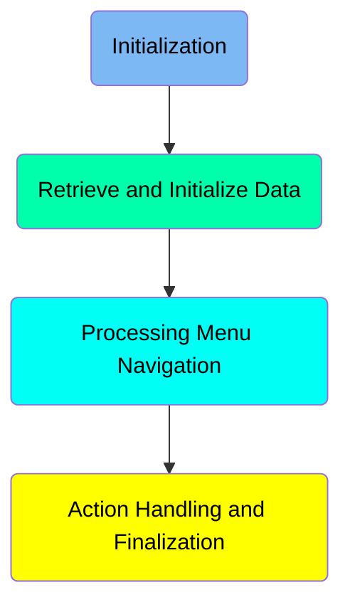
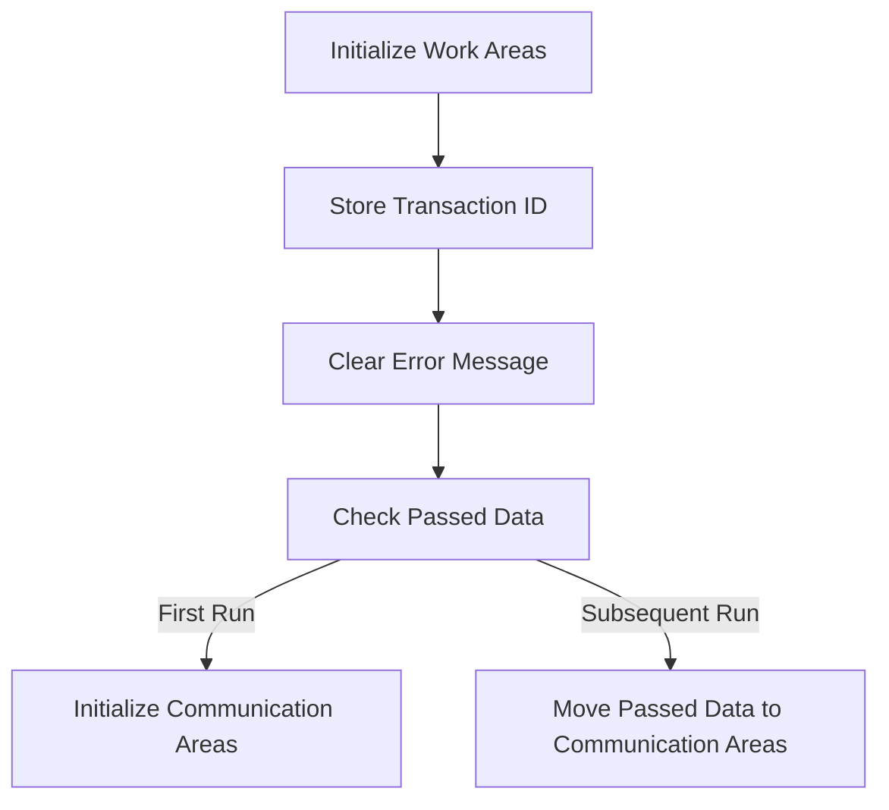
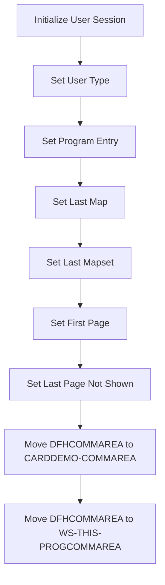
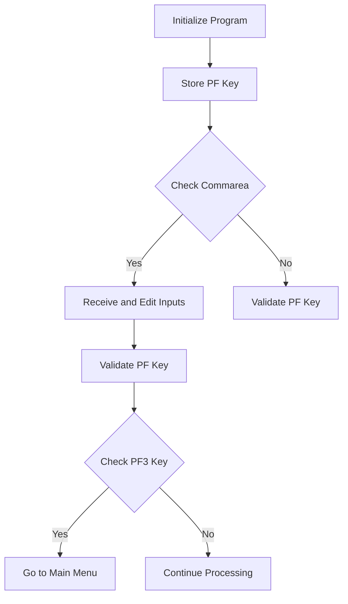
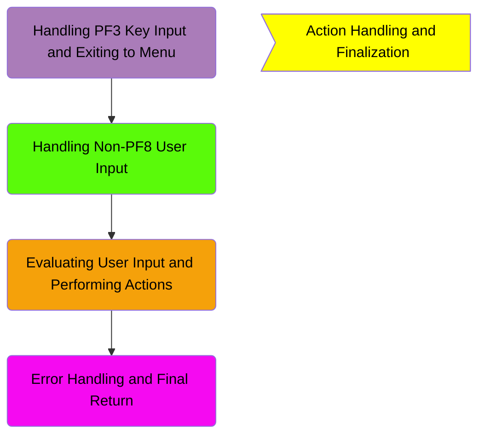
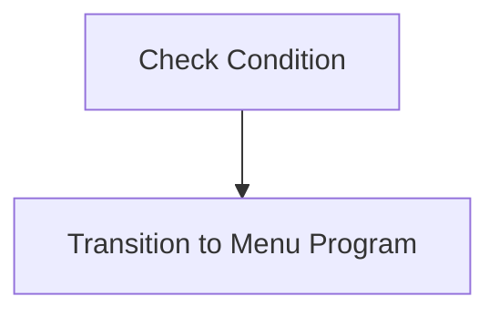
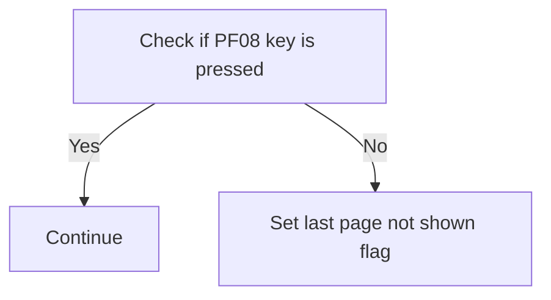
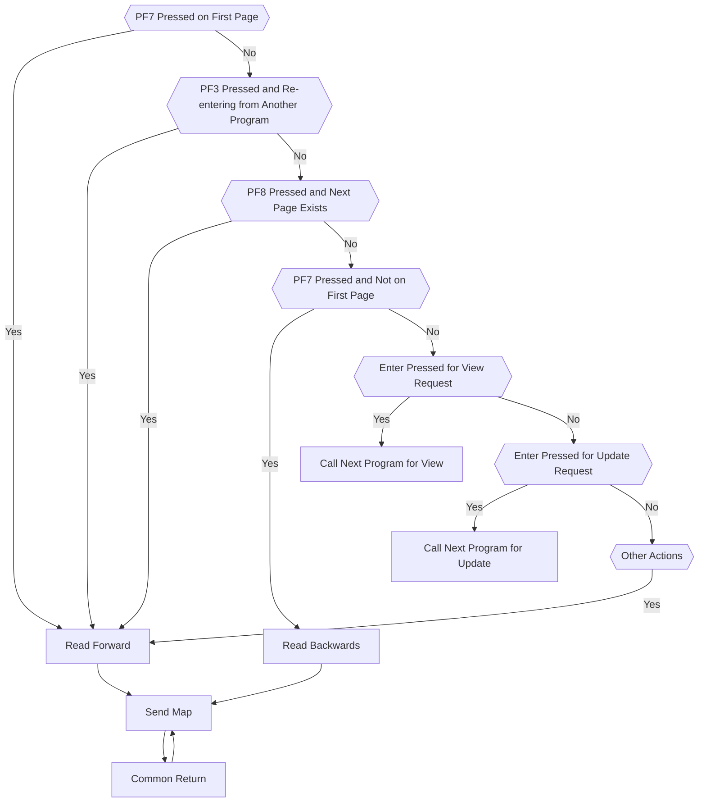
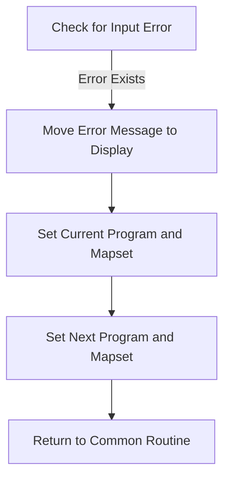

The COCRDLIC program is used for initializing and managing user sessions, handling menu navigation, and processing user actions within the CardDemo application. It achieves this by setting up necessary work areas, storing transaction IDs, clearing error messages, and checking passed data. The program also handles various user inputs and transitions between different states based on the actions performed.

The COCRDLIC program starts by initializing work areas and storing transaction IDs. It then clears any previous error messages and checks if there is any passed data. The program proceeds to retrieve and initialize user session data, set user types, and handle communication areas. It navigates through menus based on user inputs and validates function keys pressed by the user. Depending on the user actions, it either transitions to different programs or processes the inputs accordingly. Finally, it handles any errors and returns to a common routine to complete the transaction.

Here is a high level diagram of the program:



# Initialization



<SwmSnippet path="/app/cbl/COCRDLIC.cbl" line="299">

---

## Initialize Work Areas

First, the program initializes the work areas <SwmToken path="app/cbl/COCRDLIC.cbl" pos="299:3:7" line-data="           INITIALIZE CC-WORK-AREA                                              ">`CC-WORK-AREA`</SwmToken>, <SwmToken path="app/cbl/COCRDLIC.cbl" pos="300:1:5" line-data="                      WS-MISC-STORAGE                                           ">`WS-MISC-STORAGE`</SwmToken>, and <SwmToken path="app/cbl/COCRDLIC.cbl" pos="301:1:3" line-data="                      WS-COMMAREA                                               ">`WS-COMMAREA`</SwmToken>. This step sets up the necessary storage areas for the transaction processing.

```cobol
           INITIALIZE CC-WORK-AREA                                              
                      WS-MISC-STORAGE                                           
                      WS-COMMAREA                                               
```

---

</SwmSnippet>

<SwmSnippet path="/app/cbl/COCRDLIC.cbl" line="306">

---

## Store Transaction ID

Next, the program stores the current transaction ID by moving <SwmToken path="app/cbl/COCRDLIC.cbl" pos="306:3:5" line-data="           MOVE LIT-THISTRANID       TO WS-TRANID                               ">`LIT-THISTRANID`</SwmToken> to <SwmToken path="app/cbl/COCRDLIC.cbl" pos="306:9:11" line-data="           MOVE LIT-THISTRANID       TO WS-TRANID                               ">`WS-TRANID`</SwmToken>. This helps in tracking the transaction throughout its lifecycle.

```cobol
           MOVE LIT-THISTRANID       TO WS-TRANID                               
```

---

</SwmSnippet>

<SwmSnippet path="/app/cbl/COCRDLIC.cbl" line="310">

---

## Clear Error Message

Then, the program ensures that any previous error messages are cleared by setting <SwmToken path="app/cbl/COCRDLIC.cbl" pos="310:3:9" line-data="           SET WS-ERROR-MSG-OFF  TO TRUE                                        ">`WS-ERROR-MSG-OFF`</SwmToken> to TRUE. This prepares the system for a new transaction without any residual errors.

```cobol
           SET WS-ERROR-MSG-OFF  TO TRUE                                        
```

---

</SwmSnippet>

<SwmSnippet path="/app/cbl/COCRDLIC.cbl" line="314">

---

## Check Passed Data

Finally, the program checks if there is any passed data by evaluating <SwmToken path="app/cbl/COCRDLIC.cbl" pos="314:3:3" line-data="           IF EIBCALEN = 0">`EIBCALEN`</SwmToken>. If <SwmToken path="app/cbl/COCRDLIC.cbl" pos="314:3:3" line-data="           IF EIBCALEN = 0">`EIBCALEN`</SwmToken> is 0, it indicates the first run, and the communication areas <SwmToken path="app/cbl/COCRDLIC.cbl" pos="326:12:14" line-data="              MOVE DFHCOMMAREA (1:LENGTH OF CARDDEMO-COMMAREA) TO               ">`CARDDEMO-COMMAREA`</SwmToken> and <SwmToken path="app/cbl/COCRDLIC.cbl" pos="316:1:5" line-data="                         WS-THIS-PROGCOMMAREA ">`WS-THIS-PROGCOMMAREA`</SwmToken> are initialized.

```cobol
           IF EIBCALEN = 0
```

---

</SwmSnippet>

# Retrieve and Initialize Data

This is the next section of the flow.



<SwmSnippet path="/app/cbl/COCRDLIC.cbl" line="316">

---

## Initialize User Session

First, the program initializes the user session by moving the transaction ID to <SwmToken path="app/cbl/COCRDLIC.cbl" pos="317:9:13" line-data="              MOVE LIT-THISTRANID        TO CDEMO-FROM-TRANID                   ">`CDEMO-FROM-TRANID`</SwmToken>.

```cobol
                         WS-THIS-PROGCOMMAREA 
              MOVE LIT-THISTRANID        TO CDEMO-FROM-TRANID                   
```

---

</SwmSnippet>

<SwmSnippet path="/app/cbl/COCRDLIC.cbl" line="318">

---

## Set User Type

Next, it sets the user type to 'USER' by setting <SwmToken path="app/cbl/COCRDLIC.cbl" pos="319:3:7" line-data="              SET CDEMO-USRTYP-USER      TO TRUE                                ">`CDEMO-USRTYP-USER`</SwmToken> to TRUE.

```cobol
              MOVE LIT-THISPGM           TO CDEMO-FROM-PROGRAM                  
              SET CDEMO-USRTYP-USER      TO TRUE                                
```

---

</SwmSnippet>

<SwmSnippet path="/app/cbl/COCRDLIC.cbl" line="320">

---

## Set Program Entry

Then, it sets the program entry flag by setting <SwmToken path="app/cbl/COCRDLIC.cbl" pos="320:3:7" line-data="              SET CDEMO-PGM-ENTER        TO TRUE                                ">`CDEMO-PGM-ENTER`</SwmToken> to TRUE.

```cobol
              SET CDEMO-PGM-ENTER        TO TRUE                                
```

---

</SwmSnippet>

<SwmSnippet path="/app/cbl/COCRDLIC.cbl" line="321">

---

## Set Last Map

Moving to the next step, it sets the last map used by moving <SwmToken path="app/cbl/COCRDLIC.cbl" pos="321:3:5" line-data="              MOVE LIT-THISMAP           TO CDEMO-LAST-MAP                      ">`LIT-THISMAP`</SwmToken> to <SwmToken path="app/cbl/COCRDLIC.cbl" pos="321:9:13" line-data="              MOVE LIT-THISMAP           TO CDEMO-LAST-MAP                      ">`CDEMO-LAST-MAP`</SwmToken>.

```cobol
              MOVE LIT-THISMAP           TO CDEMO-LAST-MAP                      
```

---

</SwmSnippet>

<SwmSnippet path="/app/cbl/COCRDLIC.cbl" line="322">

---

## Set Last Mapset

Then, it sets the last mapset used by moving <SwmToken path="app/cbl/COCRDLIC.cbl" pos="322:3:5" line-data="              MOVE LIT-THISMAPSET        TO CDEMO-LAST-MAPSET                   ">`LIT-THISMAPSET`</SwmToken> to <SwmToken path="app/cbl/COCRDLIC.cbl" pos="322:9:13" line-data="              MOVE LIT-THISMAPSET        TO CDEMO-LAST-MAPSET                   ">`CDEMO-LAST-MAPSET`</SwmToken>.

```cobol
              MOVE LIT-THISMAPSET        TO CDEMO-LAST-MAPSET                   
```

---

</SwmSnippet>

<SwmSnippet path="/app/cbl/COCRDLIC.cbl" line="323">

---

## Set First Page

Next, it sets the first page flag by setting <SwmToken path="app/cbl/COCRDLIC.cbl" pos="323:3:7" line-data="              SET CA-FIRST-PAGE          TO TRUE                                ">`CA-FIRST-PAGE`</SwmToken> to TRUE.

```cobol
              SET CA-FIRST-PAGE          TO TRUE                                
```

---

</SwmSnippet>

<SwmSnippet path="/app/cbl/COCRDLIC.cbl" line="324">

---

## Set Last Page Not Shown

Then, it sets the last page not shown flag by setting <SwmToken path="app/cbl/COCRDLIC.cbl" pos="324:3:11" line-data="              SET CA-LAST-PAGE-NOT-SHOWN TO TRUE                                ">`CA-LAST-PAGE-NOT-SHOWN`</SwmToken> to TRUE.

```cobol
              SET CA-LAST-PAGE-NOT-SHOWN TO TRUE                                
```

---

</SwmSnippet>

<SwmSnippet path="/app/cbl/COCRDLIC.cbl" line="326">

---

## Move DFHCOMMAREA to <SwmToken path="app/cbl/COCRDLIC.cbl" pos="326:12:14" line-data="              MOVE DFHCOMMAREA (1:LENGTH OF CARDDEMO-COMMAREA) TO               ">`CARDDEMO-COMMAREA`</SwmToken>

Going into the next step, it moves the <SwmToken path="app/cbl/COCRDLIC.cbl" pos="326:3:3" line-data="              MOVE DFHCOMMAREA (1:LENGTH OF CARDDEMO-COMMAREA) TO               ">`DFHCOMMAREA`</SwmToken> to <SwmToken path="app/cbl/COCRDLIC.cbl" pos="326:12:14" line-data="              MOVE DFHCOMMAREA (1:LENGTH OF CARDDEMO-COMMAREA) TO               ">`CARDDEMO-COMMAREA`</SwmToken>.

```cobol
              MOVE DFHCOMMAREA (1:LENGTH OF CARDDEMO-COMMAREA) TO               
                                CARDDEMO-COMMAREA                               
```

---

</SwmSnippet>

<SwmSnippet path="/app/cbl/COCRDLIC.cbl" line="328">

---

## Move DFHCOMMAREA to <SwmToken path="app/cbl/COCRDLIC.cbl" pos="329:5:9" line-data="                               LENGTH OF WS-THIS-PROGCOMMAREA )TO               ">`WS-THIS-PROGCOMMAREA`</SwmToken>

Finally, it moves the remaining part of <SwmToken path="app/cbl/COCRDLIC.cbl" pos="328:3:3" line-data="              MOVE DFHCOMMAREA(LENGTH OF CARDDEMO-COMMAREA + 1:                 ">`DFHCOMMAREA`</SwmToken> to <SwmToken path="app/cbl/COCRDLIC.cbl" pos="329:5:9" line-data="                               LENGTH OF WS-THIS-PROGCOMMAREA )TO               ">`WS-THIS-PROGCOMMAREA`</SwmToken>.

```cobol
              MOVE DFHCOMMAREA(LENGTH OF CARDDEMO-COMMAREA + 1:                 
                               LENGTH OF WS-THIS-PROGCOMMAREA )TO               
                                WS-THIS-PROGCOMMAREA                            
```

---

</SwmSnippet>

# Processing Menu Navigation



<SwmSnippet path="/app/cbl/COCRDLIC.cbl" line="335">

---

## Initialize Program

First, the program checks if <SwmToken path="app/cbl/COCRDLIC.cbl" pos="335:4:8" line-data="           IF (CDEMO-PGM-ENTER                                                  ">`CDEMO-PGM-ENTER`</SwmToken> is true and <SwmToken path="app/cbl/COCRDLIC.cbl" pos="336:3:7" line-data="           AND CDEMO-FROM-PROGRAM NOT EQUAL LIT-THISPGM)                        ">`CDEMO-FROM-PROGRAM`</SwmToken> is not equal to <SwmToken path="app/cbl/COCRDLIC.cbl" pos="336:13:15" line-data="           AND CDEMO-FROM-PROGRAM NOT EQUAL LIT-THISPGM)                        ">`LIT-THISPGM`</SwmToken>. If these conditions are met, it initializes the working storage for the program, sets <SwmToken path="app/cbl/COCRDLIC.cbl" pos="335:4:8" line-data="           IF (CDEMO-PGM-ENTER                                                  ">`CDEMO-PGM-ENTER`</SwmToken> to true, moves <SwmToken path="app/cbl/COCRDLIC.cbl" pos="339:3:5" line-data="               MOVE LIT-THISMAP         TO CDEMO-LAST-MAP                       ">`LIT-THISMAP`</SwmToken> to <SwmToken path="app/cbl/COCRDLIC.cbl" pos="339:9:13" line-data="               MOVE LIT-THISMAP         TO CDEMO-LAST-MAP                       ">`CDEMO-LAST-MAP`</SwmToken>, and sets the first and last page indicators to true. This step ensures that the program is properly initialized and ready to process user inputs.

```cobol
           IF (CDEMO-PGM-ENTER                                                  
           AND CDEMO-FROM-PROGRAM NOT EQUAL LIT-THISPGM)                        
               INITIALIZE WS-THIS-PROGCOMMAREA
               SET CDEMO-PGM-ENTER      TO TRUE                                 
               MOVE LIT-THISMAP         TO CDEMO-LAST-MAP                       
               SET CA-FIRST-PAGE        TO TRUE                                 
               SET CA-LAST-PAGE-NOT-SHOWN TO TRUE                               
           END-IF 
```

---

</SwmSnippet>

<SwmSnippet path="/app/cbl/COCRDLIC.cbl" line="348">

---

## Store PF Key

Moving to the next step, the program performs the <SwmToken path="app/cbl/COCRDLIC.cbl" pos="348:3:7" line-data="           PERFORM YYYY-STORE-PFKEY                                             ">`YYYY-STORE-PFKEY`</SwmToken> paragraph to remap and store the PF keys as needed. This ensures that the function keys are correctly mapped for the user's session.

```cobol
           PERFORM YYYY-STORE-PFKEY                                             
              THRU YYYY-STORE-PFKEY-EXIT                                        
```

---

</SwmSnippet>

<SwmSnippet path="/app/cbl/COCRDLIC.cbl" line="356">

---

## Check Commarea

Next, the program checks if <SwmToken path="app/cbl/COCRDLIC.cbl" pos="356:3:3" line-data="           IF  EIBCALEN &gt; 0                                                     ">`EIBCALEN`</SwmToken> is greater than 0 and <SwmToken path="app/cbl/COCRDLIC.cbl" pos="357:3:7" line-data="           AND CDEMO-FROM-PROGRAM  EQUAL LIT-THISPGM                            ">`CDEMO-FROM-PROGRAM`</SwmToken> is equal to <SwmToken path="app/cbl/COCRDLIC.cbl" pos="357:11:13" line-data="           AND CDEMO-FROM-PROGRAM  EQUAL LIT-THISPGM                            ">`LIT-THISPGM`</SwmToken>. If these conditions are met, it performs the <SwmToken path="app/cbl/COCRDLIC.cbl" pos="358:3:7" line-data="               PERFORM 2000-RECEIVE-MAP                                         ">`2000-RECEIVE-MAP`</SwmToken> paragraph to read and edit the inputs given by the user. This step is crucial for processing any data passed through the communication area.

```cobol
           IF  EIBCALEN > 0                                                     
           AND CDEMO-FROM-PROGRAM  EQUAL LIT-THISPGM                            
               PERFORM 2000-RECEIVE-MAP                                         
               THRU    2000-RECEIVE-MAP-EXIT                                    
```

---

</SwmSnippet>

<SwmSnippet path="/app/cbl/COCRDLIC.cbl" line="369">

---

## Validate PF Key

Then, the program sets <SwmToken path="app/cbl/COCRDLIC.cbl" pos="369:3:5" line-data="           SET PFK-INVALID TO TRUE                                              ">`PFK-INVALID`</SwmToken> to true and checks if any of the function keys <SwmToken path="app/cbl/COCRDLIC.cbl" pos="370:3:7" line-data="           IF CCARD-AID-ENTER OR                                                ">`CCARD-AID-ENTER`</SwmToken>, <SwmToken path="app/cbl/COCRDLIC.cbl" pos="371:1:5" line-data="              CCARD-AID-PFK03 OR                                                ">`CCARD-AID-PFK03`</SwmToken>, <SwmToken path="app/cbl/COCRDLIC.cbl" pos="372:1:5" line-data="              CCARD-AID-PFK07 OR                                                ">`CCARD-AID-PFK07`</SwmToken>, or <SwmToken path="app/cbl/COCRDLIC.cbl" pos="373:1:5" line-data="              CCARD-AID-PFK08                                                   ">`CCARD-AID-PFK08`</SwmToken> are pressed. If any of these keys are pressed, it sets <SwmToken path="app/cbl/COCRDLIC.cbl" pos="374:3:5" line-data="               SET PFK-VALID TO TRUE                                            ">`PFK-VALID`</SwmToken> to true. This step validates the function key pressed by the user.

```cobol
           SET PFK-INVALID TO TRUE                                              
           IF CCARD-AID-ENTER OR                                                
              CCARD-AID-PFK03 OR                                                
              CCARD-AID-PFK07 OR                                                
              CCARD-AID-PFK08                                                   
               SET PFK-VALID TO TRUE                                            
           END-IF                                                               
```

---

</SwmSnippet>

<SwmSnippet path="/app/cbl/COCRDLIC.cbl" line="383">

---

## Check <SwmToken path="app/cbl/COCRDLIC.cbl" pos="381:11:11" line-data="      * If the user pressed PF3 go back to main menu                            ">`PF3`</SwmToken> Key

Finally, the program checks if the <SwmToken path="app/cbl/COCRDLIC.cbl" pos="383:4:8" line-data="           IF  (CCARD-AID-PFK03                                                 ">`CCARD-AID-PFK03`</SwmToken> key is pressed and <SwmToken path="app/cbl/COCRDLIC.cbl" pos="384:3:7" line-data="           AND CDEMO-FROM-PROGRAM  EQUAL LIT-THISPGM)                           ">`CDEMO-FROM-PROGRAM`</SwmToken> is equal to <SwmToken path="app/cbl/COCRDLIC.cbl" pos="384:11:13" line-data="           AND CDEMO-FROM-PROGRAM  EQUAL LIT-THISPGM)                           ">`LIT-THISPGM`</SwmToken>. If these conditions are met, it moves various literals to the communication area fields and sets the exit message indicator to true. This step prepares the program to return to the main menu if the <SwmToken path="app/cbl/COCRDLIC.cbl" pos="381:11:11" line-data="      * If the user pressed PF3 go back to main menu                            ">`PF3`</SwmToken> key is pressed.

```cobol
           IF  (CCARD-AID-PFK03                                                 
           AND CDEMO-FROM-PROGRAM  EQUAL LIT-THISPGM)                           
              MOVE LIT-THISTRANID   TO CDEMO-FROM-TRANID                        
              MOVE LIT-THISPGM      TO CDEMO-FROM-PROGRAM                       
              SET  CDEMO-USRTYP-USER TO TRUE                                    
              SET  CDEMO-PGM-ENTER  TO TRUE                                     
              MOVE LIT-THISMAPSET   TO CDEMO-LAST-MAPSET                        
              MOVE LIT-THISMAP      TO CDEMO-LAST-MAP                           
              MOVE LIT-MENUPGM      TO CDEMO-TO-PROGRAM                         
                                                                                
              MOVE LIT-MENUMAPSET   TO CCARD-NEXT-MAPSET                        
              MOVE LIT-THISMAP      TO CCARD-NEXT-MAP                           
              SET WS-EXIT-MESSAGE            TO TRUE                            
```

---

</SwmSnippet>

## Interim Summary

So far, we saw the initialization process, including setting up work areas, storing transaction IDs, clearing error messages, and checking passed data. Now, we will focus on retrieving and initializing data, which involves setting up the user session, program entry, and handling communication areas.

# Action Handling and Finalization

Lets split this section into smaller parts:



# Handling <SwmToken path="app/cbl/COCRDLIC.cbl" pos="381:11:11" line-data="      * If the user pressed PF3 go back to main menu                            ">`PF3`</SwmToken> Key Input and Exiting to Menu



<SwmSnippet path="/app/cbl/COCRDLIC.cbl" line="400">

---

## Transition to Menu Program

First, the program checks a condition to determine if it should transition to the menu program. If the condition is met, it executes the <SwmToken path="app/cbl/COCRDLIC.cbl" pos="401:1:5" line-data="              EXEC CICS XCTL                                                    ">`EXEC CICS XCTL`</SwmToken> command to transfer control to the program specified by <SwmToken path="app/cbl/COCRDLIC.cbl" pos="402:4:6" line-data="                        PROGRAM (LIT-MENUPGM)                                   ">`LIT-MENUPGM`</SwmToken>, passing along the communication area <SwmToken path="app/cbl/COCRDLIC.cbl" pos="403:3:5" line-data="                        COMMAREA(CARDDEMO-COMMAREA)                             ">`CARDDEMO-COMMAREA`</SwmToken>.

```cobol
      *                                                                         
              EXEC CICS XCTL                                                    
                        PROGRAM (LIT-MENUPGM)                                   
                        COMMAREA(CARDDEMO-COMMAREA)                             
              END-EXEC                                                          
           END-IF                                                               
      *****************************************************************         
      * If the user did not press PF8, lets reset the last page flag            
```

---

</SwmSnippet>

# Handling Non-PF8 User Input

This is the next section of the flow.



<SwmSnippet path="/app/cbl/COCRDLIC.cbl" line="409">

---

## Check if PF08 key is pressed

First, the code checks if the PF08 key (<SwmToken path="app/cbl/COCRDLIC.cbl" pos="409:3:7" line-data="           IF CCARD-AID-PFK08                                                   ">`CCARD-AID-PFK08`</SwmToken>) is pressed. If it is, the program continues without any further action.

```cobol
           IF CCARD-AID-PFK08                                                   
              CONTINUE                                                          
```

---

</SwmSnippet>

<SwmSnippet path="/app/cbl/COCRDLIC.cbl" line="411">

---

## Set last page not shown flag

If the PF08 key is not pressed, the code sets the <SwmToken path="app/cbl/COCRDLIC.cbl" pos="412:3:11" line-data="              SET CA-LAST-PAGE-NOT-SHOWN   TO TRUE                              ">`CA-LAST-PAGE-NOT-SHOWN`</SwmToken> flag to TRUE. This indicates that the last page of credit card records has not been shown to the user.

```cobol
           ELSE                                                                 
              SET CA-LAST-PAGE-NOT-SHOWN   TO TRUE                              
           END-IF                                                               
```

---

</SwmSnippet>

# Evaluating User Input and Performing Actions



<SwmSnippet path="/app/cbl/COCRDLIC.cbl" line="438">

---

## Handling <SwmToken path="app/cbl/COCRDLIC.cbl" pos="441:9:9" line-data="      *        PAGE UP - PF7 - BUT ALREADY ON FIRST PAGE                        ">`PF7`</SwmToken> on First Page

When <SwmToken path="app/cbl/COCRDLIC.cbl" pos="441:9:9" line-data="      *        PAGE UP - PF7 - BUT ALREADY ON FIRST PAGE                        ">`PF7`</SwmToken> is pressed and the user is already on the first page, the system reads forward to display the next set of records.

```cobol
               WHEN CCARD-AID-PFK07                                             
                    AND CA-FIRST-PAGE                                           
      *****************************************************************         
      *        PAGE UP - PF7 - BUT ALREADY ON FIRST PAGE                        
      *****************************************************************         
               WHEN CCARD-AID-PFK07                                             
                    AND CA-FIRST-PAGE                                           
                    MOVE WS-CA-FIRST-CARD-NUM                                   
                                  TO WS-CARD-RID-CARDNUM                        
      *             MOVE WS-CA-FIRST-CARD-ACCT-ID                               
      *                           TO WS-CARD-RID-ACCT-ID                        
                    PERFORM 9000-READ-FORWARD                                   
                       THRU 9000-READ-FORWARD-EXIT                              
                    PERFORM 1000-SEND-MAP                                       
                       THRU 1000-SEND-MAP                                       
                    GO TO COMMON-RETURN                                         
```

---

</SwmSnippet>

<SwmSnippet path="/app/cbl/COCRDLIC.cbl" line="457">

---

## Handling <SwmToken path="app/cbl/COCRDLIC.cbl" pos="381:11:11" line-data="      * If the user pressed PF3 go back to main menu                            ">`PF3`</SwmToken> Re-enter from Another Program

When <SwmToken path="app/cbl/COCRDLIC.cbl" pos="381:11:11" line-data="      * If the user pressed PF3 go back to main menu                            ">`PF3`</SwmToken> is pressed and the user is re-entering from another program, the system initializes the communication area and reads forward to display the records.

```cobol
               WHEN CCARD-AID-PFK03                                             
               WHEN CDEMO-PGM-REENTER AND                                       
                    CDEMO-FROM-PROGRAM NOT EQUAL LIT-THISPGM                    
                                                                                
                    INITIALIZE CARDDEMO-COMMAREA                                
                               WS-THIS-PROGCOMMAREA                             
                    MOVE LIT-THISTRANID      TO CDEMO-FROM-TRANID               
                    MOVE LIT-THISPGM         TO CDEMO-FROM-PROGRAM              
                    SET CDEMO-USRTYP-USER    TO TRUE                            
                    SET CDEMO-PGM-ENTER      TO TRUE                            
                    MOVE LIT-THISMAP         TO CDEMO-LAST-MAP                  
                    MOVE LIT-THISMAPSET      TO CDEMO-LAST-MAPSET               
                    SET CA-FIRST-PAGE        TO TRUE                            
                    SET CA-LAST-PAGE-NOT-SHOWN TO TRUE                          
                                                                                
                    MOVE WS-CA-FIRST-CARD-NUM                                   
                                  TO WS-CARD-RID-CARDNUM                        
      *             MOVE WS-CA-FIRST-CARD-ACCT-ID                               
      *                           TO WS-CARD-RID-ACCT-ID                        
                                                                                
                    PERFORM 9000-READ-FORWARD                                   
```

---

</SwmSnippet>

<SwmSnippet path="/app/cbl/COCRDLIC.cbl" line="485">

---

## Handling <SwmToken path="app/cbl/COCRDLIC.cbl" pos="407:15:15" line-data="      * If the user did not press PF8, lets reset the last page flag            ">`PF8`</SwmToken> for Next Page

When <SwmToken path="app/cbl/COCRDLIC.cbl" pos="407:15:15" line-data="      * If the user did not press PF8, lets reset the last page flag            ">`PF8`</SwmToken> is pressed and there is a next page, the system reads forward to display the next set of records.

```cobol
               WHEN CCARD-AID-PFK08                                             
                    AND CA-NEXT-PAGE-EXISTS                                     
                    MOVE WS-CA-LAST-CARD-NUM                                    
                                  TO WS-CARD-RID-CARDNUM                        
      *             MOVE WS-CA-LAST-CARD-ACCT-ID                                
      *                           TO WS-CARD-RID-ACCT-ID                        
                    ADD   +1       TO WS-CA-SCREEN-NUM                          
                    PERFORM 9000-READ-FORWARD                                   
                       THRU 9000-READ-FORWARD-EXIT                              
                    PERFORM 1000-SEND-MAP                                       
                       THRU 1000-SEND-MAP-EXIT                                  
                    GO TO COMMON-RETURN                                         
```

---

</SwmSnippet>

<SwmSnippet path="/app/cbl/COCRDLIC.cbl" line="500">

---

## Handling <SwmToken path="app/cbl/COCRDLIC.cbl" pos="441:9:9" line-data="      *        PAGE UP - PF7 - BUT ALREADY ON FIRST PAGE                        ">`PF7`</SwmToken> for Previous Page

When <SwmToken path="app/cbl/COCRDLIC.cbl" pos="441:9:9" line-data="      *        PAGE UP - PF7 - BUT ALREADY ON FIRST PAGE                        ">`PF7`</SwmToken> is pressed and the user is not on the first page, the system reads backwards to display the previous set of records.

```cobol
               WHEN CCARD-AID-PFK07                                             
                    AND NOT CA-FIRST-PAGE                                       
                                                                                
                    MOVE WS-CA-FIRST-CARD-NUM                                   
                                  TO WS-CARD-RID-CARDNUM                        
      *             MOVE WS-CA-FIRST-CARD-ACCT-ID                               
      *                           TO WS-CARD-RID-ACCT-ID                        
                    SUBTRACT 1    FROM WS-CA-SCREEN-NUM                         
                    PERFORM 9100-READ-BACKWARDS                                 
                       THRU 9100-READ-BACKWARDS-EXIT                            
                    PERFORM 1000-SEND-MAP                                       
                       THRU 1000-SEND-MAP-EXIT                                  
                    GO TO COMMON-RETURN                                         
```

---

</SwmSnippet>

<SwmSnippet path="/app/cbl/COCRDLIC.cbl" line="516">

---

## Handling Enter for View Request

When Enter is pressed for a view request, the system transfers control to the card detail view program.

```cobol
               WHEN CCARD-AID-ENTER                                             
                AND VIEW-REQUESTED-ON(I-SELECTED)                               
                AND CDEMO-FROM-PROGRAM  EQUAL LIT-THISPGM                       
                   MOVE LIT-THISTRANID    TO CDEMO-FROM-TRANID                  
                   MOVE LIT-THISPGM       TO CDEMO-FROM-PROGRAM                 
                   SET  CDEMO-USRTYP-USER TO TRUE                               
                   SET  CDEMO-PGM-ENTER   TO TRUE                               
                   MOVE LIT-THISMAPSET    TO CDEMO-LAST-MAPSET                  
                   MOVE LIT-THISMAP       TO CDEMO-LAST-MAP                     
                   MOVE LIT-CARDDTLPGM    TO CCARD-NEXT-PROG                    
                                                                                
                   MOVE LIT-CARDDTLMAPSET TO CCARD-NEXT-MAPSET                  
                   MOVE LIT-CARDDTLMAP    TO CCARD-NEXT-MAP                     
                                                                                
                   MOVE WS-ROW-ACCTNO (I-SELECTED)                              
                                          TO CDEMO-ACCT-ID                      
                   MOVE WS-ROW-CARD-NUM (I-SELECTED)                            
                                          TO CDEMO-CARD-NUM                     
                                                                                
      *            CALL CARD DETAIL PROGRAM                                     
      *                                                                         
```

---

</SwmSnippet>

<SwmSnippet path="/app/cbl/COCRDLIC.cbl" line="544">

---

## Handling Enter for Update Request

When Enter is pressed for an update request, the system transfers control to the card update program.

```cobol
               WHEN CCARD-AID-ENTER                                             
                AND UPDATE-REQUESTED-ON(I-SELECTED)                             
                AND CDEMO-FROM-PROGRAM  EQUAL LIT-THISPGM                       
                   MOVE LIT-THISTRANID    TO CDEMO-FROM-TRANID                  
                   MOVE LIT-THISPGM       TO CDEMO-FROM-PROGRAM                 
                   SET  CDEMO-USRTYP-USER TO TRUE                               
                   SET  CDEMO-PGM-ENTER   TO TRUE                               
                   MOVE LIT-THISMAPSET    TO CDEMO-LAST-MAPSET                  
                   MOVE LIT-THISMAP       TO CDEMO-LAST-MAP                     
                   MOVE LIT-CARDUPDPGM    TO CCARD-NEXT-PROG                    
                                                                                
                   MOVE LIT-CARDUPDMAPSET TO CCARD-NEXT-MAPSET                  
                   MOVE LIT-CARDUPDMAP    TO CCARD-NEXT-MAP                     
                                                                                
                   MOVE WS-ROW-ACCTNO (I-SELECTED)                              
                                          TO CDEMO-ACCT-ID                      
                   MOVE WS-ROW-CARD-NUM (I-SELECTED)                            
                                          TO CDEMO-CARD-NUM                     
                                                                                
      *            CALL CARD UPDATE PROGRAM                                     
      *                                                                         
```

---

</SwmSnippet>

<SwmSnippet path="/app/cbl/COCRDLIC.cbl" line="571">

---

## Handling Other Actions

For any other actions, the system reads forward to display the records.

```cobol
               WHEN OTHER                                                       
      *****************************************************************         
                    MOVE WS-CA-FIRST-CARD-NUM                                   
                                  TO WS-CARD-RID-CARDNUM                        
      *             MOVE WS-CA-FIRST-CARD-ACCT-ID                               
      *                           TO WS-CARD-RID-ACCT-ID                        
                    PERFORM 9000-READ-FORWARD                                   
                       THRU 9000-READ-FORWARD-EXIT                              
                    PERFORM 1000-SEND-MAP                                       
                       THRU 1000-SEND-MAP                                       
                    GO TO COMMON-RETURN                                         
           END-EVALUATE                                                         
```

---

</SwmSnippet>

# Error Handling and Final Return



<SwmSnippet path="/app/cbl/COCRDLIC.cbl" line="585">

---

## Check for Input Error

First, the code checks if there is an input error by evaluating the <SwmToken path="app/cbl/COCRDLIC.cbl" pos="585:3:5" line-data="           IF INPUT-ERROR                                                       ">`INPUT-ERROR`</SwmToken> flag. If an error is detected, the subsequent steps are executed to handle the error.

```cobol
           IF INPUT-ERROR                                                       
```

---

</SwmSnippet>

<SwmSnippet path="/app/cbl/COCRDLIC.cbl" line="586">

---

## Move Error Message to Display

Next, the error message stored in <SwmToken path="app/cbl/COCRDLIC.cbl" pos="586:3:7" line-data="              MOVE WS-ERROR-MSG   TO CCARD-ERROR-MSG                            ">`WS-ERROR-MSG`</SwmToken> is moved to <SwmToken path="app/cbl/COCRDLIC.cbl" pos="586:11:15" line-data="              MOVE WS-ERROR-MSG   TO CCARD-ERROR-MSG                            ">`CCARD-ERROR-MSG`</SwmToken> to be displayed to the user.

```cobol
              MOVE WS-ERROR-MSG   TO CCARD-ERROR-MSG                            
```

---

</SwmSnippet>

<SwmSnippet path="/app/cbl/COCRDLIC.cbl" line="587">

---

## Set Current Program and Mapset

Then, the current program, mapset, and map are set by moving <SwmToken path="app/cbl/COCRDLIC.cbl" pos="587:3:5" line-data="              MOVE LIT-THISPGM     TO CDEMO-FROM-PROGRAM                        ">`LIT-THISPGM`</SwmToken>, <SwmToken path="app/cbl/COCRDLIC.cbl" pos="588:3:5" line-data="              MOVE LIT-THISMAPSET  TO CDEMO-LAST-MAPSET                         ">`LIT-THISMAPSET`</SwmToken>, and <SwmToken path="app/cbl/COCRDLIC.cbl" pos="589:3:5" line-data="              MOVE LIT-THISMAP     TO CDEMO-LAST-MAP                            ">`LIT-THISMAP`</SwmToken> to <SwmToken path="app/cbl/COCRDLIC.cbl" pos="587:9:13" line-data="              MOVE LIT-THISPGM     TO CDEMO-FROM-PROGRAM                        ">`CDEMO-FROM-PROGRAM`</SwmToken>, <SwmToken path="app/cbl/COCRDLIC.cbl" pos="588:9:13" line-data="              MOVE LIT-THISMAPSET  TO CDEMO-LAST-MAPSET                         ">`CDEMO-LAST-MAPSET`</SwmToken>, and <SwmToken path="app/cbl/COCRDLIC.cbl" pos="589:9:13" line-data="              MOVE LIT-THISMAP     TO CDEMO-LAST-MAP                            ">`CDEMO-LAST-MAP`</SwmToken> respectively.

```cobol
              MOVE LIT-THISPGM     TO CDEMO-FROM-PROGRAM                        
              MOVE LIT-THISMAPSET  TO CDEMO-LAST-MAPSET                         
              MOVE LIT-THISMAP     TO CDEMO-LAST-MAP                            
```

---

</SwmSnippet>

<SwmSnippet path="/app/cbl/COCRDLIC.cbl" line="591">

---

## Set Next Program and Mapset

Moving to the next step, the next program, mapset, and map are set by moving <SwmToken path="app/cbl/COCRDLIC.cbl" pos="591:3:5" line-data="              MOVE LIT-THISPGM     TO CCARD-NEXT-PROG                           ">`LIT-THISPGM`</SwmToken>, <SwmToken path="app/cbl/COCRDLIC.cbl" pos="592:3:5" line-data="              MOVE LIT-THISMAPSET  TO CCARD-NEXT-MAPSET                         ">`LIT-THISMAPSET`</SwmToken>, and <SwmToken path="app/cbl/COCRDLIC.cbl" pos="593:3:5" line-data="              MOVE LIT-THISMAP     TO CCARD-NEXT-MAP                            ">`LIT-THISMAP`</SwmToken> to <SwmToken path="app/cbl/COCRDLIC.cbl" pos="591:9:13" line-data="              MOVE LIT-THISPGM     TO CCARD-NEXT-PROG                           ">`CCARD-NEXT-PROG`</SwmToken>, <SwmToken path="app/cbl/COCRDLIC.cbl" pos="592:9:13" line-data="              MOVE LIT-THISMAPSET  TO CCARD-NEXT-MAPSET                         ">`CCARD-NEXT-MAPSET`</SwmToken>, and <SwmToken path="app/cbl/COCRDLIC.cbl" pos="593:9:13" line-data="              MOVE LIT-THISMAP     TO CCARD-NEXT-MAP                            ">`CCARD-NEXT-MAP`</SwmToken> respectively.

```cobol
              MOVE LIT-THISPGM     TO CCARD-NEXT-PROG                           
              MOVE LIT-THISMAPSET  TO CCARD-NEXT-MAPSET                         
              MOVE LIT-THISMAP     TO CCARD-NEXT-MAP                            
```

---

</SwmSnippet>

<SwmSnippet path="/app/cbl/COCRDLIC.cbl" line="596">

---

## Return to Common Routine

Finally, the flow goes to the <SwmToken path="app/cbl/COCRDLIC.cbl" pos="596:5:7" line-data="              GO TO COMMON-RETURN                                               ">`COMMON-RETURN`</SwmToken> routine to handle the return process.

```cobol
              GO TO COMMON-RETURN                                               
```

---

</SwmSnippet>

<SwmSnippet path="/app/cbl/COCRDLIC.cbl" line="603">

---

### <SwmToken path="app/cbl/COCRDLIC.cbl" pos="603:1:3" line-data="       COMMON-RETURN.                                                           ">`COMMON-RETURN`</SwmToken> Routine

The <SwmToken path="app/cbl/COCRDLIC.cbl" pos="603:1:3" line-data="       COMMON-RETURN.                                                           ">`COMMON-RETURN`</SwmToken> routine sets up the transaction ID, program, mapset, and map for the return process, and then executes the CICS RETURN command to complete the transaction.

```cobol
       COMMON-RETURN.                                                           
           MOVE  LIT-THISTRANID TO CDEMO-FROM-TRANID                            
           MOVE  LIT-THISPGM     TO CDEMO-FROM-PROGRAM                          
           MOVE  LIT-THISMAPSET  TO CDEMO-LAST-MAPSET                           
           MOVE  LIT-THISMAP     TO CDEMO-LAST-MAP                              
           MOVE  CARDDEMO-COMMAREA    TO WS-COMMAREA                            
           MOVE  WS-THIS-PROGCOMMAREA TO                                        
                  WS-COMMAREA(LENGTH OF CARDDEMO-COMMAREA + 1:                  
                               LENGTH OF WS-THIS-PROGCOMMAREA )                 
                                                                                
                                                                                
           EXEC CICS RETURN                                                     
                TRANSID (LIT-THISTRANID)                                        
                COMMAREA (WS-COMMAREA)                                          
                LENGTH(LENGTH OF WS-COMMAREA)                                   
           END-EXEC                                                             
```

---

</SwmSnippet>

&nbsp;

*This is an auto-generated document by Swimm 🌊 and has not yet been verified by a human*

<SwmMeta version="3.0.0" repo-id="Z2l0aHViJTNBJTNBa3luZHJ5bC1hd3MtbWFpbmZyYW1lLW1vZGVybml6YXRpb24tY2FyZGRlbW8lM0ElM0FTd2ltbS1EZW1v" repo-name="kyndryl-aws-mainframe-modernization-carddemo"><sup>Powered by [Swimm](https://staging.swimm.cloud/)</sup></SwmMeta>
