The COCRDLIC program is designed to list credit cards for users. If no context is passed and the user is an admin, it lists all credit cards. Otherwise, it lists only the credit cards associated with the account in the communication area (COMMAREA).

For example, if an admin user accesses the program without any specific context, they will see a list of all credit cards. If a non-admin user accesses the program with a specific account in the COMMAREA, they will only see the credit cards associated with that account.

# Handle user navigation (<SwmToken path="app/cbl/COCRDLIC.cbl" pos="298:1:3" line-data="       0000-MAIN.                                                               ">`0000-MAIN`</SwmToken>)

Let's split this section into smaller parts:

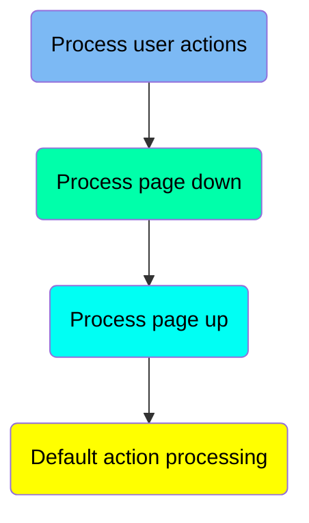

## Process user actions

First, we'll zoom into this section of the flow:

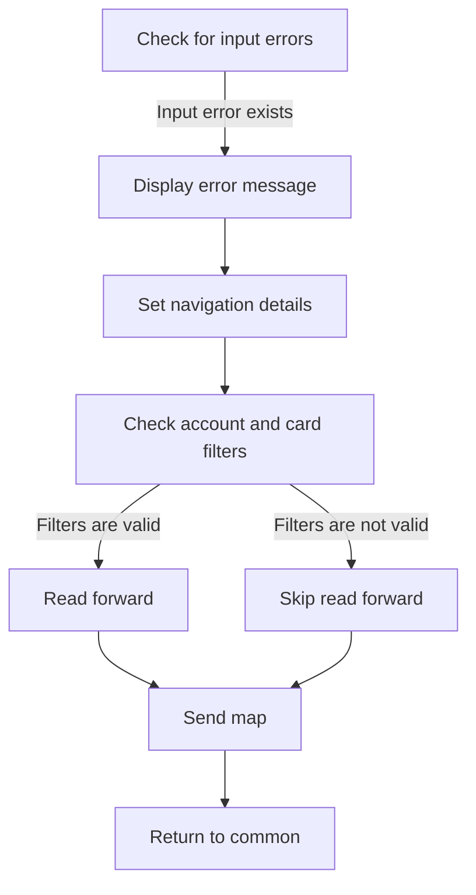

<SwmSnippet path="/app/cbl/COCRDLIC.cbl" line="418">

---

### Handling Input Errors

Going into the snippet, the code first checks for any input errors. If an input error is detected, it sets the error message and navigation details to prompt the user for corrections. It then verifies the account and card filters to determine if they are valid. If the filters are valid, it proceeds to read the next set of records. Finally, it sends the updated map to the user and returns control to the common return point.

```cobol
           EVALUATE TRUE                                                        
               WHEN INPUT-ERROR                                                 
      *****************************************************************         
      *        ASK FOR CORRECTIONS TO INPUTS                                    
      *****************************************************************         
                    MOVE WS-ERROR-MSG    TO CCARD-ERROR-MSG                     
                    MOVE LIT-THISPGM     TO CDEMO-FROM-PROGRAM                  
                    MOVE LIT-THISMAPSET  TO CDEMO-LAST-MAPSET                   
                    MOVE LIT-THISMAP     TO CDEMO-LAST-MAP                      
                                                                                
                    MOVE LIT-THISPGM     TO CCARD-NEXT-PROG                     
                    MOVE LIT-THISMAPSET  TO CCARD-NEXT-MAPSET                   
                    MOVE LIT-THISMAP     TO CCARD-NEXT-MAP                      
                    IF  NOT FLG-ACCTFILTER-NOT-OK                               
                    AND NOT FLG-CARDFILTER-NOT-OK                               
                       PERFORM 9000-READ-FORWARD                                
                          THRU 9000-READ-FORWARD-EXIT                           
                    END-IF                                                      
                    PERFORM 1000-SEND-MAP                                       
                       THRU 1000-SEND-MAP                                       
                    GO TO COMMON-RETURN                                         
```

---

</SwmSnippet>

## Process page down

Now, lets zoom into this section of the flow:

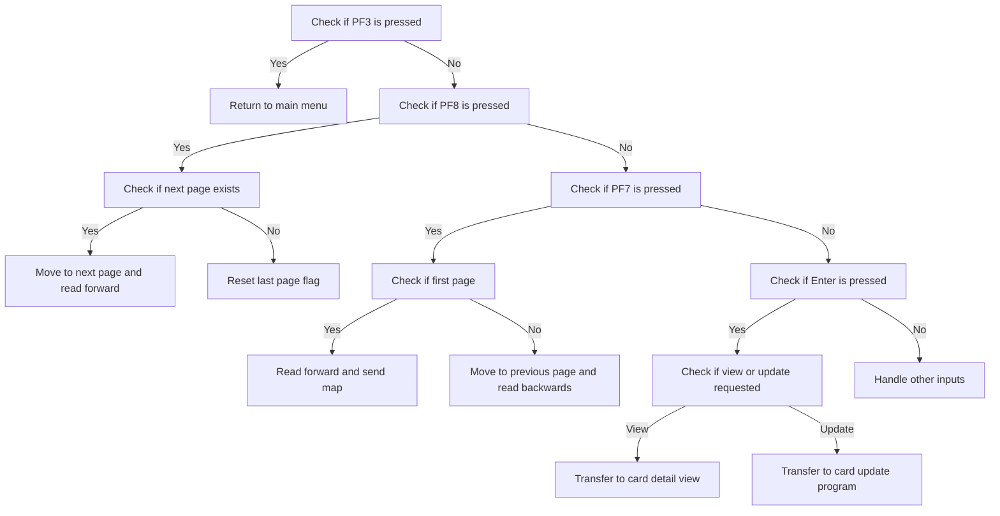

<SwmSnippet path="/app/cbl/COCRDLIC.cbl" line="473">

---

### Handling <SwmToken path="app/cbl/COCRDLIC.cbl" pos="382:11:11" line-data="      * If the user pressed PF3 go back to main menu                            ">`PF3`</SwmToken> Key Press

Going into the snippet, the code checks if the <SwmToken path="app/cbl/COCRDLIC.cbl" pos="382:11:11" line-data="      * If the user pressed PF3 go back to main menu                            ">`PF3`</SwmToken> key is pressed and if the user is coming from the same program. If both conditions are met, it sets up the necessary context to return to the main menu.

```cobol
                    MOVE WS-CA-FIRST-CARD-NUM                                   
                                  TO WS-CARD-RID-CARDNUM                        
      *             MOVE WS-CA-FIRST-CARD-ACCT-ID                               
      *                           TO WS-CARD-RID-ACCT-ID                        
                                                                                
                    PERFORM 9000-READ-FORWARD                                   
                       THRU 9000-READ-FORWARD-EXIT                              
                    PERFORM 1000-SEND-MAP                                       
                       THRU 1000-SEND-MAP                                       
```

---

</SwmSnippet>

<SwmSnippet path="/app/cbl/COCRDLIC.cbl" line="482">

---

### Handling <SwmToken path="app/cbl/COCRDLIC.cbl" pos="408:15:15" line-data="      * If the user did not press PF8, lets reset the last page flag            ">`PF8`</SwmToken> Key Press

Next, the code checks if the <SwmToken path="app/cbl/COCRDLIC.cbl" pos="408:15:15" line-data="      * If the user did not press PF8, lets reset the last page flag            ">`PF8`</SwmToken> key is pressed and if there is a next page available. If both conditions are true, it moves to the next page by updating the screen number and reading the next set of credit card records.

```cobol
                    GO TO COMMON-RETURN                                         
      *****************************************************************         
      *        PAGE DOWN                                                        
      *****************************************************************         
               WHEN CCARD-AID-PFK08                                             
                    AND CA-NEXT-PAGE-EXISTS                                     
                    MOVE WS-CA-LAST-CARD-NUM                                    
                                  TO WS-CARD-RID-CARDNUM                        
      *             MOVE WS-CA-LAST-CARD-ACCT-ID                                
      *                           TO WS-CARD-RID-ACCT-ID                        
                    ADD   +1       TO WS-CA-SCREEN-NUM                          
```

---

</SwmSnippet>

<SwmSnippet path="/app/cbl/COCRDLIC.cbl" line="493">

---

### Handling <SwmToken path="app/cbl/COCRDLIC.cbl" pos="442:9:9" line-data="      *        PAGE UP - PF7 - BUT ALREADY ON FIRST PAGE                        ">`PF7`</SwmToken> Key Press

Then, the code checks if the <SwmToken path="app/cbl/COCRDLIC.cbl" pos="442:9:9" line-data="      *        PAGE UP - PF7 - BUT ALREADY ON FIRST PAGE                        ">`PF7`</SwmToken> key is pressed and if the current page is the first page. If both conditions are met, it reads the first set of credit card records and sends the map to display them.

```cobol
                    PERFORM 9000-READ-FORWARD                                   
                       THRU 9000-READ-FORWARD-EXIT                              
                    PERFORM 1000-SEND-MAP                                       
                       THRU 1000-SEND-MAP-EXIT                                  
```

---

</SwmSnippet>

## Process page up

Now, lets zoom into this section of the flow:

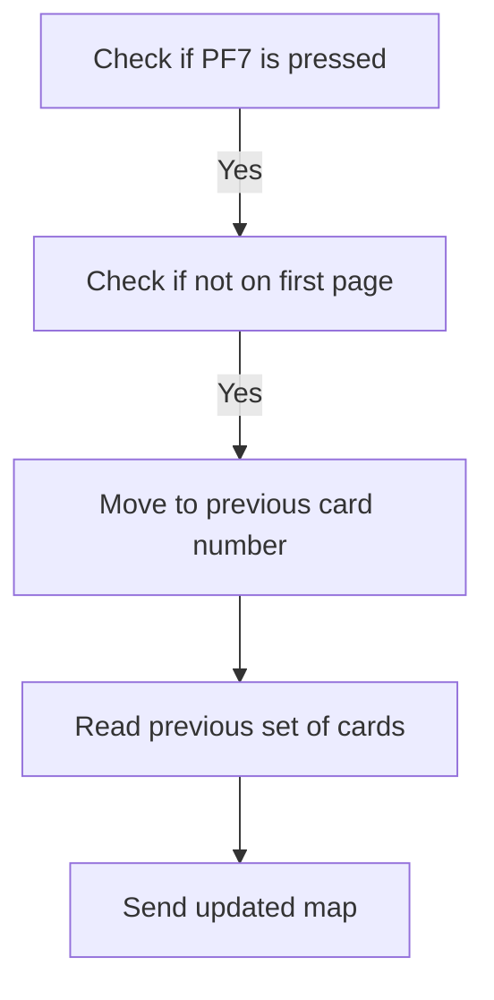

<SwmSnippet path="/app/cbl/COCRDLIC.cbl" line="501">

---

### Handling <SwmToken path="app/cbl/COCRDLIC.cbl" pos="442:9:9" line-data="      *        PAGE UP - PF7 - BUT ALREADY ON FIRST PAGE                        ">`PF7`</SwmToken> Key Press for Page Up

Going into the snippet, the code checks if the <SwmToken path="app/cbl/COCRDLIC.cbl" pos="442:9:9" line-data="      *        PAGE UP - PF7 - BUT ALREADY ON FIRST PAGE                        ">`PF7`</SwmToken> key is pressed and if the user is not on the first page. If both conditions are met, it navigates to the previous set of cards and updates the display for the user.

```cobol
               WHEN CCARD-AID-PFK07                                             
                    AND NOT CA-FIRST-PAGE                                       
                                                                                
                    MOVE WS-CA-FIRST-CARD-NUM                                   
                                  TO WS-CARD-RID-CARDNUM                        
      *             MOVE WS-CA-FIRST-CARD-ACCT-ID                               
      *                           TO WS-CARD-RID-ACCT-ID                        
                    SUBTRACT 1    FROM WS-CA-SCREEN-NUM                         
                    PERFORM 9100-READ-BACKWARDS                                 
                       THRU 9100-READ-BACKWARDS-EXIT                            
                    PERFORM 1000-SEND-MAP                                       
                       THRU 1000-SEND-MAP-EXIT                                  
```

---

</SwmSnippet>

<SwmSnippet path="/app/cbl/COCRDLIC.cbl" line="513">

---

### Transferring to Card Detail View

Next, the code checks if the Enter key is pressed and if the user has requested to view details. If the current program is the same as the one stored in the context, it sets up the necessary parameters and transfers control to the card detail view program.

```cobol
                    GO TO COMMON-RETURN                                         
      *****************************************************************         
      *        TRANSFER TO CARD DETAIL VIEW                                     
      *****************************************************************         
               WHEN CCARD-AID-ENTER                                             
                AND VIEW-REQUESTED-ON(I-SELECTED)                               
                AND CDEMO-FROM-PROGRAM  EQUAL LIT-THISPGM                       
                   MOVE LIT-THISTRANID    TO CDEMO-FROM-TRANID                  
                   MOVE LIT-THISPGM       TO CDEMO-FROM-PROGRAM                 
                   SET  CDEMO-USRTYP-USER TO TRUE                               
                   SET  CDEMO-PGM-ENTER   TO TRUE                               
                   MOVE LIT-THISMAPSET    TO CDEMO-LAST-MAPSET                  
                   MOVE LIT-THISMAP       TO CDEMO-LAST-MAP                     
                   MOVE LIT-CARDDTLPGM    TO CCARD-NEXT-PROG                    
                                                                                
                   MOVE LIT-CARDDTLMAPSET TO CCARD-NEXT-MAPSET                  
                   MOVE LIT-CARDDTLMAP    TO CCARD-NEXT-MAP                     
                                                                                
                   MOVE WS-ROW-ACCTNO (I-SELECTED)                              
                                          TO CDEMO-ACCT-ID                      
                   MOVE WS-ROW-CARD-NUM (I-SELECTED)                            
                                          TO CDEMO-CARD-NUM                     
```

---

</SwmSnippet>

<SwmSnippet path="/app/cbl/COCRDLIC.cbl" line="538">

---

### Executing Card Detail Program

Then, the code executes the card detail program by transferring control to it and passing the communication area data.

```cobol
                   EXEC CICS XCTL                                               
                        PROGRAM (CCARD-NEXT-PROG)                               
                        COMMAREA(CARDDEMO-COMMAREA)                             
                   END-EXEC                                                     
```

---

</SwmSnippet>

<SwmSnippet path="/app/cbl/COCRDLIC.cbl" line="545">

---

### Transferring to Card Update Program

Finally, the code checks if the Enter key is pressed and if the user has requested an update. If the current program is the same as the one stored in the context, it sets up the necessary parameters and transfers control to the card update program.

```cobol
               WHEN CCARD-AID-ENTER                                             
                AND UPDATE-REQUESTED-ON(I-SELECTED)                             
                AND CDEMO-FROM-PROGRAM  EQUAL LIT-THISPGM                       
                   MOVE LIT-THISTRANID    TO CDEMO-FROM-TRANID                  
                   MOVE LIT-THISPGM       TO CDEMO-FROM-PROGRAM                 
                   SET  CDEMO-USRTYP-USER TO TRUE                               
                   SET  CDEMO-PGM-ENTER   TO TRUE                               
                   MOVE LIT-THISMAPSET    TO CDEMO-LAST-MAPSET                  
                   MOVE LIT-THISMAP       TO CDEMO-LAST-MAP                     
                   MOVE LIT-CARDUPDPGM    TO CCARD-NEXT-PROG                    
                                                                                
                   MOVE LIT-CARDUPDMAPSET TO CCARD-NEXT-MAPSET                  
                   MOVE LIT-CARDUPDMAP    TO CCARD-NEXT-MAP                     
                                                                                
                   MOVE WS-ROW-ACCTNO (I-SELECTED)                              
                                          TO CDEMO-ACCT-ID                      
                   MOVE WS-ROW-CARD-NUM (I-SELECTED)                            
                                          TO CDEMO-CARD-NUM                     
                                                                                
      *            CALL CARD UPDATE PROGRAM                                     
      *                                                                         
                   EXEC CICS XCTL                                               
                        PROGRAM (CCARD-NEXT-PROG)                               
                        COMMAREA(CARDDEMO-COMMAREA)                             
                   END-EXEC                                                     
```

---

</SwmSnippet>

## Default action processing

<SwmSnippet path="/app/cbl/COCRDLIC.cbl" line="572">

---

Going into the snippet, the code handles the scenario when none of the specified conditions are met. It sets the card number to the first card number in the list and then reads the next set of credit card records. After reading the records, it displays the credit card screen to the user.

```cobol
               WHEN OTHER                                                       
      *****************************************************************         
                    MOVE WS-CA-FIRST-CARD-NUM                                   
                                  TO WS-CARD-RID-CARDNUM                        
      *             MOVE WS-CA-FIRST-CARD-ACCT-ID                               
      *                           TO WS-CARD-RID-ACCT-ID                        
                    PERFORM 9000-READ-FORWARD                                   
                       THRU 9000-READ-FORWARD-EXIT                              
                    PERFORM 1000-SEND-MAP                                       
                       THRU 1000-SEND-MAP                                       
```

---

</SwmSnippet>

# Receive and Validate Input (<SwmToken path="app/cbl/COCRDLIC.cbl" pos="951:1:5" line-data="       2000-RECEIVE-MAP.                                                        ">`2000-RECEIVE-MAP`</SwmToken>)

<SwmSnippet path="/app/cbl/COCRDLIC.cbl" line="951">

---

### Receiving and Validating User Inputs

Going into the <SwmToken path="app/cbl/COCRDLIC.cbl" pos="951:1:5" line-data="       2000-RECEIVE-MAP.                                                        ">`2000-RECEIVE-MAP`</SwmToken> function, it first receives data from the user interface and stores it in appropriate fields. Then, it sets input and protection flags, performs edit operations for account, card, and array, validating the selection options and identifying any errors in the selected cards.

```cobol
       2000-RECEIVE-MAP.                                                        
           PERFORM 2100-RECEIVE-SCREEN                                          
              THRU 2100-RECEIVE-SCREEN-EXIT                                     
                                                                                
           PERFORM 2200-EDIT-INPUTS                                             
            THRU   2200-EDIT-INPUTS-EXIT                                        
```

---

</SwmSnippet>

# Receive Screen Data (<SwmToken path="app/cbl/COCRDLIC.cbl" pos="952:3:7" line-data="           PERFORM 2100-RECEIVE-SCREEN                                          ">`2100-RECEIVE-SCREEN`</SwmToken>)

<SwmSnippet path="/app/cbl/COCRDLIC.cbl" line="962">

---

### Receiving user input

Going into the <SwmToken path="app/cbl/COCRDLIC.cbl" pos="962:1:5" line-data="       2100-RECEIVE-SCREEN.                                                     ">`2100-RECEIVE-SCREEN`</SwmToken> function, the code captures user input from the screen for further processing.

```cobol
       2100-RECEIVE-SCREEN.                                                     
           EXEC CICS RECEIVE MAP(LIT-THISMAP)                                   
                          MAPSET(LIT-THISMAPSET)                                
                          INTO(CCRDLIAI)                                        
                          RESP(WS-RESP-CD)                                      
           END-EXEC                                                             
```

---

</SwmSnippet>

<SwmSnippet path="/app/cbl/COCRDLIC.cbl" line="969">

---

### Processing user input

Next, the code processes the received user input by moving it to various working storage fields for further logic to determine the user's actions and selections.

```cobol
           MOVE ACCTSIDI OF CCRDLIAI  TO CC-ACCT-ID                             
           MOVE CARDSIDI OF CCRDLIAI  TO CC-CARD-NUM                            
                                                                                
           MOVE CRDSEL1I OF CCRDLIAI  TO WS-EDIT-SELECT(1)                      
           MOVE CRDSEL2I OF CCRDLIAI  TO WS-EDIT-SELECT(2)                      
           MOVE CRDSEL3I OF CCRDLIAI  TO WS-EDIT-SELECT(3)                      
           MOVE CRDSEL4I OF CCRDLIAI  TO WS-EDIT-SELECT(4)                      
           MOVE CRDSEL5I OF CCRDLIAI  TO WS-EDIT-SELECT(5)                      
           MOVE CRDSEL6I OF CCRDLIAI  TO WS-EDIT-SELECT(6)                      
           MOVE CRDSEL7I OF CCRDLIAI  TO WS-EDIT-SELECT(7)                      
           .                                                                    
```

---

</SwmSnippet>

# Edit Inputs and Perform Edits (<SwmToken path="app/cbl/COCRDLIC.cbl" pos="955:3:7" line-data="           PERFORM 2200-EDIT-INPUTS                                             ">`2200-EDIT-INPUTS`</SwmToken>)

<SwmSnippet path="/app/cbl/COCRDLIC.cbl" line="985">

---

### Validating and processing user inputs

Going into the <SwmToken path="app/cbl/COCRDLIC.cbl" pos="985:1:5" line-data="       2200-EDIT-INPUTS.                                                        ">`2200-EDIT-INPUTS`</SwmToken> function, the code sets the input operation as valid and controls the protection of certain rows. The function then performs three main tasks: editing the account details, validating and processing the credit card number input, and validating the selection options for credit cards. Each of these tasks is handled by separate functions: <SwmToken path="app/cbl/COCRDLIC.cbl" pos="989:3:7" line-data="           PERFORM 2210-EDIT-ACCOUNT                                            ">`2210-EDIT-ACCOUNT`</SwmToken>, <SwmToken path="app/cbl/COCRDLIC.cbl" pos="992:3:7" line-data="           PERFORM 2220-EDIT-CARD                                               ">`2220-EDIT-CARD`</SwmToken>, and <SwmToken path="app/cbl/COCRDLIC.cbl" pos="995:3:7" line-data="           PERFORM 2250-EDIT-ARRAY                                              ">`2250-EDIT-ARRAY`</SwmToken>.

```cobol
       2200-EDIT-INPUTS.                                                        
           SET INPUT-OK                   TO TRUE                               
           SET FLG-PROTECT-SELECT-ROWS-NO TO TRUE                               
                                                                                
           PERFORM 2210-EDIT-ACCOUNT                                            
              THRU 2210-EDIT-ACCOUNT-EXIT                                       
                                                                                
           PERFORM 2220-EDIT-CARD                                               
              THRU 2220-EDIT-CARD-EXIT                                          
                                                                                
           PERFORM 2250-EDIT-ARRAY                                              
              THRU 2250-EDIT-ARRAY-EXIT                                         
```

---

</SwmSnippet>

# Edit Account (<SwmToken path="app/cbl/COCRDLIC.cbl" pos="989:3:7" line-data="           PERFORM 2210-EDIT-ACCOUNT                                            ">`2210-EDIT-ACCOUNT`</SwmToken>)

Lets' zoom into the program flow:

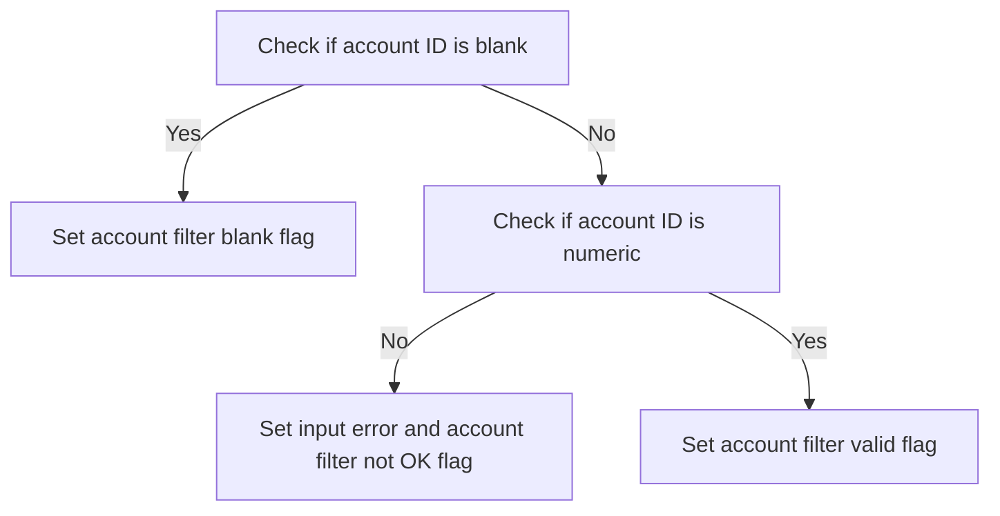

<SwmSnippet path="/app/cbl/COCRDLIC.cbl" line="1003">

---

### Checking if account ID is blank

Going into the first snippet, the code checks if the account ID is blank by evaluating if it is not provided. If it is blank, it sets the account filter blank flag to true and resets the account ID to zeros, ensuring the system recognizes it as blank and exits the current process.

```cobol
       2210-EDIT-ACCOUNT.                                                       
           SET FLG-ACCTFILTER-BLANK TO TRUE                                     
                                                                                
      *    Not supplied                                                         
           IF CC-ACCT-ID   EQUAL LOW-VALUES                                     
           OR CC-ACCT-ID   EQUAL SPACES                                         
           OR CC-ACCT-ID-N EQUAL ZEROS                                          
              SET FLG-ACCTFILTER-BLANK  TO TRUE                                 
              MOVE ZEROES       TO CDEMO-ACCT-ID                                
              GO TO  2210-EDIT-ACCOUNT-EXIT                                     
           END-IF                                                               
```

---

</SwmSnippet>

<SwmSnippet path="/app/cbl/COCRDLIC.cbl" line="1017">

---

### Validating account ID format

Now, the second snippet checks if the account ID is numeric and exactly 11 digits long. If it is not numeric, it sets the input error flag, the account filter not OK flag, and the protect select rows flag to true. It also sets an error message indicating that the account filter must be an 11-digit number and resets the account ID to zero, ensuring that only valid numeric account IDs are processed further.

```cobol
           IF CC-ACCT-ID  IS NOT NUMERIC                                        
              SET INPUT-ERROR TO TRUE                                           
              SET FLG-ACCTFILTER-NOT-OK TO TRUE                                 
              SET FLG-PROTECT-SELECT-ROWS-YES TO TRUE                           
              MOVE                                                              
              'ACCOUNT FILTER,IF SUPPLIED MUST BE A 11 DIGIT NUMBER'            
                              TO WS-ERROR-MSG                                   
              MOVE ZERO       TO CDEMO-ACCT-ID                                  
              GO TO 2210-EDIT-ACCOUNT-EXIT                                      
           ELSE                                                                 
              MOVE CC-ACCT-ID TO CDEMO-ACCT-ID                                  
              SET FLG-ACCTFILTER-ISVALID TO TRUE                                
           END-IF                                                               
```

---

</SwmSnippet>

# Validate Credit Card Number (<SwmToken path="app/cbl/COCRDLIC.cbl" pos="992:3:7" line-data="           PERFORM 2220-EDIT-CARD                                               ">`2220-EDIT-CARD`</SwmToken>)

Lets' zoom into the program flow:

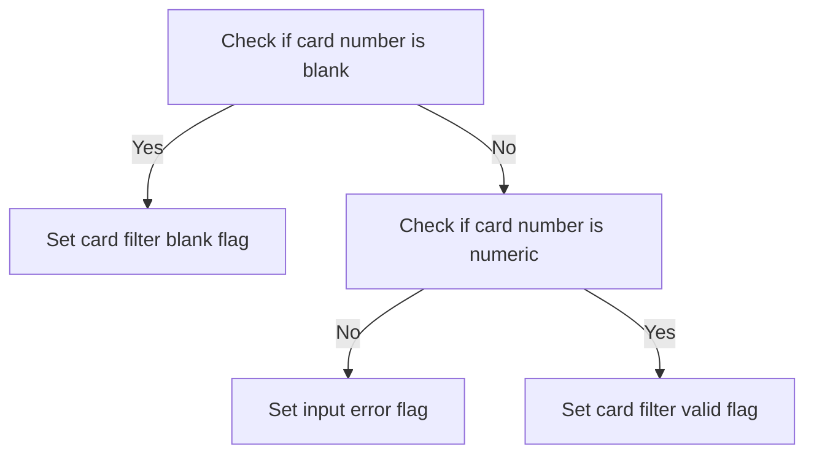

<SwmSnippet path="/app/cbl/COCRDLIC.cbl" line="1036">

---

### Checking for blank card number

Going into the first snippet, the code checks if the credit card number is blank. If the card number is either not supplied, contains only spaces, or is filled with zeros, it sets the <SwmToken path="app/cbl/COCRDLIC.cbl" pos="1039:3:7" line-data="           SET FLG-CARDFILTER-BLANK TO TRUE                                     ">`FLG-CARDFILTER-BLANK`</SwmToken> flag to true and resets the card number to zero. This ensures that any invalid or empty card numbers are flagged and handled appropriately.

```cobol
       2220-EDIT-CARD.                                                          
      *    Not numeric                                                          
      *    Not 16 characters                                                    
           SET FLG-CARDFILTER-BLANK TO TRUE                                     
                                                                                
      *    Not supplied                                                         
           IF CC-CARD-NUM   EQUAL LOW-VALUES                                    
           OR CC-CARD-NUM   EQUAL SPACES                                        
           OR CC-CARD-NUM-N EQUAL ZEROS                                         
              SET FLG-CARDFILTER-BLANK  TO TRUE                                 
              MOVE ZEROES       TO CDEMO-CARD-NUM                               
              GO TO  2220-EDIT-CARD-EXIT                                        
           END-IF                                                               
```

---

</SwmSnippet>

<SwmSnippet path="/app/cbl/COCRDLIC.cbl" line="1052">

---

### Validating card number format

Next, the code checks if the card number is numeric. If the card number is not numeric, it sets several flags to indicate an input error and protect selected rows. Additionally, it sets an error message stating that the card ID filter must be a 16-digit number and resets the card number to zero. This step ensures that only valid numeric card numbers are processed further.

```cobol
           IF CC-CARD-NUM  IS NOT NUMERIC                                       
              SET INPUT-ERROR TO TRUE                                           
              SET FLG-CARDFILTER-NOT-OK TO TRUE                                 
              SET FLG-PROTECT-SELECT-ROWS-YES TO TRUE                           
              IF WS-ERROR-MSG-OFF                                               
                 MOVE                                                           
              'CARD ID FILTER,IF SUPPLIED MUST BE A 16 DIGIT NUMBER'            
                              TO WS-ERROR-MSG                                   
              END-IF                                                            
              MOVE ZERO       TO CDEMO-CARD-NUM                                 
              GO TO 2220-EDIT-CARD-EXIT                                         
```

---

</SwmSnippet>

<SwmSnippet path="/app/cbl/COCRDLIC.cbl" line="1063">

---

### Setting valid card number flag

Then, if the card number passes the numeric check, the code moves the card number to the appropriate field and sets the <SwmToken path="app/cbl/COCRDLIC.cbl" pos="1065:3:7" line-data="              SET FLG-CARDFILTER-ISVALID TO TRUE                                ">`FLG-CARDFILTER-ISVALID`</SwmToken> flag to true. This indicates that the card number is valid and can be used for further processing.

```cobol
           ELSE                                                                 
              MOVE CC-CARD-NUM-N TO CDEMO-CARD-NUM                              
              SET FLG-CARDFILTER-ISVALID TO TRUE                                
           END-IF                                                               
```

---

</SwmSnippet>

# Read Next Records (<SwmToken path="app/cbl/COCRDLIC.cbl" pos="433:3:7" line-data="                       PERFORM 9000-READ-FORWARD                                ">`9000-READ-FORWARD`</SwmToken>)

Let's split this section into smaller parts:

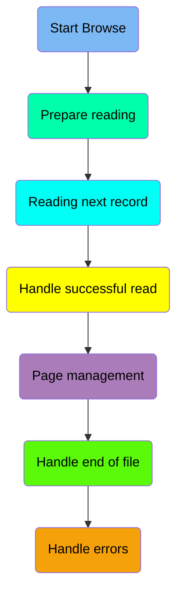

## Start Browse

First, we'll zoom into this section of the flow:

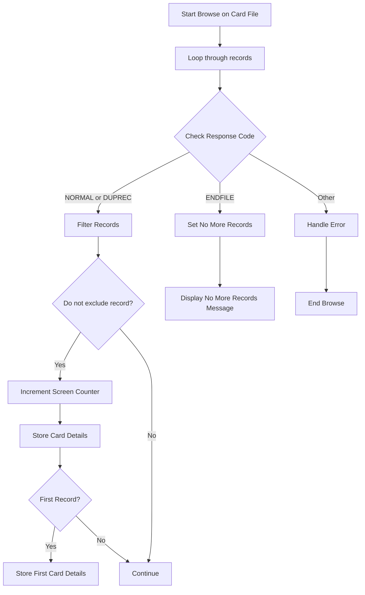

<SwmSnippet path="/app/cbl/COCRDLIC.cbl" line="1129">

---

### Starting Browse on Card File

Going into the browse operation, it initializes the process to read through the card records sequentially, starting at the specified point and ensuring that the browse begins at the appropriate record.

```cobol
           EXEC CICS STARTBR                                                    
                DATASET(LIT-CARD-FILE)                                          
                RIDFLD(WS-CARD-RID-CARDNUM)                                     
                KEYLENGTH(LENGTH OF WS-CARD-RID-CARDNUM)                        
                GTEQ                                                            
                RESP(WS-RESP-CD)                                                
                RESP2(WS-REAS-CD)                                               
           END-EXEC                                                             
```

---

</SwmSnippet>

## Prepare reading

Now, lets zoom into this section of the flow:

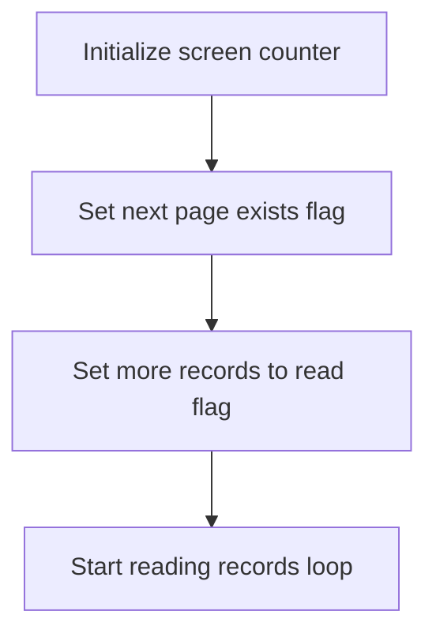

<SwmSnippet path="/app/cbl/COCRDLIC.cbl" line="1140">

---

### Initializing and Setting Flags for Reading Records

Going into the snippet, the code initializes the screen counter to zero, sets the flag indicating that the next page of results exists, and sets the flag indicating that there are more records to read. This prepares the system to start reading records in a loop.

```cobol
           MOVE ZEROES TO WS-SCRN-COUNTER                                       
           SET CA-NEXT-PAGE-EXISTS    TO TRUE                                   
           SET MORE-RECORDS-TO-READ   TO TRUE                                   
                                                                                
           PERFORM UNTIL READ-LOOP-EXIT                                         
```

---

</SwmSnippet>

## Reading next record

<SwmSnippet path="/app/cbl/COCRDLIC.cbl" line="1146">

---

### Reading the next credit card record

The <SwmToken path="app/cbl/COCRDLIC.cbl" pos="1146:5:5" line-data="           EXEC CICS READNEXT                                                   ">`READNEXT`</SwmToken> command reads the next credit card record from the file, storing the details for further processing.

```cobol
           EXEC CICS READNEXT                                                   
                DATASET(LIT-CARD-FILE)                                          
                INTO (CARD-RECORD)                                              
                LENGTH(LENGTH OF CARD-RECORD)                                   
                RIDFLD(WS-CARD-RID-CARDNUM)                                     
                KEYLENGTH(LENGTH OF WS-CARD-RID-CARDNUM)                        
                RESP(WS-RESP-CD)                                                
                RESP2(WS-REAS-CD)                                               
           END-EXEC                                                             
```

---

</SwmSnippet>

## Handle successful read

Now, lets zoom into this section of the flow:

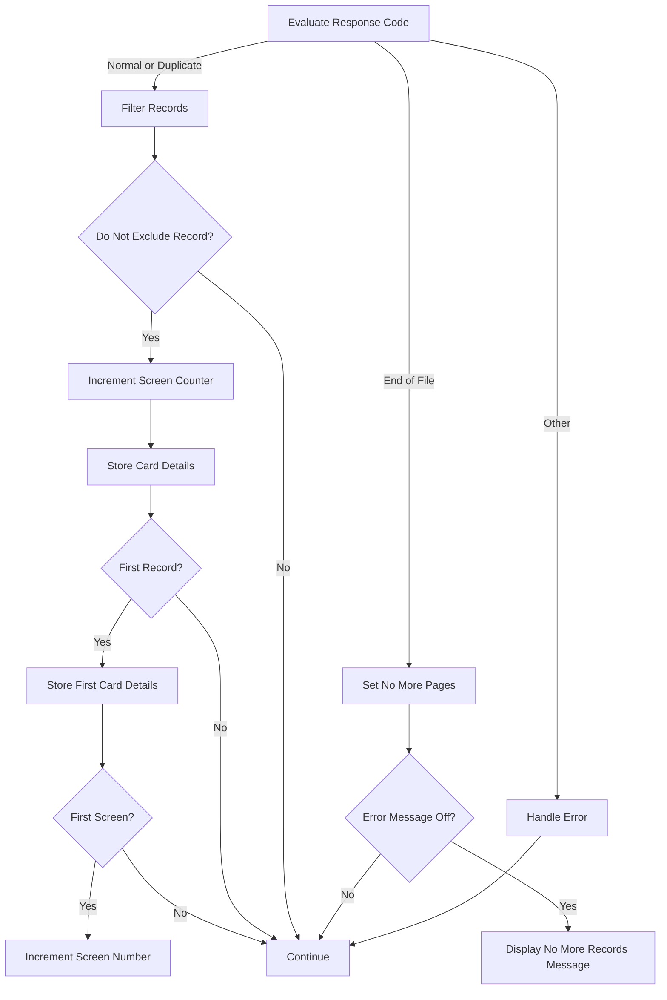

<SwmSnippet path="/app/cbl/COCRDLIC.cbl" line="1156">

---

### Evaluating Response Code

Going into the snippet, the code evaluates the response code to determine if the record should be processed further or filtered out.

```cobol
           EVALUATE WS-RESP-CD                                                  
               WHEN DFHRESP(NORMAL)                                             
               WHEN DFHRESP(DUPREC)                                             
                   PERFORM 9500-FILTER-RECORDS                                  
                      THRU 9500-FILTER-RECORDS-EXIT                             
```

---

</SwmSnippet>

<SwmSnippet path="/app/cbl/COCRDLIC.cbl" line="1162">

---

### Filtering and Storing Records

Now, if the record should not be excluded, the screen counter is incremented, and the card details are stored for display.

```cobol
                   IF WS-DONOT-EXCLUDE-THIS-RECORD                              
                      ADD 1             TO WS-SCRN-COUNTER                      
                                                                                
                      MOVE CARD-NUM     TO WS-ROW-CARD-NUM(                     
                      WS-SCRN-COUNTER)                                          
                      MOVE CARD-ACCT-ID TO                                      
                      WS-ROW-ACCTNO(WS-SCRN-COUNTER)                            
                      MOVE CARD-ACTIVE-STATUS                                   
                                        TO WS-ROW-CARD-STATUS(                  
                                        WS-SCRN-COUNTER)                        
```

---

</SwmSnippet>

<SwmSnippet path="/app/cbl/COCRDLIC.cbl" line="1173">

---

### Storing First Record Details

Next, if this is the first record, the first card account ID and card number are stored. If this is the first screen, the screen number is incremented.

```cobol
                      IF WS-SCRN-COUNTER = 1                                    
                         MOVE CARD-ACCT-ID                                      
                                        TO WS-CA-FIRST-CARD-ACCT-ID             
                         MOVE CARD-NUM  TO WS-CA-FIRST-CARD-NUM                 
                         IF   WS-CA-SCREEN-NUM = 0                              
                           ADD   +1     TO WS-CA-SCREEN-NUM                     
                         ELSE                                                   
                           CONTINUE                                             
                         END-IF                                                 
                      ELSE                                                      
                         CONTINUE                                               
                      END-IF                                                    
```

---

</SwmSnippet>

<SwmSnippet path="/app/cbl/COCRDLIC.cbl" line="1185">

---

### Continuing Processing

Then, if the conditions are not met, the code continues processing.

```cobol
                   ELSE                                                         
                       CONTINUE                                                 
                   END-IF                                                       
```

---

</SwmSnippet>

<SwmSnippet path="/app/cbl/COCRDLIC.cbl" line="1191">

---

### Handling Maximum Screen Lines

Moving to the next snippet, if the screen counter reaches the maximum screen lines, the loop is set to exit, and the last card details are stored. The code then reads the next record.

```cobol
                   IF WS-SCRN-COUNTER = WS-MAX-SCREEN-LINES                     
                      SET READ-LOOP-EXIT  TO TRUE                               
                                                                                
                      MOVE CARD-ACCT-ID     TO WS-CA-LAST-CARD-ACCT-ID          
                      MOVE CARD-NUM         TO WS-CA-LAST-CARD-NUM              
                                                                                
                      EXEC CICS READNEXT                                        
                        DATASET(LIT-CARD-FILE)                                  
                        INTO (CARD-RECORD)                                      
                        LENGTH(LENGTH OF CARD-RECORD)                           
                        RIDFLD(WS-CARD-RID-CARDNUM)                             
                        KEYLENGTH(LENGTH OF WS-CARD-RID-CARDNUM)                
                        RESP(WS-RESP-CD)                                        
                        RESP2(WS-REAS-CD)                                       
                      END-EXEC                                                  
```

---

</SwmSnippet>

<SwmSnippet path="/app/cbl/COCRDLIC.cbl" line="1207">

---

### Evaluating Next Response Code

Next, the response code is evaluated again. If it indicates a normal or duplicate record, it sets the flag indicating that the next page exists and stores the last card details.

```cobol
                      EVALUATE WS-RESP-CD                                       
                         WHEN DFHRESP(NORMAL)                                   
                         WHEN DFHRESP(DUPREC)                                   
                              SET CA-NEXT-PAGE-EXISTS                           
                                                TO TRUE                         
                              MOVE CARD-ACCT-ID TO                              
                                   WS-CA-LAST-CARD-ACCT-ID                      
                              MOVE CARD-NUM     TO WS-CA-LAST-CARD-NUM          
```

---

</SwmSnippet>

<SwmSnippet path="/app/cbl/COCRDLIC.cbl" line="1215">

---

### Handling End of File

Then, if the response code indicates the end of the file, it sets the flag indicating that there are no more pages. If error messages are turned off, it displays a message indicating no more records to show.

```cobol
                        WHEN DFHRESP(ENDFILE)                                   
                            SET CA-NEXT-PAGE-NOT-EXISTS     TO TRUE             
                                                                                
                            IF WS-ERROR-MSG-OFF                                 
                                MOVE 'NO MORE RECORDS TO SHOW'                  
                                                TO WS-ERROR-MSG                 
                            END-IF                                              
```

---

</SwmSnippet>

<SwmSnippet path="/app/cbl/COCRDLIC.cbl" line="1222">

---

### Handling Other Errors

Next, if the response code indicates any other error, the loop is set to exit, and the error details are stored for further handling.

```cobol
                            WHEN OTHER                                          
      *                     This is some kind of error. Change to END BR        
      *                     And exit                                            
                            SET READ-LOOP-EXIT      TO TRUE                     
                            MOVE 'READ'              TO ERROR-OPNAME            
                            MOVE LIT-CARD-FILE       TO ERROR-FILE              
                            MOVE WS-RESP-CD          TO ERROR-RESP              
                            MOVE WS-REAS-CD          TO ERROR-RESP2             
                          MOVE WS-FILE-ERROR-MESSAGE TO WS-ERROR-MSG            
                      END-EVALUATE                                              
```

---

</SwmSnippet>

<SwmSnippet path="/app/cbl/COCRDLIC.cbl" line="1233">

---

### Handling End of File Again

Then, if the response code indicates the end of the file again, the loop is set to exit, and the flag indicating no more pages is set. If error messages are turned off, it displays a message indicating no more records to show. If this is the first screen and no records were found, it sets the flag indicating no records were found.

```cobol
               WHEN DFHRESP(ENDFILE)                                            
                  SET READ-LOOP-EXIT              TO TRUE                       
                  SET CA-NEXT-PAGE-NOT-EXISTS     TO TRUE                       
                  MOVE CARD-ACCT-ID     TO WS-CA-LAST-CARD-ACCT-ID              
                  MOVE CARD-NUM         TO WS-CA-LAST-CARD-NUM                  
                  IF WS-ERROR-MSG-OFF                                           
                     MOVE 'NO MORE RECORDS TO SHOW'  TO WS-ERROR-MSG            
                  END-IF                                                        
                  IF WS-CA-SCREEN-NUM = 1                                       
                  AND WS-SCRN-COUNTER = 0                                       
      *               MOVE 'NO RECORDS TO SHOW'  TO WS-ERROR-MSG                
                      SET WS-NO-RECORDS-FOUND    TO TRUE                        
                  END-IF                                                        
```

---

</SwmSnippet>

<SwmSnippet path="/app/cbl/COCRDLIC.cbl" line="1246">

---

### Handling Other Errors Again

Finally, if the response code indicates any other error again, the loop is set to exit, and the error details are stored for further handling.

```cobol
               WHEN OTHER                                                       
      *           This is some kind of error. Change to END BR                  
      *           And exit                                                      
                  SET READ-LOOP-EXIT             TO TRUE                        
                  MOVE 'READ'                     TO ERROR-OPNAME               
                  MOVE LIT-CARD-FILE              TO ERROR-FILE                 
                  MOVE WS-RESP-CD                 TO ERROR-RESP                 
                  MOVE WS-REAS-CD                 TO ERROR-RESP2                
                  MOVE WS-FILE-ERROR-MESSAGE      TO WS-ERROR-MSG               
           END-EVALUATE                                                         
```

---

</SwmSnippet>

## Page management

Now, lets zoom into this section of the flow:

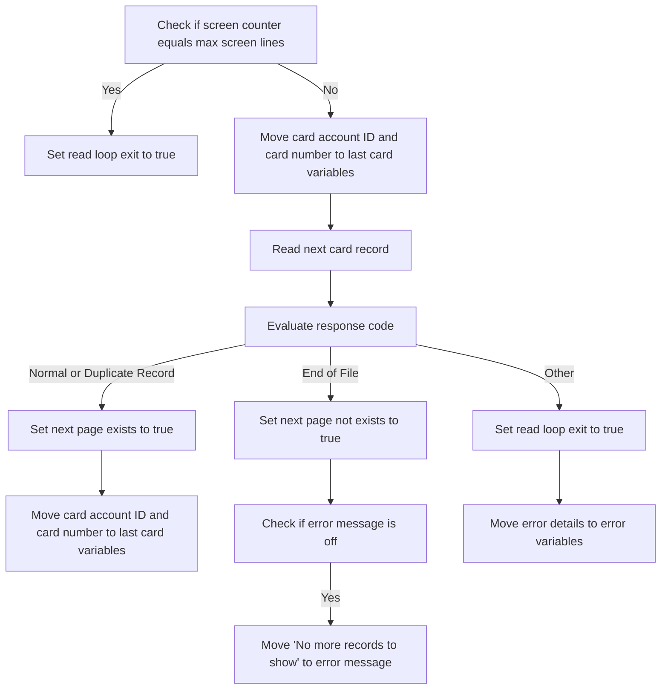

<SwmSnippet path="/app/cbl/COCRDLIC.cbl" line="1191">

---

### Checking screen counter and reading next record

Going into the first snippet, the code checks if the screen counter equals the maximum screen lines. If it does, it sets the read loop exit flag to true, indicating that the maximum number of records for the screen has been reached. It then updates the last card details and reads the next card record.

```cobol
                   IF WS-SCRN-COUNTER = WS-MAX-SCREEN-LINES                     
                      SET READ-LOOP-EXIT  TO TRUE                               
                                                                                
                      MOVE CARD-ACCT-ID     TO WS-CA-LAST-CARD-ACCT-ID          
                      MOVE CARD-NUM         TO WS-CA-LAST-CARD-NUM              
                                                                                
                      EXEC CICS READNEXT                                        
                        DATASET(LIT-CARD-FILE)                                  
                        INTO (CARD-RECORD)                                      
                        LENGTH(LENGTH OF CARD-RECORD)                           
                        RIDFLD(WS-CARD-RID-CARDNUM)                             
                        KEYLENGTH(LENGTH OF WS-CARD-RID-CARDNUM)                
                        RESP(WS-RESP-CD)                                        
                        RESP2(WS-REAS-CD)                                       
                      END-EXEC                                                  
```

---

</SwmSnippet>

<SwmSnippet path="/app/cbl/COCRDLIC.cbl" line="1207">

---

### Evaluating response code for next page

Now, the code evaluates the response code from the read operation. If the response is normal or indicates a duplicate record, it sets the flag indicating that the next page exists to true. It also updates the last card details.

```cobol
                      EVALUATE WS-RESP-CD                                       
                         WHEN DFHRESP(NORMAL)                                   
                         WHEN DFHRESP(DUPREC)                                   
                              SET CA-NEXT-PAGE-EXISTS                           
                                                TO TRUE                         
                              MOVE CARD-ACCT-ID TO                              
                                   WS-CA-LAST-CARD-ACCT-ID                      
                              MOVE CARD-NUM     TO WS-CA-LAST-CARD-NUM          
```

---

</SwmSnippet>

<SwmSnippet path="/app/cbl/COCRDLIC.cbl" line="1215">

---

### Handling end of file response

Next, the code handles the end of file response. If the response indicates the end of the file, it sets the flag indicating that the next page does not exist to true. It then checks if the error message display is off, and if so, it sets the error message to 'No more records to show'.

```cobol
                        WHEN DFHRESP(ENDFILE)                                   
                            SET CA-NEXT-PAGE-NOT-EXISTS     TO TRUE             
                                                                                
                            IF WS-ERROR-MSG-OFF                                 
                                MOVE 'NO MORE RECORDS TO SHOW'                  
                                                TO WS-ERROR-MSG                 
                            END-IF                                              
```

---

</SwmSnippet>

<SwmSnippet path="/app/cbl/COCRDLIC.cbl" line="1222">

---

### Handling other responses

Then, the code handles any other responses. If the response is not normal, duplicate record, or end of file, it sets the read loop exit flag to true, indicating an error. It then updates the error details.

```cobol
                            WHEN OTHER                                          
      *                     This is some kind of error. Change to END BR        
      *                     And exit                                            
                            SET READ-LOOP-EXIT      TO TRUE                     
                            MOVE 'READ'              TO ERROR-OPNAME            
                            MOVE LIT-CARD-FILE       TO ERROR-FILE              
                            MOVE WS-RESP-CD          TO ERROR-RESP              
                            MOVE WS-REAS-CD          TO ERROR-RESP2             
                          MOVE WS-FILE-ERROR-MESSAGE TO WS-ERROR-MSG            
                      END-EVALUATE                                              
```

---

</SwmSnippet>

## Handle end of file

Now, lets zoom into this section of the flow:

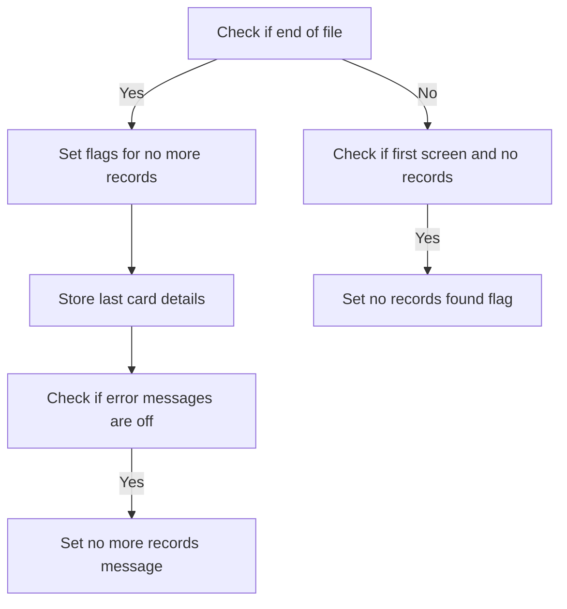

<SwmSnippet path="/app/cbl/COCRDLIC.cbl" line="1232">

---

### Handling end of file

Going into the first snippet, the code checks if the end of the file has been reached. If it has, it sets flags to indicate that there are no more records to read and stores the last card details. If error messages are turned off, it sets a message indicating that there are no more records to show.

```cobol
                  END-IF                                                        
               WHEN DFHRESP(ENDFILE)                                            
                  SET READ-LOOP-EXIT              TO TRUE                       
                  SET CA-NEXT-PAGE-NOT-EXISTS     TO TRUE                       
                  MOVE CARD-ACCT-ID     TO WS-CA-LAST-CARD-ACCT-ID              
                  MOVE CARD-NUM         TO WS-CA-LAST-CARD-NUM                  
                  IF WS-ERROR-MSG-OFF                                           
                     MOVE 'NO MORE RECORDS TO SHOW'  TO WS-ERROR-MSG            
                  END-IF                                                        
```

---

</SwmSnippet>

<SwmSnippet path="/app/cbl/COCRDLIC.cbl" line="1241">

---

### Checking for records on the first screen

Now, the second snippet checks if the current screen is the first screen and if no records have been found. If both conditions are true, it sets a flag to indicate that no records were found.

```cobol
                  IF WS-CA-SCREEN-NUM = 1                                       
                  AND WS-SCRN-COUNTER = 0                                       
      *               MOVE 'NO RECORDS TO SHOW'  TO WS-ERROR-MSG                
                      SET WS-NO-RECORDS-FOUND    TO TRUE                        
                  END-IF                                                        
```

---

</SwmSnippet>

## Handle errors

<SwmSnippet path="/app/cbl/COCRDLIC.cbl" line="1246">

---

Going into the snippet, it handles errors that occur during the credit card listing process. If an error is detected, it sets a flag to terminate the loop and logs the error details.

```cobol
               WHEN OTHER                                                       
      *           This is some kind of error. Change to END BR                  
      *           And exit                                                      
                  SET READ-LOOP-EXIT             TO TRUE                        
                  MOVE 'READ'                     TO ERROR-OPNAME               
                  MOVE LIT-CARD-FILE              TO ERROR-FILE                 
                  MOVE WS-RESP-CD                 TO ERROR-RESP                 
                  MOVE WS-REAS-CD                 TO ERROR-RESP2                
                  MOVE WS-FILE-ERROR-MESSAGE      TO WS-ERROR-MSG               
           END-EVALUATE                                                         
```

---

</SwmSnippet>

# Filter Credit Card Records (<SwmToken path="app/cbl/COCRDLIC.cbl" pos="1159:3:7" line-data="                   PERFORM 9500-FILTER-RECORDS                                  ">`9500-FILTER-RECORDS`</SwmToken>)

Lets' zoom into the program flow:

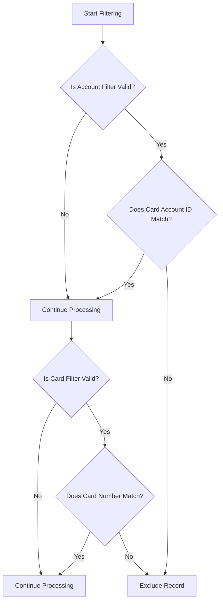

<SwmSnippet path="/app/cbl/COCRDLIC.cbl" line="1382">

---

### Filtering based on account filter

Going into the first snippet, the code checks if the account filter is valid. If it is, it then compares the card account ID with the provided account ID. If they match, the processing continues. If they do not match, the record is marked for exclusion and the filtering process exits.

```cobol
       9500-FILTER-RECORDS.                                                     
           SET WS-DONOT-EXCLUDE-THIS-RECORD TO TRUE                             
                                                                                
           IF FLG-ACCTFILTER-ISVALID                                            
              IF  CARD-ACCT-ID = CC-ACCT-ID                                     
                  CONTINUE                                                      
              ELSE                                                              
                  SET WS-EXCLUDE-THIS-RECORD  TO TRUE                           
                  GO TO 9500-FILTER-RECORDS-EXIT                                
              END-IF                                                            
           ELSE                                                                 
             CONTINUE                                                           
           END-IF                                                               
```

---

</SwmSnippet>

<SwmSnippet path="/app/cbl/COCRDLIC.cbl" line="1396">

---

### Filtering based on card filter

Now, the second snippet checks if the card filter is valid. If it is, it compares the card number with the provided card number. If they match, the processing continues. If they do not match, the record is marked for exclusion and the filtering process exits.

```cobol
           IF FLG-CARDFILTER-ISVALID                                            
              IF  CARD-NUM = CC-CARD-NUM-N                                      
                  CONTINUE                                                      
              ELSE                                                              
                  SET WS-EXCLUDE-THIS-RECORD TO TRUE                            
                  GO TO 9500-FILTER-RECORDS-EXIT                                
              END-IF                                                            
           ELSE                                                                 
             CONTINUE                                                           
           END-IF                                                               
```

---

</SwmSnippet>

# Display Credit Card Screen (<SwmToken path="app/cbl/COCRDLIC.cbl" pos="436:3:7" line-data="                    PERFORM 1000-SEND-MAP                                       ">`1000-SEND-MAP`</SwmToken>)

<SwmSnippet path="/app/cbl/COCRDLIC.cbl" line="624">

---

### Sending the Map

Going into the <SwmToken path="app/cbl/COCRDLIC.cbl" pos="624:1:5" line-data="       1000-SEND-MAP.                                                           ">`1000-SEND-MAP`</SwmToken> function, it performs several steps to prepare and display the screen. It initializes the screen, sets up the screen array with credit card data, sets attributes for credit card selection, sets up screen attributes and validates filters, sets up error and informational messages, and finally displays the screen.

```cobol
       1000-SEND-MAP.                                                           
           PERFORM 1100-SCREEN-INIT                                             
              THRU 1100-SCREEN-INIT-EXIT                                        
           PERFORM 1200-SCREEN-ARRAY-INIT                                       
              THRU 1200-SCREEN-ARRAY-INIT-EXIT                                  
           PERFORM 1250-SETUP-ARRAY-ATTRIBS                                     
              THRU 1250-SETUP-ARRAY-ATTRIBS-EXIT                                
           PERFORM 1300-SETUP-SCREEN-ATTRS                                      
              THRU 1300-SETUP-SCREEN-ATTRS-EXIT                                 
           PERFORM 1400-SETUP-MESSAGE                                           
              THRU 1400-SETUP-MESSAGE-EXIT                                      
           PERFORM 1500-SEND-SCREEN                                             
              THRU 1500-SEND-SCREEN-EXIT                                        
```

---

</SwmSnippet>

# Initialize Screen Data (<SwmToken path="app/cbl/COCRDLIC.cbl" pos="625:3:7" line-data="           PERFORM 1100-SCREEN-INIT                                             ">`1100-SCREEN-INIT`</SwmToken>)

<SwmSnippet path="/app/cbl/COCRDLIC.cbl" line="642">

---

The <SwmToken path="app/cbl/COCRDLIC.cbl" pos="642:1:5" line-data="       1100-SCREEN-INIT.                                                        ">`1100-SCREEN-INIT`</SwmToken> function initializes the screen by setting various fields with current date, time, and relevant information. It starts by clearing the relevant data structure and then populates it with the current date and time. Titles and program names are also set, followed by the current date and time in specific formats. The screen number and an informational message are also set to ensure the screen displays the correct context and information to the user.

```cobol
       1100-SCREEN-INIT.                                                        
           MOVE LOW-VALUES             TO CCRDLIAO                              
                                                                                
           MOVE FUNCTION CURRENT-DATE  TO WS-CURDATE-DATA                       
                                                                                
           MOVE CCDA-TITLE01           TO TITLE01O OF CCRDLIAO                  
           MOVE CCDA-TITLE02           TO TITLE02O OF CCRDLIAO                  
           MOVE LIT-THISTRANID         TO TRNNAMEO OF CCRDLIAO                  
           MOVE LIT-THISPGM            TO PGMNAMEO OF CCRDLIAO                  
                                                                                
           MOVE FUNCTION CURRENT-DATE  TO WS-CURDATE-DATA                       
                                                                                
           MOVE WS-CURDATE-MONTH       TO WS-CURDATE-MM                         
           MOVE WS-CURDATE-DAY         TO WS-CURDATE-DD                         
           MOVE WS-CURDATE-YEAR(3:2)   TO WS-CURDATE-YY                         
                                                                                
           MOVE WS-CURDATE-MM-DD-YY    TO CURDATEO OF CCRDLIAO                  
                                                                                
           MOVE WS-CURTIME-HOURS       TO WS-CURTIME-HH                         
           MOVE WS-CURTIME-MINUTE      TO WS-CURTIME-MM                         
           MOVE WS-CURTIME-SECOND      TO WS-CURTIME-SS                         
                                                                                
           MOVE WS-CURTIME-HH-MM-SS    TO CURTIMEO OF CCRDLIAO                  
      *    PAGE NUMBER                                                          
      *                                                                         
           MOVE WS-CA-SCREEN-NUM       TO PAGENOO  OF CCRDLIAO                  
                                                                                
           SET WS-NO-INFO-MESSAGE      TO TRUE                                  
           MOVE WS-INFO-MSG            TO INFOMSGO OF CCRDLIAO                  
           MOVE DFHBMDAR               TO INFOMSGC OF CCRDLIAO                  
           .                                                                    
```

---

</SwmSnippet>

&nbsp;

*This is an auto-generated document by Swimm 🌊 and has not yet been verified by a human*

<SwmMeta version="3.0.0" repo-id="Z2l0aHViJTNBJTNBa3luZHJ5bC1hd3MtbWFpbmZyYW1lLW1vZGVybml6YXRpb24tY2FyZGRlbW8lM0ElM0FTd2ltbS1EZW1v" repo-name="kyndryl-aws-mainframe-modernization-carddemo"><sup>Powered by [Swimm](/)</sup></SwmMeta>
