The document describes the role of the COCRDLIC program in listing credit cards. The program handles the display of all credit cards for admin users and filters the cards associated with a specific account for non-admin users. This functionality is achieved through a series of steps that initialize the working storage and communication areas, set the transaction context, and process user inputs to validate function keys and handle navigation.

The COCRDLIC program starts by initializing necessary data structures and setting the transaction context. It then processes user inputs to validate function keys and handle navigation, ensuring that the correct credit card information is displayed based on the user's role and context.

Here is a high level diagram of the program:

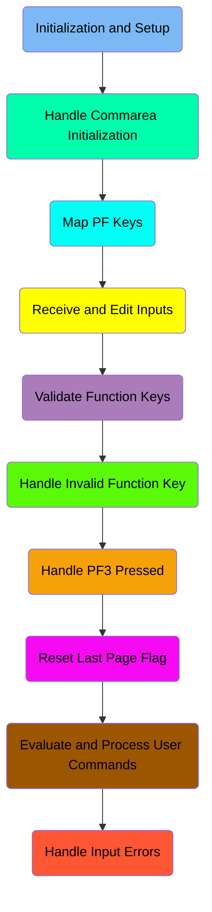

## Initialization and Setup

First, we'll zoom into this section of the flow:

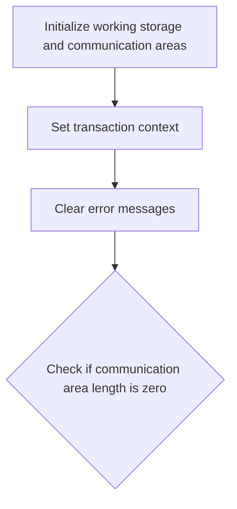

<SwmSnippet path="/app/cbl/COCRDLIC.cbl" line="298">

---

First, the section initializes the working storage areas (<SwmToken path="app/cbl/COCRDLIC.cbl" pos="300:3:7" line-data="           INITIALIZE CC-WORK-AREA                                              ">`CC-WORK-AREA`</SwmToken>, <SwmToken path="app/cbl/COCRDLIC.cbl" pos="301:1:5" line-data="                      WS-MISC-STORAGE                                           ">`WS-MISC-STORAGE`</SwmToken>, and <SwmToken path="app/cbl/COCRDLIC.cbl" pos="302:1:3" line-data="                      WS-COMMAREA                                               ">`WS-COMMAREA`</SwmToken>) to ensure that all necessary data structures are set up and ready for use.

```cobol
       0000-MAIN SECTION.                                                               
                                                                                
           INITIALIZE CC-WORK-AREA                                              
                      WS-MISC-STORAGE                                           
                      WS-COMMAREA                                               
```

---

</SwmSnippet>

<SwmSnippet path="/app/cbl/COCRDLIC.cbl" line="307">

---

Next, the transaction context is set by moving the transaction ID (<SwmToken path="app/cbl/COCRDLIC.cbl" pos="307:3:5" line-data="           MOVE LIT-THISTRANID       TO WS-TRANID                               ">`LIT-THISTRANID`</SwmToken>) to <SwmToken path="app/cbl/COCRDLIC.cbl" pos="307:9:11" line-data="           MOVE LIT-THISTRANID       TO WS-TRANID                               ">`WS-TRANID`</SwmToken>, which helps in identifying the current transaction throughout the program flow.

```cobol
           MOVE LIT-THISTRANID       TO WS-TRANID                               
```

---

</SwmSnippet>

## Handle Commarea Initialization

This is the next section of the flow.

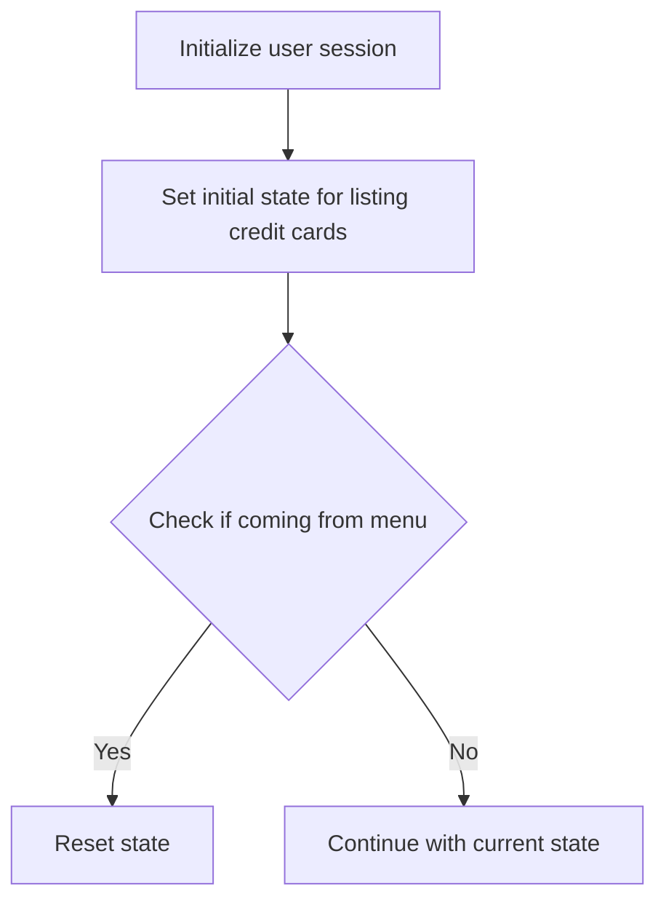

<SwmSnippet path="/app/cbl/COCRDLIC.cbl" line="316">

---

First, the user session is initialized by setting up the communication areas and flags that indicate the user's entry into the program. This ensures that the session starts with a clean slate and all necessary variables are prepared for the subsequent operations.

```cobol
              INITIALIZE CARDDEMO-COMMAREA
                         WS-THIS-PROGCOMMAREA 
              MOVE LIT-THISTRANID        TO CDEMO-FROM-TRANID                   
              MOVE LIT-THISPGM           TO CDEMO-FROM-PROGRAM                  
              SET CDEMO-USRTYP-USER      TO TRUE                                
              SET CDEMO-PGM-ENTER        TO TRUE                                
              MOVE LIT-THISMAP           TO CDEMO-LAST-MAP                      
              MOVE LIT-THISMAPSET        TO CDEMO-LAST-MAPSET                   
              SET CA-FIRST-PAGE          TO TRUE                                
              SET CA-LAST-PAGE-NOT-SHOWN TO TRUE                                
```

---

</SwmSnippet>

<SwmSnippet path="/app/cbl/COCRDLIC.cbl" line="326">

---

Moving to the next step, the initial state for listing credit cards is set. This involves setting flags that indicate the first page of the listing and ensuring that the last page is not shown initially. This setup is crucial for displaying the credit card list correctly to the user.

```cobol
           ELSE
              MOVE DFHCOMMAREA (1:LENGTH OF CARDDEMO-COMMAREA) TO               
                                CARDDEMO-COMMAREA                               
              MOVE DFHCOMMAREA(LENGTH OF CARDDEMO-COMMAREA + 1:                 
                               LENGTH OF WS-THIS-PROGCOMMAREA )TO               
                                WS-THIS-PROGCOMMAREA                            
```

---

</SwmSnippet>

<SwmSnippet path="/app/cbl/COCRDLIC.cbl" line="332">

---

Then, the program checks if the user is coming from the menu. If so, it resets the state by reinitializing the communication areas and setting the necessary flags again. This ensures that any previous state is cleared, and the user starts afresh, which is important for maintaining data consistency and accuracy.

```cobol
           END-IF                                                               
      *****************************************************************         
      * If coming in from menu. Lets forget the past and start afresh *         
      *****************************************************************         
           IF (CDEMO-PGM-ENTER                                                  
           AND CDEMO-FROM-PROGRAM NOT EQUAL LIT-THISPGM)                        
               INITIALIZE WS-THIS-PROGCOMMAREA
               SET CDEMO-PGM-ENTER      TO TRUE                                 
               MOVE LIT-THISMAP         TO CDEMO-LAST-MAP                       
               SET CA-FIRST-PAGE        TO TRUE                                 
               SET CA-LAST-PAGE-NOT-SHOWN TO TRUE                               
           END-IF 
```

---

</SwmSnippet>

## Map PF Keys

This is the next section of the flow.

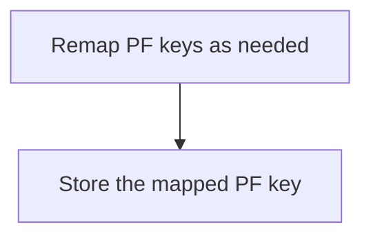

<SwmSnippet path="/app/cbl/COCRDLIC.cbl" line="345">

---

The section remaps the PF keys as needed to ensure that user interactions are correctly interpreted and processed. This step is crucial for maintaining the correct functionality of the user interface, as it ensures that the function keys perform their intended actions. After remapping, the mapped PF key is stored for future reference, which helps in maintaining consistency in user interactions and system responses.

```cobol
      ******************************************************************        
      * Remap PFkeys as needed.                                                 
      * Store the Mapped PF Key                                                 
      *****************************************************************         
           PERFORM YYYY-STORE-PFKEY                                             
              THRU YYYY-STORE-PFKEY-EXIT                                        
```

---

</SwmSnippet>

## Receive and Edit Inputs

Now, lets zoom into this section of the flow:

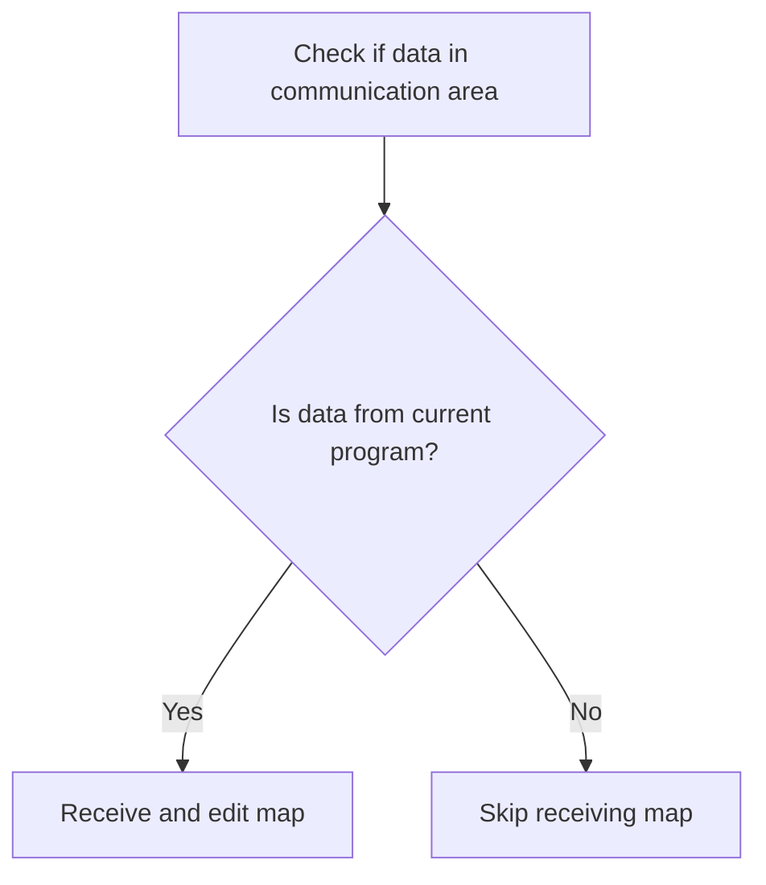

First, we check if there is data in the communication area (<SwmToken path="app/cbl/COCRDLIC.cbl" pos="357:3:7" line-data="           IF  EIBCALEN &gt; 0                                                     ">`EIBCALEN > 0`</SwmToken>). This ensures that there is relevant data to process.

## Validate Function Keys

This is the next section of the flow.

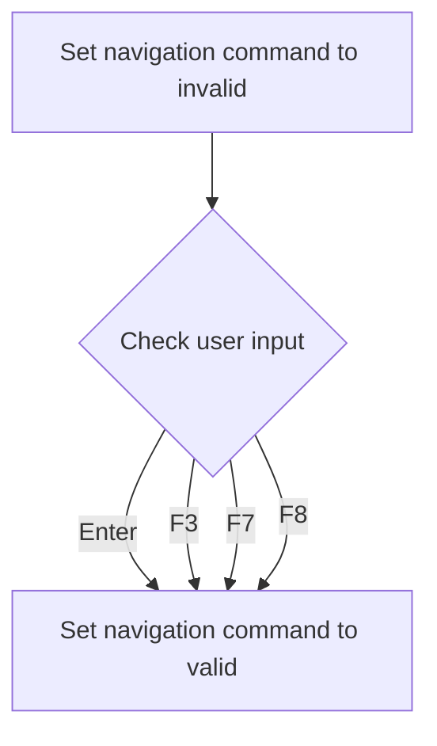

<SwmSnippet path="/app/cbl/COCRDLIC.cbl" line="370">

---

The initial step involves setting the navigation command state to invalid, ensuring that any subsequent checks start from a known state.

```cobol
           SET PFK-INVALID TO TRUE                                              
```

---

</SwmSnippet>

<SwmSnippet path="/app/cbl/COCRDLIC.cbl" line="371">

---

Next, the user input is checked against a list of valid navigation commands, including Enter, <SwmToken path="app/cbl/COCRDLIC.cbl" pos="365:3:3" line-data="      * F3    - Exit                                                            ">`F3`</SwmToken>, <SwmToken path="app/cbl/COCRDLIC.cbl" pos="368:3:3" line-data="      * F7    - Page up                                                         ">`F7`</SwmToken>, and <SwmToken path="app/cbl/COCRDLIC.cbl" pos="367:3:3" line-data="      * F8    - Page down                                                       ">`F8`</SwmToken>.

```cobol
           IF CCARD-AID-ENTER OR                                                
              CCARD-AID-PFK03 OR                                                
              CCARD-AID-PFK07 OR                                                
              CCARD-AID-PFK08                                                   
```

---

</SwmSnippet>

<SwmSnippet path="/app/cbl/COCRDLIC.cbl" line="375">

---

If the user input matches any of the valid commands, the navigation command state is updated to valid, allowing the program to proceed with the corresponding action.

```cobol
               SET PFK-VALID TO TRUE                                            
           END-IF                                                               
```

---

</SwmSnippet>

## Interim Summary

So far, we saw how the program initializes the working storage and communication areas, sets the transaction context, and handles the initialization of the user session and the initial state for listing credit cards. We also covered how the program remaps PF keys and processes user inputs to validate function keys. Now, we will focus on handling invalid function key inputs, ensuring the program can gracefully manage such scenarios.

## Handle Invalid Function Key

This is the next section of the flow.

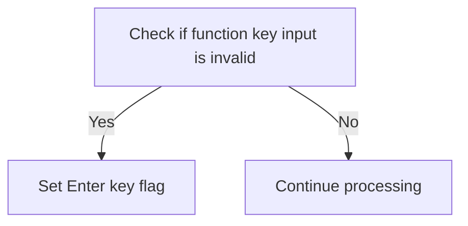

<SwmSnippet path="/app/cbl/COCRDLIC.cbl" line="378">

---

The code checks if the function key input is invalid by evaluating the <SwmToken path="app/cbl/COCRDLIC.cbl" pos="378:3:5" line-data="           IF PFK-INVALID                                                       ">`PFK-INVALID`</SwmToken> flag. If the input is invalid, it sets the <SwmToken path="app/cbl/COCRDLIC.cbl" pos="379:3:7" line-data="              SET CCARD-AID-ENTER TO TRUE                                       ">`CCARD-AID-ENTER`</SwmToken> flag to true, indicating that the user has pressed the Enter key. This step ensures that the program can handle invalid inputs gracefully by simulating an Enter key press, which may trigger a default action or prompt the user for correct input.

```cobol
           IF PFK-INVALID                                                       
              SET CCARD-AID-ENTER TO TRUE                                       
           END-IF                                                               
```

---

</SwmSnippet>

## Handle <SwmToken path="app/cbl/COCRDLIC.cbl" pos="456:7:7" line-data="      *        BACK - PF3 IF WE CAME FROM SOME OTHER PROGRAM                    ">`PF3`</SwmToken> Pressed

Now, lets zoom into this section of the flow:

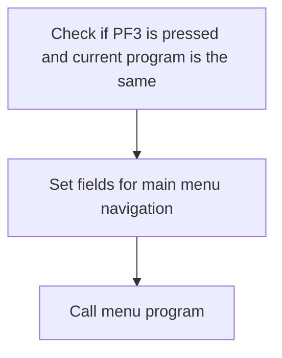

<SwmSnippet path="/app/cbl/COCRDLIC.cbl" line="384">

---

First, we check if the user pressed <SwmToken path="app/cbl/COCRDLIC.cbl" pos="456:7:7" line-data="      *        BACK - PF3 IF WE CAME FROM SOME OTHER PROGRAM                    ">`PF3`</SwmToken> and if the current program is the same as the originating program. This ensures that the user intends to navigate back to the main menu from the current context.

```cobol
           IF  (CCARD-AID-PFK03                                                 
           AND CDEMO-FROM-PROGRAM  EQUAL LIT-THISPGM)                           
```

---

</SwmSnippet>

<SwmSnippet path="/app/cbl/COCRDLIC.cbl" line="386">

---

Next, we set the necessary fields to navigate back to the main menu. This includes setting the user type, program entry flag, and updating the map and program identifiers to point to the main menu.

```cobol
              MOVE LIT-THISTRANID   TO CDEMO-FROM-TRANID                        
              MOVE LIT-THISPGM      TO CDEMO-FROM-PROGRAM                       
              SET  CDEMO-USRTYP-USER TO TRUE                                    
              SET  CDEMO-PGM-ENTER  TO TRUE                                     
              MOVE LIT-THISMAPSET   TO CDEMO-LAST-MAPSET                        
              MOVE LIT-THISMAP      TO CDEMO-LAST-MAP                           
              MOVE LIT-MENUPGM      TO CDEMO-TO-PROGRAM                         
                                                                                
              MOVE LIT-MENUMAPSET   TO CCARD-NEXT-MAPSET                        
              MOVE LIT-THISMAP      TO CCARD-NEXT-MAP                           
              SET WS-EXIT-MESSAGE            TO TRUE                            
```

---

</SwmSnippet>

<SwmSnippet path="/app/cbl/COCRDLIC.cbl" line="402">

---

Then, we call the menu program to display the main menu to the user. This involves executing a CICS command to transfer control to the menu program, passing the communication area as a parameter.

```cobol
              EXEC CICS XCTL                                                    
                        PROGRAM (LIT-MENUPGM)                                   
                        COMMAREA(CARDDEMO-COMMAREA)                             
              END-EXEC                                                          
```

---

</SwmSnippet>

## Reset Last Page Flag

This is the next section of the flow.

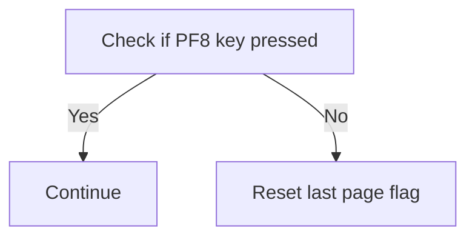

## Evaluate and Process User Commands

Now, lets zoom into this section of the flow:

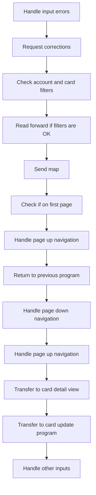

<SwmSnippet path="/app/cbl/COCRDLIC.cbl" line="418">

---

### Handling input errors

First, the program checks if there are any input errors. If errors are found, it moves the error message to the appropriate field and sets up the next program, mapset, and map to request corrections from the user.

```cobol
           EVALUATE TRUE                                                        
               WHEN INPUT-ERROR                                                 
      *****************************************************************         
      *        ASK FOR CORRECTIONS TO INPUTS                                    
      *****************************************************************         
                    MOVE WS-ERROR-MSG    TO CCARD-ERROR-MSG                     
                    MOVE LIT-THISPGM     TO CDEMO-FROM-PROGRAM                  
                    MOVE LIT-THISMAPSET  TO CDEMO-LAST-MAPSET                   
                    MOVE LIT-THISMAP     TO CDEMO-LAST-MAP                      
                                                                                
                    MOVE LIT-THISPGM     TO CCARD-NEXT-PROG                     
                    MOVE LIT-THISMAPSET  TO CCARD-NEXT-MAPSET                   
                    MOVE LIT-THISMAP     TO CCARD-NEXT-MAP                      
                    IF  NOT FLG-ACCTFILTER-NOT-OK                               
                    AND NOT FLG-CARDFILTER-NOT-OK                               
                       PERFORM 9000-READ-FORWARD                                
                          THRU 9000-READ-FORWARD-EXIT                           
                    END-IF                                                      
                    PERFORM 1000-SEND-MAP                                       
                       THRU 1000-SEND-MAP                                       
                    GO TO COMMON-RETURN                                         
```

---

</SwmSnippet>

<SwmSnippet path="/app/cbl/COCRDLIC.cbl" line="439">

---

### Managing navigation to the first page

Next, if the user attempts to navigate to the first page while already on it, the program handles this by setting the appropriate card number and reading forward to refresh the display.

```cobol
               WHEN CCARD-AID-PFK07                                             
                    AND CA-FIRST-PAGE                                           
      *****************************************************************         
      *        PAGE UP - PF7 - BUT ALREADY ON FIRST PAGE                        
      *****************************************************************         
               WHEN CCARD-AID-PFK07                                             
                    AND CA-FIRST-PAGE                                           
                    MOVE WS-CA-FIRST-CARD-NUM                                   
                                  TO WS-CARD-RID-CARDNUM                        
      *             MOVE WS-CA-FIRST-CARD-ACCT-ID                               
      *                           TO WS-CARD-RID-ACCT-ID                        
                    PERFORM 9000-READ-FORWARD                                   
                       THRU 9000-READ-FORWARD-EXIT                              
                    PERFORM 1000-SEND-MAP                                       
                       THRU 1000-SEND-MAP                                       
                    GO TO COMMON-RETURN                                         
```

---

</SwmSnippet>

<SwmSnippet path="/app/cbl/COCRDLIC.cbl" line="455">

---

### Handling return to the previous program

Then, if the user chooses to go back to the previous program, the program initializes the communication area, sets up the necessary flags, and reads forward to refresh the display.

```cobol
      *****************************************************************         
      *        BACK - PF3 IF WE CAME FROM SOME OTHER PROGRAM                    
      *****************************************************************         
               WHEN CCARD-AID-PFK03                                             
               WHEN CDEMO-PGM-REENTER AND                                       
                    CDEMO-FROM-PROGRAM NOT EQUAL LIT-THISPGM                    
                                                                                
                    INITIALIZE CARDDEMO-COMMAREA                                
                               WS-THIS-PROGCOMMAREA                             
                    MOVE LIT-THISTRANID      TO CDEMO-FROM-TRANID               
                    MOVE LIT-THISPGM         TO CDEMO-FROM-PROGRAM              
                    SET CDEMO-USRTYP-USER    TO TRUE                            
                    SET CDEMO-PGM-ENTER      TO TRUE                            
                    MOVE LIT-THISMAP         TO CDEMO-LAST-MAP                  
                    MOVE LIT-THISMAPSET      TO CDEMO-LAST-MAPSET               
                    SET CA-FIRST-PAGE        TO TRUE                            
                    SET CA-LAST-PAGE-NOT-SHOWN TO TRUE                          
                                                                                
                    MOVE WS-CA-FIRST-CARD-NUM                                   
                                  TO WS-CARD-RID-CARDNUM                        
      *             MOVE WS-CA-FIRST-CARD-ACCT-ID                               
```

---

</SwmSnippet>

<SwmSnippet path="/app/cbl/COCRDLIC.cbl" line="484">

---

### Managing page down navigation

Moving to page down navigation, if there are more pages to display, the program sets the card number to the last card on the current page, increments the screen number, and reads forward to display the next page.

```cobol
      *        PAGE DOWN                                                        
      *****************************************************************         
               WHEN CCARD-AID-PFK08                                             
                    AND CA-NEXT-PAGE-EXISTS                                     
                    MOVE WS-CA-LAST-CARD-NUM                                    
                                  TO WS-CARD-RID-CARDNUM                        
      *             MOVE WS-CA-LAST-CARD-ACCT-ID                                
      *                           TO WS-CARD-RID-ACCT-ID                        
                    ADD   +1       TO WS-CA-SCREEN-NUM                          
                    PERFORM 9000-READ-FORWARD                                   
                       THRU 9000-READ-FORWARD-EXIT                              
                    PERFORM 1000-SEND-MAP                                       
                       THRU 1000-SEND-MAP-EXIT                                  
                    GO TO COMMON-RETURN                                         
```

---

</SwmSnippet>

<SwmSnippet path="/app/cbl/COCRDLIC.cbl" line="499">

---

### Managing page up navigation

For page up navigation, if the user is not on the first page, the program sets the card number to the first card on the current page, decrements the screen number, and reads backward to display the previous page.

```cobol
      *        PAGE UP                                                          
      *****************************************************************         
               WHEN CCARD-AID-PFK07                                             
                    AND NOT CA-FIRST-PAGE                                       
                                                                                
                    MOVE WS-CA-FIRST-CARD-NUM                                   
                                  TO WS-CARD-RID-CARDNUM                        
      *             MOVE WS-CA-FIRST-CARD-ACCT-ID                               
      *                           TO WS-CARD-RID-ACCT-ID                        
                    SUBTRACT 1    FROM WS-CA-SCREEN-NUM                         
                    PERFORM 9100-READ-BACKWARDS                                 
                       THRU 9100-READ-BACKWARDS-EXIT                            
                    PERFORM 1000-SEND-MAP                                       
                       THRU 1000-SEND-MAP-EXIT                                  
                    GO TO COMMON-RETURN                                         
```

---

</SwmSnippet>

<SwmSnippet path="/app/cbl/COCRDLIC.cbl" line="515">

---

### Transferring to card detail view

When the user requests to view card details, the program sets up the necessary fields and flags, moves the selected account and card numbers, and transfers control to the card detail program.

```cobol
      *        TRANSFER TO CARD DETAIL VIEW                                     
      *****************************************************************         
               WHEN CCARD-AID-ENTER                                             
                AND VIEW-REQUESTED-ON(I-SELECTED)                               
                AND CDEMO-FROM-PROGRAM  EQUAL LIT-THISPGM                       
                   MOVE LIT-THISTRANID    TO CDEMO-FROM-TRANID                  
                   MOVE LIT-THISPGM       TO CDEMO-FROM-PROGRAM                 
                   SET  CDEMO-USRTYP-USER TO TRUE                               
                   SET  CDEMO-PGM-ENTER   TO TRUE                               
                   MOVE LIT-THISMAPSET    TO CDEMO-LAST-MAPSET                  
                   MOVE LIT-THISMAP       TO CDEMO-LAST-MAP                     
                   MOVE LIT-CARDDTLPGM    TO CCARD-NEXT-PROG                    
                                                                                
                   MOVE LIT-CARDDTLMAPSET TO CCARD-NEXT-MAPSET                  
                   MOVE LIT-CARDDTLMAP    TO CCARD-NEXT-MAP                     
                                                                                
                   MOVE WS-ROW-ACCTNO (I-SELECTED)                              
                                          TO CDEMO-ACCT-ID                      
                   MOVE WS-ROW-CARD-NUM (I-SELECTED)                            
                                          TO CDEMO-CARD-NUM                     
                                                                                
```

---

</SwmSnippet>

<SwmSnippet path="/app/cbl/COCRDLIC.cbl" line="543">

---

### Transferring to card update program

Similarly, if the user requests to update card details, the program sets up the necessary fields and flags, moves the selected account and card numbers, and transfers control to the card update program.

```cobol
      *        TRANSFER TO CARD UPDATED PROGRAM                                 
      *****************************************************************         
               WHEN CCARD-AID-ENTER                                             
                AND UPDATE-REQUESTED-ON(I-SELECTED)                             
                AND CDEMO-FROM-PROGRAM  EQUAL LIT-THISPGM                       
                   MOVE LIT-THISTRANID    TO CDEMO-FROM-TRANID                  
                   MOVE LIT-THISPGM       TO CDEMO-FROM-PROGRAM                 
                   SET  CDEMO-USRTYP-USER TO TRUE                               
                   SET  CDEMO-PGM-ENTER   TO TRUE                               
                   MOVE LIT-THISMAPSET    TO CDEMO-LAST-MAPSET                  
                   MOVE LIT-THISMAP       TO CDEMO-LAST-MAP                     
                   MOVE LIT-CARDUPDPGM    TO CCARD-NEXT-PROG                    
                                                                                
                   MOVE LIT-CARDUPDMAPSET TO CCARD-NEXT-MAPSET                  
                   MOVE LIT-CARDUPDMAP    TO CCARD-NEXT-MAP                     
                                                                                
                   MOVE WS-ROW-ACCTNO (I-SELECTED)                              
                                          TO CDEMO-ACCT-ID                      
                   MOVE WS-ROW-CARD-NUM (I-SELECTED)                            
                                          TO CDEMO-CARD-NUM                     
                                                                                
```

---

</SwmSnippet>

<SwmSnippet path="/app/cbl/COCRDLIC.cbl" line="572">

---

### Handling other unspecified inputs

Finally, for any other unspecified inputs, the program sets the card number to the first card on the current page and reads forward to refresh the display.

```cobol
               WHEN OTHER                                                       
      *****************************************************************         
                    MOVE WS-CA-FIRST-CARD-NUM                                   
                                  TO WS-CARD-RID-CARDNUM                        
      *             MOVE WS-CA-FIRST-CARD-ACCT-ID                               
      *                           TO WS-CARD-RID-ACCT-ID                        
                    PERFORM 9000-READ-FORWARD                                   
                       THRU 9000-READ-FORWARD-EXIT                              
                    PERFORM 1000-SEND-MAP                                       
                       THRU 1000-SEND-MAP                                       
                    GO TO COMMON-RETURN                                         
           END-EVALUATE                                                         
```

---

</SwmSnippet>

## Handle Input Errors

Now, lets zoom into this section of the flow:

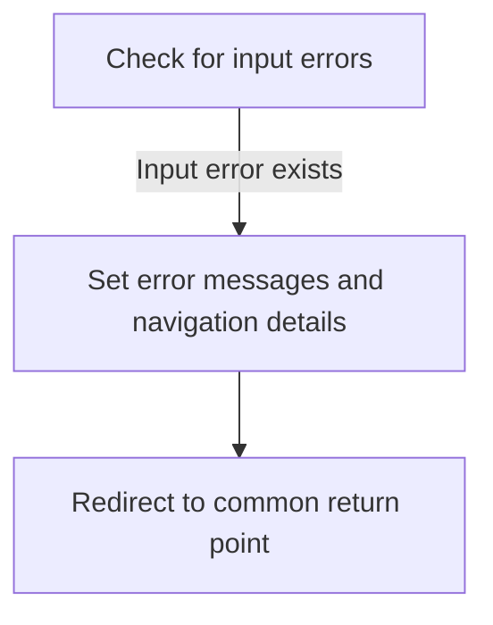

<SwmSnippet path="/app/cbl/COCRDLIC.cbl" line="586">

---

If an input error is detected (<SwmToken path="app/cbl/COCRDLIC.cbl" pos="586:3:5" line-data="           IF INPUT-ERROR                                                       ">`INPUT-ERROR`</SwmToken>), the system sets the error message (<SwmToken path="app/cbl/COCRDLIC.cbl" pos="587:3:7" line-data="              MOVE WS-ERROR-MSG   TO CCARD-ERROR-MSG                            ">`WS-ERROR-MSG`</SwmToken>) to be displayed to the user. This ensures that the user is informed about the specific issue with their input.

```cobol
           IF INPUT-ERROR                                                       
              MOVE WS-ERROR-MSG   TO CCARD-ERROR-MSG                            
```

---

</SwmSnippet>

<SwmSnippet path="/app/cbl/COCRDLIC.cbl" line="588">

---

The program then sets the navigation details to ensure the user is returned to the appropriate screen. This involves setting the current program (<SwmToken path="app/cbl/COCRDLIC.cbl" pos="588:3:5" line-data="              MOVE LIT-THISPGM     TO CDEMO-FROM-PROGRAM                        ">`LIT-THISPGM`</SwmToken>), mapset (<SwmToken path="app/cbl/COCRDLIC.cbl" pos="589:3:5" line-data="              MOVE LIT-THISMAPSET  TO CDEMO-LAST-MAPSET                         ">`LIT-THISMAPSET`</SwmToken>), and map (<SwmToken path="app/cbl/COCRDLIC.cbl" pos="590:3:5" line-data="              MOVE LIT-THISMAP     TO CDEMO-LAST-MAP                            ">`LIT-THISMAP`</SwmToken>) to the respective fields (<SwmToken path="app/cbl/COCRDLIC.cbl" pos="588:9:13" line-data="              MOVE LIT-THISPGM     TO CDEMO-FROM-PROGRAM                        ">`CDEMO-FROM-PROGRAM`</SwmToken>, <SwmToken path="app/cbl/COCRDLIC.cbl" pos="589:9:13" line-data="              MOVE LIT-THISMAPSET  TO CDEMO-LAST-MAPSET                         ">`CDEMO-LAST-MAPSET`</SwmToken>, <SwmToken path="app/cbl/COCRDLIC.cbl" pos="590:9:13" line-data="              MOVE LIT-THISMAP     TO CDEMO-LAST-MAP                            ">`CDEMO-LAST-MAP`</SwmToken>).

```cobol
              MOVE LIT-THISPGM     TO CDEMO-FROM-PROGRAM                        
              MOVE LIT-THISMAPSET  TO CDEMO-LAST-MAPSET                         
              MOVE LIT-THISMAP     TO CDEMO-LAST-MAP                            
```

---

</SwmSnippet>

<SwmSnippet path="/app/cbl/COCRDLIC.cbl" line="592">

---

Additionally, the program sets the next program, mapset, and map to the same values to ensure continuity in navigation. This is done by moving <SwmToken path="app/cbl/COCRDLIC.cbl" pos="592:3:5" line-data="              MOVE LIT-THISPGM     TO CCARD-NEXT-PROG                           ">`LIT-THISPGM`</SwmToken>, <SwmToken path="app/cbl/COCRDLIC.cbl" pos="593:3:5" line-data="              MOVE LIT-THISMAPSET  TO CCARD-NEXT-MAPSET                         ">`LIT-THISMAPSET`</SwmToken>, and <SwmToken path="app/cbl/COCRDLIC.cbl" pos="594:3:5" line-data="              MOVE LIT-THISMAP     TO CCARD-NEXT-MAP                            ">`LIT-THISMAP`</SwmToken> to <SwmToken path="app/cbl/COCRDLIC.cbl" pos="592:9:13" line-data="              MOVE LIT-THISPGM     TO CCARD-NEXT-PROG                           ">`CCARD-NEXT-PROG`</SwmToken>, <SwmToken path="app/cbl/COCRDLIC.cbl" pos="593:9:13" line-data="              MOVE LIT-THISMAPSET  TO CCARD-NEXT-MAPSET                         ">`CCARD-NEXT-MAPSET`</SwmToken>, and <SwmToken path="app/cbl/COCRDLIC.cbl" pos="594:9:13" line-data="              MOVE LIT-THISMAP     TO CCARD-NEXT-MAP                            ">`CCARD-NEXT-MAP`</SwmToken> respectively.

```cobol
              MOVE LIT-THISPGM     TO CCARD-NEXT-PROG                           
              MOVE LIT-THISMAPSET  TO CCARD-NEXT-MAPSET                         
              MOVE LIT-THISMAP     TO CCARD-NEXT-MAP                            
```

---

</SwmSnippet>

<SwmSnippet path="/app/cbl/COCRDLIC.cbl" line="597">

---

Finally, the program redirects to a common return point (<SwmToken path="app/cbl/COCRDLIC.cbl" pos="597:5:7" line-data="              GO TO COMMON-RETURN                                               ">`COMMON-RETURN`</SwmToken>) to handle the error and navigate appropriately.

```cobol
              GO TO COMMON-RETURN                                               
```

---

</SwmSnippet>

&nbsp;

*This is an auto-generated document by Swimm 🌊 and has not yet been verified by a human*

<SwmMeta version="3.0.0" repo-id="Z2l0aHViJTNBJTNBa3luZHJ5bC1hd3MtbWFpbmZyYW1lLW1vZGVybml6YXRpb24tY2FyZGRlbW8lM0ElM0FTd2ltbS1EZW1v" repo-name="kyndryl-aws-mainframe-modernization-carddemo"><sup>Powered by [Swimm](https://staging.swimm.cloud/)</sup></SwmMeta>
