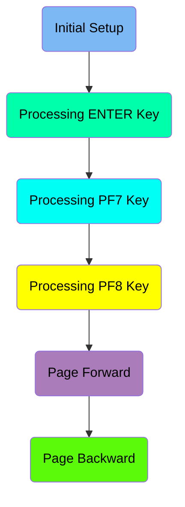
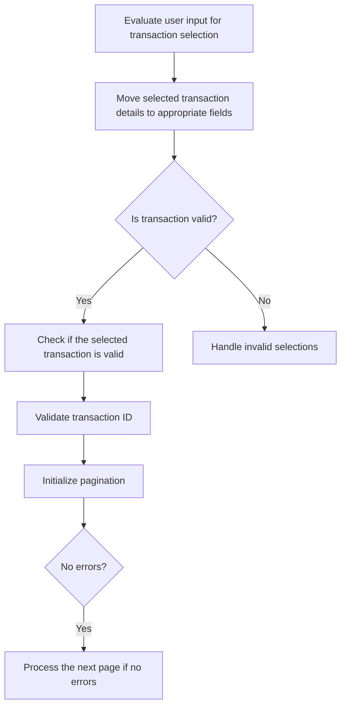
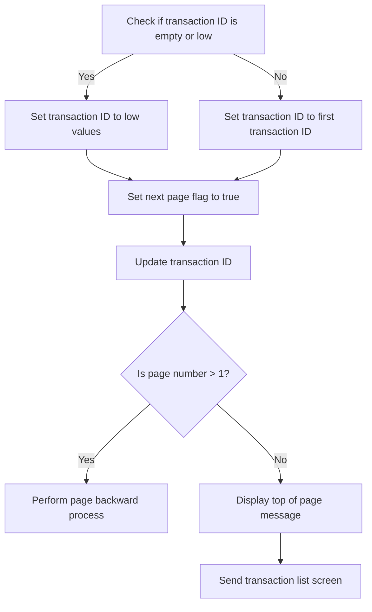
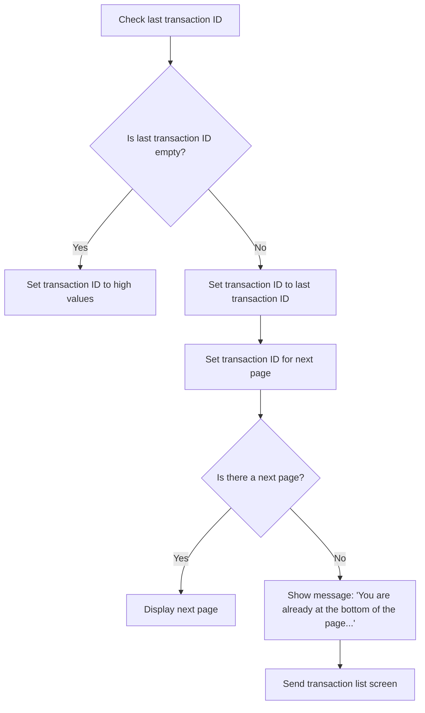
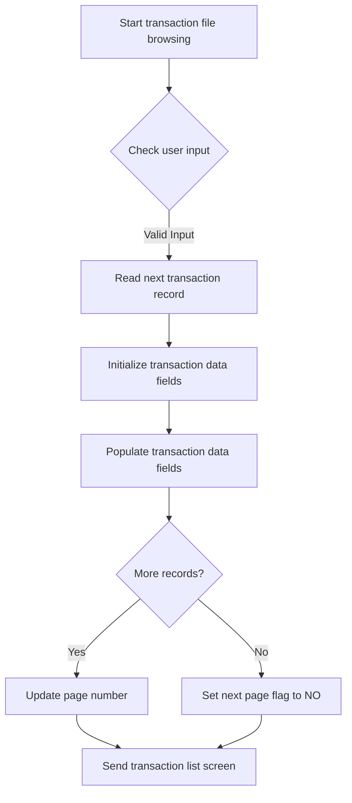
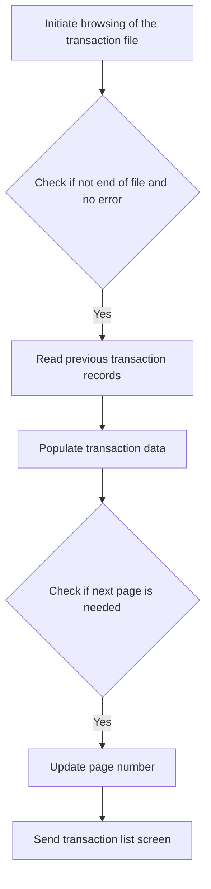

The Listing Transactions (<SwmToken path="app/cbl/COTRN00C.cbl" pos="2:7:7" line-data="      * Program     : COTRN00C.CBL">`COTRN00C`</SwmToken>) document describes the process of listing transactions from the TRANSACT file in the <SwmToken path="app/cbl/COTRN00C.cbl" pos="3:7:7" line-data="      * Application : CardDemo">`CardDemo`</SwmToken> application. This is achieved by initializing flags and variables, evaluating user inputs, and processing different keys to navigate through the transaction records.

The flow involves initializing flags and variables, checking if the program is re-entered, evaluating user inputs, and processing keys like ENTER, <SwmToken path="app/cbl/COTRN00C.cbl" pos="126:5:5" line-data="                           PERFORM PROCESS-PF7-KEY">`PF7`</SwmToken>, and <SwmToken path="app/cbl/COTRN00C.cbl" pos="128:5:5" line-data="                           PERFORM PROCESS-PF8-KEY">`PF8`</SwmToken> to navigate through the transaction records. The program ensures that the transaction list is displayed correctly based on user actions.

Here is a high level diagram of the program:



## Initial Setup

First, we'll zoom into this section of the flow:

```mermaid
graph TD
  A[Initialize flags and variables] --> B{Check if program is re-entered}
  B -->|No| C[Set next program to COSGN00C]
  C --> D[Return to previous screen]
  B -->|Yes| E[Move data to communication area]
  E --> F{Evaluate action key}
  F -->|Enter| G[Process enter key]
  F -->|PF3| H[Set next program to COMEN01C]
  H --> D
  F -->|PF7| I[Process PF7 key]
  F -->|PF8| J[Process PF8 key]
  F -->|Other| K[Set error flag and message]
  K --> L[Send transaction list screen]
  G --> L
  I --> L
  J --> L

%% Swimm:
%% graph TD
%%   A[Initialize flags and variables] --> B{Check if program is re-entered}
%%   B -->|No| C[Set next program to <SwmToken path="app/cbl/COTRN00C.cbl" pos="108:4:4" line-data="               MOVE &#39;COSGN00C&#39; TO CDEMO-TO-PROGRAM">`COSGN00C`</SwmToken>]
%%   C --> D[Return to previous screen]
%%   B -->|Yes| E[Move data to communication area]
%%   E --> F{Evaluate action key}
%%   F -->|Enter| G[Process enter key]
%%   F -->|PF3| H[Set next program to <SwmToken path="app/cbl/COTRN00C.cbl" pos="123:4:4" line-data="                           MOVE &#39;COMEN01C&#39; TO CDEMO-TO-PROGRAM">`COMEN01C`</SwmToken>]
%%   H --> D
%%   F -->|<SwmToken path="app/cbl/COTRN00C.cbl" pos="126:5:5" line-data="                           PERFORM PROCESS-PF7-KEY">`PF7`</SwmToken>| I[Process <SwmToken path="app/cbl/COTRN00C.cbl" pos="126:5:5" line-data="                           PERFORM PROCESS-PF7-KEY">`PF7`</SwmToken> key]
%%   F -->|<SwmToken path="app/cbl/COTRN00C.cbl" pos="128:5:5" line-data="                           PERFORM PROCESS-PF8-KEY">`PF8`</SwmToken>| J[Process <SwmToken path="app/cbl/COTRN00C.cbl" pos="128:5:5" line-data="                           PERFORM PROCESS-PF8-KEY">`PF8`</SwmToken> key]
%%   F -->|Other| K[Set error flag and message]
%%   K --> L[Send transaction list screen]
%%   G --> L
%%   I --> L
%%   J --> L
```



<SwmSnippet path="/app/cbl/COTRN00C.cbl" line="95">

---

First, the function initializes several flags and variables to their default states. This includes setting error flags, transaction end-of-file indicators, and page numbers to ensure the program starts with a clean slate.

```cobol
             10 CDEMO-CUST-MNAME              PIC X(25).
             10 CDEMO-CUST-LNAME              PIC X(25).
          05 CDEMO-ACCOUNT-INFO.
             10 CDEMO-ACCT-ID                 PIC 9(11).
             10 CDEMO-ACCT-STATUS             PIC X(01).
          05 CDEMO-CARD-INFO.
```

---

</SwmSnippet>

<SwmSnippet path="/app/cbl/COTRN00C.cbl" line="107">

---

Moving to the next step, the function checks if the program is being re-entered by evaluating the length of the communication area. If it is the first entry, it sets the next program to <SwmToken path="app/cbl/COTRN00C.cbl" pos="108:4:4" line-data="               MOVE &#39;COSGN00C&#39; TO CDEMO-TO-PROGRAM">`COSGN00C`</SwmToken> and returns to the previous screen.

```cobol
      *

          05 CDEMO-CT00-INFO.
```

---

</SwmSnippet>

<SwmSnippet path="/app/cbl/COTRN00C.cbl" line="111">

---

Next, if the program is being re-entered, it moves the data from the communication area to the working storage and evaluates the action key pressed by the user. Depending on the key, it performs different actions such as processing the enter key, handling page forward and backward requests, or setting error messages.

```cobol
             10 CDEMO-CT00-TRNID-LAST      PIC X(16).
             10 CDEMO-CT00-PAGE-NUM        PIC 9(08).
             10 CDEMO-CT00-NEXT-PAGE-FLG   PIC X(01) VALUE 'N'.
                88 NEXT-PAGE-YES                     VALUE 'Y'.
                88 NEXT-PAGE-NO                      VALUE 'N'.
             10 CDEMO-CT00-TRN-SEL-FLG     PIC X(01).
             10 CDEMO-CT00-TRN-SELECTED    PIC X(16).

       COPY COTRN00.

      ******************************************************************
      * Copyright Amazon.com, Inc. or its affiliates.                   
      * All Rights Reserved.                                            
      *                                                                 
      * Licensed under the Apache License, Version 2.0 (the "License"). 
      * You may not use this file except in compliance with the License.
      * You may obtain a copy of the License at                         
      *                                                                 
      *    http://www.apache.org/licenses/LICENSE-2.0                   
      *                                                                 
      * Unless required by applicable law or agreed to in writing,      
```

---

</SwmSnippet>

<SwmSnippet path="/app/cbl/COTRN00C.cbl" line="138">

---

Finally, the function returns control to the CICS transaction, passing the transaction ID and communication area back to the CICS environment.

```cobol
         05 CCDA-TITLE01    PIC X(40) VALUE
            '      AWS Mainframe Modernization       '.
         05 CCDA-TITLE02    PIC X(40) VALUE
      *     '  Credit Card Demo Application (CCDA)   '.
```

---

</SwmSnippet>

## Processing ENTER Key

Now, lets zoom into this section of the flow:



<SwmSnippet path="/app/cbl/COTRN00C.cbl" line="148">

---

First, the function evaluates the user input to determine which transaction has been selected. This is done by checking if any of the selection fields (<SwmToken path="app/cbl/COTRN00C.cbl" pos="149:3:3" line-data="               WHEN SEL0001I OF COTRN0AI NOT = SPACES AND LOW-VALUES">`SEL0001I`</SwmToken> to <SwmToken path="app/cbl/COTRN00C.cbl" pos="176:3:3" line-data="               WHEN SEL0010I OF COTRN0AI NOT = SPACES AND LOW-VALUES">`SEL0010I`</SwmToken>) are not empty or contain low-values.

```cobol

      ******************************************************************
      * Copyright Amazon.com, Inc. or its affiliates.                   
      * All Rights Reserved.                                            
      *                                                                 
      * Licensed under the Apache License, Version 2.0 (the "License"). 
      * You may not use this file except in compliance with the License.
      * You may obtain a copy of the License at                         
      *                                                                 
      *    http://www.apache.org/licenses/LICENSE-2.0                   
      *                                                                 
      * Unless required by applicable law or agreed to in writing,      
      * software distributed under the License is distributed on an     
      * "AS IS" BASIS, WITHOUT WARRANTIES OR CONDITIONS OF ANY KIND,    
      * either express or implied. See the License for the specific     
      * language governing permissions and limitations under the License
      ****************************************************************** 
       01 WS-DATE-TIME.
         05 WS-CURDATE-DATA.
           10  WS-CURDATE.
             15  WS-CURDATE-YEAR         PIC 9(04).
```

---

</SwmSnippet>

## Processing <SwmToken path="app/cbl/COTRN00C.cbl" pos="126:5:5" line-data="                           PERFORM PROCESS-PF7-KEY">`PF7`</SwmToken> Key

Now, lets zoom into this section of the flow:



<SwmSnippet path="/app/cbl/COTRN00C.cbl" line="236">

---

First, we check if the transaction ID (<SwmToken path="app/cbl/COTRN00C.cbl" pos="236:3:9" line-data="           IF CDEMO-CT00-TRNID-FIRST = SPACES OR LOW-VALUES">`CDEMO-CT00-TRNID-FIRST`</SwmToken>) is empty or has low values. If it is, we set the transaction ID to low values to ensure it is properly initialized.

```cobol
      *****************************************************************         
       01  TRAN-RECORD.                                                         
           05  TRAN-ID                                 PIC X(16).               
           05  TRAN-TYPE-CD                            PIC X(02).               
           05  TRAN-CAT-CD                             PIC 9(04).               
```

---

</SwmSnippet>

<SwmSnippet path="/app/cbl/COTRN00C.cbl" line="245">

---

Next, we determine if the current page number (<SwmToken path="app/cbl/COTRN00C.cbl" pos="245:3:9" line-data="           IF CDEMO-CT00-PAGE-NUM &gt; 1">`CDEMO-CT00-PAGE-NUM`</SwmToken>) is greater than 1. If it is, we perform the process to navigate backward through the pages. If not, we display a message indicating that the user is already at the top of the page and then send the transaction list screen to the user.

```cobol
           05  TRAN-MERCHANT-NAME                      PIC X(50).               
           05  TRAN-MERCHANT-CITY                      PIC X(50).               
           05  TRAN-MERCHANT-ZIP                       PIC X(10).               
           05  TRAN-CARD-NUM                           PIC X(16).               
           05  TRAN-ORIG-TS                            PIC X(26).               
           05  TRAN-PROC-TS                            PIC X(26).               
           05  FILLER                                  PIC X(20).               
      *
```

---

</SwmSnippet>

## Interim Summary

So far, we saw how the function processes the <SwmToken path="app/cbl/COTRN00C.cbl" pos="126:5:5" line-data="                           PERFORM PROCESS-PF7-KEY">`PF7`</SwmToken> key by checking if the transaction ID is empty or has low values, and then navigating backward through the pages if necessary. This ensures that the user can move to the previous page of transactions or receive a message if they are already at the top of the page. Now, we will focus on processing the <SwmToken path="app/cbl/COTRN00C.cbl" pos="128:5:5" line-data="                           PERFORM PROCESS-PF8-KEY">`PF8`</SwmToken> key, which involves checking the last transaction ID and determining if there is a next page to display.

## Processing <SwmToken path="app/cbl/COTRN00C.cbl" pos="128:5:5" line-data="                           PERFORM PROCESS-PF8-KEY">`PF8`</SwmToken> Key

Now, lets zoom into this section of the flow:



<SwmSnippet path="/app/cbl/COTRN00C.cbl" line="259">

---

First, we check if the last transaction ID (<SwmToken path="app/cbl/COTRN00C.cbl" pos="259:3:9" line-data="           IF CDEMO-CT00-TRNID-LAST = SPACES OR LOW-VALUES">`CDEMO-CT00-TRNID-LAST`</SwmToken>) is empty or contains low values. If it is, we set the transaction ID to high values to indicate the start of a new transaction list.

```cobol

      *----------------------------------------------------------------*
```

---

</SwmSnippet>

<SwmSnippet path="/app/cbl/COTRN00C.cbl" line="261">

---

Next, we set the transaction ID for the next page by moving the last transaction ID to <SwmToken path="app/cbl/COTRN00C.cbl" pos="262:13:15" line-data="               MOVE CDEMO-CT00-TRNID-LAST TO TRAN-ID">`TRAN-ID`</SwmToken> if it is not empty. This ensures that the transaction list continues from the last transaction.

```cobol
      *                        LINKAGE SECTION
      *----------------------------------------------------------------*
```

---

</SwmSnippet>

<SwmSnippet path="/app/cbl/COTRN00C.cbl" line="267">

---

Then, we check if there is a next page (<SwmToken path="app/cbl/COTRN00C.cbl" pos="267:3:7" line-data="           IF NEXT-PAGE-YES">`NEXT-PAGE-YES`</SwmToken>). If there is, we perform the logic to display the next page of transactions. If not, we display a message indicating that the user is already at the bottom of the page and send the transaction list screen.

```cobol

      *----------------------------------------------------------------*
      *                       PROCEDURE DIVISION
      *----------------------------------------------------------------*
       PROCEDURE DIVISION.
       MAIN-PARA SECTION.

```

---

</SwmSnippet>

## Page Forward

Now, lets zoom into this section of the flow:



<SwmSnippet path="/app/cbl/COTRN00C.cbl" line="281">

---

First, the transaction file browsing is started to prepare for reading transaction records.

```cobol

```

---

</SwmSnippet>

<SwmSnippet path="/app/cbl/COTRN00C.cbl" line="285">

---

Moving to the next step, we check for user input to determine if the user has pressed any specific keys and then read the next transaction record if the input is valid.

```cobol
               MOVE 'COSGN00C' TO CDEMO-TO-PROGRAM
               PERFORM RETURN-TO-PREV-SCREEN
           ELSE
```

---

</SwmSnippet>

<SwmSnippet path="/app/cbl/COTRN00C.cbl" line="291">

---

Next, we initialize the transaction data fields to ensure that they are cleared and ready for new data.

```cobol
                   MOVE LOW-VALUES          TO COTRN0AO
```

---

</SwmSnippet>

<SwmSnippet path="/app/cbl/COTRN00C.cbl" line="300">

---

Then, we populate the transaction data fields with the information from the transaction records.

```cobol
                           MOVE 'COMEN01C' TO CDEMO-TO-PROGRAM
```

---

</SwmSnippet>

<SwmSnippet path="/app/cbl/COTRN00C.cbl" line="306">

---

Going into the next step, we update the page number and check if there are more records to be processed.

```cobol
                       WHEN OTHER
                           MOVE 'Y'                       TO WS-ERR-FLG
```

---

</SwmSnippet>

<SwmSnippet path="/app/cbl/COTRN00C.cbl" line="326">

---

Finally, we send the transaction list screen to the user, displaying the transaction data.

```cobol
               WHEN SEL0001I OF COTRN0AI NOT = SPACES AND LOW-VALUES
```

---

</SwmSnippet>

## Page Backward

Now, lets zoom into this section of the flow:



<SwmSnippet path="/app/cbl/COTRN00C.cbl" line="335">

---

First, the process initiates browsing of the transaction file to prepare for reading records in reverse order.

```cobol
               WHEN SEL0004I OF COTRN0AI NOT = SPACES AND LOW-VALUES
```

---

</SwmSnippet>

<SwmSnippet path="/app/cbl/COTRN00C.cbl" line="337">

---

Next, it checks if there are no errors and if the end of the file has not been reached. If these conditions are met, it proceeds to read the previous transaction records.

```cobol
                   MOVE TRNID04I OF COTRN0AI TO CDEMO-CT00-TRN-SELECTED
               WHEN SEL0005I OF COTRN0AI NOT = SPACES AND LOW-VALUES
                   MOVE SEL0005I OF COTRN0AI TO CDEMO-CT00-TRN-SEL-FLG
                   MOVE TRNID05I OF COTRN0AI TO CDEMO-CT00-TRN-SELECTED
```

---

</SwmSnippet>

<SwmSnippet path="/app/cbl/COTRN00C.cbl" line="343">

---

Then, the process populates the transaction data by iterating through the records and initializing the transaction data for each record.

```cobol
                   MOVE TRNID06I OF COTRN0AI TO CDEMO-CT00-TRN-SELECTED
               WHEN SEL0007I OF COTRN0AI NOT = SPACES AND LOW-VALUES
                   MOVE SEL0007I OF COTRN0AI TO CDEMO-CT00-TRN-SEL-FLG
                   MOVE TRNID07I OF COTRN0AI TO CDEMO-CT00-TRN-SELECTED
```

---

</SwmSnippet>

<SwmSnippet path="/app/cbl/COTRN00C.cbl" line="359">

---

Moving to the next step, it updates the page number if the next page is needed and the current page number is greater than one. Otherwise, it sets the page number to one.

```cobol
           END-EVALUATE
           IF (CDEMO-CT00-TRN-SEL-FLG NOT = SPACES AND LOW-VALUES) AND
              (CDEMO-CT00-TRN-SELECTED NOT = SPACES AND LOW-VALUES)
               EVALUATE CDEMO-CT00-TRN-SEL-FLG
                   WHEN 'S'
                   WHEN 's'
                        MOVE 'COTRN01C'   TO CDEMO-TO-PROGRAM
                        MOVE WS-TRANID    TO CDEMO-FROM-TRANID
                        MOVE WS-PGMNAME   TO CDEMO-FROM-PROGRAM
```

---

</SwmSnippet>

<SwmSnippet path="/app/cbl/COTRN00C.cbl" line="373">

---

Finally, the process sends the transaction list screen to the user, displaying the updated transaction data.

```cobol
                   WHEN OTHER
      *                SET TRANSACT-EOF TO TRUE
```

---

</SwmSnippet>

&nbsp;

*This is an auto-generated document by Swimm 🌊 and has not yet been verified by a human*

<SwmMeta version="3.0.0" repo-id="Z2l0aHViJTNBJTNBa3luZHJ5bC1hd3MtbWFpbmZyYW1lLW1vZGVybml6YXRpb24tY2FyZGRlbW8lM0ElM0FTd2ltbS1EZW1v" repo-name="kyndryl-aws-mainframe-modernization-carddemo"><sup>Powered by [Swimm](/)</sup></SwmMeta>
