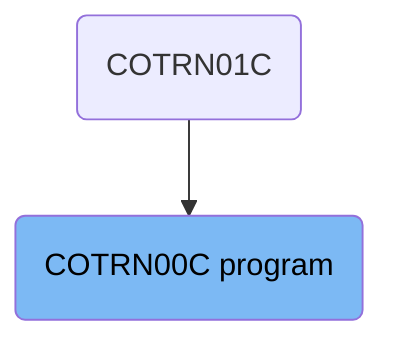
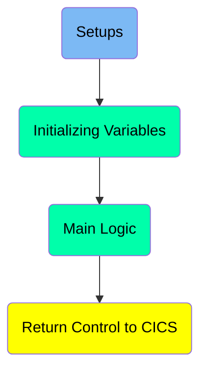
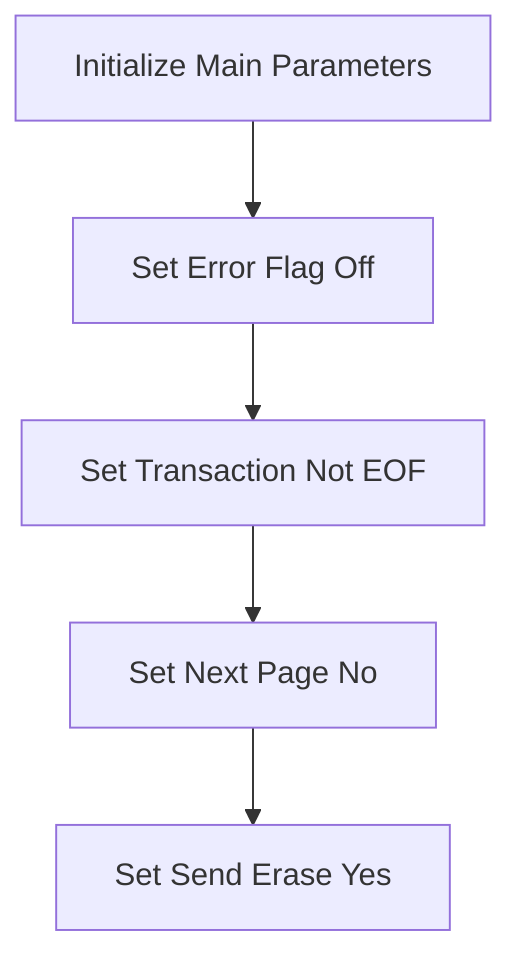
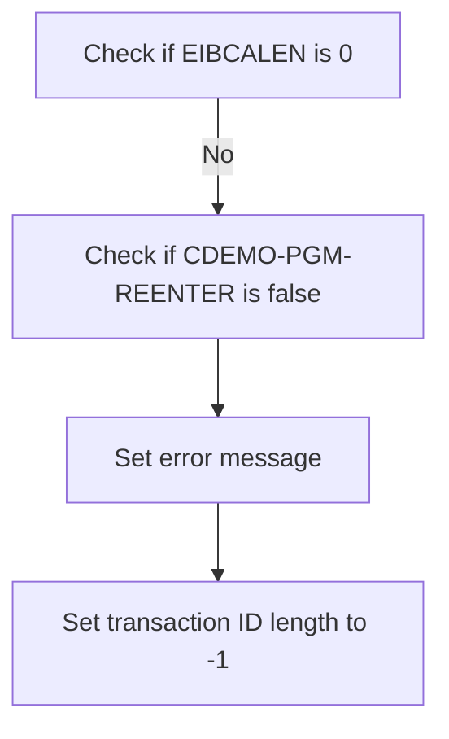
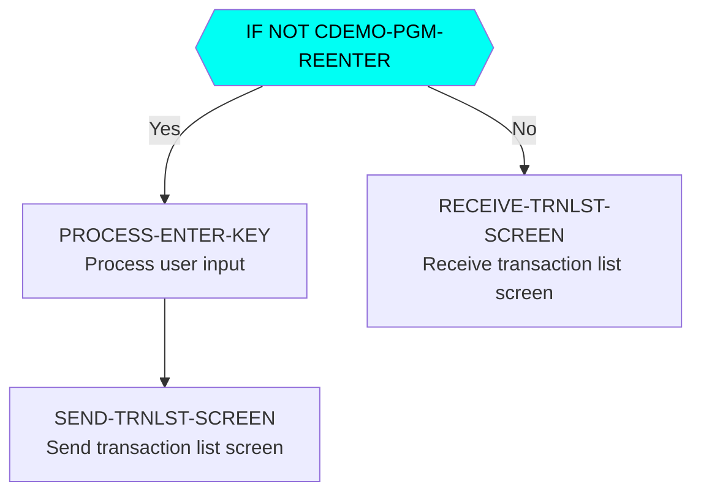
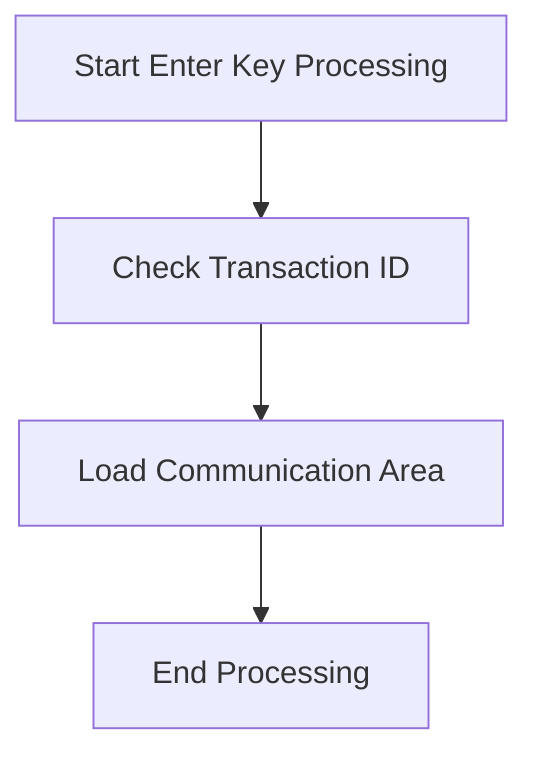

The <SwmToken path="app/cbl/COTRN00C.cbl" pos="2:7:7" line-data="      * Program     : COTRN00C.CBL">`COTRN00C`</SwmToken> program is responsible for initializing main parameters, handling user input, and managing screen transitions in a transaction processing system. It starts by setting various flags and parameters to their initial states, checks conditions such as EIBCALEN and <SwmToken path="app/cbl/COTRN00C.cbl" pos="112:5:9" line-data="               IF NOT CDEMO-PGM-REENTER">`CDEMO-PGM-REENTER`</SwmToken>, and processes user inputs like the Enter key and PF keys. The program ensures smooth transitions between screens and accurate transaction processing by evaluating user inputs and setting appropriate flags and values.

The flow of the <SwmToken path="app/cbl/COTRN00C.cbl" pos="2:7:7" line-data="      * Program     : COTRN00C.CBL">`COTRN00C`</SwmToken> program involves initializing main parameters, checking specific conditions, handling user inputs, and managing screen transitions. It starts by setting initial states for various flags and parameters, then checks conditions like EIBCALEN and <SwmToken path="app/cbl/COTRN00C.cbl" pos="112:5:9" line-data="               IF NOT CDEMO-PGM-REENTER">`CDEMO-PGM-REENTER`</SwmToken>. Based on user inputs, such as pressing the Enter key or PF keys, the program processes the input, sets necessary flags, and transitions between screens to ensure accurate transaction processing.

# Where is this program used?

This program is used once, in a flow starting from <SwmToken path="app/cbl/COTRN00C.cbl" pos="188:4:4" line-data="                        MOVE &#39;COTRN01C&#39;   TO CDEMO-TO-PROGRAM">`COTRN01C`</SwmToken> as represented in the following diagram:



Here is a high level diagram of the program:



# Setups



<SwmSnippet path="/app/cbl/COTRN00C.cbl" line="95">

---

## Initialize Main Parameters

The <SwmToken path="app/cbl/COTRN00C.cbl" pos="95:1:3" line-data="       MAIN-PARA.">`MAIN-PARA`</SwmToken> function initializes the main parameters required for transaction processing. This includes setting various flags to their initial states.

```cobol
       MAIN-PARA.

           SET ERR-FLG-OFF TO TRUE
           SET TRANSACT-NOT-EOF TO TRUE
           SET NEXT-PAGE-NO TO TRUE
           SET SEND-ERASE-YES TO TRUE

           MOVE SPACES TO WS-MESSAGE
```

---

</SwmSnippet>

<SwmSnippet path="/app/cbl/COTRN00C.cbl" line="97">

---

### Set Error Flag Off

First, the error flag is set to off (<SwmToken path="app/cbl/COTRN00C.cbl" pos="97:3:7" line-data="           SET ERR-FLG-OFF TO TRUE">`ERR-FLG-OFF`</SwmToken>). This ensures that any previous errors are cleared before starting a new transaction.

```cobol
           SET ERR-FLG-OFF TO TRUE
```

---

</SwmSnippet>

<SwmSnippet path="/app/cbl/COTRN00C.cbl" line="98">

---

### Set Transaction Not EOF

Next, the transaction not EOF flag (<SwmToken path="app/cbl/COTRN00C.cbl" pos="98:3:7" line-data="           SET TRANSACT-NOT-EOF TO TRUE">`TRANSACT-NOT-EOF`</SwmToken>) is set to true. This indicates that the transaction file has not reached the end, allowing for further processing.

```cobol
           SET TRANSACT-NOT-EOF TO TRUE
```

---

</SwmSnippet>

<SwmSnippet path="/app/cbl/COTRN00C.cbl" line="99">

---

### Set Next Page No

Then, the next page flag (<SwmToken path="app/cbl/COTRN00C.cbl" pos="99:3:7" line-data="           SET NEXT-PAGE-NO TO TRUE">`NEXT-PAGE-NO`</SwmToken>) is set to true. This prepares the system to handle pagination if needed during the transaction processing.

```cobol
           SET NEXT-PAGE-NO TO TRUE
```

---

</SwmSnippet>

<SwmSnippet path="/app/cbl/COTRN00C.cbl" line="100">

---

### Set Send Erase Yes

Finally, the send erase flag (<SwmToken path="app/cbl/COTRN00C.cbl" pos="100:3:7" line-data="           SET SEND-ERASE-YES TO TRUE">`SEND-ERASE-YES`</SwmToken>) is set to true. This ensures that the screen will be cleared before displaying new information.

```cobol
           SET SEND-ERASE-YES TO TRUE
```

---

</SwmSnippet>

# Initializing Variables



<SwmSnippet path="/app/cbl/COTRN00C.cbl" line="103">

---

## Check if EIBCALEN is 0

First, the code checks if <SwmToken path="app/cbl/COTRN00C.cbl" pos="107:3:3" line-data="           IF EIBCALEN = 0">`EIBCALEN`</SwmToken> is 0. This is a condition to determine if the length of the communication area is zero, which might indicate that no data was passed to the program.

```cobol
                          ERRMSGO OF COTRN0AO

           MOVE -1       TO TRNIDINL OF COTRN0AI

           IF EIBCALEN = 0
```

---

</SwmSnippet>

<SwmSnippet path="/app/cbl/COTRN00C.cbl" line="103">

---

## Check if <SwmToken path="app/cbl/COTRN00C.cbl" pos="112:5:9" line-data="               IF NOT CDEMO-PGM-REENTER">`CDEMO-PGM-REENTER`</SwmToken> is false

Next, the code checks if <SwmToken path="app/cbl/COTRN00C.cbl" pos="112:5:9" line-data="               IF NOT CDEMO-PGM-REENTER">`CDEMO-PGM-REENTER`</SwmToken> is false. This condition checks if the program is not in a re-entry state, meaning it is being entered for the first time in this execution.

```cobol
                          ERRMSGO OF COTRN0AO

           MOVE -1       TO TRNIDINL OF COTRN0AI

           IF EIBCALEN = 0
```

---

</SwmSnippet>

<SwmSnippet path="/app/cbl/COTRN00C.cbl" line="103">

---

## Set error message

Then, the code sets an error message by moving a value to <SwmToken path="app/cbl/COTRN00C.cbl" pos="103:1:1" line-data="                          ERRMSGO OF COTRN0AO">`ERRMSGO`</SwmToken> of <SwmToken path="app/cbl/COTRN00C.cbl" pos="103:5:5" line-data="                          ERRMSGO OF COTRN0AO">`COTRN0AO`</SwmToken>. This step is crucial for informing the user or system of an error condition.

```cobol
                          ERRMSGO OF COTRN0AO

           MOVE -1       TO TRNIDINL OF COTRN0AI

           IF EIBCALEN = 0
```

---

</SwmSnippet>

<SwmSnippet path="/app/cbl/COTRN00C.cbl" line="103">

---

## Set transaction ID length to -1

Finally, the code sets the transaction ID length to -1 by moving -1 to <SwmToken path="app/cbl/COTRN00C.cbl" pos="105:8:8" line-data="           MOVE -1       TO TRNIDINL OF COTRN0AI">`TRNIDINL`</SwmToken> of <SwmToken path="app/cbl/COTRN00C.cbl" pos="105:12:12" line-data="           MOVE -1       TO TRNIDINL OF COTRN0AI">`COTRN0AI`</SwmToken>. This indicates an invalid or uninitialized transaction ID length.

```cobol
                          ERRMSGO OF COTRN0AO

           MOVE -1       TO TRNIDINL OF COTRN0AI

           IF EIBCALEN = 0
```

---

</SwmSnippet>

## Interim Summary

So far, we saw how to initialize the main parameters and set various flags to their initial states. We also covered checking conditions such as <SwmToken path="app/cbl/COTRN00C.cbl" pos="107:3:3" line-data="           IF EIBCALEN = 0">`EIBCALEN`</SwmToken> and <SwmToken path="app/cbl/COTRN00C.cbl" pos="112:5:9" line-data="               IF NOT CDEMO-PGM-REENTER">`CDEMO-PGM-REENTER`</SwmToken>, setting error messages, and initializing transaction ID lengths. Now, we will focus on handling user input and screen transitions based on the input received.

# Main Logic



<SwmSnippet path="/app/cbl/COTRN00C.cbl" line="108">

---

## Handling User Input and Screen Transitions

This section of the code handles user input and screen transitions based on the input received. It checks if the program is being re-entered and processes the input accordingly.

```cobol
               MOVE 'COSGN00C' TO CDEMO-TO-PROGRAM
               PERFORM RETURN-TO-PREV-SCREEN
           ELSE
               MOVE DFHCOMMAREA(1:EIBCALEN) TO CARDDEMO-COMMAREA
               IF NOT CDEMO-PGM-REENTER
                   SET CDEMO-PGM-REENTER    TO TRUE
                   MOVE LOW-VALUES          TO COTRN0AO
                   PERFORM PROCESS-ENTER-KEY
                   PERFORM SEND-TRNLST-SCREEN
               ELSE
                   PERFORM RECEIVE-TRNLST-SCREEN
                   EVALUATE EIBAID
                       WHEN DFHENTER
                           PERFORM PROCESS-ENTER-KEY
                       WHEN DFHPF3
                           MOVE 'COMEN01C' TO CDEMO-TO-PROGRAM
                           PERFORM RETURN-TO-PREV-SCREEN
                       WHEN DFHPF7
                           PERFORM PROCESS-PF7-KEY
                       WHEN DFHPF8
                           PERFORM PROCESS-PF8-KEY
```

---

</SwmSnippet>

<SwmSnippet path="/app/cbl/COTRN00C.cbl" line="112">

---

### Initial Program Check

First, the code checks if the program is being re-entered by evaluating <SwmToken path="app/cbl/COTRN00C.cbl" pos="112:5:9" line-data="               IF NOT CDEMO-PGM-REENTER">`CDEMO-PGM-REENTER`</SwmToken>. If it is not, it sets <SwmToken path="app/cbl/COTRN00C.cbl" pos="112:5:9" line-data="               IF NOT CDEMO-PGM-REENTER">`CDEMO-PGM-REENTER`</SwmToken> to TRUE and initializes <SwmToken path="app/cbl/COTRN00C.cbl" pos="103:5:5" line-data="                          ERRMSGO OF COTRN0AO">`COTRN0AO`</SwmToken> with low values.

```cobol
               IF NOT CDEMO-PGM-REENTER
                   SET CDEMO-PGM-REENTER    TO TRUE
```

---

</SwmSnippet>

<SwmSnippet path="/app/cbl/COTRN00C.cbl" line="115">

---

### Processing Enter Key

Next, the code performs the <SwmToken path="app/cbl/COTRN00C.cbl" pos="115:3:7" line-data="                   PERFORM PROCESS-ENTER-KEY">`PROCESS-ENTER-KEY`</SwmToken> paragraph to handle the user input when the Enter key is pressed. This involves evaluating various conditions and setting appropriate flags and values.

```cobol
                   PERFORM PROCESS-ENTER-KEY
                   PERFORM SEND-TRNLST-SCREEN
```

---

</SwmSnippet>

<SwmSnippet path="/app/cbl/COTRN00C.cbl" line="116">

---

### Sending Transaction List Screen

Then, the code performs the <SwmToken path="app/cbl/COTRN00C.cbl" pos="116:3:7" line-data="                   PERFORM SEND-TRNLST-SCREEN">`SEND-TRNLST-SCREEN`</SwmToken> paragraph to send the transaction list screen to the user.

```cobol
                   PERFORM SEND-TRNLST-SCREEN
```

---

</SwmSnippet>

<SwmSnippet path="/app/cbl/COTRN00C.cbl" line="118">

---

### Receiving Transaction List Screen

If the program is being re-entered, the code performs the <SwmToken path="app/cbl/COTRN00C.cbl" pos="118:3:7" line-data="                   PERFORM RECEIVE-TRNLST-SCREEN">`RECEIVE-TRNLST-SCREEN`</SwmToken> paragraph to receive the transaction list screen from the user.

```cobol
                   PERFORM RECEIVE-TRNLST-SCREEN
```

---

</SwmSnippet>

<SwmSnippet path="/app/cbl/COTRN00C.cbl" line="119">

---

### Evaluating User Input

The code then evaluates the user input using the <SwmToken path="app/cbl/COTRN00C.cbl" pos="119:3:3" line-data="                   EVALUATE EIBAID">`EIBAID`</SwmToken> variable. Depending on the input (e.g., Enter key, PF3 key, <SwmToken path="app/cbl/COTRN00C.cbl" pos="126:5:5" line-data="                           PERFORM PROCESS-PF7-KEY">`PF7`</SwmToken> key, <SwmToken path="app/cbl/COTRN00C.cbl" pos="128:5:5" line-data="                           PERFORM PROCESS-PF8-KEY">`PF8`</SwmToken> key, or other), it performs different actions such as processing the Enter key, returning to the previous screen, processing <SwmToken path="app/cbl/COTRN00C.cbl" pos="126:5:5" line-data="                           PERFORM PROCESS-PF7-KEY">`PF7`</SwmToken> or <SwmToken path="app/cbl/COTRN00C.cbl" pos="128:5:5" line-data="                           PERFORM PROCESS-PF8-KEY">`PF8`</SwmToken> keys, or handling invalid input.

```cobol
                   EVALUATE EIBAID
                       WHEN DFHENTER
                           PERFORM PROCESS-ENTER-KEY
                       WHEN DFHPF3
                           MOVE 'COMEN01C' TO CDEMO-TO-PROGRAM
                           PERFORM RETURN-TO-PREV-SCREEN
                       WHEN DFHPF7
                           PERFORM PROCESS-PF7-KEY
                       WHEN DFHPF8
                           PERFORM PROCESS-PF8-KEY
                       WHEN OTHER
                           MOVE 'Y'                       TO WS-ERR-FLG
                           MOVE -1       TO TRNIDINL OF COTRN0AI
                           MOVE CCDA-MSG-INVALID-KEY      TO WS-MESSAGE
                           PERFORM SEND-TRNLST-SCREEN
                   END-EVALUATE
```

---

</SwmSnippet>

<SwmSnippet path="/app/cbl/COTRN00C.cbl" line="146">

---

### <SwmToken path="app/cbl/COTRN00C.cbl" pos="146:1:5" line-data="       PROCESS-ENTER-KEY.">`PROCESS-ENTER-KEY`</SwmToken>

The <SwmToken path="app/cbl/COTRN00C.cbl" pos="146:1:5" line-data="       PROCESS-ENTER-KEY.">`PROCESS-ENTER-KEY`</SwmToken> paragraph handles the user input when the Enter key is pressed. It evaluates various conditions to determine which transaction was selected and sets appropriate flags and values. If a valid selection is made, it moves to the next program; otherwise, it displays an error message.

```cobol
       PROCESS-ENTER-KEY.

           EVALUATE TRUE
               WHEN SEL0001I OF COTRN0AI NOT = SPACES AND LOW-VALUES
                   MOVE SEL0001I OF COTRN0AI TO CDEMO-CT00-TRN-SEL-FLG
                   MOVE TRNID01I OF COTRN0AI TO CDEMO-CT00-TRN-SELECTED
               WHEN SEL0002I OF COTRN0AI NOT = SPACES AND LOW-VALUES
                   MOVE SEL0002I OF COTRN0AI TO CDEMO-CT00-TRN-SEL-FLG
                   MOVE TRNID02I OF COTRN0AI TO CDEMO-CT00-TRN-SELECTED
               WHEN SEL0003I OF COTRN0AI NOT = SPACES AND LOW-VALUES
                   MOVE SEL0003I OF COTRN0AI TO CDEMO-CT00-TRN-SEL-FLG
                   MOVE TRNID03I OF COTRN0AI TO CDEMO-CT00-TRN-SELECTED
               WHEN SEL0004I OF COTRN0AI NOT = SPACES AND LOW-VALUES
                   MOVE SEL0004I OF COTRN0AI TO CDEMO-CT00-TRN-SEL-FLG
                   MOVE TRNID04I OF COTRN0AI TO CDEMO-CT00-TRN-SELECTED
               WHEN SEL0005I OF COTRN0AI NOT = SPACES AND LOW-VALUES
                   MOVE SEL0005I OF COTRN0AI TO CDEMO-CT00-TRN-SEL-FLG
                   MOVE TRNID05I OF COTRN0AI TO CDEMO-CT00-TRN-SELECTED
               WHEN SEL0006I OF COTRN0AI NOT = SPACES AND LOW-VALUES
                   MOVE SEL0006I OF COTRN0AI TO CDEMO-CT00-TRN-SEL-FLG
                   MOVE TRNID06I OF COTRN0AI TO CDEMO-CT00-TRN-SELECTED
```

---

</SwmSnippet>

<SwmSnippet path="/app/cbl/COTRN00C.cbl" line="510">

---

### <SwmToken path="app/cbl/COTRN00C.cbl" pos="510:1:7" line-data="       RETURN-TO-PREV-SCREEN.">`RETURN-TO-PREV-SCREEN`</SwmToken>

The <SwmToken path="app/cbl/COTRN00C.cbl" pos="510:1:7" line-data="       RETURN-TO-PREV-SCREEN.">`RETURN-TO-PREV-SCREEN`</SwmToken> paragraph handles the transition back to the previous screen. It sets the necessary program and transaction IDs and executes the transition.

```cobol
       RETURN-TO-PREV-SCREEN.

           IF CDEMO-TO-PROGRAM = LOW-VALUES OR SPACES
               MOVE 'COSGN00C' TO CDEMO-TO-PROGRAM
           END-IF
           MOVE WS-TRANID    TO CDEMO-FROM-TRANID
           MOVE WS-PGMNAME   TO CDEMO-FROM-PROGRAM
           MOVE ZEROS        TO CDEMO-PGM-CONTEXT
           EXEC CICS
               XCTL PROGRAM(CDEMO-TO-PROGRAM)
               COMMAREA(CARDDEMO-COMMAREA)
           END-EXEC.
```

---

</SwmSnippet>

<SwmSnippet path="/app/cbl/COTRN00C.cbl" line="527">

---

### <SwmToken path="app/cbl/COTRN00C.cbl" pos="527:1:5" line-data="       SEND-TRNLST-SCREEN.">`SEND-TRNLST-SCREEN`</SwmToken>

The <SwmToken path="app/cbl/COTRN00C.cbl" pos="527:1:5" line-data="       SEND-TRNLST-SCREEN.">`SEND-TRNLST-SCREEN`</SwmToken> paragraph sends the transaction list screen to the user. It populates the header information and sends the screen using the CICS SEND command.

```cobol
       SEND-TRNLST-SCREEN.

           PERFORM POPULATE-HEADER-INFO

           MOVE WS-MESSAGE TO ERRMSGO OF COTRN0AO

           IF SEND-ERASE-YES
               EXEC CICS SEND
                         MAP('COTRN0A')
                         MAPSET('COTRN00')
                         FROM(COTRN0AO)
                         ERASE
                         CURSOR
               END-EXEC
           ELSE
               EXEC CICS SEND
                         MAP('COTRN0A')
                         MAPSET('COTRN00')
                         FROM(COTRN0AO)
      *                  ERASE
                         CURSOR
```

---

</SwmSnippet>

<SwmSnippet path="/app/cbl/COTRN00C.cbl" line="554">

---

### <SwmToken path="app/cbl/COTRN00C.cbl" pos="554:1:5" line-data="       RECEIVE-TRNLST-SCREEN.">`RECEIVE-TRNLST-SCREEN`</SwmToken>

The <SwmToken path="app/cbl/COTRN00C.cbl" pos="554:1:5" line-data="       RECEIVE-TRNLST-SCREEN.">`RECEIVE-TRNLST-SCREEN`</SwmToken> paragraph receives the transaction list screen from the user using the CICS RECEIVE command.

```cobol
       RECEIVE-TRNLST-SCREEN.

           EXEC CICS RECEIVE
                     MAP('COTRN0A')
                     MAPSET('COTRN00')
                     INTO(COTRN0AI)
                     RESP(WS-RESP-CD)
                     RESP2(WS-REAS-CD)
           END-EXEC.
```

---

</SwmSnippet>

<SwmSnippet path="/app/cbl/COTRN00C.cbl" line="234">

---

### <SwmToken path="app/cbl/COTRN00C.cbl" pos="234:1:5" line-data="       PROCESS-PF7-KEY.">`PROCESS-PF7-KEY`</SwmToken>

The <SwmToken path="app/cbl/COTRN00C.cbl" pos="234:1:5" line-data="       PROCESS-PF7-KEY.">`PROCESS-PF7-KEY`</SwmToken> paragraph handles the user input when the <SwmToken path="app/cbl/COTRN00C.cbl" pos="234:3:3" line-data="       PROCESS-PF7-KEY.">`PF7`</SwmToken> key is pressed. It sets the necessary flags and values to navigate to the previous page of transactions.

```cobol
       PROCESS-PF7-KEY.

           IF CDEMO-CT00-TRNID-FIRST = SPACES OR LOW-VALUES
               MOVE LOW-VALUES TO TRAN-ID
           ELSE
               MOVE CDEMO-CT00-TRNID-FIRST TO TRAN-ID
           END-IF

           SET NEXT-PAGE-YES TO TRUE
           MOVE -1       TO TRNIDINL OF COTRN0AI

           IF CDEMO-CT00-PAGE-NUM > 1
               PERFORM PROCESS-PAGE-BACKWARD
           ELSE
               MOVE 'You are already at the top of the page...' TO
                               WS-MESSAGE
               SET SEND-ERASE-NO TO TRUE
               PERFORM SEND-TRNLST-SCREEN
           END-IF.
```

---

</SwmSnippet>

<SwmSnippet path="/app/cbl/COTRN00C.cbl" line="257">

---

### <SwmToken path="app/cbl/COTRN00C.cbl" pos="257:1:5" line-data="       PROCESS-PF8-KEY.">`PROCESS-PF8-KEY`</SwmToken>

The <SwmToken path="app/cbl/COTRN00C.cbl" pos="257:1:5" line-data="       PROCESS-PF8-KEY.">`PROCESS-PF8-KEY`</SwmToken> paragraph handles the user input when the <SwmToken path="app/cbl/COTRN00C.cbl" pos="257:3:3" line-data="       PROCESS-PF8-KEY.">`PF8`</SwmToken> key is pressed. It sets the necessary flags and values to navigate to the next page of transactions.

```cobol
       PROCESS-PF8-KEY.

           IF CDEMO-CT00-TRNID-LAST = SPACES OR LOW-VALUES
               MOVE HIGH-VALUES TO TRAN-ID
           ELSE
               MOVE CDEMO-CT00-TRNID-LAST TO TRAN-ID
           END-IF

           MOVE -1       TO TRNIDINL OF COTRN0AI

           IF NEXT-PAGE-YES
               PERFORM PROCESS-PAGE-FORWARD
           ELSE
               MOVE 'You are already at the bottom of the page...' TO
                               WS-MESSAGE
               SET SEND-ERASE-NO TO TRUE
               PERFORM SEND-TRNLST-SCREEN
           END-IF.
```

---

</SwmSnippet>

# Return Control to CICS

This is the next section of the flow.



<SwmSnippet path="/app/cbl/COTRN00C.cbl" line="139">

---

## Start Enter Key Processing

First, the program begins processing the enter key action by setting up the transaction ID using <SwmToken path="app/cbl/COTRN00C.cbl" pos="139:1:1" line-data="                     TRANSID (WS-TRANID)">`TRANSID`</SwmToken> and loading the communication area using <SwmToken path="app/cbl/COTRN00C.cbl" pos="140:1:1" line-data="                     COMMAREA (CARDDEMO-COMMAREA)">`COMMAREA`</SwmToken>. This sets the context for the transaction being processed.

```cobol
                     TRANSID (WS-TRANID)
                     COMMAREA (CARDDEMO-COMMAREA)
           END-EXEC.
```

---

</SwmSnippet>

<SwmSnippet path="/app/cbl/COTRN00C.cbl" line="139">

---

## Check Transaction ID

Next, the program checks the transaction ID (<SwmToken path="app/cbl/COTRN00C.cbl" pos="139:4:6" line-data="                     TRANSID (WS-TRANID)">`WS-TRANID`</SwmToken>) to ensure it is valid and corresponds to the current transaction. This is crucial for identifying the correct transaction to process.

```cobol
                     TRANSID (WS-TRANID)
                     COMMAREA (CARDDEMO-COMMAREA)
           END-EXEC.
```

---

</SwmSnippet>

<SwmSnippet path="/app/cbl/COTRN00C.cbl" line="140">

---

## Load Communication Area

Then, the program loads the communication area (<SwmToken path="app/cbl/COTRN00C.cbl" pos="140:4:6" line-data="                     COMMAREA (CARDDEMO-COMMAREA)">`CARDDEMO-COMMAREA`</SwmToken>). This area contains all the necessary data for processing the transaction, such as account details and transaction specifics.

```cobol
                     COMMAREA (CARDDEMO-COMMAREA)
           END-EXEC.
```

---

</SwmSnippet>

<SwmSnippet path="/app/cbl/COTRN00C.cbl" line="141">

---

## End Processing

Finally, the program ends the processing of the enter key action. At this point, the transaction has been set up and is ready for further processing steps.

```cobol
           END-EXEC.
```

---

</SwmSnippet>

&nbsp;

*This is an auto-generated document by Swimm 🌊 and has not yet been verified by a human*

<SwmMeta version="3.0.0" repo-id="Z2l0aHViJTNBJTNBa3luZHJ5bC1hd3MtbWFpbmZyYW1lLW1vZGVybml6YXRpb24tY2FyZGRlbW8lM0ElM0FTd2ltbS1EZW1v" repo-name="kyndryl-aws-mainframe-modernization-carddemo"><sup>Powered by [Swimm](/)</sup></SwmMeta>
