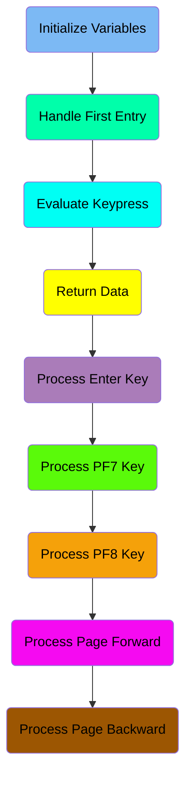
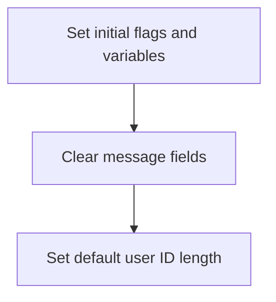
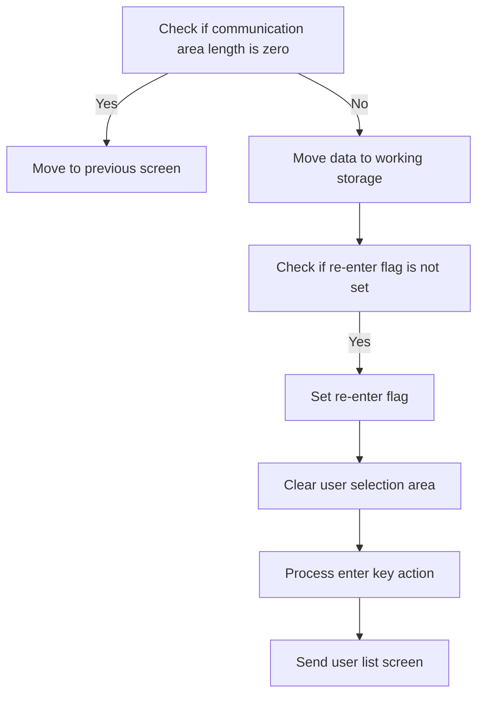
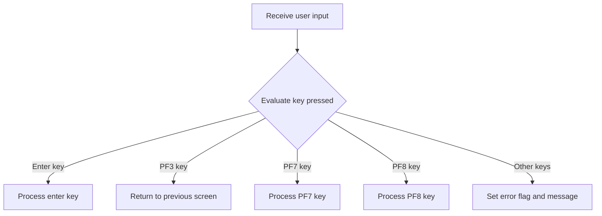
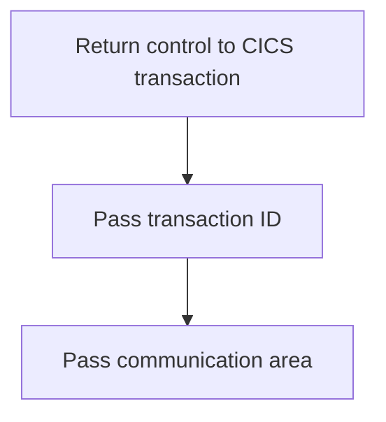
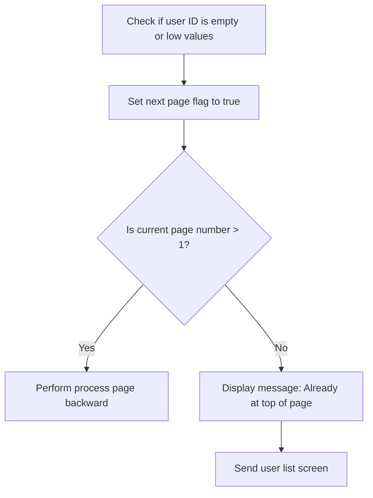
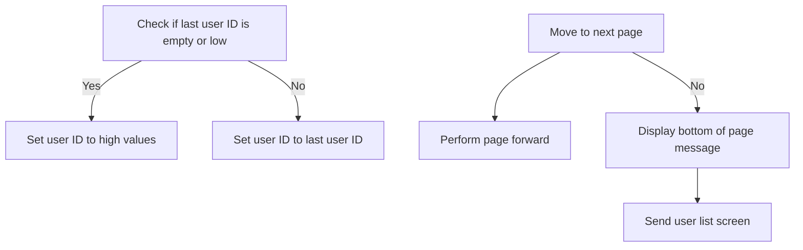
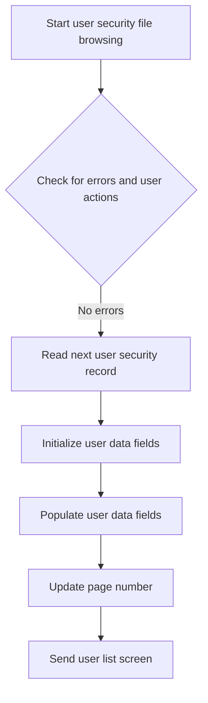
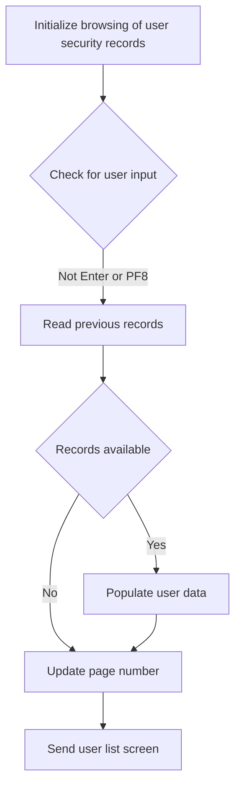

```mermaid
graph TD
  A[Evaluate user selection input] --> B{Check selection flag}
  B -->|Valid selection| C[Set user selection flags]
  C --> D{Determine next program}
  D -->|U or u| E[Set program to COUSR02C]
  D -->|D or d| F[Set program to COUSR03C]
  D -->|Other| G[Set invalid selection message]
  G --> H[Set error flag]
  D --> H
  H --> I[Check user ID initialization]

%% Swimm:
%% graph TD
%%   A[Evaluate user selection input] --> B{Check selection flag}
%%   B -->|Valid selection| C[Set user selection flags]
%%   C --> D{Determine next program}
%%   D -->|U or u| E[Set program to <SwmToken path="app/cbl/COUSR00C.cbl" pos="192:4:4" line-data="                        MOVE &#39;COUSR02C&#39;   TO CDEMO-TO-PROGRAM">`COUSR02C`</SwmToken>]
%%   D -->|D or d| F[Set program to <SwmToken path="app/cbl/COUSR00C.cbl" pos="202:4:4" line-data="                        MOVE &#39;COUSR03C&#39;   TO CDEMO-TO-PROGRAM">`COUSR03C`</SwmToken>]
%%   D -->|Other| G[Set invalid selection message]
%%   G --> H[Set error flag]
%%   D --> H
%%   H --> I[Check user ID initialization]
```

The Listing Users (<SwmToken path="app/cbl/COUSR00C.cbl" pos="2:7:7" line-data="      * Program     : COUSR00C.CBL">`COUSR00C`</SwmToken>) document describes the process of listing all users from the USRSEC file within the <SwmToken path="app/cbl/COUSR00C.cbl" pos="3:7:7" line-data="      * Application : CardDemo">`CardDemo`</SwmToken> application. This process is achieved through a series of steps that involve initializing variables, handling user input, evaluating key presses, and navigating through user records. The program ensures that user data is accurately retrieved and displayed, facilitating user management within the application.

The flow involves initializing necessary variables, handling the first user entry, evaluating key presses to determine the appropriate action, and processing user data for display. The program navigates through user records, updating the display based on user interactions, ensuring a smooth user management experience.

Here is a high level diagram of the program:



## Initialize Variables

First, we'll zoom into this section of the flow:



<SwmSnippet path="/app/cbl/COUSR00C.cbl" line="98">

---

First, we set initial flags and variables to their default states. This includes setting <SwmToken path="app/cbl/COUSR00C.cbl" pos="100:3:7" line-data="           SET ERR-FLG-OFF TO TRUE">`ERR-FLG-OFF`</SwmToken> (error flag) to true, <SwmToken path="app/cbl/COUSR00C.cbl" pos="101:3:9" line-data="           SET USER-SEC-NOT-EOF TO TRUE">`USER-SEC-NOT-EOF`</SwmToken> (end of file flag) to true, <SwmToken path="app/cbl/COUSR00C.cbl" pos="102:3:7" line-data="           SET NEXT-PAGE-NO TO TRUE">`NEXT-PAGE-NO`</SwmToken> (next page flag) to true, and <SwmToken path="app/cbl/COUSR00C.cbl" pos="103:3:7" line-data="           SET SEND-ERASE-YES TO TRUE">`SEND-ERASE-YES`</SwmToken> (send erase flag) to true.

```cobol
       MAIN-PARA SECTION.

           SET ERR-FLG-OFF TO TRUE
           SET USER-SEC-NOT-EOF TO TRUE
           SET NEXT-PAGE-NO TO TRUE
           SET SEND-ERASE-YES TO TRUE
```

---

</SwmSnippet>

<SwmSnippet path="/app/cbl/COUSR00C.cbl" line="105">

---

Next, we clear the message fields by moving spaces to <SwmToken path="app/cbl/COUSR00C.cbl" pos="105:7:9" line-data="           MOVE SPACES TO WS-MESSAGE">`WS-MESSAGE`</SwmToken> and <SwmToken path="app/cbl/COUSR00C.cbl" pos="106:1:1" line-data="                          ERRMSGO OF COUSR0AO">`ERRMSGO`</SwmToken> of <SwmToken path="app/cbl/COUSR00C.cbl" pos="106:5:5" line-data="                          ERRMSGO OF COUSR0AO">`COUSR0AO`</SwmToken>. This ensures that any previous messages are erased before starting the new process. Additionally, we set the default user ID length by moving -1 to <SwmToken path="app/cbl/COUSR00C.cbl" pos="108:8:8" line-data="           MOVE -1       TO USRIDINL OF COUSR0AI">`USRIDINL`</SwmToken> of <SwmToken path="app/cbl/COUSR00C.cbl" pos="108:12:12" line-data="           MOVE -1       TO USRIDINL OF COUSR0AI">`COUSR0AI`</SwmToken>.

```cobol
           MOVE SPACES TO WS-MESSAGE
                          ERRMSGO OF COUSR0AO

           MOVE -1       TO USRIDINL OF COUSR0AI
```

---

</SwmSnippet>

## Handle First Entry

Now, lets zoom into this section of the flow:



<SwmSnippet path="/app/cbl/COUSR00C.cbl" line="110">

---

The function first checks if the communication area length (<SwmToken path="app/cbl/COUSR00C.cbl" pos="110:3:3" line-data="           IF EIBCALEN = 0">`EIBCALEN`</SwmToken>) is zero. If it is, it moves to the previous screen by setting the <SwmToken path="app/cbl/COUSR00C.cbl" pos="111:9:13" line-data="               MOVE &#39;COSGN00C&#39; TO CDEMO-TO-PROGRAM">`CDEMO-TO-PROGRAM`</SwmToken> variable to <SwmToken path="app/cbl/COUSR00C.cbl" pos="111:4:4" line-data="               MOVE &#39;COSGN00C&#39; TO CDEMO-TO-PROGRAM">`COSGN00C`</SwmToken> and performing the <SwmToken path="app/cbl/COUSR00C.cbl" pos="112:3:9" line-data="               PERFORM RETURN-TO-PREV-SCREEN">`RETURN-TO-PREV-SCREEN`</SwmToken> action. If the communication area length is not zero, it moves the data from the communication area to the <SwmToken path="app/cbl/COUSR00C.cbl" pos="114:12:14" line-data="               MOVE DFHCOMMAREA(1:EIBCALEN) TO CARDDEMO-COMMAREA">`CARDDEMO-COMMAREA`</SwmToken>. Then, it checks if the <SwmToken path="app/cbl/COUSR00C.cbl" pos="115:5:9" line-data="               IF NOT CDEMO-PGM-REENTER">`CDEMO-PGM-REENTER`</SwmToken> flag is not set. If the flag is not set, it sets the <SwmToken path="app/cbl/COUSR00C.cbl" pos="115:5:9" line-data="               IF NOT CDEMO-PGM-REENTER">`CDEMO-PGM-REENTER`</SwmToken> flag to true and clears the user selection area by moving low values to <SwmToken path="app/cbl/COUSR00C.cbl" pos="117:9:9" line-data="                   MOVE LOW-VALUES          TO COUSR0AO">`COUSR0AO`</SwmToken>. Finally, it processes the enter key action by performing the <SwmToken path="app/cbl/COUSR00C.cbl" pos="118:3:7" line-data="                   PERFORM PROCESS-ENTER-KEY">`PROCESS-ENTER-KEY`</SwmToken> action and sends the user list screen by performing the <SwmToken path="app/cbl/COUSR00C.cbl" pos="119:3:7" line-data="                   PERFORM SEND-USRLST-SCREEN">`SEND-USRLST-SCREEN`</SwmToken> action.

```cobol
           IF EIBCALEN = 0
               MOVE 'COSGN00C' TO CDEMO-TO-PROGRAM
               PERFORM RETURN-TO-PREV-SCREEN
           ELSE
               MOVE DFHCOMMAREA(1:EIBCALEN) TO CARDDEMO-COMMAREA
               IF NOT CDEMO-PGM-REENTER
                   SET CDEMO-PGM-REENTER    TO TRUE
                   MOVE LOW-VALUES          TO COUSR0AO
                   PERFORM PROCESS-ENTER-KEY
                   PERFORM SEND-USRLST-SCREEN
```

---

</SwmSnippet>

## Evaluate Keypress

Now, lets zoom into this section of the flow:



<SwmSnippet path="/app/cbl/COUSR00C.cbl" line="121">

---

First, the user input is received from the user list screen, which is essential for determining the next action based on the user's interaction.

```cobol
                   PERFORM RECEIVE-USRLST-SCREEN
```

---

</SwmSnippet>

<SwmSnippet path="/app/cbl/COUSR00C.cbl" line="122">

---

Next, the key pressed by the user is evaluated to determine the appropriate action. If the Enter key is pressed, the process for handling the Enter key is performed. If the PF3 key is pressed, the program navigates back to the previous screen. If the <SwmToken path="app/cbl/COUSR00C.cbl" pos="129:5:5" line-data="                           PERFORM PROCESS-PF7-KEY">`PF7`</SwmToken> or <SwmToken path="app/cbl/COUSR00C.cbl" pos="131:5:5" line-data="                           PERFORM PROCESS-PF8-KEY">`PF8`</SwmToken> keys are pressed, the respective processes for these keys are executed. For any other key presses, an error flag is set, and an error message is prepared to inform the user of the invalid input.

```cobol
                   EVALUATE EIBAID
                       WHEN DFHENTER
                           PERFORM PROCESS-ENTER-KEY
                       WHEN DFHPF3
                           MOVE 'COADM01C' TO CDEMO-TO-PROGRAM
                           PERFORM RETURN-TO-PREV-SCREEN
                       WHEN DFHPF7
                           PERFORM PROCESS-PF7-KEY
                       WHEN DFHPF8
                           PERFORM PROCESS-PF8-KEY
                       WHEN OTHER
                           MOVE 'Y'                       TO WS-ERR-FLG
                           MOVE -1       TO USRIDINL OF COUSR0AI
                           MOVE CCDA-MSG-INVALID-KEY      TO WS-MESSAGE
                           PERFORM SEND-USRLST-SCREEN
                   END-EVALUATE
```

---

</SwmSnippet>

## Return Data

This is the next section of the flow.



<SwmSnippet path="/app/cbl/COUSR00C.cbl" line="141">

---

The function returns control to the CICS transaction processing system, ensuring that the transaction flow continues smoothly.

```cobol
           EXEC CICS RETURN
                     TRANSID (WS-TRANID)
                     COMMAREA (CARDDEMO-COMMAREA)
           END-EXEC.
```

---

</SwmSnippet>

## Process Enter Key

Now, lets zoom into this section of the flow:



<SwmSnippet path="/app/cbl/COUSR00C.cbl" line="151">

---

First, the function evaluates the user selection input to determine which option the user has chosen.

```cobol
           EVALUATE TRUE
               WHEN SEL0001I OF COUSR0AI NOT = SPACES AND LOW-VALUES
```

---

</SwmSnippet>

<SwmSnippet path="/app/cbl/COUSR00C.cbl" line="153">

---

Next, it sets the user selection flags based on the input provided. This involves moving the selection indicator and user ID to the appropriate fields.

```cobol
                   MOVE SEL0001I OF COUSR0AI TO CDEMO-CU00-USR-SEL-FLG
                   MOVE USRID01I OF COUSR0AI TO CDEMO-CU00-USR-SELECTED
               WHEN SEL0002I OF COUSR0AI NOT = SPACES AND LOW-VALUES
                   MOVE SEL0002I OF COUSR0AI TO CDEMO-CU00-USR-SEL-FLG
                   MOVE USRID02I OF COUSR0AI TO CDEMO-CU00-USR-SELECTED
               WHEN SEL0003I OF COUSR0AI NOT = SPACES AND LOW-VALUES
                   MOVE SEL0003I OF COUSR0AI TO CDEMO-CU00-USR-SEL-FLG
                   MOVE USRID03I OF COUSR0AI TO CDEMO-CU00-USR-SELECTED
               WHEN SEL0004I OF COUSR0AI NOT = SPACES AND LOW-VALUES
                   MOVE SEL0004I OF COUSR0AI TO CDEMO-CU00-USR-SEL-FLG
                   MOVE USRID04I OF COUSR0AI TO CDEMO-CU00-USR-SELECTED
               WHEN SEL0005I OF COUSR0AI NOT = SPACES AND LOW-VALUES
                   MOVE SEL0005I OF COUSR0AI TO CDEMO-CU00-USR-SEL-FLG
                   MOVE USRID05I OF COUSR0AI TO CDEMO-CU00-USR-SELECTED
               WHEN SEL0006I OF COUSR0AI NOT = SPACES AND LOW-VALUES
                   MOVE SEL0006I OF COUSR0AI TO CDEMO-CU00-USR-SEL-FLG
                   MOVE USRID06I OF COUSR0AI TO CDEMO-CU00-USR-SELECTED
               WHEN SEL0007I OF COUSR0AI NOT = SPACES AND LOW-VALUES
                   MOVE SEL0007I OF COUSR0AI TO CDEMO-CU00-USR-SEL-FLG
                   MOVE USRID07I OF COUSR0AI TO CDEMO-CU00-USR-SELECTED
               WHEN SEL0008I OF COUSR0AI NOT = SPACES AND LOW-VALUES
```

---

</SwmSnippet>

<SwmSnippet path="/app/cbl/COUSR00C.cbl" line="189">

---

Then, the function determines the next program to call based on the user selection flag. If the selection is 'U' or 'u', it sets the program to <SwmToken path="app/cbl/COUSR00C.cbl" pos="192:4:4" line-data="                        MOVE &#39;COUSR02C&#39;   TO CDEMO-TO-PROGRAM">`COUSR02C`</SwmToken>. If the selection is 'D' or 'd', it sets the program to <SwmToken path="app/cbl/COUSR00C.cbl" pos="202:4:4" line-data="                        MOVE &#39;COUSR03C&#39;   TO CDEMO-TO-PROGRAM">`COUSR03C`</SwmToken>.

```cobol
               EVALUATE CDEMO-CU00-USR-SEL-FLG
                   WHEN 'U'
                   WHEN 'u'
                        MOVE 'COUSR02C'   TO CDEMO-TO-PROGRAM
                        MOVE WS-TRANID    TO CDEMO-FROM-TRANID
                        MOVE WS-PGMNAME   TO CDEMO-FROM-PROGRAM
                        MOVE 0        TO CDEMO-PGM-CONTEXT
                        EXEC CICS
                            XCTL PROGRAM(CDEMO-TO-PROGRAM)
                            COMMAREA(CARDDEMO-COMMAREA)
                        END-EXEC
                   WHEN 'D'
                   WHEN 'd'
                        MOVE 'COUSR03C'   TO CDEMO-TO-PROGRAM
                        MOVE WS-TRANID    TO CDEMO-FROM-TRANID
                        MOVE WS-PGMNAME   TO CDEMO-FROM-PROGRAM
                        MOVE 0        TO CDEMO-PGM-CONTEXT
                        EXEC CICS
                            XCTL PROGRAM(CDEMO-TO-PROGRAM)
                            COMMAREA(CARDDEMO-COMMAREA)
                        END-EXEC
```

---

</SwmSnippet>

<SwmSnippet path="/app/cbl/COUSR00C.cbl" line="210">

---

If the selection is invalid, it sets an error message indicating that the selection is invalid and sets the error flag.

```cobol
                   WHEN OTHER
                       MOVE
                       'Invalid selection. Valid values are U and D' TO
                                       WS-MESSAGE
                       MOVE -1       TO USRIDINL OF COUSR0AI
               END-EVALUATE
```

---

</SwmSnippet>

<SwmSnippet path="/app/cbl/COUSR00C.cbl" line="218">

---

Finally, the function checks if the user ID is initialized. If it is not, it sets the user ID to low values.

```cobol
           IF USRIDINI OF COUSR0AI = SPACES OR LOW-VALUES
               MOVE LOW-VALUES TO SEC-USR-ID
```

---

</SwmSnippet>

## Process <SwmToken path="app/cbl/COUSR00C.cbl" pos="129:5:5" line-data="                           PERFORM PROCESS-PF7-KEY">`PF7`</SwmToken> Key

Now, lets zoom into this section of the flow:



<SwmSnippet path="/app/cbl/COUSR00C.cbl" line="239">

---

First, the function checks if the user ID is empty or contains low values. If it is, it sets the user ID to low values; otherwise, it retains the current user ID.

```cobol
           IF CDEMO-CU00-USRID-FIRST = SPACES OR LOW-VALUES
               MOVE LOW-VALUES TO SEC-USR-ID
           ELSE
               MOVE CDEMO-CU00-USRID-FIRST TO SEC-USR-ID
           END-IF
```

---

</SwmSnippet>

<SwmSnippet path="/app/cbl/COUSR00C.cbl" line="245">

---

Next, the function sets the next page flag to true and prepares for navigating to the previous page. It then checks if the current page number is greater than 1. If it is, it performs the process to move to the previous page. If the current page number is 1 or less, it displays a message indicating that the user is already at the top of the page and sends the user list screen.

```cobol
           SET NEXT-PAGE-YES TO TRUE
           MOVE -1       TO USRIDINL OF COUSR0AI

           IF CDEMO-CU00-PAGE-NUM > 1
               PERFORM PROCESS-PAGE-BACKWARD
           ELSE
               MOVE 'You are already at the top of the page...' TO
                               WS-MESSAGE
               SET SEND-ERASE-NO TO TRUE
               PERFORM SEND-USRLST-SCREEN
           END-IF.
```

---

</SwmSnippet>

## Process <SwmToken path="app/cbl/COUSR00C.cbl" pos="131:5:5" line-data="                           PERFORM PROCESS-PF8-KEY">`PF8`</SwmToken> Key

Now, lets zoom into this section of the flow:



<SwmSnippet path="/app/cbl/COUSR00C.cbl" line="262">

---

First, we check if <SwmToken path="app/cbl/COUSR00C.cbl" pos="262:3:9" line-data="           IF CDEMO-CU00-USRID-LAST = SPACES OR LOW-VALUES">`CDEMO-CU00-USRID-LAST`</SwmToken> (which holds the last user ID) is empty or has low values. If it is, we set <SwmToken path="app/cbl/COUSR00C.cbl" pos="263:9:13" line-data="               MOVE HIGH-VALUES TO SEC-USR-ID">`SEC-USR-ID`</SwmToken> (the user ID for the security check) to high values. Otherwise, we set <SwmToken path="app/cbl/COUSR00C.cbl" pos="263:9:13" line-data="               MOVE HIGH-VALUES TO SEC-USR-ID">`SEC-USR-ID`</SwmToken> to the last user ID.

```cobol
           IF CDEMO-CU00-USRID-LAST = SPACES OR LOW-VALUES
               MOVE HIGH-VALUES TO SEC-USR-ID
           ELSE
               MOVE CDEMO-CU00-USRID-LAST TO SEC-USR-ID
```

---

</SwmSnippet>

<SwmSnippet path="/app/cbl/COUSR00C.cbl" line="270">

---

Next, we check if <SwmToken path="app/cbl/COUSR00C.cbl" pos="270:3:7" line-data="           IF NEXT-PAGE-YES">`NEXT-PAGE-YES`</SwmToken> (a flag indicating if there is a next page) is true. If it is, we perform the page forward process. If not, we display a message indicating that the user is already at the bottom of the page, set <SwmToken path="app/cbl/COUSR00C.cbl" pos="275:3:7" line-data="               SET SEND-ERASE-NO TO TRUE">`SEND-ERASE-NO`</SwmToken> to true, and perform the screen update to send the user list.

```cobol
           IF NEXT-PAGE-YES
               PERFORM PROCESS-PAGE-FORWARD
           ELSE
               MOVE 'You are already at the bottom of the page...' TO
                               WS-MESSAGE
               SET SEND-ERASE-NO TO TRUE
               PERFORM SEND-USRLST-SCREEN
           END-IF.
```

---

</SwmSnippet>

## Process Page Forward

Now, lets zoom into this section of the flow:



<SwmSnippet path="/app/cbl/COUSR00C.cbl" line="284">

---

First, the process starts by initiating the browsing of the user security file.

```cobol
           PERFORM STARTBR-USER-SEC-FILE
```

---

</SwmSnippet>

<SwmSnippet path="/app/cbl/COUSR00C.cbl" line="286">

---

Next, it checks for any errors and user actions that are not related to entering data or navigating pages.

```cobol
           IF NOT ERR-FLG-ON

               IF EIBAID NOT = DFHENTER AND DFHPF7 AND DFHPF3
```

---

</SwmSnippet>

<SwmSnippet path="/app/cbl/COUSR00C.cbl" line="289">

---

Then, it reads the next user security record from the file if there are no errors.

```cobol
                   PERFORM READNEXT-USER-SEC-FILE
```

---

</SwmSnippet>

<SwmSnippet path="/app/cbl/COUSR00C.cbl" line="294">

---

Moving to the next step, it initializes user data fields by setting them to spaces based on the value of the index variable <SwmToken path="app/cbl/COUSR00C.cbl" pos="347:5:7" line-data="               PERFORM VARYING WS-IDX FROM 1 BY 1 UNTIL WS-IDX &gt; 10">`WS-IDX`</SwmToken>.

```cobol
                   PERFORM INITIALIZE-USER-DATA
```

---

</SwmSnippet>

<SwmSnippet path="/app/cbl/COUSR00C.cbl" line="303">

---

Next, it populates the user data fields with the information read from the user security file.

```cobol
                       PERFORM POPULATE-USER-DATA
```

---

</SwmSnippet>

<SwmSnippet path="/app/cbl/COUSR00C.cbl" line="309">

---

Then, it updates the page number if there are more records to be read.

```cobol
                   COMPUTE CDEMO-CU00-PAGE-NUM =
                           CDEMO-CU00-PAGE-NUM + 1
```

---

</SwmSnippet>

<SwmSnippet path="/app/cbl/COUSR00C.cbl" line="329">

---

Finally, it sends the user list screen to the user, displaying the current page of user data.

```cobol
               PERFORM SEND-USRLST-SCREEN
```

---

</SwmSnippet>

## Process Page Backward

Now, lets zoom into this section of the flow:



<SwmSnippet path="/app/cbl/COUSR00C.cbl" line="336">

---

First, the browsing of user security records is initialized to start reading the records.

```cobol
       PROCESS-PAGE-BACKWARD.

           PERFORM STARTBR-USER-SEC-FILE

```

---

</SwmSnippet>

<SwmSnippet path="/app/cbl/COUSR00C.cbl" line="340">

---

Moving to the next step, the system checks for user input to determine if the Enter or <SwmToken path="app/cbl/COUSR00C.cbl" pos="131:5:5" line-data="                           PERFORM PROCESS-PF8-KEY">`PF8`</SwmToken> keys were pressed. If neither key was pressed, it proceeds to read the previous user security records.

```cobol
           IF NOT ERR-FLG-ON

               IF EIBAID NOT = DFHENTER  AND DFHPF8
                   PERFORM READPREV-USER-SEC-FILE
               END-IF
```

---

</SwmSnippet>

<SwmSnippet path="/app/cbl/COUSR00C.cbl" line="345">

---

Next, if records are available and no errors are flagged, the system populates user data by iterating through the records.

```cobol

               IF USER-SEC-NOT-EOF AND ERR-FLG-OFF
               PERFORM VARYING WS-IDX FROM 1 BY 1 UNTIL WS-IDX > 10
                   PERFORM INITIALIZE-USER-DATA
               END-PERFORM
               END-IF
```

---

</SwmSnippet>

<SwmSnippet path="/app/cbl/COUSR00C.cbl" line="362">

---

Then, the system updates the page number based on the availability of records and user input, ensuring the correct page number is set for navigation.

```cobol
               IF USER-SEC-NOT-EOF AND ERR-FLG-OFF
               PERFORM READPREV-USER-SEC-FILE
               IF NEXT-PAGE-YES
                   IF USER-SEC-NOT-EOF AND ERR-FLG-OFF AND
                       CDEMO-CU00-PAGE-NUM > 1
                       SUBTRACT 1 FROM CDEMO-CU00-PAGE-NUM
                   ELSE
                       MOVE 1 TO CDEMO-CU00-PAGE-NUM
                   END-IF
```

---

</SwmSnippet>

<SwmSnippet path="/app/cbl/COUSR00C.cbl" line="376">

---

Finally, the user list screen is sent to the user, displaying the updated list of user security records.

```cobol
               MOVE CDEMO-CU00-PAGE-NUM TO PAGENUMI  OF COUSR0AI
               PERFORM SEND-USRLST-SCREEN
```

---

</SwmSnippet>

&nbsp;

*This is an auto-generated document by Swimm 🌊 and has not yet been verified by a human*

<SwmMeta version="3.0.0" repo-id="Z2l0aHViJTNBJTNBa3luZHJ5bC1hd3MtbWFpbmZyYW1lLW1vZGVybml6YXRpb24tY2FyZGRlbW8lM0ElM0FTd2ltbS1EZW1v" repo-name="kyndryl-aws-mainframe-modernization-carddemo"><sup>Powered by [Swimm](/)</sup></SwmMeta>
