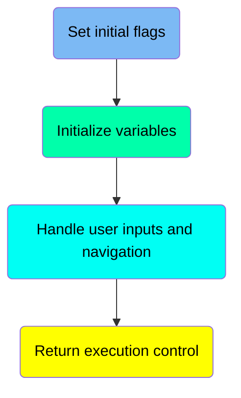
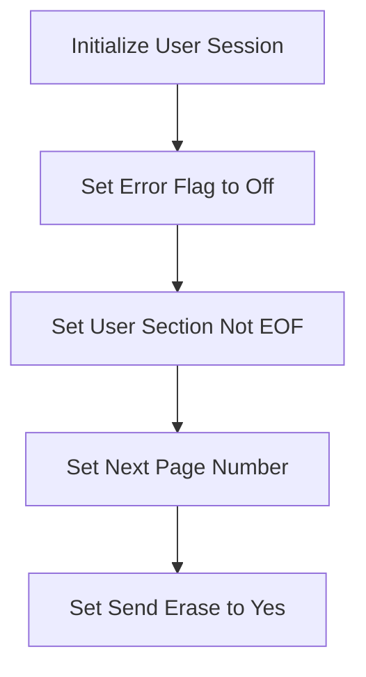
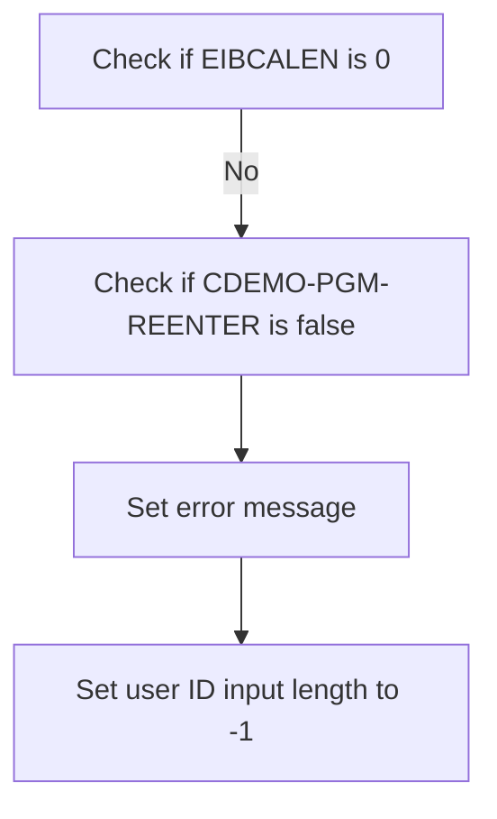
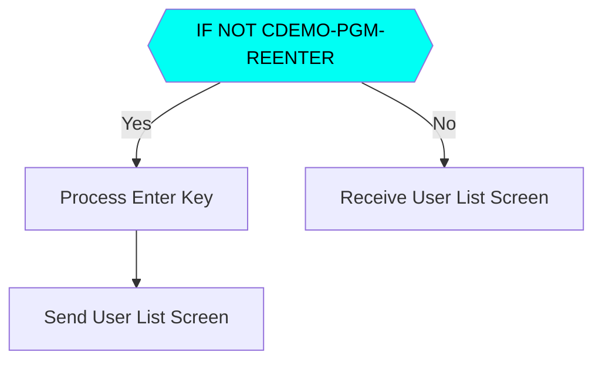
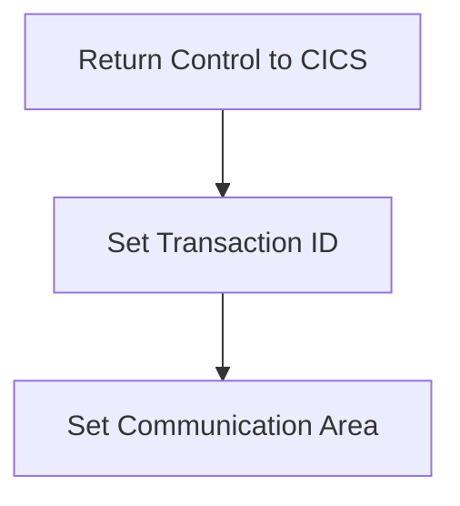

The <SwmToken path="app/cbl/COUSR00C.cbl" pos="2:7:7" line-data="      * Program     : COUSR00C.CBL">`COUSR00C`</SwmToken> program is responsible for initializing user sessions and handling user inputs and navigation within the application. It achieves this by setting various session flags, processing user inputs, and managing the flow of control within the application.

The flow starts with initializing the user session by setting several flags to their default states. It then handles user inputs by checking if the program is being re-entered and processing the Enter key or other function keys accordingly. Finally, it returns control to the CICS system, ensuring the correct transaction ID and communication area are set.

Here is a high level diagram of the program:



# Set initial flags



<SwmSnippet path="/app/cbl/COUSR00C.cbl" line="98">

---

## Initialize User Session

The <SwmToken path="app/cbl/COUSR00C.cbl" pos="98:1:3" line-data="       MAIN-PARA.">`MAIN-PARA`</SwmToken> function begins by initializing several session variables to their default states. This is crucial for ensuring that the user session starts with a clean slate and no residual data from previous sessions.

```cobol
       MAIN-PARA.

           SET ERR-FLG-OFF TO TRUE
           SET USER-SEC-NOT-EOF TO TRUE
           SET NEXT-PAGE-NO TO TRUE
           SET SEND-ERASE-YES TO TRUE

           MOVE SPACES TO WS-MESSAGE
```

---

</SwmSnippet>

<SwmSnippet path="/app/cbl/COUSR00C.cbl" line="100">

---

### Set Error Flag to Off

First, the error flag is set to off (<SwmToken path="app/cbl/COUSR00C.cbl" pos="100:3:7" line-data="           SET ERR-FLG-OFF TO TRUE">`ERR-FLG-OFF`</SwmToken>). This ensures that no error state is carried over from any previous operations, allowing the session to start without any pre-existing errors.

```cobol
           SET ERR-FLG-OFF TO TRUE
```

---

</SwmSnippet>

<SwmSnippet path="/app/cbl/COUSR00C.cbl" line="101">

---

### Set User Section Not EOF

Next, the user section end-of-file flag is set to not EOF (<SwmToken path="app/cbl/COUSR00C.cbl" pos="101:3:9" line-data="           SET USER-SEC-NOT-EOF TO TRUE">`USER-SEC-NOT-EOF`</SwmToken>). This indicates that the user section data is available and has not reached the end, allowing further processing of user data.

```cobol
           SET USER-SEC-NOT-EOF TO TRUE
```

---

</SwmSnippet>

<SwmSnippet path="/app/cbl/COUSR00C.cbl" line="102">

---

### Set Next Page Number

Then, the next page number flag is set to true (<SwmToken path="app/cbl/COUSR00C.cbl" pos="102:3:7" line-data="           SET NEXT-PAGE-NO TO TRUE">`NEXT-PAGE-NO`</SwmToken>). This prepares the session to handle pagination, indicating that there are more pages to be processed or displayed.

```cobol
           SET NEXT-PAGE-NO TO TRUE
```

---

</SwmSnippet>

<SwmSnippet path="/app/cbl/COUSR00C.cbl" line="103">

---

### Set Send Erase to Yes

Finally, the send erase flag is set to yes (<SwmToken path="app/cbl/COUSR00C.cbl" pos="103:3:7" line-data="           SET SEND-ERASE-YES TO TRUE">`SEND-ERASE-YES`</SwmToken>). This ensures that the screen will be cleared before displaying new data, providing a clean interface for the user.

```cobol
           SET SEND-ERASE-YES TO TRUE
```

---

</SwmSnippet>

# Initialize variables



<SwmSnippet path="/app/cbl/COUSR00C.cbl" line="106">

---

## Setting Error Message

First, the error message <SwmToken path="app/cbl/COUSR00C.cbl" pos="106:1:1" line-data="                          ERRMSGO OF COUSR0AO">`ERRMSGO`</SwmToken> of <SwmToken path="app/cbl/COUSR00C.cbl" pos="106:5:5" line-data="                          ERRMSGO OF COUSR0AO">`COUSR0AO`</SwmToken> is set. This indicates that an error has occurred in the process.

```cobol
                          ERRMSGO OF COUSR0AO
```

---

</SwmSnippet>

<SwmSnippet path="/app/cbl/COUSR00C.cbl" line="108">

---

## Setting User ID Input Length

Next, the user ID input length <SwmToken path="app/cbl/COUSR00C.cbl" pos="108:8:8" line-data="           MOVE -1       TO USRIDINL OF COUSR0AI">`USRIDINL`</SwmToken> of <SwmToken path="app/cbl/COUSR00C.cbl" pos="108:12:12" line-data="           MOVE -1       TO USRIDINL OF COUSR0AI">`COUSR0AI`</SwmToken> is set to -1. This signifies that the user ID input is invalid or not provided.

```cobol
           MOVE -1       TO USRIDINL OF COUSR0AI
```

---

</SwmSnippet>

## Interim Summary

So far, we saw how the user session is initialized by setting various flags and preparing the environment for a new session. This includes setting error flags, user section flags, pagination flags, and screen erase flags. Now, we will focus on handling user inputs and navigation within the application.

# Handle user inputs and navigation



<SwmSnippet path="/app/cbl/COUSR00C.cbl" line="115">

---

## Initial Check for Program Reentry

First, the code checks if the program is being re-entered by evaluating <SwmToken path="app/cbl/COUSR00C.cbl" pos="115:5:9" line-data="               IF NOT CDEMO-PGM-REENTER">`CDEMO-PGM-REENTER`</SwmToken>. If it is not, it sets <SwmToken path="app/cbl/COUSR00C.cbl" pos="115:5:9" line-data="               IF NOT CDEMO-PGM-REENTER">`CDEMO-PGM-REENTER`</SwmToken> to TRUE, indicating that the program has been entered.

```cobol
               IF NOT CDEMO-PGM-REENTER
                   SET CDEMO-PGM-REENTER    TO TRUE
```

---

</SwmSnippet>

<SwmSnippet path="/app/cbl/COUSR00C.cbl" line="118">

---

## Processing Enter Key

Next, if the program is not being re-entered, it performs the <SwmToken path="app/cbl/COUSR00C.cbl" pos="118:3:7" line-data="                   PERFORM PROCESS-ENTER-KEY">`PROCESS-ENTER-KEY`</SwmToken> paragraph, which handles user input when the Enter key is pressed. After processing the Enter key, it sends the user list screen by performing the <SwmToken path="app/cbl/COUSR00C.cbl" pos="119:3:7" line-data="                   PERFORM SEND-USRLST-SCREEN">`SEND-USRLST-SCREEN`</SwmToken> paragraph.

```cobol
                   PERFORM PROCESS-ENTER-KEY
                   PERFORM SEND-USRLST-SCREEN
```

---

</SwmSnippet>

<SwmSnippet path="/app/cbl/COUSR00C.cbl" line="121">

---

## Receiving User List Screen

If the program is being re-entered, it performs the <SwmToken path="app/cbl/COUSR00C.cbl" pos="121:3:7" line-data="                   PERFORM RECEIVE-USRLST-SCREEN">`RECEIVE-USRLST-SCREEN`</SwmToken> paragraph to receive the user list screen data.

```cobol
                   PERFORM RECEIVE-USRLST-SCREEN
```

---

</SwmSnippet>

<SwmSnippet path="/app/cbl/COUSR00C.cbl" line="122">

---

## Evaluating User Actions

Then, the code evaluates the user action based on the <SwmToken path="app/cbl/COUSR00C.cbl" pos="122:3:3" line-data="                   EVALUATE EIBAID">`EIBAID`</SwmToken> value. If the Enter key is pressed, it performs the <SwmToken path="app/cbl/COUSR00C.cbl" pos="124:3:7" line-data="                           PERFORM PROCESS-ENTER-KEY">`PROCESS-ENTER-KEY`</SwmToken> paragraph again. If PF3 is pressed, it sets the next program to <SwmToken path="app/cbl/COUSR00C.cbl" pos="126:4:4" line-data="                           MOVE &#39;COADM01C&#39; TO CDEMO-TO-PROGRAM">`COADM01C`</SwmToken> and returns to the previous screen. If <SwmToken path="app/cbl/COUSR00C.cbl" pos="129:5:5" line-data="                           PERFORM PROCESS-PF7-KEY">`PF7`</SwmToken> or <SwmToken path="app/cbl/COUSR00C.cbl" pos="131:5:5" line-data="                           PERFORM PROCESS-PF8-KEY">`PF8`</SwmToken> is pressed, it performs the respective paragraphs for handling these keys. For any other key, it sets an error flag and sends an error message to the user list screen.

```cobol
                   EVALUATE EIBAID
                       WHEN DFHENTER
                           PERFORM PROCESS-ENTER-KEY
                       WHEN DFHPF3
                           MOVE 'COADM01C' TO CDEMO-TO-PROGRAM
                           PERFORM RETURN-TO-PREV-SCREEN
                       WHEN DFHPF7
                           PERFORM PROCESS-PF7-KEY
                       WHEN DFHPF8
                           PERFORM PROCESS-PF8-KEY
                       WHEN OTHER
                           MOVE 'Y'                       TO WS-ERR-FLG
                           MOVE -1       TO USRIDINL OF COUSR0AI
                           MOVE CCDA-MSG-INVALID-KEY      TO WS-MESSAGE
                           PERFORM SEND-USRLST-SCREEN
                   END-EVALUATE
```

---

</SwmSnippet>

# Return execution control

This is the next section of the flow.



<SwmSnippet path="/app/cbl/COUSR00C.cbl" line="141">

---

## Returning Control to CICS

First, the <SwmToken path="app/cbl/COUSR00C.cbl" pos="141:1:5" line-data="           EXEC CICS RETURN">`EXEC CICS RETURN`</SwmToken> command is used to return control to the CICS system. This is essential for ending the current task and passing control back to CICS.

```cobol
           EXEC CICS RETURN
                     TRANSID (WS-TRANID)
                     COMMAREA (CARDDEMO-COMMAREA)
           END-EXEC.
```

---

</SwmSnippet>

<SwmSnippet path="/app/cbl/COUSR00C.cbl" line="142">

---

## Setting Transaction ID

Next, the <SwmToken path="app/cbl/COUSR00C.cbl" pos="142:1:1" line-data="                     TRANSID (WS-TRANID)">`TRANSID`</SwmToken> parameter is set with <SwmToken path="app/cbl/COUSR00C.cbl" pos="142:4:6" line-data="                     TRANSID (WS-TRANID)">`WS-TRANID`</SwmToken>, which specifies the transaction ID to be used when control is returned to CICS. This ensures that the correct transaction is invoked.

```cobol
                     TRANSID (WS-TRANID)
```

---

</SwmSnippet>

<SwmSnippet path="/app/cbl/COUSR00C.cbl" line="143">

---

## Setting Communication Area

Then, the <SwmToken path="app/cbl/COUSR00C.cbl" pos="143:1:1" line-data="                     COMMAREA (CARDDEMO-COMMAREA)">`COMMAREA`</SwmToken> parameter is set with <SwmToken path="app/cbl/COUSR00C.cbl" pos="143:4:6" line-data="                     COMMAREA (CARDDEMO-COMMAREA)">`CARDDEMO-COMMAREA`</SwmToken>, which specifies the communication area to be used. This allows data to be passed between tasks.

```cobol
                     COMMAREA (CARDDEMO-COMMAREA)
```

---

</SwmSnippet>

&nbsp;

*This is an auto-generated document by Swimm 🌊 and has not yet been verified by a human*

<SwmMeta version="3.0.0" repo-id="Z2l0aHViJTNBJTNBa3luZHJ5bC1hd3MtbWFpbmZyYW1lLW1vZGVybml6YXRpb24tY2FyZGRlbW8lM0ElM0FTd2ltbS1EZW1v" repo-name="kyndryl-aws-mainframe-modernization-carddemo"><sup>Powered by [Swimm](/)</sup></SwmMeta>
