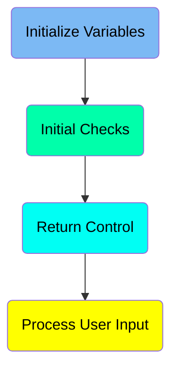
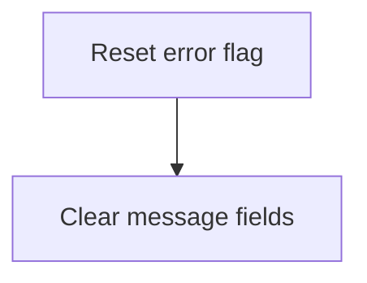
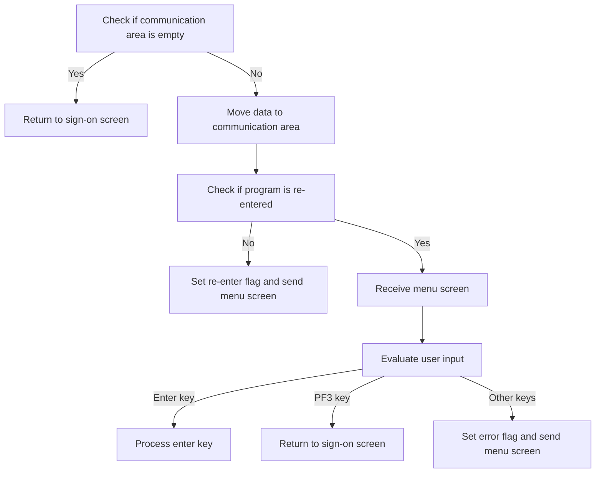
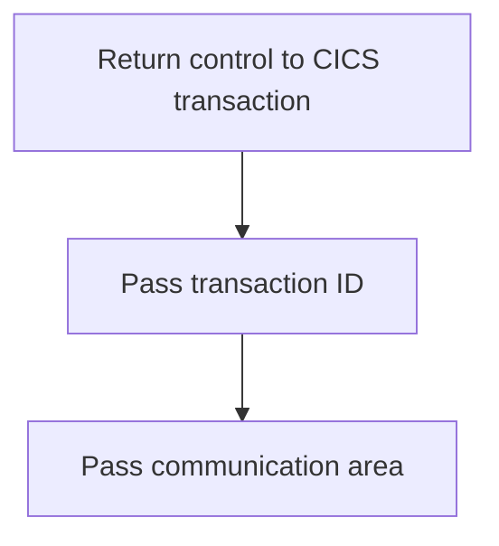
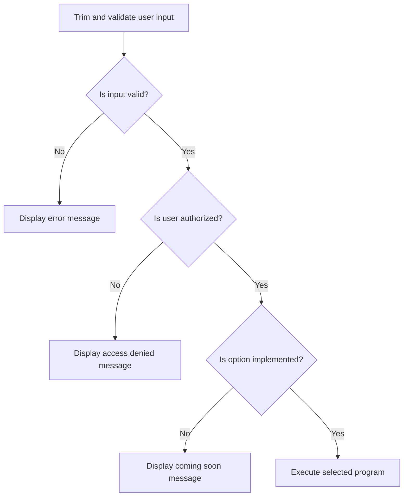

The Main Menu (<SwmToken path="app/cbl/COMEN01C.cbl" pos="2:7:7" line-data="      * Program     : COMEN01C.CBL">`COMEN01C`</SwmToken>) program serves as the main menu for regular users within the <SwmToken path="app/cbl/COMEN01C.cbl" pos="3:7:7" line-data="      * Application : CardDemo">`CardDemo`</SwmToken> application. This CICS COBOL program is designed to handle user interactions by presenting a menu and processing user inputs to navigate through various functions of the application.

The flow is simple and involves three steps: initializing variables, performing initial checks, and processing user inputs. The program first resets error flags and clears message fields. It then checks the communication area to determine the next steps, such as returning to the sign-on screen or sending the menu screen. Finally, it processes user inputs to navigate through the application.

# Where is this program used?

This program is used multiple times in the codebase as represented in the following diagram:

(Note - these are only some of the usages of this program)

```mermaid
graph TD
COSGN00C(COSGN00C) --> COMEN01C("COMEN01C program"):::currentProgram
COCRDSLC("COCRDSLC") --> COMEN01C("COMEN01C program"):::currentProgram
COACTVWC("COACTVWC") --> COMEN01C("COMEN01C program"):::currentProgram
COCRDLIC("COCRDLIC") --> COMEN01C("COMEN01C program"):::currentProgram
COCRDUPC("COCRDUPC") --> COMEN01C("COMEN01C program"):::currentProgram
  classDef currentProgram color:#000000,fill:#7CB9F4

%% Swimm:
%% graph TD
%% <SwmToken path="app/cbl/COMEN01C.cbl" pos="83:4:4" line-data="               MOVE &#39;COSGN00C&#39; TO CDEMO-FROM-PROGRAM">`COSGN00C`</SwmToken>(<SwmToken path="app/cbl/COMEN01C.cbl" pos="83:4:4" line-data="               MOVE &#39;COSGN00C&#39; TO CDEMO-FROM-PROGRAM">`COSGN00C`</SwmToken>) --> <SwmToken path="app/cbl/COMEN01C.cbl" pos="2:7:7" line-data="      * Program     : COMEN01C.CBL">`COMEN01C`</SwmToken>("<SwmToken path="app/cbl/COMEN01C.cbl" pos="2:7:7" line-data="      * Program     : COMEN01C.CBL">`COMEN01C`</SwmToken> program"):::currentProgram
%% COCRDSLC("COCRDSLC") --> <SwmToken path="app/cbl/COMEN01C.cbl" pos="2:7:7" line-data="      * Program     : COMEN01C.CBL">`COMEN01C`</SwmToken>("<SwmToken path="app/cbl/COMEN01C.cbl" pos="2:7:7" line-data="      * Program     : COMEN01C.CBL">`COMEN01C`</SwmToken> program"):::currentProgram
%% COACTVWC("COACTVWC") --> <SwmToken path="app/cbl/COMEN01C.cbl" pos="2:7:7" line-data="      * Program     : COMEN01C.CBL">`COMEN01C`</SwmToken>("<SwmToken path="app/cbl/COMEN01C.cbl" pos="2:7:7" line-data="      * Program     : COMEN01C.CBL">`COMEN01C`</SwmToken> program"):::currentProgram
%% COCRDLIC("COCRDLIC") --> <SwmToken path="app/cbl/COMEN01C.cbl" pos="2:7:7" line-data="      * Program     : COMEN01C.CBL">`COMEN01C`</SwmToken>("<SwmToken path="app/cbl/COMEN01C.cbl" pos="2:7:7" line-data="      * Program     : COMEN01C.CBL">`COMEN01C`</SwmToken> program"):::currentProgram
%% COCRDUPC("COCRDUPC") --> <SwmToken path="app/cbl/COMEN01C.cbl" pos="2:7:7" line-data="      * Program     : COMEN01C.CBL">`COMEN01C`</SwmToken>("<SwmToken path="app/cbl/COMEN01C.cbl" pos="2:7:7" line-data="      * Program     : COMEN01C.CBL">`COMEN01C`</SwmToken> program"):::currentProgram
%%   classDef currentProgram color:#000000,fill:#7CB9F4
```



Here is a high level diagram of the program:



## Initialize Variables

First, we'll zoom into this section of the flow:



<SwmSnippet path="/app/cbl/COMEN01C.cbl" line="77">

---

The first step in this section is to reset the error flag by setting <SwmToken path="app/cbl/COMEN01C.cbl" pos="77:3:7" line-data="           SET ERR-FLG-OFF TO TRUE">`ERR-FLG-OFF`</SwmToken> to TRUE. This indicates that there are no errors currently present, allowing the program to proceed with normal operations.

```cobol
           SET ERR-FLG-OFF TO TRUE
```

---

</SwmSnippet>

<SwmSnippet path="/app/cbl/COMEN01C.cbl" line="79">

---

Next, the code clears any existing messages by moving spaces to <SwmToken path="app/cbl/COMEN01C.cbl" pos="79:7:9" line-data="           MOVE SPACES TO WS-MESSAGE">`WS-MESSAGE`</SwmToken> and <SwmToken path="app/cbl/COMEN01C.cbl" pos="80:1:5" line-data="                          ERRMSGO OF COMEN1AO">`ERRMSGO OF COMEN1AO`</SwmToken>. This ensures that the message fields are empty and ready to display new messages if needed.

```cobol
           MOVE SPACES TO WS-MESSAGE
                          ERRMSGO OF COMEN1AO
```

---

</SwmSnippet>

## Initial Checks

Now, lets zoom into this section of the flow:



<SwmSnippet path="/app/cbl/COMEN01C.cbl" line="82">

---

First, we check if the communication area is empty by evaluating the length of <SwmToken path="app/cbl/COMEN01C.cbl" pos="82:3:3" line-data="           IF EIBCALEN = 0">`EIBCALEN`</SwmToken>. If it is empty, we set the program to return to the sign-on screen.

```cobol
           IF EIBCALEN = 0
               MOVE 'COSGN00C' TO CDEMO-FROM-PROGRAM
               PERFORM RETURN-TO-SIGNON-SCREEN
```

---

</SwmSnippet>

<SwmSnippet path="/app/cbl/COMEN01C.cbl" line="85">

---

Next, if the communication area is not empty, we move the data to <SwmToken path="app/cbl/COMEN01C.cbl" pos="86:12:14" line-data="               MOVE DFHCOMMAREA(1:EIBCALEN) TO CARDDEMO-COMMAREA">`CARDDEMO-COMMAREA`</SwmToken> and check if the program is being re-entered. If it is not being re-entered, we set the re-enter flag to true, clear the <SwmToken path="app/cbl/COMEN01C.cbl" pos="89:9:9" line-data="                   MOVE LOW-VALUES          TO COMEN1AO">`COMEN1AO`</SwmToken> area, and send the menu screen to the user. If the program is being re-entered, we receive the menu screen data entered by the user and evaluate the user input to determine the next action.

```cobol
           ELSE
               MOVE DFHCOMMAREA(1:EIBCALEN) TO CARDDEMO-COMMAREA
               IF NOT CDEMO-PGM-REENTER
                   SET CDEMO-PGM-REENTER    TO TRUE
                   MOVE LOW-VALUES          TO COMEN1AO
                   PERFORM SEND-MENU-SCREEN
               ELSE
                   PERFORM RECEIVE-MENU-SCREEN
                   EVALUATE EIBAID
                       WHEN DFHENTER
                           PERFORM PROCESS-ENTER-KEY
                       WHEN DFHPF3
                           MOVE 'COSGN00C' TO CDEMO-TO-PROGRAM
                           PERFORM RETURN-TO-SIGNON-SCREEN
                       WHEN OTHER
                           MOVE 'Y'                       TO WS-ERR-FLG
                           MOVE CCDA-MSG-INVALID-KEY      TO WS-MESSAGE
                           PERFORM SEND-MENU-SCREEN
                   END-EVALUATE
               END-IF
           END-IF
```

---

</SwmSnippet>

## Interim Summary

So far, we saw how to initialize variables by resetting the error flag and clearing message fields, followed by performing initial checks to determine the next steps based on the communication area and user input. Now, we will focus on returning control to the CICS transaction, ensuring the application can continue processing other tasks or transactions.

## Return Control

This is the next section of the flow.



<SwmSnippet path="/app/cbl/COMEN01C.cbl" line="107">

---

The function returns control to the CICS transaction, ensuring that the application can continue processing other tasks or transactions.

```cobol
           EXEC CICS RETURN
                     TRANSID (WS-TRANID)
                     COMMAREA (CARDDEMO-COMMAREA)
           END-EXEC.
```

---

</SwmSnippet>

## Process User Input

Now, lets zoom into this section of the flow:



First, the user input is trimmed and validated to ensure it is in the correct format and not empty. This step involves removing any trailing spaces and replacing them with zeros.

Next, the program checks if the selected option is valid by ensuring it is numeric, within the range of available options, and not zero. If the input is invalid, an error message is displayed to the user.

Then, the program verifies if the user has the necessary permissions to access the selected option. If the user is not authorized, an access denied message is displayed.

If there are no errors and the user is authorized, the program checks if the selected option is implemented. If the option is implemented, the corresponding program is executed.

&nbsp;

*This is an auto-generated document by Swimm 🌊 and has not yet been verified by a human*

<SwmMeta version="3.0.0" repo-id="Z2l0aHViJTNBJTNBa3luZHJ5bC1hd3MtbWFpbmZyYW1lLW1vZGVybml6YXRpb24tY2FyZGRlbW8lM0ElM0FTd2ltbS1EZW1v" repo-name="kyndryl-aws-mainframe-modernization-carddemo"><sup>Powered by [Swimm](/)</sup></SwmMeta>
