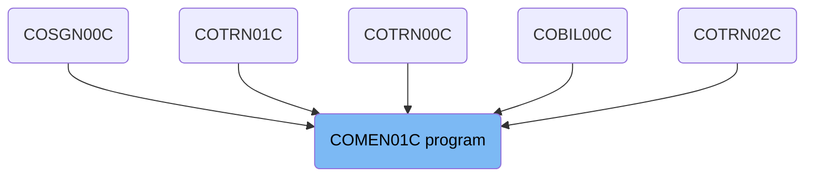
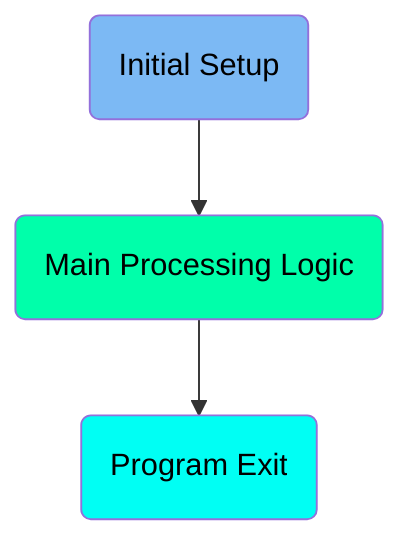
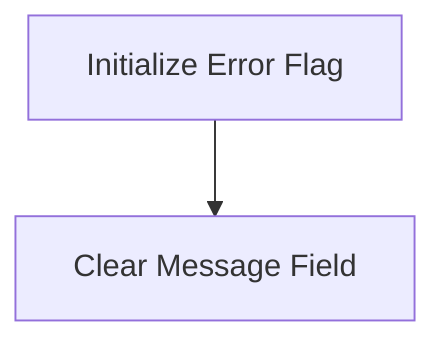
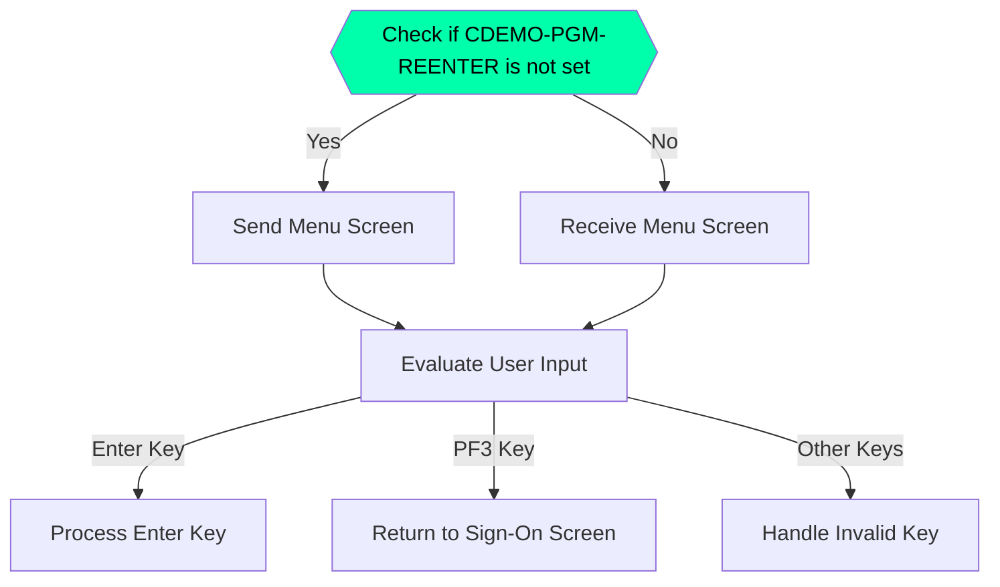
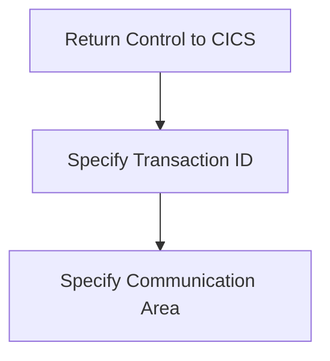

The <SwmToken path="app/cbl/COMEN01C.cbl" pos="2:7:7" line-data="      * Program     : COMEN01C.CBL">`COMEN01C`</SwmToken> program is responsible for handling the main menu interactions in the <SwmToken path="app/cbl/COMEN01C.cbl" pos="3:7:7" line-data="      * Application : CardDemo">`CardDemo`</SwmToken> application. It initializes the program state, sends the menu screen to the user, receives user input, evaluates the input, and processes it accordingly. The program ensures smooth navigation and interaction within the application by managing the flow between different screens and handling user commands effectively.

The <SwmToken path="app/cbl/COMEN01C.cbl" pos="2:7:7" line-data="      * Program     : COMEN01C.CBL">`COMEN01C`</SwmToken> program starts by initializing the error flag and clearing any previous messages. It then checks if the program is being re-entered. If not, it sends the menu screen to the user; otherwise, it receives the menu screen. The program evaluates the user's input and processes it based on the key pressed. If the Enter key is pressed, it processes the enter key; if PF3 is pressed, it returns to the sign-on screen; for any other key, it handles the invalid key. Finally, it returns control to the CICS environment.

# Where is this program used?

This program is used multiple times in the codebase as represented in the following diagram:

(Note - these are only some of the usages of this flow)



Here is a high level diagram of the program:



# Initial Setup



<SwmSnippet path="/app/cbl/COMEN01C.cbl" line="77">

---

## Initialize Error Flag

First, the error flag is set to off by setting <SwmToken path="app/cbl/COMEN01C.cbl" pos="77:3:7" line-data="           SET ERR-FLG-OFF TO TRUE">`ERR-FLG-OFF`</SwmToken> to TRUE. This ensures that any previous error state is cleared before proceeding with the rest of the program.

```cobol
           SET ERR-FLG-OFF TO TRUE
```

---

</SwmSnippet>

<SwmSnippet path="/app/cbl/COMEN01C.cbl" line="79">

---

## Clear Message Field

Next, the message field <SwmToken path="app/cbl/COMEN01C.cbl" pos="79:7:9" line-data="           MOVE SPACES TO WS-MESSAGE">`WS-MESSAGE`</SwmToken> is cleared by moving spaces to it. This ensures that any previous messages are removed. Additionally, <SwmToken path="app/cbl/COMEN01C.cbl" pos="80:1:1" line-data="                          ERRMSGO OF COMEN1AO">`ERRMSGO`</SwmToken> of <SwmToken path="app/cbl/COMEN01C.cbl" pos="80:5:5" line-data="                          ERRMSGO OF COMEN1AO">`COMEN1AO`</SwmToken> is also cleared.

```cobol
           MOVE SPACES TO WS-MESSAGE
                          ERRMSGO OF COMEN1AO
```

---

</SwmSnippet>

# Main Processing Logic



<SwmSnippet path="/app/cbl/COMEN01C.cbl" line="83">

---

## Initial Transition Check

First, the program checks if <SwmToken path="app/cbl/COMEN01C.cbl" pos="87:5:9" line-data="               IF NOT CDEMO-PGM-REENTER">`CDEMO-PGM-REENTER`</SwmToken> is not set. If it is not set, it initializes the program state and sends the menu screen to the user.

```cobol
               MOVE 'COSGN00C' TO CDEMO-FROM-PROGRAM
               PERFORM RETURN-TO-SIGNON-SCREEN
           ELSE
               MOVE DFHCOMMAREA(1:EIBCALEN) TO CARDDEMO-COMMAREA
               IF NOT CDEMO-PGM-REENTER
```

---

</SwmSnippet>

<SwmSnippet path="/app/cbl/COMEN01C.cbl" line="88">

---

## Sending Menu Screen

Next, if <SwmToken path="app/cbl/COMEN01C.cbl" pos="88:3:7" line-data="                   SET CDEMO-PGM-REENTER    TO TRUE">`CDEMO-PGM-REENTER`</SwmToken> is not set, the program sets it to true, clears the screen, and performs the <SwmToken path="app/cbl/COMEN01C.cbl" pos="90:3:7" line-data="                   PERFORM SEND-MENU-SCREEN">`SEND-MENU-SCREEN`</SwmToken> function to display the menu options to the user.

```cobol
                   SET CDEMO-PGM-REENTER    TO TRUE
                   MOVE LOW-VALUES          TO COMEN1AO
                   PERFORM SEND-MENU-SCREEN
```

---

</SwmSnippet>

<SwmSnippet path="/app/cbl/COMEN01C.cbl" line="91">

---

## Receiving Menu Screen

If <SwmToken path="app/cbl/COMEN01C.cbl" pos="87:5:9" line-data="               IF NOT CDEMO-PGM-REENTER">`CDEMO-PGM-REENTER`</SwmToken> is already set, the program performs the <SwmToken path="app/cbl/COMEN01C.cbl" pos="92:3:7" line-data="                   PERFORM RECEIVE-MENU-SCREEN">`RECEIVE-MENU-SCREEN`</SwmToken> function to receive user input from the menu screen.

```cobol
               ELSE
                   PERFORM RECEIVE-MENU-SCREEN
```

---

</SwmSnippet>

<SwmSnippet path="/app/cbl/COMEN01C.cbl" line="93">

---

## Evaluating User Input

Then, the program evaluates the user input (<SwmToken path="app/cbl/COMEN01C.cbl" pos="93:3:3" line-data="                   EVALUATE EIBAID">`EIBAID`</SwmToken>). If the Enter key is pressed, it processes the enter key. If PF3 is pressed, it returns to the sign-on screen. For any other key, it sets an error flag and sends an invalid key message.

```cobol
                   EVALUATE EIBAID
                       WHEN DFHENTER
                           PERFORM PROCESS-ENTER-KEY
                       WHEN DFHPF3
                           MOVE 'COSGN00C' TO CDEMO-TO-PROGRAM
                           PERFORM RETURN-TO-SIGNON-SCREEN
                       WHEN OTHER
                           MOVE 'Y'                       TO WS-ERR-FLG
                           MOVE CCDA-MSG-INVALID-KEY      TO WS-MESSAGE
                           PERFORM SEND-MENU-SCREEN
                   END-EVALUATE
```

---

</SwmSnippet>

<SwmSnippet path="/app/cbl/COMEN01C.cbl" line="170">

---

### Returning to Sign-On Screen

The <SwmToken path="app/cbl/COMEN01C.cbl" pos="170:1:7" line-data="       RETURN-TO-SIGNON-SCREEN.">`RETURN-TO-SIGNON-SCREEN`</SwmToken> function handles the transition back to the sign-on screen by setting the appropriate program name and executing the CICS transaction.

```cobol
       RETURN-TO-SIGNON-SCREEN.

           IF CDEMO-TO-PROGRAM = LOW-VALUES OR SPACES
               MOVE 'COSGN00C' TO CDEMO-TO-PROGRAM
           END-IF
           EXEC CICS
               XCTL PROGRAM(CDEMO-TO-PROGRAM)
           END-EXEC.
```

---

</SwmSnippet>

<SwmSnippet path="/app/cbl/COMEN01C.cbl" line="182">

---

### Sending Menu Screen

The <SwmToken path="app/cbl/COMEN01C.cbl" pos="182:1:5" line-data="       SEND-MENU-SCREEN.">`SEND-MENU-SCREEN`</SwmToken> function populates the header information, builds the menu options, and sends the menu screen to the user.

```cobol
       SEND-MENU-SCREEN.

           PERFORM POPULATE-HEADER-INFO
           PERFORM BUILD-MENU-OPTIONS

           MOVE WS-MESSAGE TO ERRMSGO OF COMEN1AO

           EXEC CICS SEND
                     MAP('COMEN1A')
                     MAPSET('COMEN01')
                     FROM(COMEN1AO)
                     ERASE
           END-EXEC.
```

---

</SwmSnippet>

<SwmSnippet path="/app/cbl/COMEN01C.cbl" line="199">

---

### Receiving Menu Screen

The <SwmToken path="app/cbl/COMEN01C.cbl" pos="199:1:5" line-data="       RECEIVE-MENU-SCREEN.">`RECEIVE-MENU-SCREEN`</SwmToken> function receives the user input from the menu screen and stores it in the appropriate variables for further processing.

```cobol
       RECEIVE-MENU-SCREEN.

           EXEC CICS RECEIVE
                     MAP('COMEN1A')
                     MAPSET('COMEN01')
                     INTO(COMEN1AI)
                     RESP(WS-RESP-CD)
                     RESP2(WS-REAS-CD)
           END-EXEC.
```

---

</SwmSnippet>

# Program Exit

This is the next section of the flow.



<SwmSnippet path="/app/cbl/COMEN01C.cbl" line="107">

---

## Returning Control to CICS

First, the <SwmToken path="app/cbl/COMEN01C.cbl" pos="107:1:5" line-data="           EXEC CICS RETURN">`EXEC CICS RETURN`</SwmToken> command is used to return control to the CICS. This command ensures that the program ends its current execution and returns control to the CICS environment. The <SwmToken path="app/cbl/COMEN01C.cbl" pos="108:1:1" line-data="                     TRANSID (WS-TRANID)">`TRANSID`</SwmToken> parameter specifies the transaction ID that should be used for the next transaction, and the <SwmToken path="app/cbl/COMEN01C.cbl" pos="109:1:1" line-data="                     COMMAREA (CARDDEMO-COMMAREA)">`COMMAREA`</SwmToken> parameter specifies the communication area that should be passed to the next program.

```cobol
           EXEC CICS RETURN
                     TRANSID (WS-TRANID)
                     COMMAREA (CARDDEMO-COMMAREA)
           END-EXEC.
```

---

</SwmSnippet>

<SwmSnippet path="/app/cbl/COMEN01C.cbl" line="113">

---

## Process Enter Key

Then, the <SwmToken path="app/cbl/COMEN01C.cbl" pos="113:3:7" line-data="      *                      PROCESS-ENTER-KEY">`PROCESS-ENTER-KEY`</SwmToken> section is marked for processing the enter key. This section is likely used to handle the logic when the enter key is pressed by the user, although the specific implementation details are not provided in this snippet.

```cobol
      *                      PROCESS-ENTER-KEY
      *----------------------------------------------------------------*
```

---

</SwmSnippet>

&nbsp;

*This is an auto-generated document by Swimm 🌊 and has not yet been verified by a human*

<SwmMeta version="3.0.0" repo-id="Z2l0aHViJTNBJTNBa3luZHJ5bC1hd3MtbWFpbmZyYW1lLW1vZGVybml6YXRpb24tY2FyZGRlbW8lM0ElM0FTd2ltbS1EZW1v" repo-name="kyndryl-aws-mainframe-modernization-carddemo"><sup>Powered by [Swimm](/)</sup></SwmMeta>
