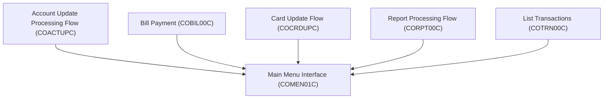
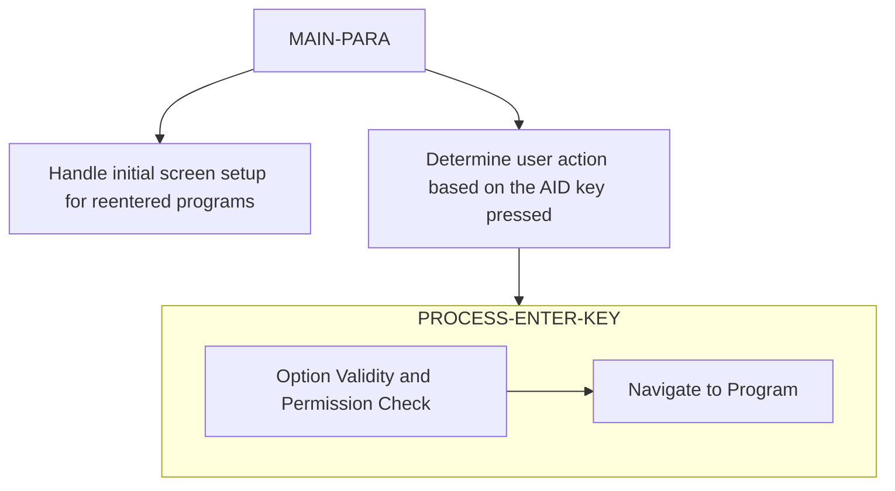

The <SwmToken path="/app/cbl/COMEN01C.cbl" pos="2:7:7" line-data="      * Program     : COMEN01C.CBL" repo-id="Z2l0aHViJTNBJTNBa3luZHJ5bC1hd3MtbWFpbmZyYW1lLW1vZGVybml6YXRpb24tY2FyZGRlbW8lM0ElM0FTd2ltbS1EZW1v" repo-name="aws-mainframe-modernization-carddemo">`COMEN01C`</SwmToken> program serves as the main menu interface for regular users in the application.

# Usages



# Program Drill Down



## <SwmToken path="/app/cbl/COMEN01C.cbl" pos="75:1:3" line-data="       MAIN-PARA." repo-id="Z2l0aHViJTNBJTNBa3luZHJ5bC1hd3MtbWFpbmZyYW1lLW1vZGVybml6YXRpb24tY2FyZGRlbW8lM0ElM0FTd2ltbS1EZW1v" repo-name="aws-mainframe-modernization-carddemo">`MAIN-PARA`</SwmToken> Function

The <SwmToken path="/app/cbl/COMEN01C.cbl" pos="75:1:3" line-data="       MAIN-PARA." repo-id="Z2l0aHViJTNBJTNBa3luZHJ5bC1hd3MtbWFpbmZyYW1lLW1vZGVybml6YXRpb24tY2FyZGRlbW8lM0ElM0FTd2ltbS1EZW1v" repo-name="aws-mainframe-modernization-carddemo">`MAIN-PARA`</SwmToken> function handles the main menu interactions for regular users in the CardDemo application.&nbsp;

<SwmSnippet path="/app/cbl/COMEN01C.cbl" line="82" repo-id="Z2l0aHViJTNBJTNBa3luZHJ5bC1hd3MtbWFpbmZyYW1lLW1vZGVybml6YXRpb24tY2FyZGRlbW8lM0ElM0FTd2ltbS1EZW1v">

---

It checks if the initial transaction length (<SwmToken path="/app/cbl/COMEN01C.cbl" pos="82:3:3" line-data="           IF EIBCALEN = 0" repo-id="Z2l0aHViJTNBJTNBa3luZHJ5bC1hd3MtbWFpbmZyYW1lLW1vZGVybml6YXRpb24tY2FyZGRlbW8lM0ElM0FTd2ltbS1EZW1v" repo-name="aws-mainframe-modernization-carddemo">`EIBCALEN`</SwmToken>) is zero. If it is, it means the user needs to sign in, so the program sets <SwmToken path="/app/cbl/COMEN01C.cbl" pos="83:9:13" line-data="               MOVE &#39;COSGN00C&#39; TO CDEMO-FROM-PROGRAM" repo-id="Z2l0aHViJTNBJTNBa3luZHJ5bC1hd3MtbWFpbmZyYW1lLW1vZGVybml6YXRpb24tY2FyZGRlbW8lM0ElM0FTd2ltbS1EZW1v" repo-name="aws-mainframe-modernization-carddemo">`CDEMO-FROM-PROGRAM`</SwmToken> to <SwmToken path="/app/cbl/COMEN01C.cbl" pos="83:4:4" line-data="               MOVE &#39;COSGN00C&#39; TO CDEMO-FROM-PROGRAM" repo-id="Z2l0aHViJTNBJTNBa3luZHJ5bC1hd3MtbWFpbmZyYW1lLW1vZGVybml6YXRpb24tY2FyZGRlbW8lM0ElM0FTd2ltbS1EZW1v" repo-name="aws-mainframe-modernization-carddemo">`COSGN00C`</SwmToken> and performs the <SwmToken path="/app/cbl/COMEN01C.cbl" pos="84:3:9" line-data="               PERFORM RETURN-TO-SIGNON-SCREEN" repo-id="Z2l0aHViJTNBJTNBa3luZHJ5bC1hd3MtbWFpbmZyYW1lLW1vZGVybml6YXRpb24tY2FyZGRlbW8lM0ElM0FTd2ltbS1EZW1v" repo-name="aws-mainframe-modernization-carddemo">`RETURN-TO-SIGNON-SCREEN`</SwmToken> operation, which navigates the user to the sign-on screen.

```cobol
           IF EIBCALEN = 0
               MOVE 'COSGN00C' TO CDEMO-FROM-PROGRAM
               PERFORM RETURN-TO-SIGNON-SCREEN
```

---

</SwmSnippet>

<SwmSnippet path="/app/cbl/COMEN01C.cbl" line="87" repo-id="Z2l0aHViJTNBJTNBa3luZHJ5bC1hd3MtbWFpbmZyYW1lLW1vZGVybml6YXRpb24tY2FyZGRlbW8lM0ElM0FTd2ltbS1EZW1v">

---

If the initial transaction length is not zero, the program checks if the program has been re-entered (<SwmToken path="/app/cbl/COMEN01C.cbl" pos="87:5:9" line-data="               IF NOT CDEMO-PGM-REENTER" repo-id="Z2l0aHViJTNBJTNBa3luZHJ5bC1hd3MtbWFpbmZyYW1lLW1vZGVybml6YXRpb24tY2FyZGRlbW8lM0ElM0FTd2ltbS1EZW1v" repo-name="aws-mainframe-modernization-carddemo">`CDEMO-PGM-REENTER`</SwmToken>). If not, it performs the <SwmToken path="/app/cbl/COMEN01C.cbl" pos="90:3:7" line-data="                   PERFORM SEND-MENU-SCREEN" repo-id="Z2l0aHViJTNBJTNBa3luZHJ5bC1hd3MtbWFpbmZyYW1lLW1vZGVybml6YXRpb24tY2FyZGRlbW8lM0ElM0FTd2ltbS1EZW1v" repo-name="aws-mainframe-modernization-carddemo">`SEND-MENU-SCREEN`</SwmToken> operation to display the main menu screen.

```cobol
               IF NOT CDEMO-PGM-REENTER
                   SET CDEMO-PGM-REENTER    TO TRUE
                   MOVE LOW-VALUES          TO COMEN1AO
                   PERFORM SEND-MENU-SCREEN
```

---

</SwmSnippet>

<SwmSnippet path="/app/cbl/COMEN01C.cbl" line="92" repo-id="Z2l0aHViJTNBJTNBa3luZHJ5bC1hd3MtbWFpbmZyYW1lLW1vZGVybml6YXRpb24tY2FyZGRlbW8lM0ElM0FTd2ltbS1EZW1v">

---

If the program has been re-entered, it performs the <SwmToken path="/app/cbl/COMEN01C.cbl" pos="92:3:7" line-data="                   PERFORM RECEIVE-MENU-SCREEN" repo-id="Z2l0aHViJTNBJTNBa3luZHJ5bC1hd3MtbWFpbmZyYW1lLW1vZGVybml6YXRpb24tY2FyZGRlbW8lM0ElM0FTd2ltbS1EZW1v" repo-name="aws-mainframe-modernization-carddemo">`RECEIVE-MENU-SCREEN`</SwmToken> operation to receive and process data from the user's main menu screen. The function then evaluates the <SwmToken path="/app/cbl/COMEN01C.cbl" pos="93:3:3" line-data="                   EVALUATE EIBAID" repo-id="Z2l0aHViJTNBJTNBa3luZHJ5bC1hd3MtbWFpbmZyYW1lLW1vZGVybml6YXRpb24tY2FyZGRlbW8lM0ElM0FTd2ltbS1EZW1v" repo-name="aws-mainframe-modernization-carddemo">`EIBAID`</SwmToken> variable to determine the user's action based on the key pressed:

- If the user presses the Enter key (<SwmToken path="/app/cbl/COMEN01C.cbl" pos="94:3:3" line-data="                       WHEN DFHENTER" repo-id="Z2l0aHViJTNBJTNBa3luZHJ5bC1hd3MtbWFpbmZyYW1lLW1vZGVybml6YXRpb24tY2FyZGRlbW8lM0ElM0FTd2ltbS1EZW1v" repo-name="aws-mainframe-modernization-carddemo">`DFHENTER`</SwmToken>), it performs the <SwmToken path="/app/cbl/COMEN01C.cbl" pos="95:3:7" line-data="                           PERFORM PROCESS-ENTER-KEY" repo-id="Z2l0aHViJTNBJTNBa3luZHJ5bC1hd3MtbWFpbmZyYW1lLW1vZGVybml6YXRpb24tY2FyZGRlbW8lM0ElM0FTd2ltbS1EZW1v" repo-name="aws-mainframe-modernization-carddemo">`PROCESS-ENTER-KEY`</SwmToken> function.&nbsp;
- If the user presses the PF3 key (<SwmToken path="/app/cbl/COMEN01C.cbl" pos="96:3:3" line-data="                       WHEN DFHPF3" repo-id="Z2l0aHViJTNBJTNBa3luZHJ5bC1hd3MtbWFpbmZyYW1lLW1vZGVybml6YXRpb24tY2FyZGRlbW8lM0ElM0FTd2ltbS1EZW1v" repo-name="aws-mainframe-modernization-carddemo">`DFHPF3`</SwmToken>), it navigates to the signon screen.
- For any other input, it shows an error.

```
                   PERFORM RECEIVE-MENU-SCREEN
                   EVALUATE EIBAID
                       WHEN DFHENTER
                           PERFORM PROCESS-ENTER-KEY
                       WHEN DFHPF3
                           MOVE 'COSGN00C' TO CDEMO-TO-PROGRAM
                           PERFORM RETURN-TO-SIGNON-SCREEN
                       WHEN OTHER
                           MOVE 'Y'                       TO WS-ERR-FLG
                           MOVE CCDA-MSG-INVALID-KEY      TO WS-MESSAGE
                           PERFORM SEND-MENU-SCREEN
```

---

</SwmSnippet>

## <SwmToken path="/app/cbl/COMEN01C.cbl" pos="95:3:7" line-data="                           PERFORM PROCESS-ENTER-KEY" repo-id="Z2l0aHViJTNBJTNBa3luZHJ5bC1hd3MtbWFpbmZyYW1lLW1vZGVybml6YXRpb24tY2FyZGRlbW8lM0ElM0FTd2ltbS1EZW1v" repo-name="aws-mainframe-modernization-carddemo">`PROCESS-ENTER-KEY`</SwmToken> Function

This function validates and processes the menu option selected by the user.

<SwmSnippet path="/app/cbl/COMEN01C.cbl" line="127" repo-id="Z2l0aHViJTNBJTNBa3luZHJ5bC1hd3MtbWFpbmZyYW1lLW1vZGVybml6YXRpb24tY2FyZGRlbW8lM0ElM0FTd2ltbS1EZW1v">

---

First, it validates the user's selection.

```cobol
           IF WS-OPTION IS NOT NUMERIC OR
              WS-OPTION > CDEMO-MENU-OPT-COUNT OR
              WS-OPTION = ZEROS
               MOVE 'Y'     TO WS-ERR-FLG
               MOVE 'Please enter a valid option number...' TO
                               WS-MESSAGE
               PERFORM SEND-MENU-SCREEN
           END-IF
```

---

</SwmSnippet>

<SwmSnippet path="/app/cbl/COMEN01C.cbl" line="136" repo-id="Z2l0aHViJTNBJTNBa3luZHJ5bC1hd3MtbWFpbmZyYW1lLW1vZGVybml6YXRpb24tY2FyZGRlbW8lM0ElM0FTd2ltbS1EZW1v">

---

Next, it checks the user permissions. If the user is a regular user (<SwmToken path="/app/cbl/COMEN01C.cbl" pos="136:3:7" line-data="           IF CDEMO-USRTYP-USER AND" repo-id="Z2l0aHViJTNBJTNBa3luZHJ5bC1hd3MtbWFpbmZyYW1lLW1vZGVybml6YXRpb24tY2FyZGRlbW8lM0ElM0FTd2ltbS1EZW1v" repo-name="aws-mainframe-modernization-carddemo">`CDEMO-USRTYP-USER`</SwmToken>) and if the selected option is restricted to admin users (<SwmToken path="/app/cbl/COMEN01C.cbl" pos="137:1:7" line-data="              CDEMO-MENU-OPT-USRTYPE(WS-OPTION) = &#39;A&#39;" repo-id="Z2l0aHViJTNBJTNBa3luZHJ5bC1hd3MtbWFpbmZyYW1lLW1vZGVybml6YXRpb24tY2FyZGRlbW8lM0ElM0FTd2ltbS1EZW1v" repo-name="aws-mainframe-modernization-carddemo">`CDEMO-MENU-OPT-USRTYPE`</SwmToken>) it displays an access restriction message on the screen.

```cobol
           IF CDEMO-USRTYP-USER AND
              CDEMO-MENU-OPT-USRTYPE(WS-OPTION) = 'A'
               SET ERR-FLG-ON          TO TRUE
               MOVE SPACES             TO WS-MESSAGE
               MOVE 'No access - Admin Only option... ' TO
                                       WS-MESSAGE
               PERFORM SEND-MENU-SCREEN
           END-IF
```

---

</SwmSnippet>

<SwmSnippet path="/app/cbl/COMEN01C.cbl" line="145" repo-id="Z2l0aHViJTNBJTNBa3luZHJ5bC1hd3MtbWFpbmZyYW1lLW1vZGVybml6YXRpb24tY2FyZGRlbW8lM0ElM0FTd2ltbS1EZW1v">

---

If no errors are present, the function sets the necessary transaction and program identifiers (<SwmToken path="/app/cbl/COMEN01C.cbl" pos="147:3:5" line-data="                   MOVE WS-TRANID    TO CDEMO-FROM-TRANID" repo-id="Z2l0aHViJTNBJTNBa3luZHJ5bC1hd3MtbWFpbmZyYW1lLW1vZGVybml6YXRpb24tY2FyZGRlbW8lM0ElM0FTd2ltbS1EZW1v" repo-name="aws-mainframe-modernization-carddemo">`WS-TRANID`</SwmToken>, <SwmToken path="/app/cbl/COMEN01C.cbl" pos="148:3:5" line-data="                   MOVE WS-PGMNAME   TO CDEMO-FROM-PROGRAM" repo-id="Z2l0aHViJTNBJTNBa3luZHJ5bC1hd3MtbWFpbmZyYW1lLW1vZGVybml6YXRpb24tY2FyZGRlbW8lM0ElM0FTd2ltbS1EZW1v" repo-name="aws-mainframe-modernization-carddemo">`WS-PGMNAME`</SwmToken>) and executes the corresponding program. If the option is not implemented, it displays a 'coming soon' message.

```cobol
           IF NOT ERR-FLG-ON
               IF CDEMO-MENU-OPT-PGMNAME(WS-OPTION)(1:5) NOT = 'DUMMY'
                   MOVE WS-TRANID    TO CDEMO-FROM-TRANID
                   MOVE WS-PGMNAME   TO CDEMO-FROM-PROGRAM
      *            MOVE WS-USER-ID   TO CDEMO-USER-ID
      *            MOVE SEC-USR-TYPE TO CDEMO-USER-TYPE
                   MOVE ZEROS        TO CDEMO-PGM-CONTEXT
                   EXEC CICS
                       XCTL PROGRAM(CDEMO-MENU-OPT-PGMNAME(WS-OPTION))
                       COMMAREA(CARDDEMO-COMMAREA)
                   END-EXEC
               END-IF
               MOVE SPACES             TO WS-MESSAGE
               MOVE DFHGREEN           TO ERRMSGC  OF COMEN1AO
               STRING 'This option '       DELIMITED BY SIZE
                       CDEMO-MENU-OPT-NAME(WS-OPTION)
                                       DELIMITED BY SPACE
                       'is coming soon ...'   DELIMITED BY SIZE
                  INTO WS-MESSAGE
               PERFORM SEND-MENU-SCREEN
           END-IF.
```

---

</SwmSnippet>

&nbsp;

*This is an auto-generated document by Swimm 🌊 and has not yet been verified by a human*

<SwmMeta version="3.0.0"><sup>Powered by [Swimm](https://app.swimm.io/)</sup></SwmMeta>
