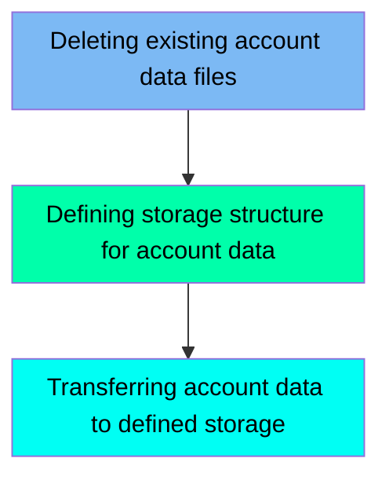

This document describes the ACCTFILE job, which is responsible for managing account data within the application. The job ensures that any existing account data files are deleted, defines the storage structure for new account data, and transfers the account data to the defined storage.

For example, the job first deletes any existing account data files stored in a VSAM Key-Sequenced Data Set (KSDS), then defines a new KSDS for storing account data, and finally copies the account data from a flat file to the newly defined VSAM file.

Here is a high level diagram of the file:

## Deleting existing account data files

Steps in this section: `STEP05`.

This section is responsible for deleting the existing account data files stored in a VSAM Key-Sequenced Data Set (KSDS) if they already exist. This ensures that any old or outdated account data is removed before new data is processed or added.

## Defining storage structure for account data

Steps in this section: `STEP10`.

This section is about defining a VSAM Key-Sequenced Data Set (KSDS) for storing and managing account data efficiently. It involves specifying the dataset name, volume, key structure, record size, and other attributes necessary for the proper organization and retrieval of account information.

## Transferring account data to defined storage

Steps in this section: `STEP15`.

This section is responsible for copying account data from a flat file to a VSAM file, ensuring that the data is efficiently managed and stored in the appropriate dataset.

&nbsp;

*This is an auto-generated document by Swimm 🌊 and has not yet been verified by a human*

<SwmMeta version="3.0.0" repo-id="Z2l0aHViJTNBJTNBa3luZHJ5bC1hd3MtbWFpbmZyYW1lLW1vZGVybml6YXRpb24tY2FyZGRlbW8lM0ElM0FTd2ltbS1EZW1v" repo-name="kyndryl-aws-mainframe-modernization-carddemo">Powered by [Swimm](/)</SwmMeta>
