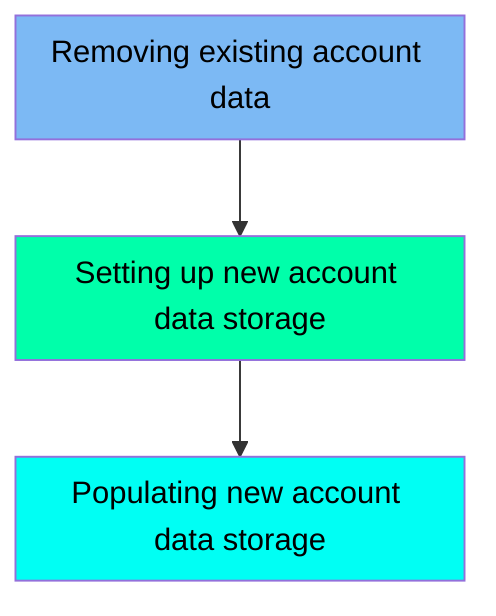

The ACCTFILE job is responsible for managing the account data storage in the CardDemo application. This process involves three main steps: removing any existing account data, setting up new account data storage, and populating the new storage with account data. The job ensures that the account data is efficiently managed and accessible within the application.

Here is a high level diagram of the file:

## Removing existing account data

Steps in this section: `STEP05`.

This section is responsible for deleting an existing Indexed Sequential Access Method (ISAM) dataset used for managing and accessing account data efficiently in the CardDemo application.

## Setting up new account data storage

Steps in this section: `STEP10`.

This section is about defining a new VSAM Key-Sequenced Data Set (KSDS) for account data storage and management. It involves specifying the dataset name, storage parameters, and indexing options to ensure efficient data access and organization within the CardDemo application.

## Populating new account data storage

Steps in this section: `STEP15`.

This section is responsible for copying account data from a flat file to a VSAM file, ensuring that the new account data is properly stored and managed within the application.

&nbsp;

*This is an auto-generated document by Swimm 🌊 and has not yet been verified by a human*

<SwmMeta version="3.0.0" repo-id="Z2l0aHViJTNBJTNBa3luZHJ5bC1hd3MtbWFpbmZyYW1lLW1vZGVybml6YXRpb24tY2FyZGRlbW8lM0ElM0FTd2ltbS1EZW1v" repo-name="kyndryl-aws-mainframe-modernization-carddemo">Powered by [Swimm](/)</SwmMeta>
