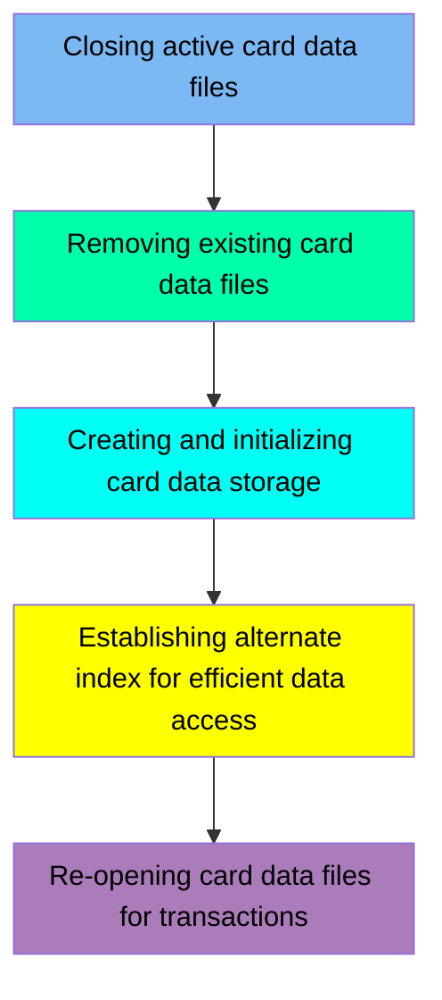

The CARDFILE job is responsible for managing the lifecycle of card data files in the mainframe application. This involves closing active files, deleting existing data, creating and initializing new storage, establishing an alternate index for efficient data access, and re-opening the files for transactions.

For example, the job ensures that any previous card data is cleared and new data is properly defined and loaded into the VSAM file, making it ready for subsequent transactions.

Here is a high level diagram of the file:

## Closing active card data files

Steps in this section: `CLCIFIL`.

This section is responsible for closing the active card data files in the CICS region. It ensures that the files CARDDAT and CARDAIX are properly closed using the SDSF tool, which is essential for maintaining data integrity and preparing the system for subsequent operations.

## Removing existing card data files

Steps in this section: `STEP05`.

This section is responsible for deleting existing card data files stored in VSAM datasets to ensure that any previous data is cleared before new data is defined and loaded.

## Creating and initializing card data storage

Steps in this section: `STEP10`, `STEP15`.

This section is responsible for defining a VSAM file to store card data and copying card data from a flat file to the VSAM file for efficient storage and access.

## Establishing alternate index for efficient data access

Steps in this section: `STEP40`, `STEP50`, `STEP60`.

This section is about establishing an alternate index for efficient data access in the card data VSAM file. It involves creating the alternate index, defining the path to relate it to the base cluster, and building the alternate index cluster.

## Re-opening card data files for transactions

Steps in this section: `OPCIFIL`.

This section is responsible for re-opening the card data files in the CICS region to ensure that they are available for subsequent transactions. It involves executing commands to open the CARDDAT and CARDAIX files, which are essential for handling card-related operations within the mainframe application.

&nbsp;

*This is an auto-generated document by Swimm 🌊 and has not yet been verified by a human*

<SwmMeta version="3.0.0" repo-id="Z2l0aHViJTNBJTNBa3luZHJ5bC1hd3MtbWFpbmZyYW1lLW1vZGVybml6YXRpb24tY2FyZGRlbW8lM0ElM0FTd2ltbS1EZW1v" repo-name="kyndryl-aws-mainframe-modernization-carddemo">Powered by [Swimm](/)</SwmMeta>
