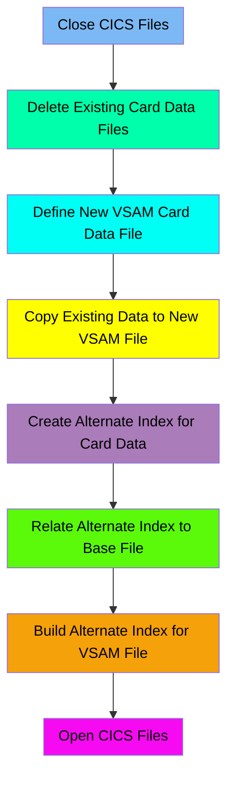

The CARDFILE job is responsible for managing the card data files in the CardDemo application. This process involves closing existing files in the CICS region, deleting any pre-existing card data files, defining new VSAM files, copying data from flat files to VSAM files, creating and relating alternate indexes, and finally opening the files again in the CICS region. The input to this flow includes existing card data files and flat files, and the output is a newly defined and populated VSAM file with an alternate index for efficient data retrieval.

Here is a high level diagram of the file:

## Close CICS Files

Steps in this section: `CLCIFIL`.

This section is about closing specific card-related data files in the CICS region named CICSAWSA. It ensures that the files CARDDAT and CARDAIX are properly closed to maintain data integrity and prepare for subsequent operations.

## Delete Existing Card Data Files

Steps in this section: `STEP05`.

This section is responsible for deleting existing card data VSAM files if they already exist. It ensures that any pre-existing data is removed before new data is defined and loaded.

## Define New VSAM Card Data File

Steps in this section: `STEP10`.

This section is about defining a new VSAM Key-Sequenced Data Set (KSDS) to store card data. The IDCAMS utility is used to create the VSAM cluster, specifying attributes such as the dataset name, volume, key length, record size, and share options.

## Copy Existing Data to New VSAM File

Steps in this section: `STEP15`.

This section is about copying card data from a flat file to a VSAM file. It uses the IDCAMS program to perform the data transfer, ensuring that the card data is properly stored in the VSAM dataset for further processing within the CardDemo application.

## Create Alternate Index for Card Data

Steps in this section: `STEP40`.

This section is about creating an alternate index on the account ID for a card data VSAM file. The alternate index provides an additional access path to the data stored in the primary dataset, enhancing data retrieval efficiency.

## Relate Alternate Index to Base File

Steps in this section: `STEP50`.

This section is about defining a path to relate the alternate index to the base cluster in the CardDemo application's VSAM file. The IDCAMS program is used to execute this dataset management task.

## Build Alternate Index for VSAM File

Steps in this section: `STEP60`.

This section is about creating an alternate index for the VSAM dataset that stores card data. The alternate index allows for more efficient access and retrieval of the card data based on different key values.

## Open CICS Files

Steps in this section: `OPCIFIL`.

This section is about opening files in the CICS region to allow access to card-related data and operations. It ensures that the necessary files are available for the application to perform its functions related to card data management.

&nbsp;

*This is an auto-generated document by Swimm 🌊 and has not yet been verified by a human*

<SwmMeta version="3.0.0" repo-id="Z2l0aHViJTNBJTNBa3luZHJ5bC1hd3MtbWFpbmZyYW1lLW1vZGVybml6YXRpb24tY2FyZGRlbW8lM0ElM0FTd2ltbS1EZW1v" repo-name="kyndryl-aws-mainframe-modernization-carddemo">Powered by [Swimm](/)</SwmMeta>
