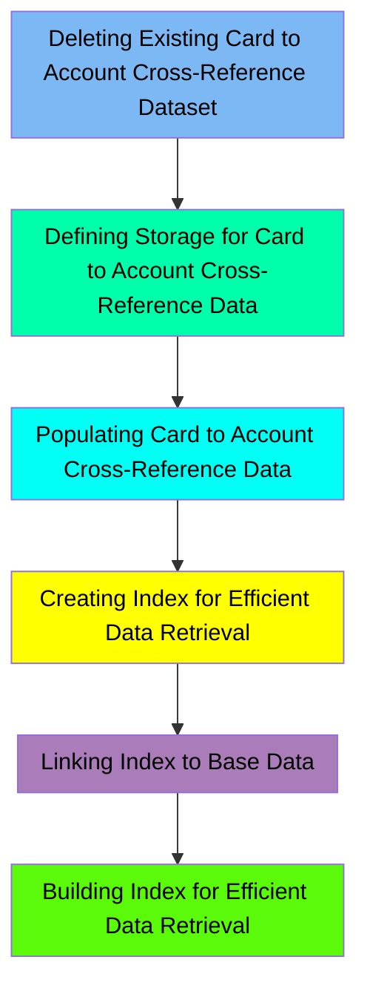

The XREFFILE job is responsible for managing the card to account cross-reference dataset within the CardDemo application. This process involves several steps, including deleting any existing datasets, defining new storage, populating the data, and creating indexes for efficient data retrieval. The job ensures that the cross-reference data is accurately stored and easily accessible, which is crucial for the application's performance.

Here is a high level diagram of the file:

## Deleting Existing Card to Account Cross-Reference Dataset

Steps in this section: `STEP05`.

This section is responsible for deleting the existing card to account cross-reference dataset and its alternate index path if they already exist. This ensures that any previous data is removed before new data is defined and loaded.

## Defining Storage for Card to Account Cross-Reference Data

Steps in this section: `STEP10`.

This section is about defining a VSAM file for storing card to account cross-reference data. The program uses IDCAMS to create the necessary datasets and indexes for efficient data storage and retrieval.

## Populating Card to Account Cross-Reference Data

Steps in this section: `STEP15`.

This section is about copying data from a flat file to a VSAM file to populate the card to account cross-reference data. The IDCAMS utility is used to perform this data transfer, ensuring that the cross-reference information is accurately stored in the VSAM Key-Sequenced Data Set (KSDS).

## Creating Index for Efficient Data Retrieval

Steps in this section: `STEP20`.

This section is about defining an alternate index for the CARDXREF VSAM dataset. The alternate index allows efficient data retrieval using account IDs as alternate keys, enhancing the performance of data access operations.

## Linking Index to Base Data

Steps in this section: `STEP25`.

This section is about creating a path that connects the alternate index to the base data cluster, enabling efficient data retrieval based on alternate keys.

## Building Index for Efficient Data Retrieval

Steps in this section: `STEP30`.

This section is about building an alternate index cluster for the card to account cross-reference dataset. The alternate index enables efficient data retrieval based on alternate keys, improving the performance of data access operations.

&nbsp;

*This is an auto-generated document by Swimm 🌊 and has not yet been verified by a human*

<SwmMeta version="3.0.0" repo-id="Z2l0aHViJTNBJTNBa3luZHJ5bC1hd3MtbWFpbmZyYW1lLW1vZGVybml6YXRpb24tY2FyZGRlbW8lM0ElM0FTd2ltbS1EZW1v" repo-name="kyndryl-aws-mainframe-modernization-carddemo">Powered by [Swimm](/)</SwmMeta>
