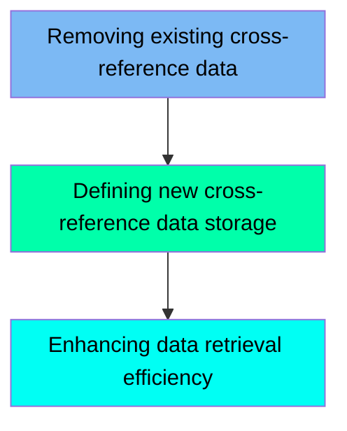

The XREFFILE job is responsible for managing the cross-reference data for card to account mappings in the application. This job ensures that any existing cross-reference data is deleted, new storage is defined, and data retrieval efficiency is enhanced by creating an alternate index. The process starts by removing any outdated data, then defining new storage for the cross-reference data, and finally, creating an alternate index to improve data retrieval efficiency.

For example, if there is existing cross-reference data that needs to be updated, the job will first delete the old data, define new storage for the updated data, and create an alternate index to ensure efficient access to the new data.

Here is a high level diagram of the file:

## Removing existing cross-reference data

Steps in this section: `STEP05`.

This section is responsible for deleting the existing card to account cross-reference data from the VSAM KSDS dataset and its alternate index path if they already exist. This ensures that any outdated or redundant data is removed before new data is defined and loaded.

## Defining new cross-reference data storage

Steps in this section: `STEP10`, `STEP15`.

This section is about defining a new VSAM file for storing card to account cross-reference data and copying data from a flat file to this VSAM file.

## Enhancing data retrieval efficiency

Steps in this section: `STEP20`, `STEP25`, `STEP30`.

This section is about creating and defining an alternate index on the account ID for the CARDXREF VSAM file. The alternate index improves the efficiency of record retrieval by providing an additional access path based on alternate keys. The steps include defining the alternate index, relating it to the base cluster, and building the alternate index cluster.

&nbsp;

*This is an auto-generated document by Swimm 🌊 and has not yet been verified by a human*

<SwmMeta version="3.0.0" repo-id="Z2l0aHViJTNBJTNBa3luZHJ5bC1hd3MtbWFpbmZyYW1lLW1vZGVybml6YXRpb24tY2FyZGRlbW8lM0ElM0FTd2ltbS1EZW1v" repo-name="kyndryl-aws-mainframe-modernization-carddemo">Powered by [Swimm](/)</SwmMeta>
