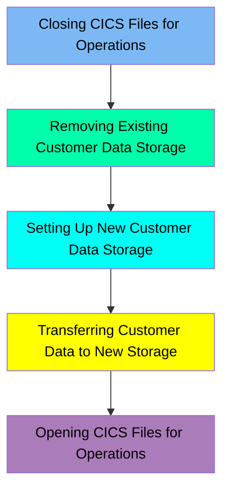

The CUSTFILE job is responsible for managing the customer data file in the CardDemo application. This process involves several steps to ensure the integrity and availability of customer data. Initially, it closes the customer data files in the CICS region to prevent any operations during the update. Then, it deletes any existing customer data storage, sets up new storage, transfers customer data to the new storage, and finally reopens the files for operations. This ensures that customer data is consistently updated and available for use in the application.

Here is a high level diagram of the file:

## Closing CICS Files for Operations

Steps in this section: `CLCIFIL`.

This section is responsible for closing the customer data files in the CICS region to ensure that no further operations can be performed on them until they are reopened. This is crucial for maintaining data integrity and ensuring that the files are in a consistent state before any further processing or updates.

## Removing Existing Customer Data Storage

Steps in this section: `STEP05`.

This section is about deleting the existing customer data storage if it exists. The IDCAMS program is used to delete the VSAM Key-Sequenced Data Set (KSDS) that stores customer data for the CardDemo application.

## Setting Up New Customer Data Storage

Steps in this section: `STEP10`.

This section is about defining the VSAM file for customer data storage in the CardDemo application. It involves creating a new VSAM Key-Sequenced Data Set (KSDS) to store and index customer data.

## Transferring Customer Data to New Storage

Steps in this section: `STEP15`.

This section is about copying customer data from a flat file to a VSAM file. The IDCAMS program is used to manage the data transfer, ensuring that customer information is accurately moved to the new storage structure.

## Opening CICS Files for Operations

Steps in this section: `OPCIFIL`.

This section is responsible for opening the customer data file in the CICS region to enable operations on customer data. It ensures that the necessary files are accessible for subsequent processing tasks.

&nbsp;

*This is an auto-generated document by Swimm 🌊 and has not yet been verified by a human*

<SwmMeta version="3.0.0" repo-id="Z2l0aHViJTNBJTNBa3luZHJ5bC1hd3MtbWFpbmZyYW1lLW1vZGVybml6YXRpb24tY2FyZGRlbW8lM0ElM0FTd2ltbS1EZW1v" repo-name="kyndryl-aws-mainframe-modernization-carddemo">Powered by [Swimm](/)</SwmMeta>
