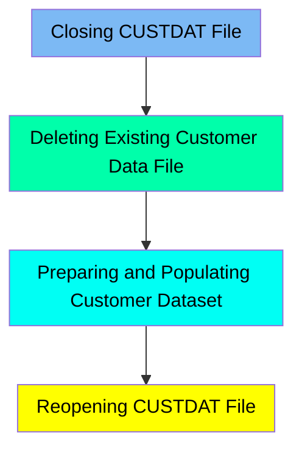

The CUSTFILE job is responsible for managing the customer data file within the CARDDEMO application. This job ensures that the customer data file is properly closed, deleted if it exists, redefined, and populated with new data. It involves several steps to handle the customer data file efficiently, ensuring that the data is structured and accessible for the application.

For example, the job first closes the CUSTDAT file in the CICS region, deletes any existing customer data file, defines a new VSAM Key-Sequenced Data Set (KSDS) for customer data, copies data from a flat file into this VSAM file, and finally reopens the CUSTDAT file for further operations.

Here is a high level diagram of the file:

## Closing CUSTDAT File

Steps in this section: `CLCIFIL`.

This section is responsible for closing the CUSTDAT file in the CICS region to ensure it is no longer available for processing. This is essential for maintenance tasks or to prevent further access to the file.

## Deleting Existing Customer Data File

Steps in this section: `STEP05`.

This section is responsible for deleting the existing customer data file if it already exists, ensuring that the system starts with a clean slate before proceeding with further operations.

## Preparing and Populating Customer Dataset

Steps in this section: `STEP10`, `STEP15`.

This section is about defining a VSAM Key-Sequenced Data Set (KSDS) to store customer data and then copying customer data from a flat file into this VSAM file. It ensures that the customer data is structured and accessible for the CARDDEMO application.

## Reopening CUSTDAT File

Steps in this section: `OPCIFIL`.

This section is about opening the CUSTDAT file in the CICS region. The program uses SDSF to execute a command that sets the CUSTDAT file to open status, allowing further operations on customer data.

&nbsp;

*This is an auto-generated document by Swimm 🌊 and has not yet been verified by a human*

<SwmMeta version="3.0.0" repo-id="Z2l0aHViJTNBJTNBa3luZHJ5bC1hd3MtbWFpbmZyYW1lLW1vZGVybml6YXRpb24tY2FyZGRlbW8lM0ElM0FTd2ltbS1EZW1v" repo-name="kyndryl-aws-mainframe-modernization-carddemo">Powered by [Swimm](/)</SwmMeta>
