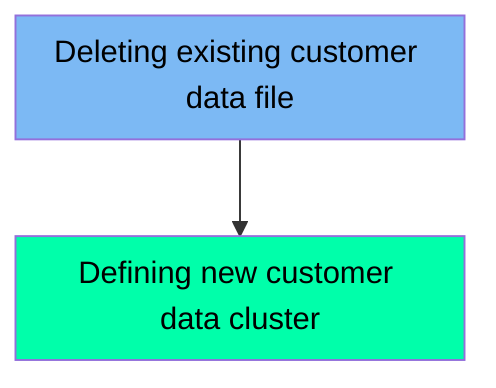

The DEFCUST job is responsible for managing customer data files within the mainframe modernization application. It ensures that any existing customer data file is deleted before creating a new one, thereby maintaining data integrity and consistency. The job involves two main steps: deleting the existing customer data file and defining a new customer data cluster.

For instance, if there is an existing customer data file, the job will first delete it to prevent any conflicts. Then, it will define a new customer data cluster to store the updated customer data.

Here is a high level diagram of the file:

## Deleting existing customer data file

Steps in this section: `STEP05`.

This section is responsible for deleting an existing customer data file if it already exists. It ensures that any pre-existing customer data is removed before new data is defined or processed.

## Defining new customer data cluster

Steps in this section: `STEP05`.

This section is about defining a new customer data cluster. It ensures that any existing customer data file is deleted before creating a new one, thereby managing and processing customer data within the mainframe modernization application.

&nbsp;

*This is an auto-generated document by Swimm 🌊 and has not yet been verified by a human*

<SwmMeta version="3.0.0" repo-id="Z2l0aHViJTNBJTNBa3luZHJ5bC1hd3MtbWFpbmZyYW1lLW1vZGVybml6YXRpb24tY2FyZGRlbW8lM0ElM0FTd2ltbS1EZW1v" repo-name="kyndryl-aws-mainframe-modernization-carddemo">Powered by [Swimm](/)</SwmMeta>
