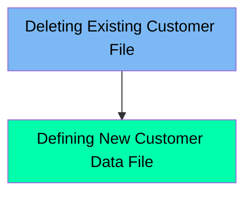

The DEFCUST job is responsible for managing customer data files within the application. It ensures that any pre-existing customer data is removed before new data is defined or processed. The job first deletes an existing customer data file if it already exists and then defines a new customer data file cluster. This process is crucial for maintaining the integrity and accuracy of customer data within the system.

Here is a high level diagram of the file:

## Deleting Existing Customer File

Steps in this section: `STEP05`.

This section is responsible for deleting an existing customer data file if it already exists. It ensures that any pre-existing customer data is removed before new data is defined or processed.

## Defining New Customer Data File

Steps in this section: `STEP05`.

This section is about managing customer data files by deleting any existing customer data file and defining a new customer data file cluster.

&nbsp;

*This is an auto-generated document by Swimm 🌊 and has not yet been verified by a human*

<SwmMeta version="3.0.0" repo-id="Z2l0aHViJTNBJTNBa3luZHJ5bC1hd3MtbWFpbmZyYW1lLW1vZGVybml6YXRpb24tY2FyZGRlbW8lM0ElM0FTd2ltbS1EZW1v" repo-name="kyndryl-aws-mainframe-modernization-carddemo">Powered by [Swimm](/)</SwmMeta>
