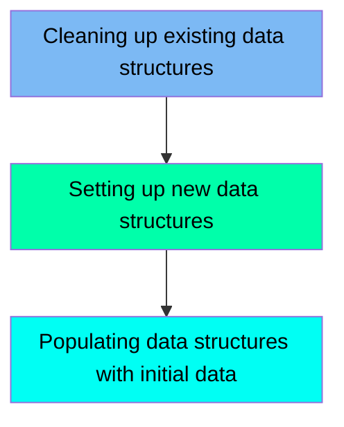

The DISCGRP job is responsible for managing the disclosure group data structures in the CardDemo mainframe application. This process involves cleaning up any existing VSAM files, setting up new VSAM files with specified attributes, and populating these files with initial data. The input for this job is an existing flat file containing disclosure group data, and the output is a newly defined and populated VSAM file ready for use in the application.

Here is a high level diagram of the file:

## Cleaning up existing data structures

Steps in this section: `STEP05`.

This section is responsible for deleting an existing VSAM file used for managing disclosure group data in the CardDemo mainframe application, if it already exists.

## Setting up new data structures

Steps in this section: `STEP10`.

This section is about defining a new VSAM file for managing disclosure group data. The program uses IDCAMS to create the VSAM Key-Sequenced Data Set (KSDS) with specified attributes, including the data and index components.

## Populating data structures with initial data

Steps in this section: `STEP15`.

This section is responsible for copying initial disclosure group data from a flat file to a VSAM file. It ensures that the VSAM file is populated with the necessary data to manage disclosure groups within the CardDemo application.

&nbsp;

*This is an auto-generated document by Swimm 🌊 and has not yet been verified by a human*

<SwmMeta version="3.0.0" repo-id="Z2l0aHViJTNBJTNBa3luZHJ5bC1hd3MtbWFpbmZyYW1lLW1vZGVybml6YXRpb24tY2FyZGRlbW8lM0ElM0FTd2ltbS1EZW1v" repo-name="kyndryl-aws-mainframe-modernization-carddemo">Powered by [Swimm](/)</SwmMeta>
