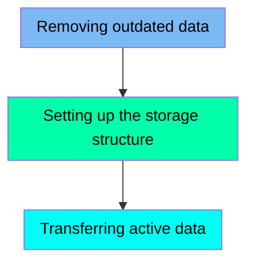

The DISCGRP job is responsible for managing the Disclosure Group data within the CARDDEMO application. This job ensures that outdated data is removed, the necessary storage structure is set up, and active data is transferred to the VSAM Key-Sequenced Data Set (KSDS).

For example, the job first deletes any existing VSAM dataset for the disclosure group, then defines a new VSAM KSDS, and finally copies data from a flat file to the newly defined VSAM file.

Here is a high level diagram of the file:

## Removing outdated data

Steps in this section: `STEP05`.

This section is about deleting an existing VSAM dataset for the disclosure group to ensure that outdated data is removed before new data is defined and loaded.

## Setting up the storage structure

Steps in this section: `STEP10`.

This section is responsible for defining a VSAM Key-Sequenced Data Set (KSDS) for the Disclosure Group within the CARDDEMO group. It sets up the necessary storage structure to manage and organize the disclosure group data efficiently.

## Transferring active data

Steps in this section: `STEP15`.

This section is responsible for copying data from a flat file to a VSAM file, ensuring that the Disclosure Group data is properly transferred and stored in the VSAM Key-Sequenced Data Set (KSDS).

&nbsp;

*This is an auto-generated document by Swimm 🌊 and has not yet been verified by a human*

<SwmMeta version="3.0.0" repo-id="Z2l0aHViJTNBJTNBa3luZHJ5bC1hd3MtbWFpbmZyYW1lLW1vZGVybml6YXRpb24tY2FyZGRlbW8lM0ElM0FTd2ltbS1EZW1v" repo-name="kyndryl-aws-mainframe-modernization-carddemo">Powered by [Swimm](/)</SwmMeta>
