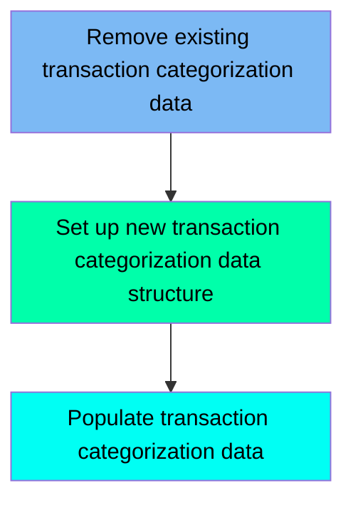

The TRANCATG job is responsible for managing transaction categorization data within the application. This job ensures that any existing transaction categorization data is removed, sets up a new data structure, and populates it with the necessary data. The process involves deleting an existing VSAM file, defining a new VSAM file, and copying data from a flat file to the newly created VSAM file.

For example, if there is outdated transaction categorization data, the TRANCATG job will delete the old data, create a new structure for the data, and then populate it with the latest transaction categorization information.

Here is a high level diagram of the file:

## Remove existing transaction categorization data

Steps in this section: `STEP05`.

This section is responsible for deleting the existing VSAM file used for transaction categorization if it already exists, ensuring that any old data is removed before new data is processed.

## Set up new transaction categorization data structure

Steps in this section: `STEP10`.

This section is about setting up a new transaction categorization data structure by defining a VSAM file. The program uses IDCAMS to create the necessary datasets for storing and indexing transaction category data.

## Populate transaction categorization data

Steps in this section: `STEP15`.

This section is responsible for copying data from a flat file to a VSAM file to manage transaction categorization. It ensures that the transaction categorization data is correctly transferred and stored in the appropriate VSAM file for further processing and usage within the application.

&nbsp;

*This is an auto-generated document by Swimm 🌊 and has not yet been verified by a human*

<SwmMeta version="3.0.0" repo-id="Z2l0aHViJTNBJTNBa3luZHJ5bC1hd3MtbWFpbmZyYW1lLW1vZGVybml6YXRpb24tY2FyZGRlbW8lM0ElM0FTd2ltbS1EZW1v" repo-name="kyndryl-aws-mainframe-modernization-carddemo">Powered by [Swimm](/)</SwmMeta>
