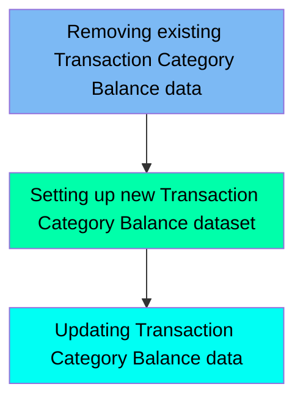

The TCATBALF job is responsible for managing the Transaction Category Balance data within the system. This job ensures that any existing data is removed, a new dataset is defined, and the balance data is updated from a flat file to a VSAM file. The process involves three main steps: deleting existing data, setting up a new dataset, and updating the data.

For instance, the job first deletes any existing Transaction Category Balance data to start with a clean slate. Then, it defines a new VSAM dataset with specific attributes for efficient data storage and retrieval. Finally, it copies the balance data from a flat file to the newly defined VSAM file.

Here is a high level diagram of the file:

## Removing existing Transaction Category Balance data

Steps in this section: `STEP05`.

This section is responsible for deleting any existing Transaction Category Balance data stored in the VSAM file to ensure that the system starts with a clean slate before new data is added.

## Setting up new Transaction Category Balance dataset

Steps in this section: `STEP10`.

This section is about defining a new VSAM dataset for storing transaction category balances. It involves specifying the dataset's attributes, such as its name, size, volume, key structure, and record size, to ensure efficient data storage and retrieval.

## Updating Transaction Category Balance data

Steps in this section: `STEP15`.

This section is about copying data from a flat file to a VSAM file to update the Transaction Category Balance information. The IDCAMS utility is used to manage the datasets, ensuring that the balance data is efficiently stored and retrieved.

&nbsp;

*This is an auto-generated document by Swimm 🌊 and has not yet been verified by a human*

<SwmMeta version="3.0.0" repo-id="Z2l0aHViJTNBJTNBa3luZHJ5bC1hd3MtbWFpbmZyYW1lLW1vZGVybml6YXRpb24tY2FyZGRlbW8lM0ElM0FTd2ltbS1EZW1v" repo-name="kyndryl-aws-mainframe-modernization-carddemo">Powered by [Swimm](/)</SwmMeta>
