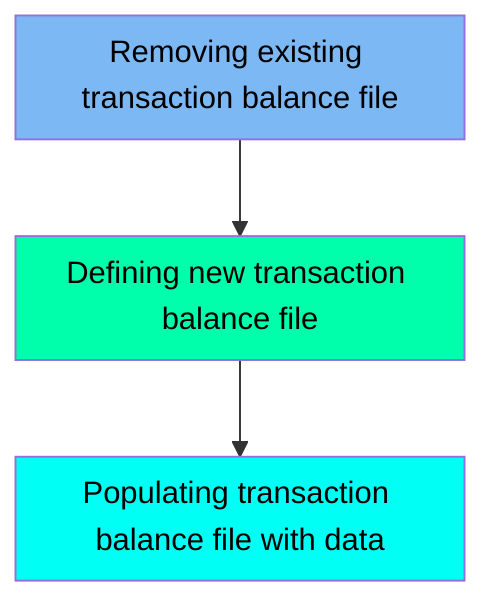

This document describes the TCATBALF job, which is responsible for managing the transaction category balance file in the CardDemo application. The process involves deleting any existing VSAM file, defining a new VSAM file, and populating it with data from a flat file. This ensures that the transaction balance data is up-to-date and properly structured for efficient access and management.

Here is a high level diagram of the file:

## Removing existing transaction balance file

Steps in this section: `STEP05`.

This section is responsible for deleting the existing transaction category balance file if it already exists. It ensures that any previous data in the VSAM Key-Sequenced Data Set is removed before new data is processed.

## Defining new transaction balance file

Steps in this section: `STEP10`.

This section is about defining a VSAM file for transaction category balance. The program uses IDCAMS to create the necessary data and index components for efficient data management and access within the CardDemo application.

## Populating transaction balance file with data

Steps in this section: `STEP15`.

This section is responsible for copying transaction balance data from a flat file to a VSAM file, ensuring the data is properly stored and managed within the CardDemo application.

&nbsp;

*This is an auto-generated document by Swimm 🌊 and has not yet been verified by a human*

<SwmMeta version="3.0.0" repo-id="Z2l0aHViJTNBJTNBa3luZHJ5bC1hd3MtbWFpbmZyYW1lLW1vZGVybml6YXRpb24tY2FyZGRlbW8lM0ElM0FTd2ltbS1EZW1v" repo-name="kyndryl-aws-mainframe-modernization-carddemo">Powered by [Swimm](/)</SwmMeta>
