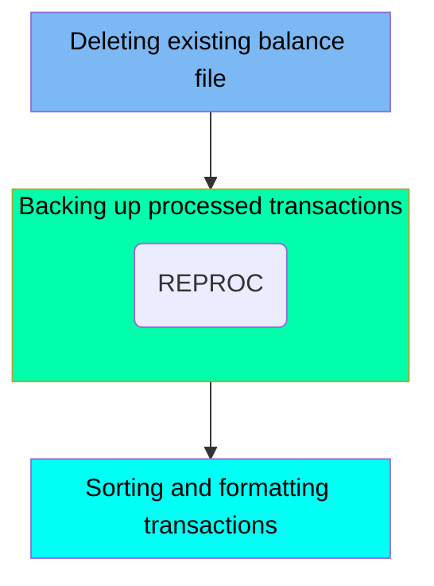

This document describes the PRTCATBL job, which is responsible for managing transaction category balance files. The job involves deleting an existing balance file, backing up processed transactions, and sorting and formatting transaction records. These steps ensure that transaction data is properly maintained and organized for reporting and future reference.

For instance, the job first deletes the existing balance file, then backs up the processed transactions, and finally sorts and formats the transaction records based on specified criteria.

Here is a high level diagram of the file:

## Deleting existing balance file

Steps in this section: `DELDEF`.

This section is responsible for deleting a specific dataset related to transaction reports in the mainframe modernization application.

## Backing up processed transactions

Steps in this section: `STEP05R`.

This section is responsible for unloading the processed transaction category balance file and creating a backup of it. The backup ensures that the processed transactions are safely stored for future reference or recovery.

## Sorting and formatting transactions

Steps in this section: `STEP10R`.

This section is responsible for filtering transaction records based on a specified date, sorting them by card number, and formatting the output for further processing or reporting.

&nbsp;

*This is an auto-generated document by Swimm 🌊 and has not yet been verified by a human*

<SwmMeta version="3.0.0" repo-id="Z2l0aHViJTNBJTNBa3luZHJ5bC1hd3MtbWFpbmZyYW1lLW1vZGVybml6YXRpb24tY2FyZGRlbW8lM0ElM0FTd2ltbS1EZW1v" repo-name="kyndryl-aws-mainframe-modernization-carddemo">Powered by [Swimm](/)</SwmMeta>
