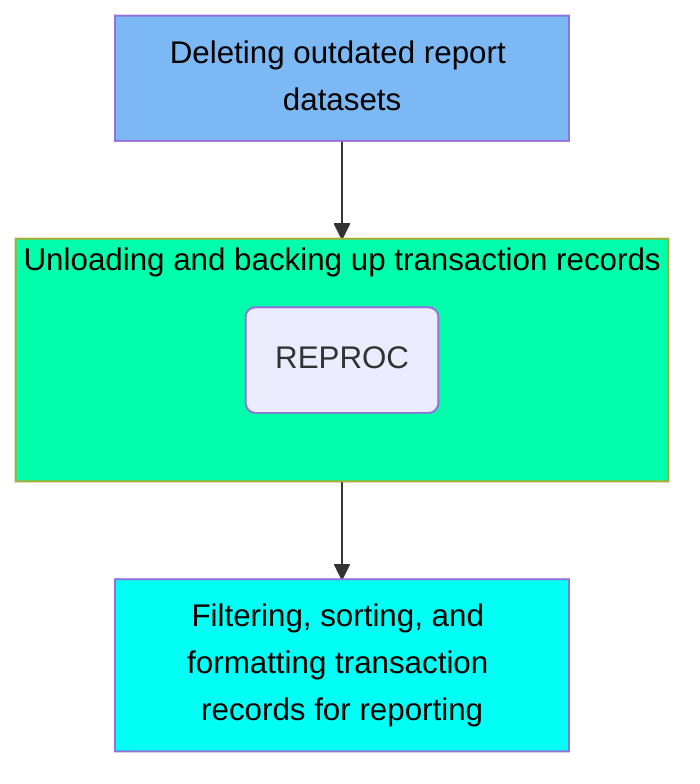

The PRTCATBL job is responsible for managing transaction category balance files within the CardDemo application. This job involves deleting outdated report datasets, unloading and backing up transaction records, and filtering, sorting, and formatting transaction records for reporting. The input to this job includes existing transaction category balance files, and the output is a formatted report dataset.

Here is a high level diagram of the file:

## Deleting outdated report datasets

Steps in this section: `DELDEF`.

This section is responsible for deleting outdated report datasets to ensure that only current and relevant data is retained. It uses the IEFBR14 utility to delete the dataset AWS.M2.CARDDEMO.TCATBALF.REPT, which handles transaction reports.

## Unloading and backing up transaction records

Steps in this section: `STEP05R`.

This section is responsible for unloading the processed transaction category balance file and creating a backup of it. The process involves reading the existing VSAM Key-Sequenced Data Set and writing its contents to a new backup dataset.

## Filtering, sorting, and formatting transaction records for reporting

Steps in this section: `STEP10R`.

This section is responsible for filtering transaction records based on a specific date, sorting them by account ID, transaction type, and transaction code, and formatting the transaction balance. The processed data is then stored in a report dataset for further use.

&nbsp;

*This is an auto-generated document by Swimm 🌊 and has not yet been verified by a human*

<SwmMeta version="3.0.0" repo-id="Z2l0aHViJTNBJTNBa3luZHJ5bC1hd3MtbWFpbmZyYW1lLW1vZGVybml6YXRpb24tY2FyZGRlbW8lM0ElM0FTd2ltbS1EZW1v" repo-name="kyndryl-aws-mainframe-modernization-carddemo">Powered by [Swimm](/)</SwmMeta>
