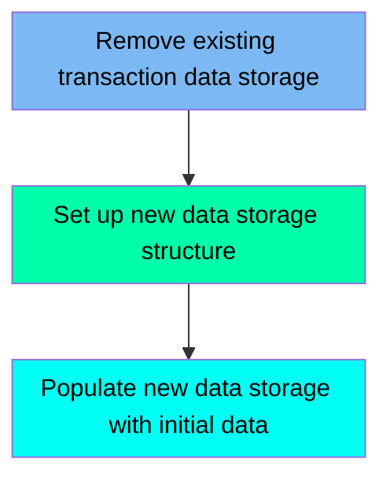

The TRANCATG job is responsible for managing the transaction category data storage in the CardDemo application. It begins by removing any existing transaction category VSAM file to ensure a clean slate. Then, it sets up a new data storage structure by defining a VSAM Key-Sequenced Data Set (KSDS) with specific attributes and storage details. Finally, it populates the new VSAM file with initial data from a flat file, ensuring that the transaction category data storage is ready for further processing and management.

Here is a high level diagram of the file:

## Remove existing transaction data storage

Steps in this section: `STEP05`.

This section is responsible for deleting the existing transaction category VSAM file if it already exists, ensuring that any previous data is cleared before new data is defined and loaded.

## Set up new data storage structure

Steps in this section: `STEP10`.

This section is about setting up a new data storage structure by defining a VSAM Key-Sequenced Data Set (KSDS) for transaction categorization. It specifies the attributes and storage details for the VSAM file, including the data and index components.

## Populate new data storage with initial data

Steps in this section: `STEP15`.

This section is responsible for copying data from a flat file to a VSAM file to initialize the transaction category data storage. It ensures that the transaction category VSAM file is populated with the necessary initial data for further processing and management within the CardDemo application.

&nbsp;

*This is an auto-generated document by Swimm 🌊 and has not yet been verified by a human*

<SwmMeta version="3.0.0" repo-id="Z2l0aHViJTNBJTNBa3luZHJ5bC1hd3MtbWFpbmZyYW1lLW1vZGVybml6YXRpb24tY2FyZGRlbW8lM0ElM0FTd2ltbS1EZW1v" repo-name="kyndryl-aws-mainframe-modernization-carddemo">Powered by [Swimm](/)</SwmMeta>
